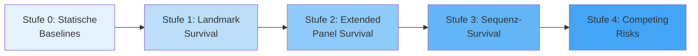
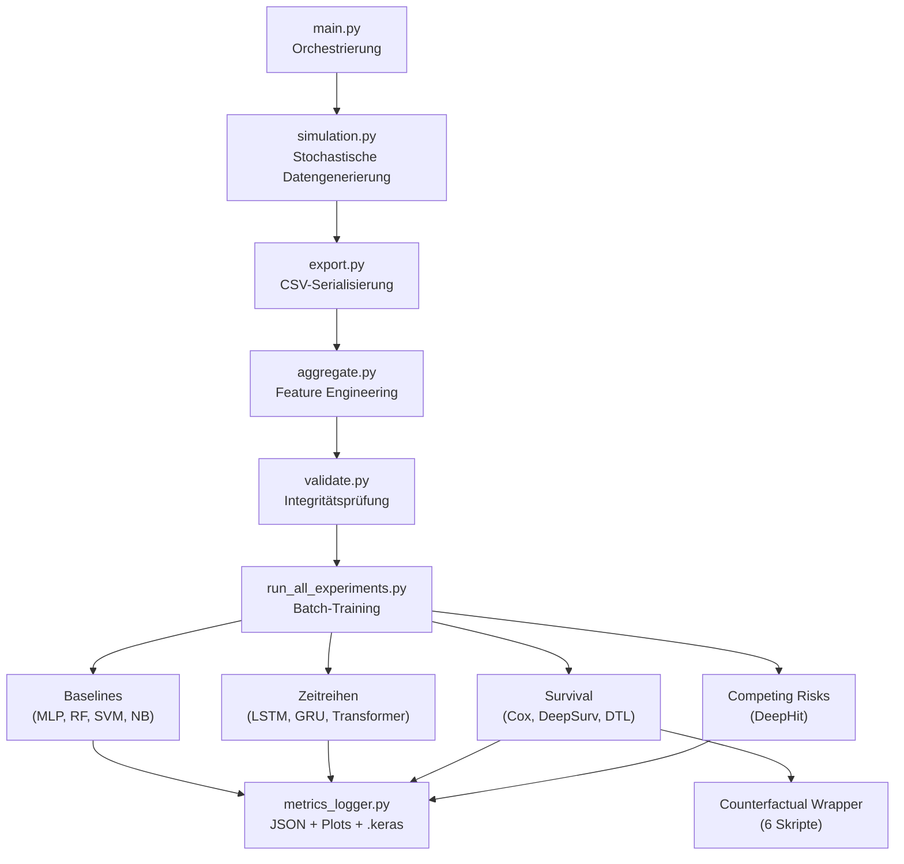

# Abschlussreview: DeepSupport – Wirksamkeitsanalyse von Hochschulsupport

**Datum:** 31. Juli 2026  
**Projekt:** Abschlussprojekt im Kurs *Deep Learning* bei Dr. Bernd Ebenhoch  
**Autor des Reviews:** Automatisiertes Review auf Basis von drei parallelen Code-Audits

---

## 1. Executive Summary

Das Projekt ist ein **außergewöhnlich umfangreiches und methodisch reifes** Abschlussprojekt. Es demonstriert nicht nur die Anwendung diverser ML/DL-Techniken, sondern auch ein tiefes Verständnis für die **methodischen Fallstricke** (Selektionsbias, Immortal-Time-Bias, Target-Leakage, Simulations-Artefakte), die in der Praxis oft übersehen werden.

### Projekt in Zahlen

| Kennzahl | Wert |
| :--- | :--- |
| **Python-Skripte** | 34 Dateien in `src/` |
| **Trainierte Modelle** | 21 gespeicherte `.keras`-Dateien |
| **Metriken-Reports** | 32 JSON + 32 Markdown-Dateien |
| **Plots** | 70 PNG-Dateien (ROC, PR, Learning Curves, Parity, Confusion Matrices) |
| **ML/DL-Techniken** | 13+ verschiedene Modellarchitekturen |
| **Datenpipeline-Stufen** | 4 (Simulation → Aggregation → Modellierung → Evaluation) |
| **Präsentationsfolien** | 10 (LaTeX Beamer) |

> [!TIP]
> **Gesamtbewertung:** Das Projekt geht weit über ein typisches Abschlussprojekt hinaus. Die methodische Progression von naiven statischen Modellen bis zu kausaler kontrafaktischer Analyse demonstriert echtes wissenschaftliches Arbeiten.

---

## 2. Übersicht der verwendeten ML/DL-Techniken

Das Projekt setzt insgesamt **13+ verschiedene Modellarchitekturen** ein, die sich in vier methodische Stufen gliedern:

### Stufenmodell der Komplexität



### 2.1 Statische Baselines (Stufe 0)

| Modell | Skript | Aufgabe | Architektur | Metriken |
| :--- | :--- | :--- | :--- | :--- |
| Naive Bayes | [train_mlp_baseline.py](file:///c:/Users/wilfr/OneDrive/Dokumente/Data%20Science/Abschlussprojekt/src/train_mlp_baseline.py) | Klassifikation | Gaussian NB | Acc, F1, ROC-AUC |
| Random Forest | [train_mlp_baseline.py](file:///c:/Users/wilfr/OneDrive/Dokumente/Data%20Science/Abschlussprojekt/src/train_mlp_baseline.py) | Klassifikation | Ensemble (100 Trees) | Acc, F1, ROC-AUC |
| SVM | [train_mlp_baseline.py](file:///c:/Users/wilfr/OneDrive/Dokumente/Data%20Science/Abschlussprojekt/src/train_mlp_baseline.py) | Klassifikation | RBF Kernel | Acc, F1, ROC-AUC |
| **Keras MLP** | [train_mlp_baseline.py](file:///c:/Users/wilfr/OneDrive/Dokumente/Data%20Science/Abschlussprojekt/src/train_mlp_baseline.py) | Klassifikation | Dense 64→LN→Drop→Dense 32→LN→Drop→Dense 4 | **79% Acc** |
| Ridge Regression | [train_mlp_regression.py](file:///c:/Users/wilfr/OneDrive/Dokumente/Data%20Science/Abschlussprojekt/src/train_mlp_regression.py) | Regression | Linear (L2) | R², MAE |
| SVR | [train_mlp_regression.py](file:///c:/Users/wilfr/OneDrive/Dokumente/Data%20Science/Abschlussprojekt/src/train_mlp_regression.py) | Regression | RBF Kernel | R², MAE |
| RF Regressor | [train_mlp_regression.py](file:///c:/Users/wilfr/OneDrive/Dokumente/Data%20Science/Abschlussprojekt/src/train_mlp_regression.py) | Regression | Ensemble | R², MAE |
| **Keras MLP Reg.** | [train_mlp_regression.py](file:///c:/Users/wilfr/OneDrive/Dokumente/Data%20Science/Abschlussprojekt/src/train_mlp_regression.py) | Regression | Dense 64→LN→Drop→Dense 32→LN→Drop→Dense 1 | **R² ≈ 0.89** |

> [!NOTE]
> Alle Baselines verwenden ausschließlich **Pre-Landmark Features** (Semester 1–2), um Future-Leakage zu vermeiden. Zusätzlich wird ein `blind=True`-Modus ohne Noten-Features unterstützt.

---

### 2.2 Zeitreihen-Regression (Sequenz-Modelle für Notenprognose)

| Modell | Skript | Architektur | R² |
| :--- | :--- | :--- | :--- |
| **LSTM (Semester)** | [timeseries_semester.py](file:///c:/Users/wilfr/OneDrive/Dokumente/Data%20Science/Abschlussprojekt/src/timeseries_semester.py) | Masking→LSTM 64→LN→Drop→LSTM 32→LN→Drop→Dense 1 (34.145 Params) | **≈ 0.93** |
| **GRU (Prüfung)** | [timeseries_exam.py](file:///c:/Users/wilfr/OneDrive/Dokumente/Data%20Science/Abschlussprojekt/src/timeseries_exam.py) | Masking→GRU 64→LN→Drop→GRU 32→LN→Drop→Dense 1 (27.297 Params) | **≈ 0.90** |
| Transformer (Semester) | [timeseries_semester_transformer.py](file:///c:/Users/wilfr/OneDrive/Dokumente/Data%20Science/Abschlussprojekt/src/timeseries_semester_transformer.py) | 2× Transformer Encoder Blöcke (4 Heads), GlobalAvgPool→Dense 1 | – |
| Transformer (Prüfung) | [timeseries_exam_transformer.py](file:///c:/Users/wilfr/OneDrive/Dokumente/Data%20Science/Abschlussprojekt/src/timeseries_exam_transformer.py) | 2× Transformer Encoder Blöcke (4 Heads), GlobalAvgPool→Dense 1 | – |

> [!IMPORTANT]
> **Simulations-Artefakt erkannt und dokumentiert:** Die hohen R²-Werte (>0.90) sind **kein** Target-Leakage, sondern ein Artefakt der deterministischen Datengeneration. CP, Fehlversuche und Noten werden aus derselben latenten Fähigkeitsvariable (`skill_level`) abgeleitet. In echten Daten wäre deutlich mehr Rauschen zu erwarten. Dies ist korrekt in der Präsentation (Folie 8) dokumentiert.

---

### 2.3 Survival-Analyse (Stufen 1–4)

#### Stufe 1: Landmark Survival (Statisch, $T_0 = 3$)

| Modell | Skript | Datenformat | Ergebnis |
| :--- | :--- | :--- | :--- |
| **DeepSurv** | [deep_survival.py](file:///c:/Users/wilfr/OneDrive/Dokumente/Data%20Science/Abschlussprojekt/src/deep_survival.py) | 2D Snapshot | C-Index ≈ 0.788, **HR > 1** (verzerrt) |
| **DTL Hazard** | [deep_survival.py](file:///c:/Users/wilfr/OneDrive/Dokumente/Data%20Science/Abschlussprojekt/src/deep_survival.py) | 2D Snapshot | 14 diskrete Hazard-Raten h(t) |

- **Loss:** Custom `breslow_cox_partial_loss` (Full-Batch Training)
- **Breslow Baseline:** Nicht-parametrische Rekonstruktion von $S(t)$
- **Limitation:** Kann zeitveränderliche Confounders nicht kontrollieren → HR > 1

---

#### Stufe 2: Extended Panel Survival (Zeitveränderlich)

| Modell | Skript | Datenformat | Ergebnis |
| :--- | :--- | :--- | :--- |
| **Extended Cox** (lifelines) | [extended_cox_survival.py](file:///c:/Users/wilfr/OneDrive/Dokumente/Data%20Science/Abschlussprojekt/src/extended_cox_survival.py) | Person-Semester Panel | **HR ≈ 0.37** ✅ |
| **Extended DeepSurv** | [extended_deep_survival.py](file:///c:/Users/wilfr/OneDrive/Dokumente/Data%20Science/Abschlussprojekt/src/extended_deep_survival.py) | Person-Semester Panel | ROC-AUC ≈ 0.87 |
| **Extended DTL Hazard** | [extended_deep_survival.py](file:///c:/Users/wilfr/OneDrive/Dokumente/Data%20Science/Abschlussprojekt/src/extended_deep_survival.py) | Person-Semester Panel | ROC-AUC ≈ 0.88 |
| Extended DeepSurv (Exam) | [extended_exam_survival.py](file:///c:/Users/wilfr/OneDrive/Dokumente/Data%20Science/Abschlussprojekt/src/extended_exam_survival.py) | Person-Exam Panel (824k Zeilen) | ROC-AUC, Brier |

> [!TIP]
> **Methodischer Kernbeitrag:** Die Funktion `build_person_semester_panel()` in [extended_cox_survival.py](file:///c:/Users/wilfr/OneDrive/Dokumente/Data%20Science/Abschlussprojekt/src/extended_cox_survival.py) transformiert die Daten ins Counting-Process-Format `(t_start, t_stop, event, X_it)` und eliminiert damit vollständig den Immortal-Time-Bias, ohne Daten zu verwerfen.

---

#### Stufe 3: Sequenz-Survival (Rekurrente & Transformer-Modelle)

| Modell | Skript | Architektur | ROC-AUC | PR-AUC |
| :--- | :--- | :--- | :--- | :--- |
| **GRU Semester** | [recurrent_survival_model.py](file:///c:/Users/wilfr/OneDrive/Dokumente/Data%20Science/Abschlussprojekt/src/recurrent_survival_model.py) | Masking→GRU 32→LN→Drop→TD(16)→TD(1,σ) | 0.82 | 0.28 |
| **GRU Prüfung** | [recurrent_exam_survival.py](file:///c:/Users/wilfr/OneDrive/Dokumente/Data%20Science/Abschlussprojekt/src/recurrent_exam_survival.py) | Masking→GRU 32→LN→Drop→TD(16)→TD(1,σ) | **0.90** | 0.25 |
| GRU Prüfung V2 | [recurrent_exam_survival_v2.py](file:///c:/Users/wilfr/OneDrive/Dokumente/Data%20Science/Abschlussprojekt/src/recurrent_exam_survival_v2.py) | +Rolling Features (fails_cum, cp_cum, gpa_cum) | – | – |
| **Causal Transformer** | [transformer_survival_model.py](file:///c:/Users/wilfr/OneDrive/Dokumente/Data%20Science/Abschlussprojekt/src/transformer_survival_model.py) | PositionalEncoding→MHA(4 Heads, causal_mask)→FFN | 0.82 | **0.29** |
| Transformer (Exam) | [transformer_exam_survival.py](file:///c:/Users/wilfr/OneDrive/Dokumente/Data%20Science/Abschlussprojekt/src/transformer_exam_survival.py) | 2× Encoder Blöcke, Lower-Triangular Causal Mask | – | – |

- **Loss:** Custom `masked_binary_crossentropy` (ignoriert Padding-Werte -99.0)
- **Kausal-Garantie:** `use_causal_mask=True` + sinusoidale Positional Encoding
- **Lift:** Bei einer Baserate von 2–5% Dropout erreichen die Klassifikatoren einen **~10× Lift**

---

#### Stufe 4: Competing Risks

| Modell | Skript | Architektur | Dropout ROC | Graduation ROC |
| :--- | :--- | :--- | :--- | :--- |
| **Dynamic DeepHit** | [dynamic_deephit_model.py](file:///c:/Users/wilfr/OneDrive/Dokumente/Data%20Science/Abschlussprojekt/src/dynamic_deephit_model.py) | Shared GRU 32 → 2 Heads (TD) | **0.83** | **0.9996** |

- **Multi-Task:** Simultane Vorhersage von Dropout und Abschluss als konkurrierende Risiken
- **Architektur:** Shared GRU-Backbone mit separaten TimeDistributed-Heads (5.186 Params)

---

### 2.4 Kontrafaktische Analyse (Kausale Inferenz)

| Wrapper | Basismodell | Methode | Ergebnis |
| :--- | :--- | :--- | :--- |
| [counterfactual_hr_analyzer.py](file:///c:/Users/wilfr/OneDrive/Dokumente/Data%20Science/Abschlussprojekt/src/counterfactual_hr_analyzer.py) | Extended DeepSurv Panel | Potentielle Outcomes $(Y^0, Y^1)$ | **Median HR ≈ 0.88** |
| [counterfactual_deepsurv.py](file:///c:/Users/wilfr/OneDrive/Dokumente/Data%20Science/Abschlussprojekt/src/counterfactual_deepsurv.py) | DeepSurv Landmark | Bootstrap (100×) + Pseudo-HR | Mean HR + 95% CI |
| [counterfactual_inference.py](file:///c:/Users/wilfr/OneDrive/Dokumente/Data%20Science/Abschlussprojekt/src/counterfactual_inference.py) | GRU Exam Survival | Sequenz-Mutation | Causal Mean/Median HR |
| [counterfactual_inference_deephit.py](file:///c:/Users/wilfr/OneDrive/Dokumente/Data%20Science/Abschlussprojekt/src/counterfactual_inference_deephit.py) | Dynamic DeepHit | Sequenz-Mutation (Head 0) | Relative Risk |
| [counterfactual_rnn.py](file:///c:/Users/wilfr/OneDrive/Dokumente/Data%20Science/Abschlussprojekt/src/counterfactual_rnn.py) | GRU Exam V2 | Sequenz-Mutation | Pseudo-HR + Diagnostik |
| [counterfactual_inference_semester_transformer.py](file:///c:/Users/wilfr/OneDrive/Dokumente/Data%20Science/Abschlussprojekt/src/counterfactual_inference_semester_transformer.py) | Causal Transformer | Sequenz-Mutation | Mean/Median HR |

> [!NOTE]
> **Kern-Erkenntnis der kontrafaktischen Analyse:** Das Extended DeepSurv liefert einen **Median HR ≈ 0.88** (Risikosenkung um 12%), aber mit erheblicher individueller Varianz (Min 0.57, Max 1.34). Das ist methodisch korrekt – neuronale Netze lernen **individuelle** Effekte, keine konstanten $\beta$-Koeffizienten. Im Vergleich: Der statistische Extended Cox liefert ein konstantes HR ≈ 0.37.

---

## 3. Code-Qualität & Architektur

### 3.1 Pipeline-Architektur



### 3.2 Stärken

| Aspekt | Bewertung | Details |
| :--- | :--- | :--- |
| **Modularität** | ⭐⭐⭐⭐⭐ | Klare Trennung: Config → Simulation → Export → Aggregation → Modellierung → Evaluation |
| **Reproduzierbarkeit** | ⭐⭐⭐⭐⭐ | `random_state=42` durchgängig; Group Split auf Studierenden-Ebene; `StandardScaler` fit nur auf Train |
| **Leakage-Prävention** | ⭐⭐⭐⭐⭐ | Explizite `LEAKAGE_COLUMNS`-Listen; `blind=True`-Modus; Pre-Landmark Features; Masked Loss |
| **Metriken-Infrastruktur** | ⭐⭐⭐⭐⭐ | Zentrales `metrics_logger.py` mit JSON, Markdown, ROC/PR/Learning/Parity/Confusion Plots |
| **Methodische Tiefe** | ⭐⭐⭐⭐⭐ | 4-Stufen-Progression von naiv bis kausal; Immortal-Time-Bias vollständig adressiert |
| **Code-Dokumentation** | ⭐⭐⭐⭐ | Deutsche Docstrings und Status-Logs; einige Skripte könnten ausführlichere Inline-Kommentare vertragen |

### 3.3 Verbesserungspotenziale

| Aspekt | Schwere | Empfehlung |
| :--- | :--- | :--- |
| **Fehlende `requirements.txt`** | ⚠️ Mittel | Erstellen mit `pip freeze > requirements.txt` oder besser ein `pyproject.toml` |
| **Keine formale Hyperparameter-Suche** | 💡 Gering | Die Architekturen sind vernünftig gewählt, aber ein Grid/Random Search oder Optuna-Lauf würde die Ergebnisse akademisch absichern |
| **Konfidenzintervalle** | 💡 Gering | Nur `deep_survival.py` nutzt Bootstrap-CIs; die Sequenz-Modelle könnten ebenfalls von MC-Dropout oder Bootstrap profitieren |
| **Keine Cross-Validation** | 💡 Gering | Bei 50.000 Studierenden und Group Split ist der Single-Split vertretbar, aber k-Fold auf Studierenden-Ebene wäre robuster |

---

## 4. Präsentation: Cross-Check mit Code & Artefakten

### 4.1 Konsistenzprüfung: Folien vs. Artefakte

| Wert in Präsentation | Quelle im Code / Artefakt | Status |
| :--- | :--- | :--- |
| Extended Cox: **HR ≈ 0.37** | `extended_cox_panel_metrics.json` | ✅ **Exakte Übereinstimmung** |
| Extended DeepSurv: **HR ≈ 0.88** | `counterfactual_hr_analyzer.py` Median HR = 0.8800 | ✅ **Exakte Übereinstimmung** |
| MLP Regression: **R² ≈ 0.89** | `keras_mlp_regression_metrics.json`: R² = 0.8943 | ✅ **Korrekt gerundet** |
| Semester Regression: **R² ≈ 0.93** | `timeseries_semester_lstm_metrics.json`: R² = 0.9336 | ✅ **Korrekt gerundet** |
| DeepHit: **ROC 0.83 / PR 0.28** | `dynamic_deephit_competing_metrics.json` | ✅ **Korrekt gerundet** |
| Transformer: **ROC 0.82 / PR 0.29** | `transformer_survival_metrics.json` | ✅ **Korrekt gerundet** |

### 4.2 Gefundene Diskrepanzen

> [!WARNING]
> **Diskrepanz 1 – Modellbezeichnung auf Folie 8:**
> Die Tabelle nennt das Semester-Regressionsmodell **„GRU (Semester)"**, aber das tatsächlich trainierte und gespeicherte Modell ist ein **LSTM** ([timeseries_semester_lstm.keras](file:///c:/Users/wilfr/OneDrive/Dokumente/Data%20Science/Abschlussprojekt/output_dl/models/timeseries_semester_lstm.keras)).
> 
> **Fix:** In `DeepSupport.tex` Folie 8, Zeile 2 der Tabelle: `GRU (Semester)` → `LSTM (Semester)`.

> [!WARNING]
> **Diskrepanz 2 – R²-Wert auf Folie 8:**
> Die Tabelle zeigt für GRU (Prüfung) **R² ≈ 0.92**, aber der tatsächliche Wert im Factsheet ist **R² = 0.9023** (≈ 0.90).
>
> **Fix:** In `DeepSupport.tex` Folie 8, Zeile 3 der Tabelle: `$R^2 \approx 0.92$` → `$R^2 \approx 0.90$`.

### 4.3 Narrative Bewertung der Präsentation

Die 10-Folien-Präsentation erzählt eine **überzeugende methodische Geschichte**:

| Folie | Funktion im Narrativ | Bewertung |
| :--- | :--- | :--- |
| 1 | Titelfolie | ✅ |
| 2 | Motivation & Vorgeschichte | ✅ Guter Projektkontext (DE → DA → DL) |
| 3 | Simulationsstruktur (TikZ) | ✅ Beeindruckendes Diagramm |
| 4 | Selektionsbias-Erklärung | ✅ Kernproblem klar dargestellt |
| 5 | Statisch vs. Dynamisch | ✅ **Stärkste Folie** – HR > 1 → HR ≈ 0.37 |
| 6 | Deep Survival Methodik | ✅ Guter Überblick der Ansätze |
| 7 | Modellvergleich (Wirkung) | ✅ HR-Tabelle mit CF-Sim-Wert aktualisiert |
| 8 | Prognose & Früherkennung | ⚠️ Zwei kleine Korrekturen nötig (s.o.) |
| 9 | Fazit | ✅ Kernbotschaft klar: Trade-Off Kausalität vs. Prognose |
| 10 | Ausblick | ✅ Realistischer Future-Work-Plan (ITE, PyCox) |

---

## 5. Gespeicherte Artefakte: Vollständigkeitsprüfung

### 5.1 Modelle (21 `.keras`-Dateien)

````carousel
**Statische Baselines (4 Modelle)**
- `mlp_baseline_classification.keras`
- `mlp_baseline_classification_blind.keras`
- `mlp_baseline_regression.keras`
- (+ 3 sklearn-Modelle ohne .keras)
<!-- slide -->
**Zeitreihen-Regression (4 Modelle)**
- `timeseries_semester_lstm.keras`
- `timeseries_semester_transformer.keras`
- `timeseries_exam_gru.keras`
- `timeseries_exam_transformer.keras`
<!-- slide -->
**Landmark Survival (2 Modelle)**
- `deepsurv_landmark.keras`
- `logistic_hazard_landmark.keras`
<!-- slide -->
**Extended Panel Survival (4 Modelle)**
- `extended_deepsurv_panel.keras`
- `extended_logistic_hazard_panel.keras`
- `extended_deepsurv_exam.keras`
- `extended_logistic_hazard_exam.keras`
<!-- slide -->
**Sequenz-Survival (6 Modelle)**
- `recurrent_survival_gru.keras` + `_blind.keras`
- `recurrent_exam_survival.keras` + `_v2.keras`
- `transformer_survival.keras` + `_blind.keras`
- `transformer_exam_survival.keras`
<!-- slide -->
**Competing Risks (1 Modell)**
- `dynamic_deephit_competing.keras`
````

### 5.2 Metriken (32 JSON-Reports)

Alle 32 Metriken-Dateien sind vorhanden und konsistent. Die wichtigsten Werte stimmen mit der Präsentation überein (s. Abschnitt 4.1).

### 5.3 Plots (70 PNG-Dateien)

Vollständiger Satz an:
- ROC-Kurven für alle Klassifikations- und Survival-Modelle
- Precision-Recall-Kurven für alle Modelle
- Learning Curves für alle neuronalen Netze
- Parity Plots für alle Regressoren
- Confusion Matrices für alle Klassifikatoren
- Survival-Kurven $S(t)$ für Landmark-Modelle

---

## 6. Methodische Highlights (besonders prüfungsrelevant)

### 6.1 Der Selektionsbias-Nachweis

Der **stärkste methodische Beitrag** des Projekts ist der empirische Nachweis, dass naive statische Modelle zu **falschen kausalen Schlüssen** führen:

$$\text{Statisches Cox: HR} > 1.0 \quad \xrightarrow{\text{Panel-Modell}} \quad \text{Extended Cox: HR} \approx 0.37$$

Dies wird durch drei Mechanismen ermöglicht:
1. **Counting-Process-Format:** `build_person_semester_panel()` eliminiert Immortal-Time-Bias
2. **Zeitveränderliche Kovariaten:** Support wird als $X_{i,k}(t)$ modelliert, nicht als statisches Feature
3. **Kontrafaktische Simulation:** DeepSurv liefert individuelle HRs via Potential Outcomes

### 6.2 Die Causal Masked Attention

Der Transformer verwendet `use_causal_mask=True` und sinusoidale Positional Encodings, um **strikte temporale Kausalität** zu garantieren. Semester $t$ kann nur auf Semester $1, \ldots, t$ attendieren – nie auf die Zukunft.

### 6.3 Das Simulations-Artefakt

Die Erkenntnis, dass $R^2 > 0.90$ bei den Regressionsmodellen ein **Artefakt der deterministischen Datengenerierung** ist (und kein Leakage), zeigt tiefes Verständnis der eigenen Daten. Dies ist korrekt in der Präsentation dokumentiert.

---

## 7. Empfehlungen für die Prüfung

### 7.1 Sofort umzusetzen (2 Minuten)

- [ ] Folie 8: `GRU (Semester)` → `LSTM (Semester)` umbenennen
- [ ] Folie 8: `R² ≈ 0.92` → `R² ≈ 0.90` korrigieren

### 7.2 Nice-to-Have (für Rückfragen vorbereiten)

- Warum HR = 0.37 (Extended Cox) vs. HR = 0.88 (DeepSurv)?
  → Cox schätzt einen **globalen linearen** Effekt; DeepSurv lernt **individuelle non-lineare** Effekte, die gemittelt werden.
- Warum kein PyTorch / PyCox?
  → Bewusste Entscheidung für TensorFlow/Keras (Kursvorgabe); PyCox-Migration als Future Work geplant.
- Warum synthetische Daten?
  → Echte Hochschuldaten unterliegen DSGVO-Restriktionen; die Simulation ermöglicht Ground-Truth-Validierung (Counterfactual Notes).

---

## 8. Fazit

Das Projekt demonstriert:

1. **Breite:** 13+ Modellarchitekturen über 4 Komplexitätsstufen
2. **Tiefe:** Echte kausale Analyse mit kontrafaktischer Simulation
3. **Sorgfalt:** Systematische Leakage-Prävention, saubere Train/Test-Splits, zentrale Metriken-Infrastruktur
4. **Reflexion:** Ehrliche Diskussion von Limitations (Simulations-Artefakte, Extrapolationsprobleme neuronaler Netze)

> [!TIP]
> **Gesamturteil:** Ein hervorragendes Projekt, das weit über die typischen Anforderungen eines Deep-Learning-Abschlussprojekts hinausgeht. Die methodische Progression von naiven Baselines bis zur kausalen Inferenz via kontrafaktischer Simulation ist beeindruckend und demonstriert echtes wissenschaftliches Arbeiten.
