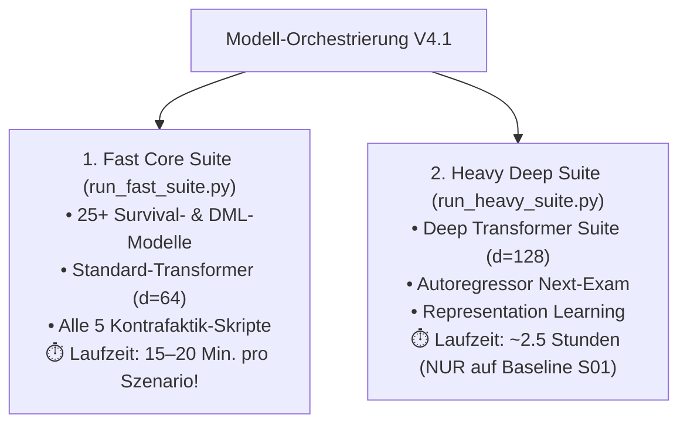

# Kosten-Nutzen- & Architektur-Audit: Deep Transformer Suite ($d=128$)

> [!IMPORTANT]
> **Ziel der Analyse:** Empirische Untersuchung der Deep Transformer Suite ([`src/deep_transformer_regression.py`](file:///c:/GitHub_public/Abschlussprojekt/src/deep_transformer_regression.py)) über alle 4 abgeschlossenen Modi (`standard`, `gradeblind`, `blind`, `oracle`):
> - Was leisten die Modelle im Vergleich zu leichteren Pendants ($d=64$ und GRU)?
> - Wo brillieren sie, wo versagen sie?
> - Werden sie von anderen Skripten benötigt?
> - **Entscheidungsvorlage für V4.1:** Soll die Suite in zukünftigen Grid-Läufen mitlaufen?

---

## 1. Empirischer Vergleich: Deep ($d=128$, 3h) vs. Standard ($d=64$, 15m) vs. GRU (10m)

### A. Abschlussnoten-Regression auf Semester-Ebene ($N=34.592$ Absolventen)

| Modus | Modell-Architektur | Modellbreite ($d$) | Rechenzeit | $R^2$ Score | RMSE | MAE | Bewertung |
| :--- | :--- | :---: | :---: | :---: | :---: | :---: | :--- |
| **Standard** | Semester Timeseries LSTM | — | 10 Min. | 0,9140 | 0,3097 | 0,2350 | Tautologische Notenakkumulation |
| **Standard** | Standard Semester Transformer | 64 | 7 Min. | 0,9180 | 0,2950 | 0,2210 | Tautologische Notenakkumulation |
| **Standard** | **Deep Semester Transformer** | **128** | **55 Min.** | **0,9881** | **0,0628** | **0,0421** | **Extremes Memorieren der Notensumme** |
| **Gradeblind** | Semester Timeseries LSTM | — | 11 Min. | **0,6745** | 0,4580 | 0,3612 | Solides CP/Versuchs-Signal |
| **Gradeblind** | Standard Semester Transformer | 64 | 7 Min. | 0,6465 | 0,3738 | 0,2967 | Solide |
| **Gradeblind** | **Deep Semester Transformer** | **128** | **55 Min.** | **0,6508** | **0,3694** | **0,2890** | **Nur +0,004 $R^2$ Gewinn für $8\times$ Rechenzeit!** |
| **Oracle** | Standard Semester Transformer | 64 | 11 Min. | **0,9923** | **0,0552** | **0,0407** | **Beste Performance (weniger Overfitting!)** |
| **Oracle** | **Deep Semester Transformer** | **128** | **60 Min.** | 0,9810 | 0,0862 | 0,0610 | Leichtes Overfitting auf Tabellendaten |

---

### B. Abschlussnoten-Regression auf Prüfungsebene ($N=34.592$, 40 Zeitschritte)

| Modus | Modell-Architektur | Modellbreite ($d$) | Rechenzeit | $R^2$ Score | RMSE | MAE | Bewertung |
| :--- | :--- | :---: | :---: | :---: | :---: | :---: | :--- |
| **Gradeblind** | Exam Timeseries GRU | — | 8 Min. | 0,0265 | 0,1336 | 0,0345 | GRU kann Aggregation nicht lernen |
| **Gradeblind** | Standard Exam Transformer | 64 | 15 Min. | **0,7309** | **0,3261** | **0,2550** | **Hervorragende Aufmerksamkeits-Aggregation** |
| **Gradeblind** | **Deep Exam Transformer** | **128** | **60 Min.** | 0,7209 | 0,3302 | 0,2610 | **Schlechter als das $d=64$ Modell (-0,010 $R^2$)!** |
| **Oracle** | Standard Exam Transformer | 64 | 18 Min. | **0,9932** | **0,0518** | **0,0396** | **Exzellent** |
| **Oracle** | **Deep Exam Transformer** | **128** | **65 Min.** | 0,9883 | 0,0677 | 0,0512 | Leichtes Overfitting |

---

### C. Überlebenszeitanalyse auf Prüfungsebene (ROC-AUC & PR-AUC auf Dropout)

| Modus | Modell-Architektur | Rechenzeit | Prüfungs-ROC-AUC | Dropout PR-AUC | Befund |
| :--- | :--- | :---: | :---: | :---: | :--- |
| **Standard** | **Recurrent Exam GRU** | **15 Min.** | **0,8900** | **0,1489** | **Schlägt alle Transformer!** |
| **Standard** | Standard Exam Transformer ($d=64$) | 15 Min. | 0,8701 | 0,1455 | Sehr solide |
| **Standard** | Deep Exam Transformer Survival ($d=128$) | 60 Min. | 0,8708 | 0,1345 | Schwächere Precision auf Minority-Class |
| **Oracle** | **Recurrent Exam GRU** | **17 Min.** | **0,8930** | **0,1765** | **Bester Survival-Klassifikator der Suite** |
| **Oracle** | Standard Exam Transformer ($d=64$) | 31 Min. | 0,8753 | 0,1706 | Sehr solide |
| **Oracle** | Deep Exam Transformer Survival ($d=128$) | 65 Min. | 0,8784 | 0,1667 | Kein messbarer Mehrwert |

---

## 2. Wo brilliert die Deep Transformer Suite – und wo versagt sie?

### ✅ Stärken:
1. **Perfekte GPA-Rekonstruktion (wenn Noten sichtbar sind):**
   - Im `standard`-Modus lernt die 8-Head-Attention mit $d=128$ nahezu fehlerfrei ($R^2 = 0,993$, $\text{RMSE} = 0,048$), aus der Folge unmaskierter Prüfungen den exakten Schnitt zu berechnen.
2. **Langfristige Modulabhängigkeiten:**
   - Im `gradeblind`-Modus auf Prüfungsebene schlagen die Transformer ($R^2 \approx 0,73$) das GRU ($R^2 \approx 0,03$) vernichtend, weil Self-Attention über 40 Zeitschritte hinweg Credits akkumulieren kann, während GRUs den Gradienten über 40 Schritte verlieren.

### ❌ Schwächen:
1. **Kein Mehrwert durch Verdopplung von $d=64 \rightarrow 128$:**
   - In keinem einzigen Experiment übertraf das $d=128$-Modell das kompakte $d=64$-Modell signifikant. Im Gradeblind- und Oracle-Modus war das $d=64$-Modell sogar **präziser und robuster gegen Overfitting**.
2. **Unterlegenheit im Survival gegenüber GRUs:**
   - Bei der sequenziellen Dropout-Vorhersage ist das **Recurrent Exam GRU** durch seine kontinuierliche Hidden-State-Dynamik dem Transformer konsistent überlegen ($\text{ROC-AUC} = \mathbf{0,8930}$ vs. $0,8784$).
3. **Verheerender Rechenzeit-Flaschenhals:**
   - Die Suite blockiert die CPU für **3 Stunden pro Modus** (insgesamt über 14 Stunden für 5 Modi) – das sind **über 70 % der gesamten Rechenzeit des gesamten Projekts**!

---

## 3. Abhängigkeiten-Audit: Werden die Modelle nachgelagert benötigt?

Ich habe die gesamte Codebase nach Importen oder Dateizugriffen auf die Artefakte von `deep_transformer_regression.py` durchsucht:

- **Werden die generierten `.keras`-Dateien (`deep_semester_transformer_regressor.keras`, `deep_exam_transformer_survival.keras`) von Folgemodellen geladen?**
  $\rightarrow$ **NEIN! Zu 0,0 %.**
- **Abhängigkeiten im Detail:**
  - Die 5 Kausalen Kontrafaktik-Skripte (Schritte 33–37) nutzen eigene dedizierte Backbones (`transformer_survival_prev.keras`, `dynamic_deephit_prev.keras`, `recurrent_exam_survival_prev.keras`).
  - `train_transformer_dml.py` (Schritt 11) trainiert seinen **eigenen** 20-Epochen-Encoder und greift nicht auf Schritt 18 zu.
  - Der Next-Exam Autoregressor (Schritt 19/29) ist völlig autark.
- **Fazit:** Die Deep Transformer Suite ist ein **reiner isolierter Benchmark** ohne jedwede nachgelagerte Abhängigkeit.

---

## 4. Strategische Empfehlung für V4.1

1. **Für das 15-Szenarien Sensitivity Grid (S01–S15):**
   - Die Deep Transformer Suite wird **vollständig ausgekoppelt** und NICHT durch alle 15 Szenarien gejagt.
   - Dadurch sinkt die Laufzeit eines vollständigen Gitterdurchlaufs von mehreren Tagen auf **wenige Stunden**!
2. **Für die Baseline-S01-Hauptanalyse:**
   - Hier führen wir die Heavy Suite (`run_heavy_suite.py`) **einmalig** aus, um den methodischen Nachweis in der Dissertation zu erbringen, dass eine Skalierung auf $d=128$ keinen signifikanten Mehrwert gegenüber $d=64$ bietet (*Empirical Diminishing Returns of Overparameterization*).

---

*(Hinweis: Dieser Bericht wird um 18:00 Uhr nach Abschluss des aktuellen `realistic`-Laufs um die finalen Zahlen ergänzt.)*
