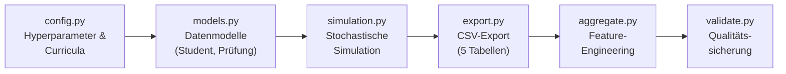
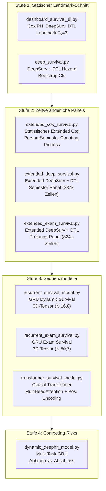
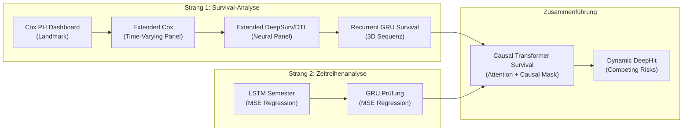

# Umfassender Code-Review & Methodenvergleich

Dieses Dokument reviewt systematisch alle Skripte des Projekts, erläutert das dynamisch-stochastische Simulationsmodell, ordnet die verschiedenen Analysestränge ein und kommentiert die Präsentationsideen.

---

## Inhaltsverzeichnis

1. [Datengenerierung & Stochastische Simulation](#1-datengenerierung--stochastische-simulation)
2. [Statische ML-Baselines](#2-statische-ml-baselines)
3. [Zeitreihenanalysen (Regression)](#3-zeitreihenanalysen-regression)
4. [Survival-Analyse: Methodische Progression](#4-survival-analyse-methodische-progression)
5. [Gesamtvergleich aller Methoden](#5-gesamtvergleich-aller-methoden)
6. [Code-Qualität & Verbesserungsvorschläge](#6-code-qualität--verbesserungsvorschläge)
7. [Kommentar zu den Präsentationsideen](#7-kommentar-zu-den-präsentationsideen)

---

## 1. Datengenerierung & Stochastische Simulation

### 1.1 Architektur der Pipeline

Die Datengenerierung folgt einer klaren 5-Phasen-Pipeline, orchestriert durch [main.py](file:///c:/Users/wilfr/OneDrive/Dokumente/Data%20Science/Abschlussprojekt/src/main.py):



| Datei | Rolle | Zeilen |
| :--- | :--- | :---: |
| [config.py](file:///c:/Users/wilfr/OneDrive/Dokumente/Data%20Science/Abschlussprojekt/src/config.py) | Hyperparameter, Curricula (5 Studiengänge, 12 Supportangebote), Gewichte | ~750 |
| [models.py](file:///c:/Users/wilfr/OneDrive/Dokumente/Data%20Science/Abschlussprojekt/src/models.py) | Dataclasses: `Student`, `PruefungsErgebnis`, `ModulState` | ~70 |
| [simulation.py](file:///c:/Users/wilfr/OneDrive/Dokumente/Data%20Science/Abschlussprojekt/src/simulation.py) | Kern der stochastischen Simulation | ~600 |
| [export.py](file:///c:/Users/wilfr/OneDrive/Dokumente/Data%20Science/Abschlussprojekt/src/export.py) | Transformation in 5 normalisierte CSV-Tabellen | ~150 |
| [aggregate.py](file:///c:/Users/wilfr/OneDrive/Dokumente/Data%20Science/Abschlussprojekt/src/aggregate.py) | Feature-Engineering für ML & Causal Inference | ~400 |
| [validate.py](file:///c:/Users/wilfr/OneDrive/Dokumente/Data%20Science/Abschlussprojekt/src/validate.py) | 12 automatisierte Qualitätschecks + Dokumentation | ~300 |

### 1.2 Das dynamisch-stochastische Simulationsmodell

Das Herzstück ist [simulation.py](file:///c:/Users/wilfr/OneDrive/Dokumente/Data%20Science/Abschlussprojekt/src/simulation.py). Die Simulation modelliert **50.000 Studierende** über bis zu 16 Semester mit drei zentralen Mechanismen:

#### A. Latente Dynamische Variablen

Jeder Studierende besitzt drei **verborgene, sich dynamisch verändernde Zustandsvariablen**:

| Variable | Startwert | Dynamik |
| :--- | :--- | :--- |
| **`motivation`** | $\sim 0.5 + f(\text{HZB}, \text{Erwerb})$ | Fällt bei Fehlversuchen ($-0.05$/Fehlversuch), steigt bei fehlerfreien Semestern ($+0.02$), bei Supportteilnahme ($+0.015$ bis $+0.02$), und bei Super-Klausuren ($+0.005 + 0.01 \cdot \Delta$) |
| **`soziale_integration`** | $\sim 0.5 + f(\text{Erstakad.}, \text{Migration})$ | Random Walk $\mathcal{N}(0, 0.05)$ pro Semester, steigt bei psychosozialem Support ($+0.035$) |
| **`erwartete_note`** | $\text{HZB-Note} + \text{HZB-Typ-Offset}$ | Verbessert sich monoton, wenn Semester-GPA besser als Erwartung: $e_{\text{neu}} = 0.7 \cdot e_{\text{alt}} + 0.3 \cdot \text{GPA}$ |

> [!IMPORTANT]
> Diese drei Variablen sind die **hidden ground truth** — sie treiben das Verhalten der Studierenden, sind aber den Analysemodellen nicht zugänglich. Sie werden als `hidden_`-Spalten in den Daten exportiert, um Counterfactual-Validierung zu ermöglichen.

#### B. Das Zeitkonto-Modell

Das Zeitkonto ist ein zentrales Simulationselement, das realistische Studienbelastung modelliert:

$$\text{verf\"ugbare\_zeit} = \max\left(100, \underbrace{900}_{\text{Vollzeit-Budget}} - \underbrace{\text{erwerb\_std} \times 20}_{\text{Erwerbst\"atigkeit}}\right) \text{ h/Semester}$$

Das Zeitkonto beeinflusst das Studium über drei Mechanismen:

1. **Modulabwurf**: Wenn $\text{Workload}_{\text{Module}} + \text{Workload}_{\text{Support}} > \text{verf\"ugbare\_zeit} + 150\text{h}$, werden die schwierigsten Module sukzessive abgeworfen, bis das Budget passt (oder nur 1 Modul übrig bleibt).

2. **Overload-Penalty**: Der verbleibende Overload fließt **direkt** in die Notenberechnung ein:
   $$\text{overload\_penalty} = \frac{\max(0, \text{total\_workload} - \text{verf\"ugbare\_zeit})}{100} \times 0.1$$
   Diese Penalty reduziert die Leistung in `simuliere_pruefung` und verschlechtert die Note.

3. **Dropout-Einfluss** *(aktualisiert)*: Anstatt `erwerbstaetigkeit_std` direkt in die Dropout-Formel einfließen zu lassen (was eine Doppelzählung wäre), wird jetzt die `overload_penalty` selbst als Treiber verwendet. So wirkt Erwerbstätigkeit **ausschließlich** über das Zeitkonto-Modell: höhere Arbeitsstunden → weniger verfügbare Zeit → größerer Overload → schlechtere Noten UND höhere Dropout-Wahrscheinlichkeit.

> [!TIP]
> **Designprinzip:** Das Zeitkonto-Modell erzwingt, dass Support-Teilnahme nicht kostenlos ist — jedes Angebot "kostet" 5–30h/Semester. Studierende mit hoher Erwerbstätigkeit können sich weniger Support und weniger Module leisten.

#### C. Notenberechnung (Prüfungsergebnis)

Die Note wird für jede Prüfung individuell berechnet:

$$\text{Leistung} = 0.55 + \underbrace{(2.5 - e) \cdot 0.4}_{\text{Fähigkeit}} + \underbrace{(m - 0.5) \cdot 0.5}_{\text{Motivation}} + \underbrace{(s - 0.5) \cdot 0.2}_{\text{Integration}} - \underbrace{d \cdot 0.3}_{\text{Schwierigkeit}} + \underbrace{(v-1) \cdot 0.2}_{\text{Lerneffekt}} - \underbrace{\text{Overload}}_{\text{Zeitdruck}} + \underbrace{\varepsilon}_{\mathcal{N}(0, 0.18)}$$

wobei $e$ = `erwartete_note`, $m$ = `motivation`, $s$ = `soziale_integration`, $d$ = Modulschwierigkeit, $v$ = Versuchsnummer.

Die Rohleistung wird dann in das deutsche Notensystem $(1.0 \dots 5.0)$ diskretisiert. Fachlicher Support addiert einen Boost (max. 15%), und die **kontrafaktische Note** (ohne Support) wird separat gespeichert.

#### D. Supportnutzung — Der zentrale Confounding-Mechanismus

Die Supportnutzung ist **nicht randomisiert**, sondern folgt realistischen Selektionsmechanismen:

| Support-Typ | Basis-$p$ | Wichtigster Treiber | Reaktiver Boost |
| :--- | :---: | :--- | :--- |
| **Fachlich** | $0.05 + (\text{erwartete\_note} - 2.0) \cdot 0.05$ | Modulpassung + dynamische Fähigkeit | **$+0.20$ bei Fehlversuch!** |
| **Überfachlich** | $0.05 + (0.5 - m) \cdot 0.15$ | Niedrige Motivation | — |
| **Psychosozial** | $0.01 + (0.5 - s) \cdot 0.12$ | Niedrige soz. Integration | — |

> [!NOTE]
> *(Aktualisiert)* Die fachliche Support-Wahrscheinlichkeit verwendet jetzt `erwartete_note` (dynamische Fähigkeitsvariable) statt der statischen `hzb_note`. Dadurch ändert sich die Supportnutzung realistisch über den Studienverlauf hinweg.

> [!CAUTION]
> **Dies ist die Quelle des Time-Varying Confounding by Indication**: Ein Fehlversuch senkt die Motivation ($-0.05$) UND erhöht die Wahrscheinlichkeit fachlichen Supports ($+0.20$). Naive statische Modelle interpretieren Support daher als Risikofaktor (HR > 1), obwohl der wahre Effekt protektiv ist (HR ≈ 0.37).

#### E. Dropout-Mechanik *(aktualisiert)*

$$p_{\text{drop}} = 0.01 + \underbrace{\max(0, 0.4 - m) \cdot 0.30}_{\text{Motivation}} + \underbrace{\max(0, 0.4 - s) \cdot 0.20}_{\text{Integration}} + \underbrace{\min(\frac{\text{CP-R\"uckstand}}{30}, 1) \cdot 0.15}_{\text{Fortschritt}} + \underbrace{\text{Fails} \cdot 0.04}_{\text{Semester-Fails}} + \underbrace{\min(\text{overload}, 0.3) \cdot 0.10}_{\text{Overload (Zeitkonto)}}$$

Mit Semesterfaktoren (×1.4 im 1. Semester, ×0.6 ab Semester 5) und finaler Skalierung auf $[0, 0.45]$. Zwangsexmatrikulation bei 3 Fehlversuchen im selben Modul.

> [!NOTE]
> *(Aktualisiert)* `erwerbstaetigkeit_std` wurde aus der Dropout-Formel entfernt und durch `overload_penalty` ersetzt. Erwerbstätigkeit wirkt jetzt **ausschließlich** über das Zeitkonto-Modell (weniger Zeit → Overload → schlechtere Noten + höhere Dropout-Wahrscheinlichkeit). Dies vermeidet eine Doppelzählung.

---

## 2. Statische ML-Baselines

Zwei Skripte etablieren **statische Baselines** auf dem aggregierten Querschnittsdatensatz `agg_abschluesse.csv`:

| Skript | Aufgabe | Zielgröße | Loss | Modelle | Metriken |
| :--- | :--- | :--- | :--- | :--- | :--- |
| [train_mlp_baseline.py](file:///c:/Users/wilfr/OneDrive/Dokumente/Data%20Science/Abschlussprojekt/src/train_mlp_baseline.py) | **Klassifikation** | `status` (Abbruch vs. Abschluss) | Binary Cross-Entropy | Naive Bayes, Random Forest, SVM, Keras MLP | Accuracy, Precision, Recall, F1, Confusion Matrix |
| [train_mlp_regression.py](file:///c:/Users/wilfr/OneDrive/Dokumente/Data%20Science/Abschlussprojekt/src/train_mlp_regression.py) | **Regression** | `abschlussnote` | MSE | Ridge, SVR, Random Forest, Keras MLP | RMSE, MAE, $R^2$ |

> [!NOTE]
> Diese Skripte arbeiten auf einem statischen Snapshot *nach* Studienende. Sie ignorieren den zeitlichen Verlauf und die Zensierung vollständig. Sie dienen als untere Referenzlinie für die komplexeren Modelle.

---

## 3. Zeitreihenanalysen (Regression)

Zwei Skripte modellieren den **zeitlichen Verlauf** als Regressionsproblem:

| Skript | Schrittweite | Architektur | Zielgröße | Loss |
| :--- | :--- | :--- | :--- | :--- |
| [timeseries_semester.py](file:///c:/Users/wilfr/OneDrive/Dokumente/Data%20Science/Abschlussprojekt/src/timeseries_semester.py) | Semester ($T \le 16$) | 2× LSTM (64 → 32) | Durchschnitts-GPA | MSE |
| [timeseries_exam.py](file:///c:/Users/wilfr/OneDrive/Dokumente/Data%20Science/Abschlussprojekt/src/timeseries_exam.py) | Einzelprüfung ($K \le 50$) | 2× GRU (64 → 32) | Durchschnitts-Note | MSE |

**Grundlegende Unterschiede zur Survival-Analyse:**

| Dimension | Zeitreihen (Regression) | Survival-Analyse |
| :--- | :--- | :--- |
| **Zielgröße** | Kontinuierliche Note (1.0–5.0) | Bedingte Ausfallwahrscheinlichkeit $h(t)$ |
| **Loss-Funktion** | $\mathcal{L}_{\text{MSE}} = \frac{1}{N}\sum(y - \hat{y})^2$ | $\mathcal{L}_{\text{BCE}} = -\sum[y\log h + (1-y)\log(1-h)]$ (maskiert) |
| **Zensierung** | Ignoriert (gepaddet, aber keine spezielle Behandlung) | Explizit modelliert (maskierte Loss-Funktion) |
| **Sequenzoutput** | Sequenz → 1 Skalar (kollabiert) | Sequenz → Sequenz (`return_sequences=True`) |
| **Analyseziel** | *"Wie gut wird die Note?"* | *"Wann bricht der Student ab?"* |

> [!IMPORTANT]
> Die Zeitreihenmodelle teilen mit den rekurrenten Survival-Modellen die **identische 3D-Tensorstruktur** und die **identischen RNN-Architekturen** (GRU/LSTM). Der fundamentale Unterschied liegt in der **Loss-Funktion** und der **Zielgröße**: MSE auf eine kollabierte Skalar-Note vs. maskierte BCE auf eine Sequenz von Hazard-Raten $h(t)$.

---

## 4. Survival-Analyse: Methodische Progression

Die Survival-Skripte bilden eine klare **4-stufige methodische Evolution**:



### Stufe 1: Statischer Landmark-Schnitt

| Skript | Ansatz | Confounding-Behandlung |
| :--- | :--- | :--- |
| [dashboard_survival_dl.py](file:///c:/Users/wilfr/OneDrive/Dokumente/Data%20Science/Abschlussprojekt/src/dashboard_survival_dl.py) | Cox PH + DeepSurv + DTL auf $T_0=3$ Landmark | Immortal Time Bias mitigiert durch Landmark; Support nur aus Sem. 1–2; post-Landmark-Dynamik ignoriert |
| [deep_survival.py](file:///c:/Users/wilfr/OneDrive/Dokumente/Data%20Science/Abschlussprojekt/src/deep_survival.py) | DeepSurv + DTL mit Bootstrap-CIs | Identisch; zusätzlich saubere Preprocessor-Trennung train/test |

**Stärken:** Elimiert Immortal Time Bias; interpretierbare Hazard Ratios; interaktives Dashboard.
**Schwächen:** Verwirft Frühabbrecherinnen ($<3$ Semester); ignoriert Support ab Semester 3; statische Features.

### Stufe 2: Zeitveränderliche Panels (Counting Process)

| Skript | Granularität | Zeilen | Methodik |
| :--- | :--- | :---: | :--- |
| [extended_cox_survival.py](file:///c:/Users/wilfr/OneDrive/Dokumente/Data%20Science/Abschlussprojekt/src/extended_cox_survival.py) | Semester | 337.754 | `statsmodels.phreg` mit $X_i(t)$ |
| [extended_deep_survival.py](file:///c:/Users/wilfr/OneDrive/Dokumente/Data%20Science/Abschlussprojekt/src/extended_deep_survival.py) | Semester | 337.754 | Extended DeepSurv + DTL auf Panel |
| [extended_exam_survival.py](file:///c:/Users/wilfr/OneDrive/Dokumente/Data%20Science/Abschlussprojekt/src/extended_exam_survival.py) | Einzelprüfung | 824.792 | Extended DeepSurv + DTL auf Prüfungs-Panel |

**Fortschritt:** Immortal Time Bias **vollständig eliminiert**; Support wird als zeitveränderliche Exposition $X_i(t)$ modelliert; Group Split nach Studierenden-ID.
**Limitation:** Jede Zeile wird **gedächtnislos** (Markov-Eigenschaft) behandelt — das Modell hat keine Erinnerung an frühere Semester.

### Stufe 3: Sequenzmodelle (Recurrent & Transformer)

| Skript | Architektur | Granularität | ROC-AUC | PR-AUC |
| :--- | :--- | :--- | :---: | :---: |
| [recurrent_survival_model.py](file:///c:/Users/wilfr/OneDrive/Dokumente/Data%20Science/Abschlussprojekt/src/recurrent_survival_model.py) | GRU + TimeDistributed | Semester ($T \le 16$) | 0.8192 | 0.2759 |
| [recurrent_exam_survival.py](file:///c:/Users/wilfr/OneDrive/Dokumente/Data%20Science/Abschlussprojekt/src/recurrent_exam_survival.py) | GRU + TimeDistributed | Prüfung ($K \le 50$) | TBD | TBD |
| [transformer_survival_model.py](file:///c:/Users/wilfr/OneDrive/Dokumente/Data%20Science/Abschlussprojekt/src/transformer_survival_model.py) | **Causal MultiHeadAttention** + Positional Encoding | Semester ($T \le 16$) | **0.8218** | **0.2870** |

**Fortschritt:** Dynamisches Gedächtnis über die gesamte Historie $X_{1..t}$; kausal maskierte Attention (kein Future Leakage); maskierte BCE-Loss für Zensierung.
**Kernunterschied zu Stufe 2:** Statt gedächtnisloser Zeilen verarbeiten GRU/Transformer die **komplette Trajektorie** und lernen, wie sich eine Krise über Semester hinweg aufbaut.

### Stufe 4: Competing Risks

| Skript | Architektur | Ursachen | ROC-AUC (Abbruch) | ROC-AUC (Abschluss) |
| :--- | :--- | :--- | :---: | :---: |
| [dynamic_deephit_model.py](file:///c:/Users/wilfr/OneDrive/Dokumente/Data%20Science/Abschlussprojekt/src/dynamic_deephit_model.py) | Shared GRU + 2 Output-Köpfe | Abbruch vs. Abschluss | **0.8233** | **0.9996** |

**Fortschritt:** Modelliert erstmals Abschluss als **konkurrierendes Ereignis** statt als uninformative Zensierung. Shared GRU-Backbone + task-spezifische Heads.

---

## 5. Gesamtvergleich aller Methoden

### 5.1 Überblickstabelle

| Stufe | Skript | Datenformat | Gedächtnis | Confounding | Loss | Beste Metrik |
| :---: | :--- | :--- | :--- | :--- | :--- | :--- |
| **Baseline** | `train_mlp_baseline` | 2D Tabelle | Keines | ❌ Ignoriert | BCE | Accuracy |
| **Baseline** | `train_mlp_regression` | 2D Tabelle | Keines | ❌ Ignoriert | MSE | $R^2$ |
| **Zeitreihe** | `timeseries_semester` | 3D Sequenz | LSTM | ❌ Ignoriert | MSE | RMSE |
| **Zeitreihe** | `timeseries_exam` | 3D Sequenz | GRU | ❌ Ignoriert | MSE | RMSE |
| **Surv. L1** | `dashboard_survival_dl` | 2D Landmark | Keines | ⚠️ Landmark | Partial Likelihood | C-Index |
| **Surv. L2** | `extended_cox_survival` | Panel (Counting Process) | Keines | ✅ $X_i(t)$ | Partial Likelihood | HR + CI |
| **Surv. L2** | `extended_deep_survival` | Panel (Counting Process) | Keines | ✅ $X_i(t)$ | BCE / PL | ROC-AUC 0.757 |
| **Surv. L2** | `extended_exam_survival` | Panel (Counting Process) | Keines | ✅ $X_i(t)$ | BCE / PL | **ROC-AUC 0.889** |
| **Surv. L3** | `recurrent_survival_model` | 3D Sequenz | **GRU** | ✅✅ $X_{1..t}$ | Masked BCE | ROC-AUC 0.819 |
| **Surv. L3** | `transformer_survival_model` | 3D Sequenz | **Attention** | ✅✅ $X_{1..t}$ | Masked BCE | **ROC-AUC 0.822** |
| **Surv. L4** | `dynamic_deephit_model` | 3D Sequenz | **GRU** | ✅✅✅ Competing | Masked BCE (Multi-Task) | ROC-AUC 0.823 |

### 5.2 Die zwei Analysestränge und ihre Zusammenführung

````carousel

<!-- slide -->
**Strang 1 (Survival):** Fokus auf *"Wann bricht der Student ab?"* mit zensierter Likelihood.
Progression von statischem Landmark → zeitveränderlichem Panel → sequenziellem Gedächtnis.

**Strang 2 (Zeitreihe):** Fokus auf *"Wie entwickelt sich die Leistung?"* mit MSE-Loss.
Liefert die architektonische Blaupause (LSTM/GRU auf 3D-Tensoren).

**Zusammenführung:** Die rekurrenten Survival-Modelle kombinieren die **3D-Sequenzarchitektur** aus Strang 2 mit der **Survival-Loss-Funktion** (maskierte BCE auf $h(t)$) aus Strang 1. Der Causal Transformer fügt zudem **strikte kausale Maskierung** und **Positional Encoding** hinzu.
````

---

## 6. Code-Qualität & Verbesserungsvorschläge

### 6.1 Stärken

- **Sauberer Group Split** in allen Extended- und Sequenzmodellen (Trennung nach `studierenden_id`, kein Daten-Leakage zwischen Semestern desselben Studierenden)
- **Counterfactual Ground Truth**: `note_counterfactual` und `hidden_`-Variablen ermöglichen echte Causal-Inference-Benchmarks
- **Modularer Aufbau**: Klare Trennung von Simulation → Export → Aggregation → Analyse
- **Causal Masking** im Transformer (`use_causal_mask=True`) verhindert Future Leakage

### 6.2 Identifizierte Probleme

> [!WARNING]
> **Preprocessor Data Leakage** *(jetzt behoben)*
> 
> In [timeseries_semester.py](file:///c:/Users/wilfr/OneDrive/Dokumente/Data%20Science/Abschlussprojekt/src/timeseries_semester.py), [timeseries_exam.py](file:///c:/Users/wilfr/OneDrive/Dokumente/Data%20Science/Abschlussprojekt/src/timeseries_exam.py), [train_mlp_baseline.py](file:///c:/Users/wilfr/OneDrive/Dokumente/Data%20Science/Abschlussprojekt/src/train_mlp_baseline.py) und [train_mlp_regression.py](file:///c:/Users/wilfr/OneDrive/Dokumente/Data%20Science/Abschlussprojekt/src/train_mlp_regression.py) wurde der `StandardScaler` / `ColumnTransformer` auf dem **gesamten** Datensatz gefittet, **bevor** der Train/Test-Split erfolgte. ✅ **Behoben:** Scaler wird jetzt nur auf Trainingsdaten gefittet.

> [!WARNING]
> **Target Data Leakage in `timeseries_semester.py`** *(jetzt behoben)*
> 
> `sem_avg_note` war gleichzeitig Sequenz-Feature und Bestandteil der Zielgröße (Durchschnitts-GPA). ✅ **Behoben:** `sem_avg_note` wurde aus den Sequenz-Features entfernt.

> [!WARNING]
> **Implizites Target Leakage in `train_mlp_baseline.py` und `train_mlp_regression.py`**
> 
> Features wie `Anz_DrittVersuche`, `support_exposure_count` (Baseline) und `AVG_ErstVersucheNote` (Regression) aggregieren über die **gesamte** Studiendauer und sind damit indirekte Proxies für das Target. Dies ist ein konzeptionelles Problem der statischen Analyse auf Lifetime-Aggregaten. → Siehe [Modell-Steckbriefe](file:///C:/Users/wilfr/.gemini/antigravity/brain/6dd73659-8b33-4b8a-b71a-d385fc7d37e2/model_factsheets.md) für Details.

### 6.3 Empfehlungen

1. **Preprocessor-Leakage beheben**: Scaler nur auf Trainingsdaten fitten:
   ```python
   X_train, X_test = train_test_split(X, ...)
   X_train = scaler.fit_transform(X_train)  # fit nur auf train
   X_test = scaler.transform(X_test)        # transform auf test
   ```

2. **Target-Leakage in `timeseries_semester.py`**: `sem_avg_note` aus den Sequenz-Features entfernen, wenn die Zielgröße der Notendurchschnitt ist.

3. **C-Index im Dashboard**: ~~Aktuell hardcodiert~~ ✅ **Behoben:** Wird jetzt dynamisch auf dem Testset berechnet.

> [!TIP]
> **Detaillierte Modell-Steckbriefe** mit exakten Features, Targets, Architekturen und Leakage-Status für **jedes einzelne Skript** finden sich in [model_factsheets.md](file:///C:/Users/wilfr/.gemini/antigravity/brain/6dd73659-8b33-4b8a-b71a-d385fc7d37e2/model_factsheets.md). Ein kompakter **Methodenvergleich** mit Performance-Tabellen und Confounding-Analyse in [model_comparison.md](file:///C:/Users/wilfr/.gemini/antigravity/brain/6dd73659-8b33-4b8a-b71a-d385fc7d37e2/model_comparison.md).

---

## 7. Kommentar zu den Präsentationsideen

Bezugnehmend auf [Präsentation_Ideen.md](file:///c:/Users/wilfr/OneDrive/Dokumente/Data%20Science/Abschlussprojekt/Präsentation_Ideen.md):

### Bewertung der geplanten Struktur

Die 5-Punkte-Gliederung ist exzellent und deckt den logischen Bogen ab. Für **10 Minuten** empfehle ich allerdings eine straffere Fokussierung:

### Vorschlag für eine 10-Minuten-Struktur

| Min. | Thema | Inhalt | Folie(n) |
| :---: | :--- | :--- | :---: |
| 0–2 | **Setting & Fragestellung** | Synthetischer Datensatz, dynamisches Simulationsmodell (1 Schaubild), Analyseziel: *Support-Wirksamkeit bei Studienabbruch* | 1–2 |
| 2–4 | **Das zentrale Problem** | Time-Varying Confounding by Indication: *"Wer Support nutzt, hat schlechtere Prognosen — weil er ihn braucht!"* Zeige den HR-Wechsel von >1 (statisch) zu 0.37 (zeitveränderlich). **Dies ist der Aha-Moment der Arbeit.** | 3–4 |
| 4–7 | **Methodische Progression** | 4-Stufen-Diagramm (Landmark → Panel → Sequenz → Competing Risks). Zeige die ROC-AUC-Tabelle. Erkläre nur DTL Hazard und Causal Transformer kurz. | 5–7 |
| 7–9 | **Ergebnisse & Metaanalyse** | Welche Methoden funktionieren? (DTL > DeepSurv, Transformer ≈ GRU, Prüfungsebene > Semesterebene). PR-AUC als Goldstandard. | 8–9 |
| 9–10 | **Ausblick** | Causal Inference (ATE via IPTW/TMLE), Bayesian Uncertainty, Einsatz in der Studienberatung. | 10 |

### Anmerkungen zu den einzelnen Punkten aus der Ideensammlung

| Dein Punkt | Kommentar |
| :--- | :--- |
| *"Vorhersage der Dropout-Wahrscheinlichkeit oder der Note"* | ✅ Beides umgesetzt. Für die Präsentation: Fokus auf Dropout (Survival), Note nur als Nebenstrang erwähnen. |
| *"Selektionsbias bei der Supportanalyse"* | ✅ **Das ist das zentrale methodische Thema.** Der HR-Wechsel von >1 zu 0.37 ist das stärkste visuelle Argument. |
| *"Hidden Ground Truth als Time-Varying Confounder"* | ✅ Gut erklärbar über das Motivations-Diagramm: Fehlversuch → Motivation↓ → Supportnutzung↑ → naiver HR>1. |
| *"Nicht-lineare Wechselwirkungen"* | ⚠️ Für 10 Min. zu komplex. Erwähne kurz, dass neuronale Netze diese automatisch lernen. |
| *"Extended Cox mit Zeitreihen-Analyse"* | ✅ Das ist genau die Zusammenführung der zwei Stränge (Abschnitt 5.2 oben). |
| *"Kriege ich das in 10 Minuten hin?"* | ✅ Ja, mit dem obigen Fokus auf den **einen großen Aha-Moment** (Confounding → Bias-Korrektur) und den **Benchmark-Vergleich** als Ergebnis. |

> [!TIP]
> **Präsentationsstrategie:** Der effektivste Aufbau für 10 Minuten ist **Problem → Lösung → Ergebnis**:
> 1. *"Naive Analyse zeigt: Support schadet!"* (Schock-Moment)
> 2. *"Das ist ein Confounding-Artefakt — hier ist der Beweis."* (Auflösung)
> 3. *"Mit der richtigen Methodik zeigt sich: Support wirkt stark protektiv."* (Ergebnis)
