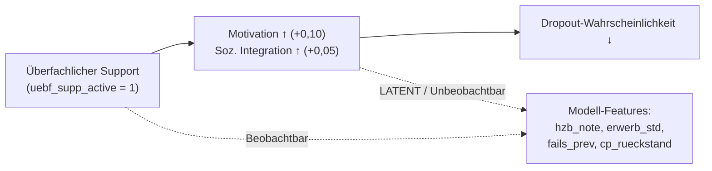

# Review: Mathematische Analyse der Counterfactual-Methoden

**Projekt:** DeepSupport – Wirksamkeitsanalyse von Hochschulsupport  
**Datum:** 21. August 2026  
**Dokumenttyp:** Methodisches Code-Review & mathematische Modellvergleiche

---

## Inhalt

1. [Korrekte Zeitkosten und Wirkungsmechanismen](#1-korrekte-zeitkosten-und-wirkungsmechanismen)
2. [Methode 0: Ground Truth (5-Universen-Simulation)](#2-methode-0-ground-truth-5-universen-simulation)
3. [Methode 1: Statistischer Cox-Regressor (Extended Cox Delta)](#3-methode-1-statistischer-cox-regressor)
4. [Methode 2: Neuronale Cox-Modelle (DeepSurv Panel & Delta)](#4-methode-2-neuronale-cox-modelle)
5. [Methode 3: Discrete-Time-Modelle (Logistic Hazard, DeepHit)](#5-methode-3-discrete-time-modelle)
6. [Methode 4: Sequenzmodelle (Transformer, GRU)](#6-methode-4-sequenzmodelle)
7. [Methode 5: Double Machine Learning (DML)](#7-methode-5-double-machine-learning)
8. [Synoptischer Vergleich aller Methoden](#8-synoptischer-vergleich-aller-methoden)
9. [Diagnose: Warum überfachlicher Support falsch geschätzt wird](#9-diagnose-warum-überfachlicher-support-falsch-geschätzt-wird)
10. [Offene Fragen & Empfehlungen](#10-offene-fragen--empfehlungen)

---

## 1. Korrekte Zeitkosten und Wirkungsmechanismen

Die Zeitkosten der Support-Angebote sind **nicht** einheitlich 30h, sondern unterscheiden sich erheblich. Aus [`config.py`](file:///c:/GitHub_public/Abschlussprojekt/src/config.py) (`SUPPORT_ANGEBOTE`):

### A. Fachlicher Support: **30 h / Semester**
| Angebot | Kosten |
|:---|:---:|
| SUP01 Mathe-Tutorium | 30 h |
| SUP02 Programmier-Lerngruppe | 30 h |
| SUP03 Statistik-Repetitorium | 30 h |
| SUP04 Schreibwerkstatt | 30 h |
| SUP05 Sprachkurs Englisch | 30 h |
| SUP06 Examenscoaching | 30 h |

**Wirkung:** Kein direkter Motivations- oder Integrationsboost. Wirkt ausschließlich über **Notenverbesserung** bei zugeordneten Prüfungen (Boost-Faktor $0{,}40$, mit Carry-over $\frac{2}{3}$ in Folgesemester).

### B. Überfachlicher Support: **10 h / Semester**
| Angebot | Kosten |
|:---|:---:|
| SUP07 Zeitmanagement-Workshop | 10 h |
| SUP08 Lerncoaching | 10 h |
| SUP09 Mentoring-Programm | 10 h |

**Wirkung:** Direkter Motivationsboost **+0,10** und sozialer Integrationsboost **+0,05** (mit `support_effect_multiplier` = 5,0).

### C. Psychosozialer Support: **5–15 h / Semester** (Durchschnitt: 8,3 h)
| Angebot | Kosten |
|:---|:---:|
| SUP10 Psychologische Beratung | 5 h |
| SUP11 Studienberatung | 5 h |
| SUP12 Peer-Support-Gruppe | 15 h |

**Wirkung:** Direkter Motivationsboost **+0,075** und starker sozialer Integrationsboost **+0,175**.

> [!IMPORTANT]
> **Kernunterschied:** Überfachlicher Support kostet nur **⅓ der Zeit** des fachlichen Supports und wirkt direkt auf die Dropout-Formel (via Motivation und soziale Integration), während fachlicher Support **nur** über Prüfungsnoten wirkt und mit 30h die höchsten Zeitkosten verursacht.

---

## 2. Methode 0: Ground Truth (5-Universen-Simulation)

### Funktionsweise
Die Simulation in [`simulation_v3.py`](file:///c:/GitHub_public/Abschlussprojekt/src/simulation_v3.py) erzeugt 50.000 identische Studierenden-Klone, die in 5 parallelen Universen simuliert werden. Die Universen unterscheiden sich nur darin, welche Support-Typen **kategorisch blockiert** werden:

| Universum | `block_fach` | `block_uebf` | `block_psych` |
|:---|:---:|:---:|:---:|
| A (Baseline) | ✗ | ✗ | ✗ |
| B (Kein Support) | ✓ | ✓ | ✓ |
| C (Kein fachlicher Support) | ✓ | ✗ | ✗ |
| D (Kein überfachlicher Support) | ✗ | ✓ | ✗ |
| E (Kein psychosozialer Support) | ✗ | ✗ | ✓ |

### Blockierungsmechanismus (Zeilen 171–205)
```python
blocked = (typ == "fachlich" and block_fach) or \
          (typ == "ueberfachlich" and block_uebf) or \
          (typ == "psychosozial" and block_psych)

if nutzt_support and not blocked:
    teilgenommene_angebote.append(ang_id)
    support_zeit_kosten += angebot.get("kosten_h", 30)
elif nutzt_support and blocked:
    # RNG-Alignment: Dummy-Draw, falls Zeitbudget überschritten wäre
    if verfuegbare_zeit - support_zeit_kosten - angebot.get("kosten_h", 30) < 0:
        _ = rng_support.random()
```

Wenn ein Support blockiert ist:
- Der Student nimmt **nicht teil** (keine Zeitkosten, kein Boost)
- Die RNG-Streams bleiben synchron durch Dummy-Draws

### Berechnung des Ground-Truth RR
$$\text{RR}_{X} = \frac{R_A}{R_X}$$

wobei $R_A$ die Dropout-Rate in Universum A (mit Support) und $R_X$ die Dropout-Rate im Universum ohne den jeweiligen Support-Typ ist.

### Interpretation
Dies ist ein **perfektes kontrafaktisches Experiment**: Derselbe Student erlebt in jedem Universum exakt dieselben Zufallsereignisse (dank der 4 isolierten RNG-Streams: `rng_init`, `rng_support`, `rng_social`, `rng_dropout` und positionsunabhängigem Prüfungsrauschen via CRC32). Der einzige Unterschied ist die kategorische An/Abwesenheit eines Support-Typs.

---

## 3. Methode 1: Statistischer Cox-Regressor

**Skript:** [`extended_cox_delta.py`](file:///c:/GitHub_public/Abschlussprojekt/src/extended_cox_delta.py)  
**Modelltyp:** Semiparametrischer Cox Proportional-Hazards (PHReg)

### Mathematisches Modell
$$h(t \mid X) = h_0(t) \cdot \exp\left(\sum_{k=1}^{K} \beta_k X_k\right)$$

### Schätzung
Maximierung der Breslow-Log-Partial-Likelihood:
$$\ell(\beta) = \sum_{j=1}^{D} \left[ \sum_{i \in D_j} X_i(t_j)'\beta \;-\; d_j \ln \left( \sum_{k \in R(t_j)} \exp(X_k(t_j)'\beta) \right) \right]$$

wobei $R(t_j) = \{k : t_{\text{start},k} < t_j \le t_{\text{stop},k}\}$ die Risikomenge (Risk Set) zum Zeitpunkt $t_j$ ist.

### HR-Berechnung
$$\text{HR}_k = \exp(\hat{\beta}_k)$$

### Merkmale dieser Methode
- **Global & konstant:** Jeder Koeffizient $\hat{\beta}_k$ liefert **eine einzige HR** für die gesamte Population über die gesamte Studiendauer.
- **Proportional-Hazards-Annahme:** Die HR ist zeitunabhängig. Wenn der wahre Effekt über die Semester variiert (z.B. stärker in frühen Semestern), wird dies gemittelt.
- **Keine kontrafaktische Intervention:** Es wird nicht explizit „Support an vs. aus" simuliert, sondern der statistische Zusammenhang im beobachteten Datensatz geschätzt.
- **Confounding:** Kontrolliert nur für die beobachteten Kovariaten (`hzb_note`, `erwerbstaetigkeit_std`, `fails_prev`, `delta_cp_prev`, `cp_rueckstand`, `erstakademiker`, `stg_name`). Latente Variablen wie **Motivation** und **soziale Integration** sind nicht beobachtbar.

---

## 4. Methode 2: Neuronale Cox-Modelle (DeepSurv)

**Skripte:**  
- [`counterfactual_hr_analyzer.py`](file:///c:/GitHub_public/Abschlussprojekt/src/counterfactual_hr_analyzer.py) → Extended DeepSurv Panel  
- [`counterfactual_hr_delta.py`](file:///c:/GitHub_public/Abschlussprojekt/src/counterfactual_hr_delta.py) → Extended DeepSurv Delta

### Mathematisches Modell
$$h(t \mid X) = h_0(t) \cdot \exp\left(g_\theta(X)\right)$$

wobei $g_\theta(X)$ ein tiefes neuronales Netz ist (4-Layer MLP: `128 → 64 → 32 → 16 → 1`, mit LayerNorm und Dropout), trainiert mit der Breslow-Cox-Loss:

$$\mathcal{L}_{\text{Breslow}}(\theta) = -\frac{1}{\sum_i E_i} \sum_{i: E_i=1} \left[ g_\theta(X_i) - \ln\left(\sum_{k: T_k \ge T_i} \exp(g_\theta(X_k)) + 10^{-7}\right) \right]$$

### Kontrafaktische HR-Berechnung
Für jeden Studierenden $i$ im Test-Set:

1. **Kontroll-Szenario** ($A=0$): Support-Variable auf `0.0` setzen → Vorhersage $h_{0,i} = g_\theta(X_i^{(0)})$
2. **Treatment-Szenario** ($A=1$): Support-Variable auf `1.0` setzen → Vorhersage $h_{1,i} = g_\theta(X_i^{(1)})$

$$\text{HR}_i = \frac{h(t \mid X_i^{(1)})}{h(t \mid X_i^{(0)})} = \exp\left(g_\theta(X_i^{(1)}) - g_\theta(X_i^{(0)})\right)$$

Dann: $\text{Median HR} = \text{Median}(\{HR_i\}_{i=1}^{N_{\text{test}}})$

### Unterschied Panel vs. Delta
| Eigenschaft | **DeepSurv Panel** | **DeepSurv Delta** |
|:---|:---|:---|
| Support-Features | `fach_supp_tv`, `uebf_supp_tv`, `psych_supp_tv` (jemals teilgenommen) | `fach_supp_active`, `uebf_supp_active`, `psych_supp_active` (dieses Semester aktiv) |
| Leistungs-Features | `cum_cp`, `cum_fails` (kumulativ) | `fails_prev`, `delta_cp_prev`, `cp_rueckstand` (Vorsemester-Deltas) |
| Toggle-Methode | Nur Ziel-Support getoggelt, andere bei beobachtetem Wert | Nur Ziel-Support getoggelt, andere bei beobachtetem Wert |

> [!NOTE]
> **Wichtig:** Die Support-Variablen werden in der ColumnTransformer-Pipeline als **`passthrough`** behandelt, d.h. die binären Werte 0,0 und 1,0 werden **nicht** durch den StandardScaler verzerrt.

---

## 5. Methode 3: Discrete-Time-Modelle (Logistic Hazard, DeepHit)

**Skripte:**  
- [`counterfactual_rr_logistic_hazard_delta.py`](file:///c:/GitHub_public/Abschlussprojekt/src/counterfactual_rr_logistic_hazard_delta.py) → Extended Logistic Hazard Delta  
- [`counterfactual_rr_deephit_delta.py`](file:///c:/GitHub_public/Abschlussprojekt/src/counterfactual_rr_deephit_delta.py) → Dynamic DeepHit Delta

### Mathematisches Modell
Statt einer kontinuierlichen Hazard-Funktion schätzen diese Modelle die **bedingte Ereigniswahrscheinlichkeit** pro diskretem Zeitschritt:

$$p_{i,t} = P(E_{i,t} = 1 \mid T_i \ge t, X_{i,t})$$

trainiert mit Binary Cross-Entropy:
$$\mathcal{L} = -\frac{1}{N} \sum_{i=1}^{N} \left[ y_i \ln(p_i) + (1-y_i)\ln(1-p_i) \right]$$

### Kontrafaktische RR-Berechnung

**Logistic Hazard Delta** (reine Isolation):
```
Kontroll: ALLE 3 Support-Variablen = 0.0
Treated:  NUR Ziel-Support = 1.0, andere 2 = 0.0
```

$$\text{RR}_i = \frac{p_{1,i}}{p_{0,i}} = \frac{P(E_i=1 \mid A_{\text{Ziel}}=1, A_{\text{andere}}=0)}{P(E_i=1 \mid A_{\text{Ziel}}=0, A_{\text{andere}}=0)}$$

**DeepHit Delta** (Sequenz-Tensor, 3D):
```
Kontroll: Spalten 4,5,6 = 0.0 für alle validen Zeitschritte
Treated:  NUR Ziel-Spalte = 1.0 für alle validen Zeitschritte
→ StandardScaler wird NACH dem Toggling angewendet
```

$$\text{RR}_{i,t} = \frac{p_{1,i,t}}{p_{0,i,t}}$$

Berechnet über **alle validen Semester-Zeitschritte** (nicht nur den letzten).

### Unterschied zu Cox-Modellen

| Eigenschaft | Cox / DeepSurv | Logistic Hazard / DeepHit |
|:---|:---|:---|
| Output | Log-Hazard-Ratio $g_\theta(X)$ | Bedingte Wahrscheinlichkeit $p \in [0,1]$ |
| Metrik | $\text{HR} = \exp(h_1 - h_0)$ | $\text{RR} = p_1 / p_0$ |
| Baseline-Hazard | Wird herausgekürzt | Implizit im Sigmoid enthalten |
| Interpretation | Instantane Rate | Diskrete Ereigniswahrscheinlichkeit |

> [!WARNING]
> **Methodischer Unterschied bei der Kontrollgruppe:**  
> - **DeepSurv** (Panel & Delta): Toggelt nur den Ziel-Support; die anderen **bleiben bei ihrem beobachteten Wert**.
> - **Logistic Hazard Delta & DeepHit Delta**: Setzen alle 3 Support-Variablen auf 0 in der Kontrollgruppe und nur den Ziel-Support auf 1 in der Treatmentgruppe.
> 
> Das ist ein substanzieller Unterschied! Beim DeepSurv-Panel bleibt z.B. ein Student, der empirisch überfachlichen *und* psychosozialen Support erhält, in der Kontrollgruppe bei diesen beobachteten Werten – nur der fachliche Support wird getoggelt. Das entspricht einer **partiellen** Intervention, nicht einer **reinen** Isolation.

---

## 6. Methode 4: Sequenzmodelle (Transformer, GRU)

**Skripte:**  
- [`counterfactual_inference_semester_transformer.py`](file:///c:/GitHub_public/Abschlussprojekt/src/counterfactual_inference_semester_transformer.py) → Semester Transformer  
- [`counterfactual_rr_exam_rnn_delta.py`](file:///c:/GitHub_public/Abschlussprojekt/src/counterfactual_rr_exam_rnn_delta.py) → Exam RNN Delta  
- [`counterfactual_rnn_delta.py`](file:///c:/GitHub_public/Abschlussprojekt/src/counterfactual_rnn_delta.py) → Recurrent GRU V2

### Mathematisches Modell
Rekurrente/Attention-basierte Netzwerke verarbeiten Sequenzen $\{X_{i,1}, X_{i,2}, \ldots, X_{i,T_i}\}$ und geben pro Zeitschritt eine bedingte Dropout-Wahrscheinlichkeit aus:

$$p_{i,t} = f_\theta(X_{i,1:t})$$

### Kontrafaktische RR-Berechnung

**Semester Transformer:** Nur `fach_supp_cum` (Spalte 3) wird getoggelt; `uebf_supp_cum` und `psych_supp_cum` bleiben bei beobachteten Werten. Evaluation über alle validen Semester-Tokens.

**Exam RNN Delta & GRU V2:** Alle 3 Support-Kanäle werden auf 0 gesetzt (Kontroll), dann nur der Ziel-Kanal auf 1 (Treatment). Evaluation **nur am letzten beobachteten Prüfungsschritt** $T_i$:

$$\text{RR}_i = \frac{p_{1, i, T_i}}{p_{0, i, T_i}}$$

### Besonderheit: Skalierung nach Toggling

Im Gegensatz zu den Panel-Modellen (wo Support `passthrough` ist) wenden die Sequenzmodelle den `StandardScaler` **nach** dem Toggling an:

$$Z_0 = \frac{0 - \mu_j}{\sigma_j}, \quad Z_1 = \frac{1 - \mu_j}{\sigma_j}$$

Das ist mathematisch korrekt, solange der Scaler auf dem Trainingsdatensatz gefittet wurde – das Netzwerk sieht dann die gleiche Standardisierung wie beim Training.

---

## 7. Methode 5: Double Machine Learning (DML)

**Skript:** [`dml_orthogonal_survival.py`](file:///c:/GitHub_public/Abschlussprojekt/src/dml_orthogonal_survival.py)

### Mathematisches Modell (3-Stufen-Verfahren)

**Stufe 1: Propensity-Residualisierung**

Für jedes Treatment $k \in \{\text{fach}, \text{uebf}, \text{psych}\}$ wird ein Propensity-Modell geschätzt:
$$\hat{e}_k(W_i) = P(A_{i,k} = 1 \mid W_i)$$

Dann wird das Residuum berechnet:
$$\tilde{A}_{i,k} = A_{i,k} - \hat{e}_k(W_i)$$

**Stufe 2: Orthogonales Hazard-Modell**

Ein neuronales Netz $f_\theta(W, \tilde{A})$ wird auf das Residual-Treatment trainiert (Binary Cross-Entropy auf `event`).

**Stufe 3: Kontrafaktische Inferenz**

Für die Kontroll-/Treatment-Szenarien wird das Propensity-Residuum angepasst:
- **Kontroll** ($A_k = 0$): $\tilde{A}_k^{(0)} = 0 - \hat{e}_k(W_i) = -\hat{e}_k(W_i)$
- **Treatment** ($A_k = 1$): $\tilde{A}_k^{(1)} = 1 - \hat{e}_k(W_i)$

$$\text{RR}_i^{\text{DML}} = \frac{f_\theta(W_i, \tilde{A}_i^{(1)})}{f_\theta(W_i, \tilde{A}_i^{(0)})} = \frac{f_\theta(W_i, 1 - \hat{e}(W_i))}{f_\theta(W_i, -\hat{e}(W_i))}$$

### Methodische Besonderheit
Die Orthogonalisierung soll sicherstellen, dass die kausale Schätzung **robust gegen moderate Fehlspezifikation** des Propensity-Modells ist (Neyman-Orthogonalität / Double Robustness). Der Ansatz versucht, den Selektionsbias durch die Residualisierung zu eliminieren.

---

## 8. Synoptischer Vergleich aller Methoden

### A. Was wird kontrafaktisch manipuliert?

| Methode | Kontroll-Szenario | Treatment-Szenario | Isolation? |
|:---|:---|:---|:---|
| **Ground Truth** | Support-Typ komplett blockiert in gesamter Simulation | Support-Typ aktiv in gesamter Simulation | ✅ Perfekt |
| **Stat. Cox** | Nicht explizit – HR = exp(β) | Nicht explizit – HR = exp(β) | ❌ Kein Toggle |
| **DeepSurv Panel** | Ziel-Support = 0; andere = **beobachteter Wert** | Ziel-Support = 1; andere = **beobachteter Wert** | ⚠️ Partiell |
| **DeepSurv Delta** | Ziel-Support = 0; andere = **beobachteter Wert** | Ziel-Support = 1; andere = **beobachteter Wert** | ⚠️ Partiell |
| **Logistic Hazard** | **Alle 3** Supports = 0 | Ziel = 1, andere 2 = 0 | ✅ Rein |
| **DeepHit Delta** | **Alle 3** Supports = 0 | Ziel = 1, andere 2 = 0 | ✅ Rein |
| **Semester Transformer** | Nur `fach_supp_cum` = 0; andere = **beobachtet** | `fach_supp_cum` = 1; andere = **beobachtet** | ⚠️ Nur Fachlich, partiell |
| **Exam RNN Delta/V2** | **Alle 3** Supports = 0 | Ziel = 1, andere 2 = 0 | ✅ Rein |
| **DML Orthogonal** | $\tilde{A}_k = -\hat{e}_k(W)$ | $\tilde{A}_k = 1 - \hat{e}_k(W)$ | ✅ Residualisiert |

### B. Was wird berechnet?

| Methode | Output-Typ | Formel | Aggregation |
|:---|:---|:---|:---|
| **Ground Truth** | Makro-RR | $R_A / R_X$ | Populationsebene |
| **Stat. Cox** | Parametrischer HR | $\exp(\hat{\beta})$ | Ein globaler Wert |
| **DeepSurv** | Individueller HR | $\exp(g_\theta(X^{(1)}) - g_\theta(X^{(0)}))$ | Median/Mean über Test-Set |
| **Logistic Hazard** | Individueller RR | $p_1 / p_0$ | Median/Mean über Test-Set |
| **DeepHit** | Step-weiser RR | $p_{1,t} / p_{0,t}$ | Median/Mean über alle Steps |
| **Transformer** | Step-weiser HR/RR | $p_{1,t} / p_{0,t}$ | Mean/Median/Global |
| **Exam RNN** | Endpunkt-RR | $p_{1,T_i} / p_{0,T_i}$ | Median/Mean über Studis |
| **DML** | Residualisierter RR | $f(W, \tilde{A}^{(1)}) / f(W, \tilde{A}^{(0)})$ | Median/Mean über Test-Set |

### C. Welche Features sehen die Modelle?

| Feature | Stat. Cox | DeepSurv Panel | DeepSurv Delta | Log. Hazard | DML | Simulation (latent) |
|:---|:---:|:---:|:---:|:---:|:---:|:---:|
| `hzb_note` | ✓ | ✓ | ✓ | ✓ | ✓ | ✓ |
| `erwerbstaetigkeit_std` | ✓ | ✓ | ✓ | ✓ | ✓ | ✓ |
| `fails_prev` / `cum_fails` | ✓ | ✓ | ✓ | ✓ | ✓ | ✓ |
| `cp_rueckstand` | ✓ | – | ✓ | ✓ | ✓ | ✓ |
| `delta_cp_prev` | ✓ | – | ✓ | ✓ | ✓ | ✓ |
| `stg_name` | ✓ | ✓ | ✓ | ✓ | ✓ | ✓ |
| `erstakademiker` | ✓ | ✓ | ✓ | ✓ | ✓ | ✓ |
| **`motivation`** | ❌ | ❌ | ❌ | ❌ | ❌ | ✓ (latent) |
| **`soz_integration`** | ❌ | ❌ | ❌ | ❌ | ❌ | ✓ (latent) |
| **`overload_penalty`** | ❌ | ❌ | ❌ | ❌ | ❌ | ✓ (latent) |
| **`hidden_zeit_puffer`** | ❌ | ❌ | ❌ | ❌ | ❌ | ✓ (latent) |

---

## 9. Diagnose: Warum überfachlicher Support falsch geschätzt wird

### A. Der tatsächliche Kausaleffekt im DGP

Überfachlicher Support hat in der Simulation folgende Eigenschaften:
- Zeitkosten: **nur 10h** (⅓ des fachlichen Supports)
- Motivationsboost: **+0,10** (direkt)
- Sozialer Integrationsboost: **+0,05** (direkt)
- Noteneffekt: **keiner** (keine Prüfungs-Zuordnung)

Die Dropout-Formel lautet:
$$p_{\text{drop}} = 0{,}5 \times \text{clip}\left(0{,}01 + \underbrace{\max(0, 0{,}4 - \text{motivation}) \times 0{,}30}_{\text{Motivation}} + \underbrace{\max(0, 0{,}4 - \text{soz\_int}) \times 0{,}20}_{\text{Soz. Integration}} + \ldots, \; 0, \; 0{,}45\right)$$

Der überfachliche Support senkt das Risiko direkt über **zwei** Kanäle: Motivation ($-0{,}10 \times 0{,}30 = -0{,}03$ auf den Hazard-Term, wenn Motivation unter 0,4) und soziale Integration ($-0{,}05 \times 0{,}20 = -0{,}01$). Das erklärt den Ground-Truth-Effekt $\text{RR} = 0{,}9387$ (stärkster Einzeleffekt!).

### B. Warum alle Modelle den Effekt verfehlen (HR ≈ 1,01–1,09)

Die zentrale Diagnose umfasst **drei** Mechanismen:

#### 1. Latente Mediatoren sind unbeobachtbar
Die Modelle sehen **weder `motivation` noch `soz_integration`**. Der kausale Pfad des überfachlichen Supports verläuft:



Die Modelle können den Kausaleffekt nicht entlang des latenten Pfads lernen, weil sie die Mediatoren nicht sehen. Sie müssen den Effekt aus Korrelationen in den **beobachtbaren** Features ableiten – und dort dominiert der Selektionsbias.

#### 2. Negativer Selektionseffekt (Reverse Causality)
Studierende, die Zeitmanagement-Workshops oder Lerncoaching buchen, tun dies **weil** sie Probleme haben (schlechte Zeitplanung, Prokrastination). In den beobachtbaren Features zeigt sich:
- Höherer `cp_rueckstand`
- Mehr `fails_prev`
- Schlechtere Noten

Die Modelle sehen also: „Wer überfachlichen Support nutzt, hat schlechtere Leistungsindikatoren → höheres Dropout-Risiko." Das ist kein kausaler Effekt des Supports, sondern der **Selektionsmechanismus**.

#### 3. Kein kompensierender Noteneffekt
Im Gegensatz zum fachlichen Support, der über verbesserte Prüfungsnoten einen **beobachtbaren** positiven Effekt erzeugt (bessere Noten → weniger `fails_prev` → niedrigerer `cp_rueckstand`), hinterlässt der überfachliche Support **keine beobachtbare Spur** in den Modell-Features. Der gesamte Effekt fließt durch die latenten Variablen Motivation und soziale Integration.

### C. Zusammenfassung der Diagnose

| Support-Typ | Kausaler Pfad | Beobachtbar durch Modelle? | Modell-Schätzung |
|:---|:---|:---:|:---|
| **Fachlich** | Noten ↑ → fails ↓ → cp_rueckstand ↓ → Dropout ↓ | **Teilweise** (über Noten/CP) | Überschätzt ($HR \approx 0{,}77$–$0{,}97$) |
| **Überfachlich** | Motivation ↑ + Soz. Int. ↑ → Dropout ↓ | **Nein** (latent!) | **Falsche Richtung** ($HR \approx 1{,}01$–$1{,}10$) |
| **Psychosozial** | Motivation ↑ + starke Soz. Int. ↑ → Dropout ↓ | **Nein** (latent!) | Teils korrekt ($HR \approx 0{,}84$–$0{,}96$) |

> [!IMPORTANT]
> **Warum wird psychosozialer Support besser erkannt als überfachlicher?**  
> Psychosoziale Beratung hat einen deutlich stärkeren sozialen Integrationsboost (**+0,175** vs. +0,05) und niedrigere Zeitkosten (**5–15h** vs. 10h). Zudem ist die Selbstselektion bei psychosozialer Beratung möglicherweise weniger stark mit schlechten Leistungsindikatoren korreliert als bei Lerncoaching – Studierende suchen psychologische Hilfe auch bei guten Noten, wenn sie emotionale Probleme haben.

---

## 10. Offene Fragen & Empfehlungen

### Methodische Fragen

1. **Unterschiedliche Kontrollgruppen-Definition:** Warum nutzen DeepSurv-Modelle die partielle Isolation (nur Ziel-Support toggeln, andere beobachtet), während Logistic Hazard und DeepHit die reine Isolation verwenden (alle 3 auf 0)? Dies beeinflusst die Vergleichbarkeit der Ergebnisse.

2. **Semester Transformer:** Evaluiert nur den fachlichen Support (`fach_supp_cum`), nicht überfachlich oder psychosozial. Die anderen beiden Kanäle werden gar nicht kontrafaktisch untersucht.

3. **Sequenzlängen-Leakage bei Deep Exam-Transformer Survival:** Der Bericht zeigt $\text{ROC-AUC} = 0{,}9999$ für das Exam-Survival-Modell. Die diagnostische Analyse ergab, dass **Absolventen im Schnitt 18,7 Prüfungen** ablegen und **Abbrecher nur 10,7** – die Sequenzlänge im gepadeten 3D-Tensor verrät dem Attention-Mechanismus unmittelbar den Outcome.

### Empfehlungen

1. **Vereinheitlichung der Kontrollgruppen:** Alle Counterfactual-Skripte sollten konsistent die reine Isolation verwenden (alle 3 Supports auf 0 in der Kontrolle, nur Ziel auf 1 im Treatment).

2. **Proxy-Features für latente Variablen:** Um den überfachlichen Support korrekt zu schätzen, bräuchten die Modelle Features, die als Proxy für Motivation und soziale Integration dienen (z.B. Anwesenheit in Lehrveranstaltungen, Bibliotheksnutzung, Teilnahme an Hochschulgruppen).

3. **Semester Transformer erweitern:** Die kontrafaktische Inferenz sollte auch für überfachlichen und psychosozialen Support durchgeführt werden.
