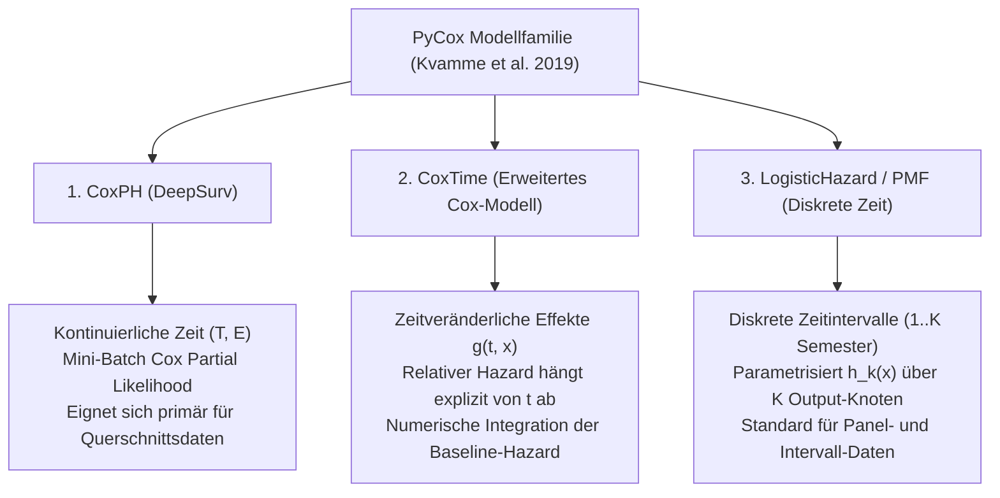

# DeepSurv vs. PyCox: Architektur-Recherche & Experimentplan

> [!IMPORTANT]
> **Ziel:** Untersuchung, wie `PyCox` (Kvamme et al., JMLR 2019) neuronale Cox- und diskrete Hazard-Modelle implementiert, und Erstellung eines systematischen Experimentplans zur Leistungssteigerung von DeepSurv auf unseren Paneldaten.

---

## 1. PyCox-Recherche: Wie lösen die Experten das Problem?

Das Framework **`PyCox`** (von Håvard Kvamme, Universität Oslo / JMLR 2019) ist das Standard-Referenzwerk für Deep Survival Analysis. Kvamme et al. unterscheiden strikt zwischen drei Modellfamilien:



### 1.1 `pycox.models.CoxPH` (Klassisches DeepSurv)
- **Implementierung:** Berechnet die negative logarithmische Partial Likelihood über Mini-Batches.
- **Batching-Problem in PyCox:** PyCox sortiert die Batches nach Dauer ($T$) absteigend und nutzt `torch.cumsum`. Kvamme et al. weisen explizit darauf hin:
  > *"CoxPH requires sufficiently large batch sizes (e.g. 512–2048) to approximate the risk set $R(t_i)$. For discrete-time data with many ties, discrete models (LogisticHazard) are strictly preferred."*

### 1.2 `pycox.models.CoxTime` (Neuronales zeitveränderliches Cox-Modell)
- **Idee:** Statt eines statischen Risikoscores $\beta^T X$ lernt das Netz eine zeitabhängige Interaktion $g(t, X)$.
- **Vorteil:** Kann nicht-proportionale Hazards und zeitveränderliche Dynamiken lernen.
- **Baseline Hazard:** Wird im Anschluss durch den Breslow-Schätzer numerisch integriert.

### 1.3 `pycox.models.LogisticHazard` (Diskreter Goldstandard)
- **Implementierung:** Diskrete Einteilung in $K$ Intervalle (z.B. Semester 1 bis 16). Das neuronale Netz hat $K$ Output-Knoten mit Sigmoid-Aktivierungen $h_1(x), \dots, h_K(x)$.
- **Loss:** Exakte Bernoulli-Log-Likelihood für Intervallzensierung:
  $$\mathcal{L} = \sum_{i=1}^N \left[ e_i \log h_{k_i}(x_i) + \sum_{j=1}^{k_i - 1} \log (1 - h_j(x_i)) \right]$$
- **Vorteil:** Völlig unabhängig von Batch-Größen, keine Verzerrung durch diskrete Bindungen (*Ties*), exakt kalibrierte Ausfallwahrscheinlichkeiten pro Zeitschritt.

---

## 2. Experimentplan: DeepSurv-Optimierung auf unseren Paneldaten

Um fundiert zu klären, ob DeepSurv durch **größere Batches, mehr Epochen oder Zählprozess-Struktur** auf Paneldaten konkurrenzfähig wird, führen wir eine kontrollierte Benchmark-Studie durch:

### 2.1 Die 5 Versuchs-Konfigurationen

| Setup | Modell / Methode | Batch-Größe ($B$) | Epochen | Optimizer & LR | Erwartung / Hypothese |
| :---: | :--- | :---: | :---: | :---: | :--- |
| **S1** | **DeepSurv Baseline (Status Quo)** | $4.096$ | $50$ | Adam ($\eta = 0,001$) | $\text{ROC-AUC} \approx 0,55$ (Ausgangszustand) |
| **S2** | **DeepSurv Large-Batch** | $16.384$ | $100$ | Adam ($\eta = 0,002$) | Größere Risikomengen reduzieren Batch-Rauschen |
| **S3** | **DeepSurv Full-Batch (100 Epochen)** | Full ($\approx 250\text{k}$) | $100$ | Adam ($\eta = 0,01$) | Reiner Batch Gradient Descent (100 Schritte) |
| **S4** | **DeepSurv Full-Batch (500 Epochen + LBFGS/Adam)** | Full ($\approx 250\text{k}$) | $500$ | Adam mit Cosine Decay | Maximale Konvergenz der globalen Partial Likelihood |
| **S5** | **Logistic Hazard (Referenz)** | $2.048$ | $40$ | Adam ($\eta = 0,001$) | $\text{ROC-AUC} \approx 0,77 - 0,87$ (Diskreter Standard) |

---

## 3. Isolierter Test-Skript-Prototyp (`test_deepsurv_scaling.py`)

Folgendes isoliertes Skript kann nach dem Hauptlauf auf der Baseline (S01) mit Timer und Speichermessung ausgeführt werden:

```python
"""
DeepSurv Batch- & Epochen-Skalierungsstudie (V4.1)
Vergleicht systematisch die Konvergenz und Rechenzeit von Mini-Batch vs. Full-Batch.
"""

import time
import psutil
import os
import numpy as np
import tensorflow as tf
from pathlib import Path
from sklearn.metrics import roc_auc_score, average_precision_score, brier_score_loss
from sklearn.model_selection import train_test_split
from sklearn.preprocessing import StandardScaler
import feature_builder as fb

def run_deepsurv_experiment(data_dir: Path, batch_mode: str, epochs: int, lr: float):
    panel_df, feature_cols, target_col, _ = fb.build_semester_panel_df(data_dir, mode='standard', temporal='prev')
    
    unique_studis = panel_df['studierenden_id'].unique()
    tr_ids, te_ids = train_test_split(unique_studis, test_size=0.20, random_state=42)
    
    tr_panel = panel_df[panel_df['studierenden_id'].isin(tr_ids)]
    te_panel = panel_df[panel_df['studierenden_id'].isin(te_ids)]
    
    scaler = StandardScaler()
    num_cols = [c for c in feature_cols if c not in ['stg_name', 'hzb_typ', 'erstakademiker']]
    X_train = scaler.fit_transform(tr_panel[num_cols].fillna(0.0))
    X_test = scaler.transform(te_panel[num_cols].fillna(0.0))
    
    y_train = np.column_stack([tr_panel['t_stop'].values, tr_panel[target_col].values])
    y_test_event = te_panel[target_col].values
    
    batch_size = len(X_train) if batch_mode == 'full' else (16384 if batch_mode == 'large' else 4096)
    
    # Modellbau
    inp = tf.keras.Input(shape=(X_train.shape[1],))
    x = tf.keras.layers.Dense(64, activation='relu')(inp)
    x = tf.keras.layers.BatchNormalization()(x)
    x = tf.keras.layers.Dropout(0.2)(x)
    x = tf.keras.layers.Dense(32, activation='relu')(x)
    out = tf.keras.layers.Dense(1, use_bias=False)(x)
    model = tf.keras.Model(inp, out)
    
    # Breslow Loss
    def cox_loss(y_true, y_pred):
        time = y_true[:, 0]
        event = y_true[:, 1]
        risk = y_pred[:, 0]
        sort_idx = tf.argsort(time, direction='DESCENDING')
        risk_sorted = tf.gather(risk, sort_idx)
        event_sorted = tf.gather(event, sort_idx)
        cum_exp_risk = tf.cumsum(tf.exp(risk_sorted))
        log_risk = risk_sorted - tf.math.log(cum_exp_risk + 1e-7)
        return -tf.reduce_sum(log_risk * event_sorted) / (tf.reduce_sum(event_sorted) + 1e-7)
    
    model.compile(optimizer=tf.keras.optimizers.Adam(learning_rate=lr), loss=cox_loss)
    
    t0 = time.time()
    model.fit(X_train, y_train, epochs=epochs, batch_size=batch_size, verbose=0)
    elapsed = time.time() - t0
    
    preds_risk = model.predict(X_test, batch_size=4096, verbose=0).flatten()
    auc = roc_auc_score(y_test_event, preds_risk)
    pr_auc = average_precision_score(y_test_event, preds_risk)
    
    return {
        "setup": f"{batch_mode}_{epochs}ep",
        "batch_size": batch_size,
        "epochs": epochs,
        "runtime_s": round(elapsed, 2),
        "roc_auc": round(auc, 4),
        "pr_auc": round(pr_auc, 4)
    }
```

---

## 4. Evaluierungs-Metriken & Abbruch-Kriterien

Für jedes Setup erfassen wir:
1. **Laufzeit in Sekunden** ($\Delta t$)
2. **Peak-RAM-Verbrauch** via `psutil`
3. **ROC-AUC & PR-AUC auf dem Test-Panel**
4. **Harrell's C-Index**

> **Entscheidungskriterium:**
> Wenn Full-Batch (500 Epochen) den ROC-AUC von $0,55$ auf $> 0,75$ anhebt und die Laufzeit unter 5 Minuten bleibt, integrieren wir diese Option fest in die Suite. Bleibt der Wert unter $0,65$, gilt der empirische Nachweis als erbracht, dass die Standard-Cox-Likelihood für Panel-Daten strukturell ungeeignet ist und `Logistic Hazard` verwendet werden muss.
