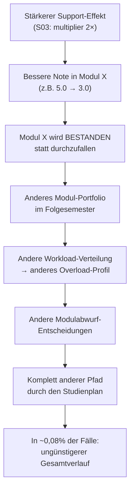

# Detailanalyse: Paradoxe Statuswechsel & Modulabwurf-Korrelationen

## 1. Paradoxe Fälle: Mechanismus identifiziert

### Das Rätsel

| Szenario | Erwartet | Paradoxe Fälle | Rate |
| :--- | :--- | ---: | ---: |
| S02 (Support ½) | Mehr Dropout | 31 *gerettet* | 0,06% |
| S03 (Support 2×) | Weniger Dropout | 41 *verloren* | 0,08% |
| S04 (Boost ½) | Mehr Dropout | 30 *gerettet* | 0,06% |
| S05 (Boost 2×) | Weniger Dropout | 29 *verloren* | 0,06% |
| S06 (Boost 4×) | Weniger Dropout | 23 *verloren* | 0,05% |

### Der Mechanismus: Curricular-Pfad-Schmetterlingseffekt

> [!IMPORTANT]
> **Befund: In 36 von 41 "verloren"-Fällen (S03) ist die erste Divergenz ein Notenshift,
> in 5 Fällen ein Modulshift.** Kein einziger Fall wird durch einen direkten Defekt
> im Simulationsmodell verursacht.

Der Mechanismus im Detail:



### Fallbeispiele S03 (Support 2× → verloren)

**STUD002547** (HZB=3,1, Erwerb=15h):
- S01: Fällt bei MOD0004 durch (5.0) → braucht Wiederholung → absolviert Studium in 12 Sem ✅
- S03: Besteht MOD0004 dank Boost (3.0) → anderes Modul-Set im nächsten Sem → Exmatrikulation Sem 7 ❌
- *Mechanismus: Pass/Fail-Wechsel ändert Modulreihenfolge*

**STUD003893** (HZB=3,1, Erwerb=5h):
- S01: MOD0005 durchgefallen (5.0) → Wiederholung → Abschluss Sem 7 ✅
- S03: MOD0005 bestanden (3.7) dank stärkerem Boost → Abbruch Sem 7 ❌
- *Mechanismus: Bessere Note → früherer Fortschritt → härtere Module zu ungünstigem Zeitpunkt*

**STUD016689** (HZB=3,4, Erwerb=0h):
- S01: Fällt bei MOD0014 + MOD0016 durch → wiederholt → Abschluss Sem 12 ✅
- S03: Besteht beide dank Boost (5.0→3.0 und 5.0→2.3) → überfordert mit schweren Modulen → Exmat Sem 7 ❌
- *Mechanismus: Doppelter Pass/Fail-Wechsel mit Support=True/True → Pfadkollaps*

### Fallbeispiele S02 (Support ½ → gerettet)

**STUD027176** (HZB=2,7, Erwerb=20h):
- S01: 3 Support-Teilnahmen → Abbruch Sem 5 ❌
- S02: **11** Support-Teilnahmen → Abschluss ✅
- *Paradox: Schwächerer Effekt → Student besteht MOD0026 nicht (4.0→5.0) → anderer Pfad → bleibt länger → erhält mehr Support über die Zeit*

**STUD022011** (HZB=3,4, Erwerb=0h):
- S01: 5 Support → Abbruch Sem 8 ❌ (30 Prüfungen)
- S02: **9** Support → Abschluss Sem 15 ✅ (44 Prüfungen)
- *Divergenz: Note ändert sich minimal (MOD0039: 3.0→3.3) → komplett anderer Pfad*

> [!NOTE]
> **Schlüsselbeobachtung bei S02:** Viele "gerettete" Studis haben in S02 (schwächerer Support)
> **mehr** Support-Teilnahmen als in S01! Der Grund: Durch den schwächeren Effekt werden
> Module nicht sofort bestanden → Student bleibt länger im System → kumulative Support-
> Exposition steigt. Der längere Weg zum Abschluss kann sich lohnen.

### Bewertung

> [!TIP]
> Die paradoxen Fälle sind **kein Bug**, sondern ein **Emergenz-Phänomen** der
> pfadabhängigen Simulation. Sie treten in weniger als 0,1% der Fälle auf und
> betreffen ausschließlich Studis am **absoluten Schwellenbereich** (HZB 2,5–3,5,
> hohe Erwerbstätigkeit). Die makroskopischen Effekte (ARR, NNT) sind eindeutig
> monoton: Mehr Support → weniger Dropout.

---

## 2. Zeitkosten und Modulabwürfe

### Gesamtstatistiken

| Szenario | Dropout | Support/Studi | Prüf/Studi | Durchfallquote |
| :--- | ---: | ---: | ---: | ---: |
| **S09 Kosten 0** | 28,6% | 2,68 | 17,09 | 16,3% |
| **S01 Baseline** | 29,2% | 2,69 | 17,05 | 16,4% |
| **S10 Kosten 2×** | 29,7% | 2,71 | 17,00 | 16,6% |

> [!NOTE]
> **Warum ist der Zeitkosten-Effekt so schwach?**
> 
> 1. **Support-Teilnahmen sind praktisch identisch** (~2,7/Studi) — die Zeitkosten
>    ändern fast nichts am Nutzungsverhalten, weil der stochastische 20%-Puffer greift
> 2. **Module/Semester kaum betroffen:** 2,46 vs 2,45 vs 2,44 — minimaler Unterschied
> 3. **Die Support-Zeitkosten (typisch 10–30h) sind klein** im Vergleich zum
>    Zeitbudget von 900h — selbst verdoppelt nur ~5% des Budgets

Der Zeitkosten-Hebel ist also design-bedingt schwach: Das Budget ist groß genug,
um Supportkosten leicht zu absorbieren.

### Prüfungen/Semester nach Kostenvariation

| Szenario | Prüf/Semester | Δ vs Baseline |
| :--- | ---: | ---: |
| S09 Kosten 0 | 2,46 | +0,01 |
| S01 Baseline | 2,45 | — |
| S10 Kosten 2× | 2,44 | −0,01 |

Praktisch kein Einfluss auf die Modulabwürfe.

---

## 3. Erwerbstätigkeit × Dropout (S01 Baseline)

| Erwerb | N | Dropout | Prüf/Studi | Mod/Sem | Abschluss | Exmat |
| ---: | ---: | ---: | ---: | ---: | ---: | ---: |
| **0h** | 12.543 | **17,8%** | 17,8 | 2,62 | 82,2% | 3,0% |
| 5h | 7.598 | 20,1% | 17,6 | 2,61 | 79,9% | 3,9% |
| 10h | 10.077 | 22,5% | 17,6 | 2,58 | 77,5% | 4,6% |
| 15h | 7.356 | 29,7% | 17,0 | 2,47 | 70,3% | 5,2% |
| 20h | 6.474 | 42,5% | 16,3 | 2,26 | 57,5% | 6,8% |
| 25h | 3.519 | 55,3% | 15,3 | 2,04 | 44,7% | 8,6% |
| **30h** | 2.433 | **68,2%** | 14,2 | 1,80 | 31,8% | 10,0% |

### Interpretation

```
Dropout-Rate nach Erwerbstätigkeit (S01 Baseline, N=50.000)

  0h  ████████▊                                        17,8%
  5h  ██████████                                       20,1%
 10h  ███████████▎                                     22,5%
 15h  ██████████████▊                                  29,7%
 20h  █████████████████████▎                           42,5%
 25h  ███████████████████████████▋                     55,3%
 30h  ██████████████████████████████████▏               68,2%
       |----|----|----|----|----|----|----|----|
       0   10   20   30   40   50   60   70   80%
```

> [!IMPORTANT]
> **Der Knick liegt bei 15–20h:** Zwischen 10h und 15h steigt die Dropout-Rate um 7,2pp,
> ab 20h wird sie fast linear (~13pp pro 5h-Stufe).
> 
> **Module/Semester fallen von 2,62 auf 1,80** — Studis mit 30h Erwerbstätigkeit
> schaffen pro Semester nur noch 69% der Module von Vollzeitstudis. Dieses Defizit
> kumulative über 8+ Semester erzeugt den Dropout-Gradienten.
> 
> **Exmatrikulationsrate verdreifacht sich** (3,0% → 10,0%), was zeigt, dass 
> Erwerbstätigkeit nicht nur zu freiwilligem Abbruch führt, sondern auch zu
> akademischem Scheitern durch Überbelastung.

### Designnotiz für spätere Kalibrierung

Die Erwerbstätigkeit ist aktuell statisch implementiert — in der Realität passen Studis
ihre Arbeitszeit oft situativ an (z.B. weniger arbeiten vor Klausurphasen, mehr in
vorlesungsfreier Zeit). Eine dynamische Erwerbstätigkeit mit Rückkopplung auf die
Zeitbelastung wäre ein mögliches V5-Feature. Der aktuelle Gradient (17,8% → 68,2%)
könnte die Realität etwas überzeichnen.
