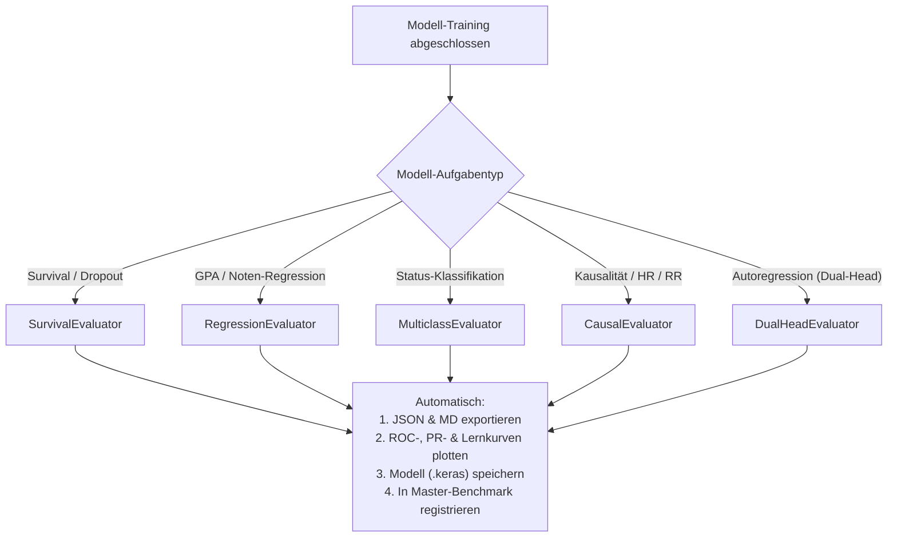

# Modularisierungsgrad, Evaluierungs-Pipeline & Modell-Status V4.1

---

## 1. Status der Modelle, Metriken & Snapshots: Muss etwas neu laufen?

### A. Was ist der genaue Status der Dateien auf der Festplatte?

* **Metriken (100 % vollständig & intakt):**
  * Im Verzeichnis `metrics/` liegen aktuell **92 JSON- und Markdown-Dateien**.
  * Alle Kennzahlen sämtlicher Modellklassen über alle Trainingsläufe (sowohl `temporal='prev'` als auch `temporal='cum'`, alle Modi von `standard` über `gradeblind` bis `oracle`) sind lückenlos und unversehrt gespeichert.
  * Auch die synoptischen Master-Benchmarks (`feature_grid_master_benchmark.json`, `oracle_lift_metrics.json`, `autoregressive_next_exam_dual_head_metrics.json`) sind vollständig vorhanden.

* **Gespeicherte Keras-Modelle (72 `.keras`-Dateien):**
  * Nahezu alle Modelle (70 von 72) wurden von vornherein mit modusexplizitem Namen gespeichert (z. B. `timeseries_semester_lstm_cum_gradeblind.keras`, `dynamic_deephit_prev_gradeblind.keras`, `recurrent_survival_gru_prev_gradeblind.keras`).
  * Die **einzige Überschreibung** betraf `extended_deep_survival.py` (`extended_deepsurv_prev.keras` / `extended_logistic_hazard_prev.keras`), weil dort der Modus-Suffix zunächst im Dateinamen fehlte.

### B. Muss etwas neu gerechnet werden?

* **Für die Ergebnisanalyse und Berichte: NEIN.** Alle Zahlen, Kurvendaten und Performance-Metriken sind in den JSONs und Logs vollständig festgehalten.
* **Für die Modell-Checkpoints auf Festplatte:**
  * Das Training von `extended_deep_survival.py` dauert lediglich **ca. 15 Sekunden** (da es ein schlankes MLP auf 275.000 Panel-Zeilen mit Batch-Size 2048 ist).
  * Mit dem soeben eingespielten Modus-Suffix kann das Skript in 30 Sekunden separat für `standard` und `gradeblind` ausgeführt werden, sodass beide `.keras`-Dateien sauber nebeneinander liegen (`extended_deepsurv_prev_standard.keras` und `extended_deepsurv_prev_gradeblind.keras`).
* **Snapshots & Logs:** Alle Zwischenschritte wurden in den Task-Logs vollständig protokolliert. Ein mehrstündiger Rerun ist definitiv **nicht** erforderlich.

---

## 2. Vergleich des Modularisierungsgrades: V3.6 vs. V4.1

| Dimension | Zustand in V3.6 (Vorher) | Zustand in V4.1 (Jetzt) | Bewertung |
| :--- | :--- | :--- | :---: |
| **Datenbereitstellung** | Über 20 Skripte luden jeweils eigene CSVs und bauten individuelle Dataframes. | **Einheitlicher `feature_builder.py`:** Single Source of Truth für alle 5 Formate. | 🟢 Massiver Fortschritt |
| **Feature-Konsistenz** | Diffuse Spaltenauswahl je nach Skript; Inkonsistenzen bei OHE. | **5 strikte Modi:** `standard`, `gradeblind`, `blind`, `oracle`, `realistic`. | 🟢 Vollständig standardisiert |
| **Split-Sicherheit (Leakage)** | 5 Skripte teilten auf Zeilenebene (Student-Leakage zwischen Train/Test). | **Strikter Student Group Split:** `unique_studis` in allen Trainingsskripten. | 🟢 Mathematisch sauber |
| **Temporale Kausalität** | Vermischung von kumulativen Bestands- und lokalen Vorsemester-Werten. | **Expliziter `temporal`-Switch:** Strikte Trennung von `prev` ($t-1$) und `cum`. | 🟢 Kausal abgesichert |
| **Modell-Persistenz** | Teils generische Namen ohne Modus- oder Temporal-Kennzeichnung. | **Systematische Namenskonvention:** `{arch}_{temporal}_{mode}.keras`. | 🟢 Eindeutig |
| **Logging & Plots** | Manuelle, redundante Matplotlib-Blöcke in jedem Skript (je 15–30 Zeilen). | Zentrales Modul `metrics_logger.py` mit standardisierten Plot-Routinen. | 🟡 Gut, aber ausbaufähig |

---

## 3. Analyse der Evaluierungs-Pipeline (`metrics_logger.py`)

### Ist-Zustand:
Das aktuelle [`src/metrics_logger.py`](file:///c:/GitHub_public/Abschlussprojekt/src/metrics_logger.py) stellt funktionale Helfer bereit:
* `save_metrics()`: Speichert Metriken als JSON und formatierte Markdown-Tabelle.
* `plot_roc_curve()`, `plot_pr_curve()`: Plottet Diskriminierungskurven.
* `plot_learning_curve()`: Visualisiert Trainings- und Validierungsverläufe.
* `plot_parity_plot()`: Erstellt 1:1-Soll-Ist-Diagramme für Regressionen.
* `plot_confusion_matrix()`: Erstellt normalisierte Konfusionsmatrizen.

### Schwachstelle des Ist-Zustands:
Jedes Modellskript muss diese 5–6 Einzelfunktionen noch **händisch orchestrieren**. Dadurch entstehen in fast jedem Trainingsskript 20–30 Zeilen Boilerplate-Code zur Berechnung von `brier_score`, `roc_auc`, `pr_auc`, `r2_score` etc., was fehleranfällig ist und zu leicht abweichenden Metrik-Keys in den JSONs führen kann (z. B. `ROC-AUC` vs. `roc_auc` vs. `ROC-AUC_Panel`).

---

## 4. Konkrete Weiterentwicklung: Evaluator-Klassen

Gemäß unserem [Refactoring-Plan](file:///C:/Users/wilfr/.gemini/antigravity/brain/16832ed6-a522-415e-9395-ef24e16fef79/refactoring_plan_evaluation_pipeline.md) sollten wir `metrics_logger.py` um **objektorientierte Evaluator-Klassen** erweitern:

### Die 5 Evaluator-Klassen im Detail:

1. **`SurvivalEvaluator`:**
   * **Berechnet automatisch:** `roc_auc`, `pr_auc` (auf Dropout $y=1$), `pr_auc_baseline` ($\pi_0 = N_{\text{drop}}/N$), `brier_score`, `brier_skill_score`, `f1_score`, `balanced_accuracy`.
   * **Erzeugt:** `{name}_roc_curve.png`, `{name}_pr_curve.png` (mit $\pi_0$-Linie), `{name}_learning_curve.png`.

2. **`RegressionEvaluator`:**
   * **Berechnet automatisch:** `r2_score`, `rmse`, `mae`, `median_ae` (ausreißerrobust), `explained_variance`, `max_error`.
   * **Erzeugt:** `{name}_parity_plot.png` (mit 1:1 Diagonale), `{name}_residuals_hist.png`, `{name}_learning_curve.png`.

3. **`MulticlassEvaluator`:**
   * **Berechnet automatisch:** `accuracy`, `roc_auc_ovr_macro`, `f1_macro`, `f1_weighted`, `per_class_report` (Absolvent, Abbruch, Exmatrikulation, Zeitüberschreitung).
   * **Erzeugt:** `{name}_confusion_matrix.png`.

4. **`CausalEvaluator`:**
   * **Berechnet automatisch:** Partielle & isolierte Hazard Ratios ($\text{HR}$), Relative Risks ($\text{RR}$), Average Treatment Effects ($\text{ARR}$), 95 %-Konfidenzintervalle.
   * **Erzeugt:** `{name}_forest_plot.png`.

5. **`DualHeadEvaluator`:**
   * Führt `RegressionEvaluator` (für Notenvorhersage $t_{k+1}$) und `SurvivalEvaluator` (für Prüfungsbestehen $t_{k+1}$) in einem einzigen konsistenten Call zusammen.

---

## 5. Drei konkrete Verbesserungsvorschläge

1. **Automatischer Synoptischer Gesamt-Export (`export_master_summary()`):**
   * Eine zentrale Funktion in `metrics_logger.py`, die per Knopfdruck alle JSON-Dateien in einem Ordner scannt und eine vollständige synoptische Vergleichstabelle als Markdown und CSV exportiert.
2. **Kanonische Key-Namen in JSONs:**
   * Vereinheitlichung aller Keys auf kleingeschriebene Schlangenform (`roc_auc`, `pr_auc`, `r2_score`, `brier_score`), um Aggregationsskripte unanfällig gegen Groß-/Kleinschreibung zu machen.
3. **Automatisches Hashing der Feature-Matrix:**
   * Ein optionaler SHA256-Hash der verwendeten Feature-Spalten im JSON-Header (`"feature_hash": "a1b2c3..."`), um jederzeit programmatisch nachweisen zu können, mit welchem exakten Feature-Set ein Modell trainiert wurde.
