# Forschungsakte: Chronologische Evolution der Hypothesen & Empirische Evidenz

**Projekt:** Causal Survival Analysis & Policy Evaluation  
**Datum:** 21. August 2026  
**Dokumenttyp:** Kumulatives Forschungsprotokoll (Append-Only Log)

---

## Chronologische Übersicht der Entwicklungsphasen

```mermaid
flowchart TD
    Phase1["Phase 1: Das Dropout-Paradoxon<br/>(DML schätzt RR=0.895 vs. Makro RR=0.997)"] 
    --> Phase2["Phase 2: Verworrene Erklärungsversuche<br/>(Noten-Bias, Amortisation, Motivations-Boost)"]
    Phase2 -->|Empirisch Widerlegt| Phase3["Phase 3: Entdeckung des Modul-Abwurf-Loops<br/>(Confounding by Time Availability)"]
    Phase3 --> Phase4["Phase 4: Der Causal Transformer-DML Durchbruch<br/>(Latenter Workload rekonstruiert -> RR 0.9987)"]
    Phase4 --> Phase5["Phase 5: Empirische Vertiefungen & V3 Spezifikation<br/>(Erwerbstätigkeit, 3. Versuch Exmatrikulationen)"]
    Phase5 --> Phase6["Phase 6: Noten-ATT & Erwerb-Blind Benchmark<br/>(ATT -0.78 Noten, Blind DML RR 0.825)"]
    Phase6 -->|"V3 Nachtlauf"| Phase7["Phase 7: Simulation V3 Nachtlauf & finale V3 Makro-Effekte<br/>(Stochastischer Puffer B_i, RR_C=0.9971)"]
    Phase7 -->|"Vertiefte Analyse"| Phase8["Phase 8: Vertiefte V3-Analyse & V3.1<br/>(Modulabwurf quantifiziert, Support-Zeit aus Abwurf entfernen)"]
    Phase8 --> Phase10["Phase 10: V3.2 Carry-over & Boost-Verdopplung<br/>(60% wirkungslose Supports gefixt, +125% Boost-Reichweite)"]
    Phase10 -->|"Code-Audit"| Phase11["Phase 11: RNG-Synchronisationsproblem entdeckt<br/>(Würfelsequenzen divergieren → V3.3 geplant)"]
    Phase11 --> Phase12["Phase 12: Simulation V3.3 & Makro-Ground-Truth<br/>(4 isolierte RNG-Streams, CRC32, perfekte Synchronisation)"]
    Phase12 --> Phase13["Phase 13: Feature-Harmonisierung & Kausal-Portfolio<br/>(Leakage-Beseitigung, Deep Transformer Refactoring, 11 Kausalmodelle)"]

    style Phase12 fill:#4caf50,stroke:#333,color:#fff
    style Phase13 fill:#2196f3,stroke:#333,color:#fff
```



---

## PHASE 1: Entdeckung des Dropout-Paradoxons

### Ausgangslage (Simulator V2)
In den 5 kontrafaktischen Universen zeigte sich ein starker Widerspruch zwischen Makro-Simulation und ML-Schätzungen:
* **Wahrheit (Universum C vs. A):** Fachlicher Support senkt das Gesamtdropout um lediglich **-0.07 %-Punkte** (relatives Risiko $RR = 0.9972$).
* **DML-Modell:** Schätzt fachlichen Support als stark protektiv (**$RR = 0.8953$**, ~10.5% Hazard-Reduktion).
* **G1-Opfer-Kohorte:** 1.064 Studierende brechen in Universum A (mit Support) ab, obwohl sie in Universum C (ohne fachlichen Support) erfolgreich abgeschlossen hätten.

---

## PHASE 2: Verworrene Erst-Erklärungen (Chronologisches Archiv)

In der ersten Phase wurden drei Arbeitshypothesen aufgestellt, die sich im Dialog und nach Code-Inspektion als **fehlerhaft bzw. unvollständig** herausstellten:

### 1. Die Zeitersparnis-Amortisations-Hypothese
* **Ursprüngliche These:** Support spart im Folgesemester 150h Wiederholungszeit ein, was den 30h-Overload amortisiert.
* **Widerlegung:** Die Formel aggregierte hypothetische zukünftige Zeitgewinne über die gesamte Studienzeit. Sie ignorierte, dass Studierende mit akutem Overload im *laufenden* Semester abbrechen, bevor sie das Folgesemester je erreichen.

### 2. Die Noten-Confounding / "Blind"-Modell Hypothese
* **Ursprüngliche These:** ML-Modelle werden durch künstlich verbesserte Prüfungsnoten getäuscht, weil sie Noten als Proxy für Überleben nutzen.
* **Widerlegung:** Das Double Machine Learning Modell (`dml_orthogonal_survival.py`) nutzt im Feature-Panel (`extended_cox_delta.py`) **überhaupt keine laufenden Noten**, sondern nur statische HZB-Noten und CP-Rückstände. Da es keine Noten sieht, kann es nicht durch sie getäuscht werden.

### 3. Die Motivations-Boost Hypothese
* **Ursprüngliche These:** Fachlicher Support pusht die mentale Motivation der Studierenden.
* **Widerlegung:** Ein Blick in `simulation_v2.py` (Z. 299–305) belegte, dass fachlicher Support die Motivation *nicht* erhöht (dies tun nur überfachliche und psychosoziale Angebote).

---

## PHASE 3: Die wahre Ursache – Time Availability Confounding

### 1. Das Rätsel der Support-Buchung (`simulation_v2.py`, Z. 286)
```python
if verfuegbare_zeit - support_zeit_kosten - 30 >= 0 or rng.random() < 0.2:
    teilgenommene_angebote.append(ang_id)
```
* **80% der Nutzer** buchen Support *nur, wenn sie ausreichend freie Zeit haben*.
* Wer freie Zeit hat, hat ein verschwindend geringes Dropout-Risiko (*Healthy Support-Taker Effect*).
* **Warum DML versagte:** DML sah `erwerbstaetigkeit_std`, kannte aber den unbeobachteten **geplanten Workload** des aktuellen Semesters nicht. Es konnte nicht unterscheiden, ob ein Student wegen des Supports überlebte oder weil er zufällig ein zeitlich entspanntes Semester hatte.

---

## PHASE 4: Der Causal Transformer-DML Durchbruch

| Modell / Methode | Geschätzter Kausaler Effekt $\beta$ | Relative Risk (RR) | Abweichung zur Ground Truth | Evaluation |
| :--- | :---: | :---: | :---: | :--- |
| **Ground Truth (Universum C vs. A)** | **-0.0007** | **0.9972** | **0.00 %** | Ground Truth (Neutral) |
| **Standard DML (Tabular Cox-Panel)** | -0.0045 | **0.8953** | **-10.19 %** | ❌ Starker Bias |
| **Base Transformer-DML (1 Block, d=32)** | -0.0018 | **0.9582** | **-3.90 %** | ⚠️ Teilweise Korrektur |
| **Deep Causal Transformer-DML (2 Blöcke, d=64)** | **-0.000056** | **0.9987** | **+0.15 %** | 🎯 **BIAS ELIMINIERT!** |

---

## PHASE 5: Vertiefte empirische Evidenz & Exmatrikulationen

### 1. Status der 1.064 G1-Opfer (Empirischer Abgleich)
* **90.7 % (965 Studierende):** Active **Abbruch** (Freiwillig wegen Demotivation/Rückstand).
* **6.9 % (73 Studierende):** **Exmatrikuliert** (Leistungsbedingt / endgültig nicht bestanden).
* **2.4 % (26 Studierende):** **Zeitüberschreitung** (Maximalstudienzeit überschritten).

### 2. Akkumulationsursache (Erwerbstätigkeit)
* **G0 (Andere / Normalos):** Median **10.0 h/Woche** Erwerbstätigkeit $\rightarrow$ 700h Verfügbare Zeit.
* **G1 (Geschädigte):** Median **20.0 h/Woche** Erwerbstätigkeit $\rightarrow$ 500h Verfügbare Zeit (Dauerhafter Engpass).

---

## PHASE 6: Noten-ATT & Erwerb-Blind Benchmark

### 1. Ground-Truth Noten-Effekt (ATT on Grades)
* **Durchschnittlicher Notengewinn:** **-0.7835 Notenstufen** (z. B. Note **2.11** mit Support vs. **2.86** kontrafaktisch ohne Support; Median: **-1.00 Notenstufe**).
* **Gewinn der Bestehensquote:** **+13.54 %-Punkte** (von 79.23% auf 92.77%).

---

## PHASE 7: Simulation V3 Nachtlauf & finale V3 Makro-Effekte

In V3 wurde die stochastische Zeitbudget-Komponente $B_i \sim \mathcal{N}(0, 30^2)$ eingeführt. Die Makro-Effekte zeigten weiterhin ein weitgehend neutrales Gesamtbild für isolierten fachlichen Support ($RR_C = 0.9971$).

---

## PHASE 8: Vertiefte V3-Analyse & V3.1

Quantifizierung des Modulabwurfs: Die Support-Zeit (30h) wurde aus der Abwurf-Schwelle entkoppelt, um zu verhindern, dass Studierende allein durch Support-Buchung Module abwerfen.

---

## PHASE 10: V3.2 – Support-Boost Verdopplung & Carry-over Mechanismus

- `gewicht_support_boost` auf 0.08 erhöht.
- Carry-over mit ⅔-Wirkung für historische Teilnahmen eingeführt.
- Reichweite des Supports verdoppelte sich auf 9,86 % aller Prüfungen.

---

## PHASE 11: Entdeckung des RNG-Synchronisationsproblems

Die detaillierte Code-Inspektion zeigte, dass asymmetrische Pfade in `simulation_v3.py` zu divergenten Zufallszahlen zwischen den Universen führten.

---

## PHASE 12: Simulation V3.3 – Perfekte 4-Stream RNG-Synchronisation & Makro-Ground-Truth

### Implementierung
- **4 isolierte RNG-Streams** pro Student: `rng_init`, `rng_support`, `rng_social`, `rng_dropout`.
- Positions- und abwurfunabhängiger Prüfungs-Noise via `zlib.crc32(f"{s_id}_{modul_id}_{versuch}")`.
- 100 % deterministische Identität aller Zufallsereignisse zwischen Universen A, B, C, D und E.

### Echte Makro-Ergebnisse V3.3 (50.000 Studierende × 5 Universen):
| Universum | Bedingung | Dropout-Quote | Relatives Risiko (RR) vs. A | Netto-Gerettete | Kausaler Effekt (Makro) |
| :--- | :--- | :---: | :---: | :---: | :--- |
| **Universum A** | Baseline (Alle Supports aktiv) | **27,37 %** | **1,0000** | — | Ausgangslage |
| **Universum B** | Kein Support (komplett blockiert) | **32,35 %** | **0,8462** | **+2.488** | **-15,38 % Risikoreduktion** (Gesamtsystem schützt) |
| **Universum C** | Kein fachlicher Support | **28,57 %** | **0,9579** | **+601** | **-4,21 % Risikoreduktion** |
| **Universum D** | Kein überfachlicher Support | **29,16 %** | **0,9387** | **+893** | **-6,13 % Risikoreduktion** |
| **Universum E** | Kein psychosozialer Support | **28,77 %** | **0,9514** | **+699** | **-4,86 % Risikoreduktion** |

---

## PHASE 13: Feature-Harmonisierung, Leakage-Bereinigung & Umfassende Kausal-Evaluation

### 1. Aufdeckung & Behebung von Code-Disharmonien
- **`deep_transformer_regression.py` (Semester):** Support-Merkmale wurden zuvor pauschal auf `0.0` gesetzt. Nach Refactoring und Anschluss an die kanonische 8-Tabellen-Pipeline stieg $R^2$ von $0{,}5046$ auf **$0{,}9070$** (paritätisch zu LSTM mit $R^2=0{,}9144$).
- **`deep_transformer_regression.py` (Exam):** Das Feature `note` war zuvor gleichzeitig Input und Regressions-Target ($R^2=0{,}9991$). Nach Beseitigung dieses trivialen Leakages erzielt das Modell ehrliche **$R^2=0{,}8978$**.
- **`recurrent_exam_survival_v2.py`:** Trainiert und validiert mit rollierenden Leistungsmerkmalen ($\text{ROC-AUC} = 0{,}8713$, $\text{PR-AUC} = 0{,}1747$).

### 2. Methodenübergreifende Kausal- & Counterfactual-Ergebnisse
Die Ausführung aller Kausal- und Counterfactual-Skripte liefert folgende konsistente Erkenntnisse:

1. **Psychosozialer Support ($RR_{\text{GT}} = 0{,}9514$):**
   Wird über fast alle Modelle hinweg stabil als protektiv geschätzt (Extended Cox $HR=0{,}8732$, Extended DeepSurv Panel $HR=0{,}9245$, DTL Hazard Delta $RR=0{,}8823$, DML Orthogonal $RR=0{,}9078$, Deep Transformer-DML $RR=0{,}9569$).

2. **Überfachlicher Support ($RR_{\text{GT}} = 0{,}9387$):**
   Wird in allen Panel-Modellen scheinbar als *risikosteigernd* geschätzt ($HR \approx 1{,}01 \dots 1{,}09$).  
   **Erklärung:** Klassisches **Reverse Causality / Workload Confounding**. Studierende mit akuter Überlastung wählen diesen Support; die 30 Stunden Support-Zeit belasten das knappe Zeitbudget im selben Semester zusätzlich, bevor die strukturelle Lernkompetenz greifen kann.

3. **Fachlicher Support ($RR_{\text{GT}} = 0{,}9579$):**
   Wird von Panel-Modellen mit Leistungs-Deltas stark positiv gewertet ($HR \approx 0{,}75 \dots 0{,}90$), während Sequenzmodelle ohne Confounder-Deltas durch Krisen-Selektionseffekte gedämpft werden.
