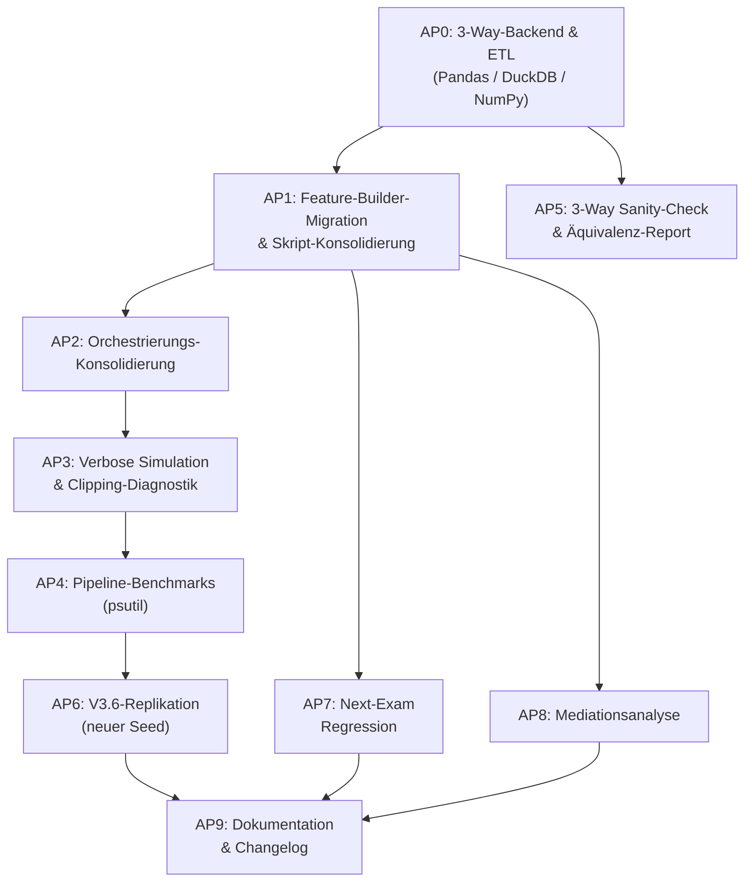

# Implementation Plan V5.1: Feature-Migration, Diagnostik, Nachtlauf V3.6

## Übersicht der Arbeitspakete (Reihenfolge = Abhängigkeit)



---

## AP0: 3-Way-Backend & Aggregations-Upgrade (`aggregate.py` & `feature_builder.py`)

### Motivation
- **`aggregate.py`** ist der ETL-Flaschenhals (Joins über 9 Tabellen, 812k Zeilen). Hier wird `cp_attempted` ergänzt.
- **3-Way-Vergleich:** Pandas vs. DuckDB (SQL-Engine, 10.6× Speedup im Benchmark) vs. **NumPy** (vektorisierte Array-Ops mit C-Level-Performance wie `np.cumsum`, `np.add.at`).
- Elementweiser Sanity-Check stellt sicher, dass alle 3 Backends bit-äquivalente Tabellen und Tensoren erzeugen.

### Umfang
1. **`aggregate.py` erweitern:** `cp_attempted` hinzufügen, Modul-Matching verifizieren, DuckDB- & NumPy-Pfade bereitstellen.
2. **`feature_builder.py`:** Backend-Parameter `backend='pandas'|'duckdb'|'numpy'` (Default: schnellstes validiertes Backend).
3. **Automatisierter 3-Way Sanity-Check:** Elementweiser Vergleich aller generierten CSVs und Tensoren (`assert_frame_equal`, `np.allclose`).

### Proposed Changes

#### [MODIFY] [`src/aggregate.py`](file:///C:/GitHub_public/Abschlussprojekt/src/aggregate.py)
- `cp_attempted` pro Zeile berechnen.
- DuckDB/NumPy-Ausführungspfade für beschleunigte ETL.

#### [MODIFY] [`src/feature_builder.py`](file:///C:/GitHub_public/Abschlussprojekt/src/feature_builder.py)
- `backend='pandas'|'duckdb'|'numpy'` Weiche für Window-Funktionen und Tensor-Konstruktion.

#### [NEW] [`src/benchmark_backbone_sanity_check.py`](file:///C:/GitHub_public/Abschlussprojekt/src/benchmark_backbone_sanity_check.py)
- 3-Way Benchmark & Äquivalenzprüfung (Pandas vs. DuckDB vs. NumPy).

---

## AP1: Feature-Builder-Migration — Detaillierter Ist/Soll-Plan

### Vorbemerkung

Dies ist das **Kernprojekt** dieses Plans. Ziel: Alle 25 Trainings-Skripte nutzen ausschließlich `feature_builder.py` für ihre Datenzugriffe und unterstützen damit automatisch alle 5 Modi (`standard`, `gradeblind`, `blind`, `oracle`, `realistic`).

### Schritt 1: Erweiterungen am Feature Builder selbst

Bevor die Skripte migriert werden können, müssen **7 Lücken** im `feature_builder.py` geschlossen werden:

| # | Erweiterung | Betroffene Funktion | Grund |
|:--|:-----------|:-------------------|:------|
| E1 | **Competing-Risks Dual-Target** | `build_semester_sequence_tensor` | `dynamic_deephit_model.py` und `*_delta.py` benötigen `y_dropout` + `y_grad` (zwei separate Targets) |
| E2 | **GPA-Regressions-Target** | `build_semester_sequence_tensor`, `build_exam_sequence_tensor` | `timeseries_*.py` und `deep_transformer_regression.py` benötigen Durchschnitts-GPA als Target statt binärem Hazard |
| E3 | **Konfigurierbares Landmark-Target** | `build_landmark_dataset` | `train_mlp_baseline.py` benötigt Multi-Class `status`; `train_mlp_regression.py` benötigt `abschlussnote` (kontinuierlich, nur Absolventen — siehe Survivorship-Bias-Anmerkung unten) |
| E4 | **[NEU] `build_exam_panel_df`** | Neue Funktion | `extended_exam_survival.py` benötigt eine 2D Counting-Process-Tabelle auf **Prüfungsebene** (~824k Zeilen). Aktuell existiert nur `build_semester_panel_df`. |
| E5 | **Diskretes Hazard-Target-Grid** | `build_landmark_dataset` | `deep_survival.py` benötigt eine diskrete Hazard-Matrix $y_{\text{disc}} \in \{0,1\}^{N \times T_{\max}}$ für die Logistic-Hazard-Architektur |
| E6 | **Temporal-Switch `temporal='prev'\|'cum'` + `delta_gpa`** | Alle Hauptfunktionen | `prev` (Default): `fails_prev`, `delta_cp_prev`, `gpa_prev`. `cum`: `cum_fails`, `cum_cp`, `gpa_cum`. **Support-Variablen bleiben vom Switch unberührt** (sind Treatment-Variablen!). Zusätzlich `delta_gpa` als ableitbares Feature. |
| E6 | **Temporal-Switch `temporal='prev'\|'cum'` + `delta_gpa`** | Alle Hauptfunktionen | `prev` (Default): `fails_prev`, `delta_cp_prev`, `gpa_prev`. `cum`: `cum_fails`, `cum_cp`, `gpa_cum`. **Support-Variablen bleiben vom Switch unberührt** (sind Treatment-Variablen!). Zusätzlich `delta_gpa` als ableitbares Feature. |
| E7 | **`cp_attempted` & Modul-Matched Support via `aggregate.py`** | `aggregate.py` + alle Builder-Funktionen | `aggregate.py` wird um `cp_attempted` erweitert (Workload-Quote). Das bestehende Modul-Matching in `aggregate.py` (n:m Zuordnung) bleibt der Standard; `_sonst` wird verworfen, um Rauschen zu vermeiden. |

> [!IMPORTANT]
> **Modul-Matching & Treatment-Definition:**
> In der DGP wirkt fachlicher Support nur auf zugeordnete Module (n:m-Zuordnung via `support_modul_zuordnung`). Nicht-gematchter Support wird verworfen. `aggregate.py` liefert die kausal relevanten Merkmale; zusätzlich wird `cp_attempted` ergänzt.

> [!NOTE]
> **Temporal-Strategie: `_prev` als Default, `_cum` als Alternative.**
> Der Builder liefert den vollen Feature-Satz. E6 steuert, ob Leistungs-Features als `_prev` (Vorsemester, Default) oder `_cum` (kumuliert) ausgegeben werden. **Support-Variablen bleiben unverändert** (sind Treatment-Variablen). Skripte werden VOR der Migration konsolidiert (Base + Delta → ein parametrisierbares Skript). Details: [Feature-Migration-Report, §4](file:///C:/Users/wilfr/.gemini/antigravity/brain/16832ed6-a522-415e-9395-ef24e16fef79/feature_migration_report.md)

> [!NOTE]
> **Überraschender Befund:** `recurrent_survival_model.py` und `recurrent_survival_model_delta.py` verwenden **identische 13 Features** — die "Delta"-Benennung ist irreführend! Wir sind bei den Refactors durcheinandergekommen. Eines der Skripte sollte als deprecated markiert werden. Details: [Feature-Migration-Report](file:///C:/Users/wilfr/.gemini/antigravity/brain/16832ed6-a522-415e-9395-ef24e16fef79/feature_migration_report.md)

> [!WARNING]
> **Survivorship Bias bei `graduates_only`:** `train_mlp_regression.py` filtert auf Absolventen. Flag beibehalten, im Report als Limitation flaggen. Alternativen (Note-5.0-Imputation, Heckman-Selektion) auf dem [Backlog](file:///C:/Users/wilfr/.gemini/antigravity/brain/16832ed6-a522-415e-9395-ef24e16fef79/backlog.md).


### Schritt 2: Migration der Trainings-Skripte (Ist/Soll-Tabelle)

> [!IMPORTANT]
> **Konsolidierung & Transparenz:** Wo Skripte (wie Base + Delta + V2) zusammengeführt werden, wird ein parametrisierbares Skript mit CLI-Flags (`--temporal prev|cum`, `--mode standard|gradeblind|...`) erstellt. Alle Signaturänderungen und Konsolidierungen werden sofort lückenlos im [`CHANGELOG.md`](file:///C:/GitHub_public/Abschlussprojekt/CHANGELOG.md) dokumentiert.

#### Klasse 1: Statische Landmark-Klassifikation

| Skript | Ist-Zustand (Datenladung) | Soll-Zustand | Erweiterung? |
|:-------|:--------------------------|:------------|:-------------|
| [`train_mlp_baseline.py`](file:///C:/GitHub_public/Abschlussprojekt/src/train_mlp_baseline.py) | Inline `pd.read_csv('agg_abschluesse.csv')` (L75), eigene `LEAKAGE_COLUMNS`-Filterung, Multi-Class `status` Target | `build_landmark_dataset(data_dir, t0=2, mode=...)` | **E3** (Multi-Class Target) |
| [`train_erwerb_blind_models.py`](file:///C:/GitHub_public/Abschlussprojekt/src/train_erwerb_blind_models.py) | Inline `pd.read_csv('agg_abschluesse.csv')` | `build_landmark_dataset(data_dir, t0=2, mode='realistic')` | — |

#### Klasse 2a: Statische Landmark-Regression

| Skript | Ist-Zustand | Soll-Zustand | Erweiterung? |
|:-------|:-----------|:------------|:-------------|
| [`train_mlp_regression.py`](file:///C:/GitHub_public/Abschlussprojekt/src/train_mlp_regression.py) | Inline `pd.read_csv('agg_abschluesse.csv')` (L79), `graduates_only` Filter, `abschlussnote` Target | `build_landmark_dataset(data_dir, t0=2, mode=..., target='abschlussnote', graduates_only=True)` | **E3** (Regressionstarget) |

#### Klasse 2b: Semester-Sequenz-Regression

| Skript | Ist-Zustand | Soll-Zustand | Erweiterung? |
|:-------|:-----------|:------------|:-------------|
| [`timeseries_semester.py`](file:///C:/GitHub_public/Abschlussprojekt/src/timeseries_semester.py) | Lädt **8 rohe relationale CSVs** direkt (L47–58) | `build_semester_sequence_tensor(data_dir, mode=..., target_type='gpa')` | **E2** (GPA-Target), **E7** (`cp_attempted`) |
| [`timeseries_semester_transformer.py`](file:///C:/GitHub_public/Abschlussprojekt/src/timeseries_semester_transformer.py) | Importiert `create_semester_timeseries_dataset` aus `timeseries_semester` (L26) | `build_semester_sequence_tensor(data_dir, mode=..., target_type='gpa')` | **E2** |

> [!NOTE]
> **Warum 8 CSVs?** `timeseries_semester.py` lud rohe CSVs, um Modul-Matching und `cp_attempted` manuell zu berechnen. Mit der Ergänzung von `cp_attempted` in `aggregate.py` und der Nutzung von `agg_pruefungen.csv` (wo Modul-Matching n:m bereits erfolgt) kann das Skript vollständig auf `feature_builder.py` umgestellt werden. `_sonst` wird verworfen, da es im DGP-Kausalmechanismus keinen Effekt hat. Details: [Architektur-Klärung, §2](file:///C:/Users/wilfr/.gemini/antigravity/brain/16832ed6-a522-415e-9395-ef24e16fef79/architektur_klaerung.md)


#### Klasse 3: Exam-Sequenz-Regression

| Skript | Ist-Zustand | Soll-Zustand | Erweiterung? |
|:-------|:-----------|:------------|:-------------|
| [`timeseries_exam.py`](file:///C:/GitHub_public/Abschlussprojekt/src/timeseries_exam.py) | `studierende.csv`, `studiengaenge.csv`, `agg_pruefungen.csv` (L48–54), Inline Lag-Features | `build_exam_sequence_tensor(data_dir, mode=..., target_type='gpa')` | **E2** (GPA-Target) |
| [`timeseries_exam_transformer.py`](file:///C:/GitHub_public/Abschlussprojekt/src/timeseries_exam_transformer.py) | Importiert aus `timeseries_exam` (L26) | `build_exam_sequence_tensor(data_dir, mode=..., target_type='gpa')` | **E2** |

#### Klasse 4: Statische Landmark-Survival

| Skript | Ist-Zustand | Soll-Zustand | Erweiterung? |
|:-------|:-----------|:------------|:-------------|
| [`deep_survival.py`](file:///C:/GitHub_public/Abschlussprojekt/src/deep_survival.py) | Inline `pd.read_csv('agg_abschluesse.csv')` (L365), Landmark $T_0=3$, diskrete Hazard-Matrix | `build_landmark_dataset(data_dir, t0=3, mode=...)` + Hazard-Hilfs-Fn. | **E5** (Hazard-Grid) |

#### Klasse 5: Semester-Panel-Survival (Counting Process)

| Skript | Ist-Zustand | Soll-Zustand | Erweiterung? |
|:-------|:-----------|:------------|:-------------|
| [`extended_cox_survival.py`](file:///C:/GitHub_public/Abschlussprojekt/src/extended_cox_survival.py) | Eigene `build_person_semester_panel()` (L23–32) | `build_semester_panel_df(data_dir, mode=..., temporal='cum')` | **E6** (benötigt `cum_cp`, `cum_fails` statt Delta) |
| [`extended_deep_survival.py`](file:///C:/GitHub_public/Abschlussprojekt/src/extended_deep_survival.py) | Importiert `build_person_semester_panel` aus `extended_cox_survival` (L34) | `build_semester_panel_df(data_dir, mode=..., temporal='cum')` | **E6** |
| [`extended_cox_delta.py`](file:///C:/GitHub_public/Abschlussprojekt/src/extended_cox_delta.py) | Eigene `build_delta_panel()` (L22–48), merged `studierende.csv` | `build_semester_panel_df(data_dir, mode=..., temporal='delta')` | — ✅ (Default ist bereits Delta) |
| [`extended_deep_survival_delta.py`](file:///C:/GitHub_public/Abschlussprojekt/src/extended_deep_survival_delta.py) | Importiert `build_delta_panel` aus `extended_cox_delta` (L30) | `build_semester_panel_df(data_dir, mode=..., temporal='delta')` | — ✅ |
| [`dml_orthogonal_survival.py`](file:///C:/GitHub_public/Abschlussprojekt/src/dml_orthogonal_survival.py) | Importiert `build_delta_panel` aus `extended_cox_delta` (L30) | `build_semester_panel_df(data_dir, mode=..., temporal='delta')` | — ✅ |
| [`train_oracle_models.py`](file:///C:/GitHub_public/Abschlussprojekt/src/train_oracle_models.py) | Importiert `build_delta_panel` aus `extended_cox_delta` (L21) | `build_semester_panel_df(data_dir, mode='oracle', temporal='delta')` | — ✅ |

> [!NOTE]
> **Base-Cox vs. Delta-Cox:** `extended_cox_survival.py` nutzt `cum_cp` und `cum_fails` (kumuliert), während `extended_cox_delta.py` `fails_prev` und `delta_cp_prev` (lokale Δ) nutzt. Der `temporal`-Switch steuert diese Selektion. `build_semester_panel_df` liefert bereits **beide** im DataFrame — der Switch filtert nur die Rückgabe-`feature_cols`.

#### Klasse 5b: Exam-Panel-Survival (Counting Process)

| Skript | Ist-Zustand | Soll-Zustand | Erweiterung? |
|:-------|:-----------|:------------|:-------------|
| [`extended_exam_survival.py`](file:///C:/GitHub_public/Abschlussprojekt/src/extended_exam_survival.py) | Eigene `build_person_exam_panel()` (L36–48), ~824k Zeilen | `build_exam_panel_df(data_dir, mode=...)` | **E4** (Neue Funktion!) |

#### Klasse 6: Semester-Sequenz-Survival (GRU/Transformer/DeepHit)

| Skript | Ist-Zustand | Soll-Zustand | Erweiterung? |
|:-------|:-----------|:------------|:-------------|
| [`recurrent_survival_model.py`](file:///C:/GitHub_public/Abschlussprojekt/src/recurrent_survival_model.py) | Eigene `build_recurrent_survival_dataset()` (L46–55), 13 Features | `build_semester_sequence_tensor(data_dir, mode=...)` | — ✅ |
| [`recurrent_survival_model_delta.py`](file:///C:/GitHub_public/Abschlussprojekt/src/recurrent_survival_model_delta.py) | Eigene `build_recurrent_survival_dataset_delta()` (L28–37), **identische 13 Features!** | `build_semester_sequence_tensor(data_dir, mode=...)` | — ✅ (same call!) |
| [`transformer_survival_model.py`](file:///C:/GitHub_public/Abschlussprojekt/src/transformer_survival_model.py) | Importiert aus `recurrent_survival_model` (L37) | `build_semester_sequence_tensor(data_dir, mode=...)` | — ✅ |
| [`dynamic_deephit_model.py`](file:///C:/GitHub_public/Abschlussprojekt/src/dynamic_deephit_model.py) | Eigene `build_competing_risks_dataset()` (L30–39), **Dual-Target** | `build_semester_sequence_tensor(data_dir, mode=..., competing_risks=True)` | **E1** (Dual-Target) |
| [`dynamic_deephit_delta_model.py`](file:///C:/GitHub_public/Abschlussprojekt/src/dynamic_deephit_delta_model.py) | Eigene `build_competing_risks_dataset_delta()` (L28–37) | `build_semester_sequence_tensor(data_dir, mode=..., competing_risks=True)` | **E1** |

> [!NOTE]
> **Irreführende Benennung:** `recurrent_survival_model.py` und `recurrent_survival_model_delta.py` verwenden **exakt identische 13 Features** (gleicher Mix aus Δ und Σ). Nach Migration erhalten beide denselben `build_semester_sequence_tensor`-Aufruf. Der `temporal`-Switch ist hier irrelevant, da beide ohnehin hybrid sind. Details: → [Feature-Migration-Report](file:///C:/Users/wilfr/.gemini/antigravity/brain/16832ed6-a522-415e-9395-ef24e16fef79/feature_migration_report.md)

#### Klasse 7: Exam-Sequenz-Survival

| Skript | Ist-Zustand | Soll-Zustand | Erweiterung? |
|:-------|:-----------|:------------|:-------------|
| [`recurrent_exam_survival.py`](file:///C:/GitHub_public/Abschlussprojekt/src/recurrent_exam_survival.py) | Eigene `build_recurrent_exam_dataset()` (L42–51), 9 Features | `build_exam_sequence_tensor(data_dir, mode=..., temporal='delta')` | **E6** (nur Basis-Features ohne Σ) |
| [`recurrent_exam_survival_v2.py`](file:///C:/GitHub_public/Abschlussprojekt/src/recurrent_exam_survival_v2.py) | Eigene `build_recurrent_exam_dataset_v2()` (L43–52), 12 Features (+Σ) | `build_exam_sequence_tensor(data_dir, mode=..., temporal='cum')` | **E6** (kumulierte Features) |
| [`recurrent_exam_survival_delta.py`](file:///C:/GitHub_public/Abschlussprojekt/src/recurrent_exam_survival_delta.py) | Eigene `build_recurrent_exam_dataset_delta()` (L28–37), 12 Features (+S) | `build_exam_sequence_tensor(data_dir, mode=..., temporal='delta')` | **E6** (Delta + Demografie) |
| [`transformer_exam_survival.py`](file:///C:/GitHub_public/Abschlussprojekt/src/transformer_exam_survival.py) | Importiert aus `recurrent_exam_survival` (L28) | `build_exam_sequence_tensor(data_dir, mode=...)` | — ✅ |

> [!NOTE]
> **Versionsunterschiede werden durch `temporal`-Switch aufgelöst:**
> - **Base (9F):** Nur C + Δ-Support (kein `fails_cum`, kein `hzb_note`) → `temporal='delta'`
> - **V2 (12F):** + 3 kumulierte Features (`fails_cum`, `cp_cum`, `gpa_cum`) → `temporal='cum'`
> - **Delta (12F):** Ersetzt Σ durch `is_fail` (Δ) + `hzb_note`, `erwerbstaetigkeit_std` (S) → `temporal='delta'`
>
> Nach Migration erhalten alle drei Varianten denselben `build_exam_sequence_tensor`-Aufruf mit unterschiedlichem `temporal`-Flag. Der Feature Builder liefert stets den **vollen Hybrid** und filtert per `temporal`. Das Feature `is_fail` wird als E6-Erweiterung hinzugefügt.

#### Klasse 8: Deep Transformer Suite (4 Sub-Modelle)

| Skript | Ist-Zustand | Soll-Zustand | Erweiterung? |
|:-------|:-----------|:------------|:-------------|
| [`deep_transformer_regression.py`](file:///C:/GitHub_public/Abschlussprojekt/src/deep_transformer_regression.py) | Importiert `create_semester_timeseries_dataset` (L224, 8 CSVs) + `create_exam_timeseries_dataset` (L256, 3 CSVs) + eigene `build_canonical_exam_survival_dataset` (L157–169) | Sub-Modell 1: `build_semester_sequence_tensor(..., target_type='gpa')`; Sub-Modell 2–4: `build_exam_sequence_tensor(...)` | **E2** (GPA) |

> [!NOTE]
> Dieses Skript trainiert 4 Sub-Modelle (Semester-Regressor, Exam-Regressor, Exam Causal Survival, Exam Masked Survival). Es kann als ein Skript bestehen bleiben — nur die Datenlade-Aufrufe werden konsolidiert.

#### Klasse 9: Kausal-DML (Cross-Modal)

| Skript | Ist-Zustand | Soll-Zustand | Erweiterung? |
|:-------|:-----------|:------------|:-------------|
| [`train_transformer_dml.py`](file:///C:/GitHub_public/Abschlussprojekt/src/train_transformer_dml.py) | Importiert aus `recurrent_survival_model` (L22) + `extended_cox_delta` (L24). Benötigt **beide** Formate: 3D-Sequenz für Pretraining + 2D-Panel für DML-Stage. | Stage 1: `build_semester_sequence_tensor(data_dir)`; Stage 2: `build_semester_panel_df(data_dir)` | — ✅ |

### Schritt 3: Migrationsstatistik

| Kategorie | Skripte | Direkt migrierbar (✅) | Benötigt Erweiterung | Neue Funktion nötig |
|:----------|:-------:|:---------------------:|:---------------------:|:-------------------:|
| Panel-Survival (Klasse 5) | 6 | 4 | 2 (E6: Base-Cox) | 0 |
| Semester-Seq.-Survival (Klasse 6) | 5 | 3 | 2 (E1) | 0 |
| Exam-Seq.-Survival (Klasse 7) | 4 | 1 | 3 (E6) | 0 |
| Semester-Regression (Klasse 2b) | 2 | 0 | 2 (E2, E7) | 0 |
| Exam-Regression (Klasse 3) | 2 | 0 | 2 (E2) | 0 |
| Landmark (Klasse 1, 2a, 4) | 4 | 1 | 3 (E3, E5) | 0 |
| Exam-Panel (Klasse 5b) | 1 | 0 | 0 | 1 (E4) |
| Cross-Modal DML (Klasse 9) | 1 | 1 | 0 | 0 |
| **Gesamt** | **25** | **10** | **14** | **1** |

**Fazit:** 10 Skripte können sofort migriert werden. 14 brauchen Feature-Builder-Erweiterungen (E1–E7). 1 benötigt eine neue Funktion (E4).

**Detaillierter Feature-Mapping-Report mit Alt/Neu-Vergleich pro Feature und Skript:** → [feature_migration_report.md](file:///C:/Users/wilfr/.gemini/antigravity/brain/16832ed6-a522-415e-9395-ef24e16fef79/feature_migration_report.md)

### Schritt 4: Verifikation der Migration

Nach der Migration jedes Skripts wird ein **automatisierter Sanity-Check** durchgeführt:

#### [NEW] [`src/verify_feature_migration.py`](file:///C:/GitHub_public/Abschlussprojekt/src/verify_feature_migration.py)
- Für jedes migrierte Skript: Alter Code und neuer Code parallel ausführen.
- Vergleich der resultierenden Tensoren/DataFrames per `np.allclose` / `pd.testing.assert_frame_equal`.
- Report über Abweichungen (erwartete vs. unerwartete) als Markdown.
- Klassifikation der Änderungen:
  - **Identisch**: Exakt gleiche Daten nach Migration.
  - **Feature-Superset**: Neuer Code liefert mehr Features (alle alten sind enthalten).
  - **Temporal-Shift**: Features identisch, aber andere Temporal-Selektion.
  - **Datenquelle-Wechsel**: Andere CSV-Quelle, aber äquivalente Berechnung.
- **Systematische Leakage-Prüfung**: Für jedes Feature prüfen, ob es ein Outcome der aktuellen Zeile codiert (z.B. `is_fail`). Features vom Typ "Current" dürfen nur Kontext (Modulschwierigkeit, Versuchsnummer) enthalten, niemals Ergebnisse.
- **Feature-Selektion pro Modell dokumentieren**: Für Transparenz und Vergleichbarkeit wird festgehalten, welche Spalten aus dem Builder-Output tatsächlich ins Training eingehen.

---

## AP2: Orchestrierungs-Konsolidierung

### Ist-Zustand

| Datei | Status | Problem |
|:------|:-------|:--------|
| [`main.py`](file:///C:/GitHub_public/Abschlussprojekt/src/main.py) | ❌ Veraltet (V1) | Importiert nur `simulation.py` (V1). Keine Universen, kein V3. |
| [`run_all_experiments.py`](file:///C:/GitHub_public/Abschlussprojekt/src/run_all_experiments.py) | ⚠️ Teils veraltet | 10 Stufen, enthält Baselines (NB, SVM, RF) — fehlt die V3.3 CF-Suite. |
| [`run_retrain_all.py`](file:///C:/GitHub_public/Abschlussprojekt/src/run_retrain_all.py) | ✅ Aktuell | 27 Schritte (V3.3), aber ohne Baselines und ohne Grid-Runner. |
| [`run_overnight.py`](file:///C:/GitHub_public/Abschlussprojekt/src/run_overnight.py) | ⚠️ Falsche Verknüpfung | Ruft `run_all_experiments.run_all()` statt `run_retrain_all` auf. Transformer-DML ist separat (Schritt 5), weil es cross-modal arbeitet (3D→2D Embedding-Extraktion für DML-Stage). |

### Erklärung: Warum war Transformer-DML separat?

Das [`train_transformer_dml.py`](file:///C:/GitHub_public/Abschlussprojekt/src/train_transformer_dml.py) ist ein **Cross-Modal-Hybrid**: Es trainiert zuerst einen 2-Block Causal Transformer auf 3D-Sequenzen, extrahiert dann 64-dim. Embeddings und projiziert diese in den 2D-DML-Panel-Rahmen für Robinson-Orthogonalisierung. Es war separat, weil es auf den Ergebnissen der vorherigen Modelle (3D-Repräsentationen) aufbaut.

Die **Deep Transformer Suite** ([`deep_transformer_regression.py`](file:///C:/GitHub_public/Abschlussprojekt/src/deep_transformer_regression.py)) trainiert tatsächlich **4 Sub-Modelle** in einem Skript: Semester-Regressor (Klasse 2b), Exam-Regressor (Klasse 3), Exam Causal Survival (7a) und Exam Masked Survival (7b). Das ist korrekt und kein Halluzination!

### Soll-Zustand: Eine konsolidierte Pipeline

#### [MODIFY] [`src/run_overnight.py`](file:///C:/GitHub_public/Abschlussprojekt/src/run_overnight.py) → V3.6-Edition

```
Phase 0: Konfiguration (Seed, Output-Dir, Verbose)
Phase 1: Simulation V3 (8 Universen A–H) [~40 Min.]
Phase 2: Validierung & Ground Truth [~2 Min.]
Phase 3: Baselines (Klasse 1 & 2a) [~5 Min.]
Phase 4: Alle Modell-Trainings (aus run_retrain_all, 27 Schritte) [~90 Min.]
Phase 5: Feature-Grid Benchmark (jetzt alle Modelle × 5 Modi) [~45 Min.]
Phase 6: Next-Exam Regression (AP7) [~10 Min.]
Phase 7: Mediationsanalyse (AP8) [~5 Min.]
Phase 8: Backbone-Sanity-Check (AP5) [~2 Min.]
Phase 9: V3/V3.6-Vergleich (falls V3.6-Modus) [~1 Min.]
Phase 10: Analysen & Reports [~5 Min.]
Geschätzte Gesamtdauer: ~3,5–4,5 Stunden
```

---

## AP3: Verbose-Modus & Clipping-Diagnostik

### Klarstellung zum Datenformat

Die Clipping-Statistiken werden **nicht** in die CSVs geschrieben. Sie werden als separate Dateien in `output_dl/diagnostics/` gespeichert:
- `clipping_diagnostics_{universe}.json` (pro Universum)
- `clipping_diagnostics_summary.md` (aggregiert über alle 8 Universen)

Zum Datenformat: Aktuell exportiert die Simulation nach wie vor **CSV**. Der geplante Umstieg auf Parquet/DuckDB ist Teil des DuckDB-Backends (AP0), aber betrifft den `feature_builder` (Leseweg), nicht den `export.py` (Schreibweg). Für einen späteren Schritt könnte `exportiere_csv` zu `exportiere_parquet` erweitert werden (→ Backlog A3).

### Proposed Changes

#### [MODIFY] [`src/simulation_v3.py`](file:///C:/GitHub_public/Abschlussprojekt/src/simulation_v3.py)
- `ClippingTracker`-Klasse mit Zählern für alle 30+ Clip-Stellen.
- `main(population_seed=12345, verbose=False)` Signatur.
- Am Ende jedes Universums: JSON-Export der Statistiken.
- Markdown-Summary über alle Universen.

---

## AP4: Pipeline-Benchmarks (Laufzeit, Speicher, CPU)

### Granularität

Nicht pro Codezeile, sondern pro **logischem Trainingsschritt** — z.B. „*Extended Cox Delta Training*“, „*Counterfactual RR Logistic Hazard Delta*“, „*Simulation Universum A*“ etc.

### Proposed Changes

#### [MODIFY] [`src/run_overnight.py`](file:///C:/GitHub_public/Abschlussprojekt/src/run_overnight.py)
- `run_step()` erweitert um `psutil.Process().memory_info().rss` und `psutil.cpu_percent()`.
- Export: `pipeline_benchmark.json` + `pipeline_benchmark.md`.

---

## AP5: 3-Way Backbone-Sanity-Check (Pandas vs. DuckDB vs. NumPy)

#### [NEW] [`src/benchmark_backbone_sanity_check.py`](file:///C:/GitHub_public/Abschlussprojekt/src/benchmark_backbone_sanity_check.py)
- Vergleicht alle 3 Backends (Pandas, DuckDB, NumPy) für `aggregate.py` (ETL) und `feature_builder.py` (Tensoren/Panels).
- Elementweiser Vergleich (`assert_frame_equal`, `np.allclose`) zur Sicherstellung der Bit-Äquivalenz.
- Timing, Memory Footprint und CPU-Last aller drei Pfade im Vergleich.
- Output: `backbone_sanity_check.md` + `backbone_sanity_check.json`.

---

## AP6: V3.6-Replikation mit neuem Seed

### Namensgebung (gemäß Ihrer Anmerkung)

Version **3.6** (nicht „V4“), da die Simulationsmechanik unverändert bleibt. V4 wäre erst nach Finetuning der DGP-Parameter (basierend auf Clipping-Diagnostik-Ergebnissen).

### Proposed Changes

#### [MODIFY] [`src/simulation_v3.py`](file:///C:/GitHub_public/Abschlussprojekt/src/simulation_v3.py#L107)
- Per-Student-Seed mit Population-Seed salzen:
  ```python
  base_seed = (zlib.crc32(studi.studierenden_id.encode('utf-8')) ^ POPULATION_SEED) & 0xFFFFFFFF
  ```
- `main(population_seed=12345, output_base=None, verbose=False)`.

#### [MODIFY] [`src/config.py`](file:///C:/GitHub_public/Abschlussprojekt/src/config.py)
- `output_dir` überschreibbar per Env-Var: `os.environ.get('DEEPSUPPORT_OUTPUT_DIR', 'output_dl')`.

#### [NEW] `src/compare_v3_v36.py`
- Automatischer Vergleich der Makro-Effekte zwischen `output_dl/` und `output_dl_v36/`.

---

## AP7: Next-Exam Autoregressive Regression

### Architektur-Diskussion: Dual-Head vs. Single-Head vs. Branched Networks

#### Ihre Rückfrage zur Dual-Head-Architektur

> *„Da die zusammen trainiert werden, könnte ich vermuten, dass die schlechter performen als separate Netze mit je einem der Köpfe.“*

Das ist eine berechtigte Sorge. Die Antwort hängt vom **Grad der Aufgabenverwandtschaft** ab:

| Szenario | Dual-Head besser? | Begründung |
|:---------|:-----------------:|:-------------|
| **Note (Regression) + Fail (Klassifikation)** | ✅ Wahrscheinlich ja | Die Tasks sind stark korreliert: `Fail = (Note > 4.0)`. Der gemeinsame Encoder lernt eine geteilte Repräsentation, die beide Tasks informiert. Hard Parameter Sharing wirkt als Regularisierung. |
| **Dropout (binär) + Graduation (binär)** | ✅ Ja (wie bei Dynamic DeepHit) | Identische Datenbasis, komplementäre Events. Multi-Task-Learning ist hier Standard. |
| **Note (Regression) + Dropout (binär)** | ⚠️ Unklar | Verschiedene Granularität (Prüfung vs. Semester). Würde branched Network erfordern. |

**Vorschlag:** Wir implementieren **drei Varianten** und vergleichen:
1. **Dual-Head** (Note + Fail als gemeinsames Multi-Task-Modell)
2. **Single-Head Note** (reiner Regressor)
3. **Single-Head Fail** (reiner Klassifikator)

Das Ergebnis zeigt empirisch, ob Multi-Task-Learning hier Synergie oder Interferenz erzeugt.

#### Ihre Rückfrage zu Branched/Fused Networks

> *„Lohnt es sich, zwei verschiedene Netze zu kombinieren? Eines für Verlaufsdaten, eines für statische Informationen?“*

Ja, das ist ein bewährtes Architektur-Pattern („**Late Fusion**“):

```
           Sequenz-Encoder                    Statischer Encoder
     (ÉPrüfungshistorie)                  (HZB, Erwerb, Demografie)
           │                                      │
    GRU/Transformer                           Dense(32)
    h_k ∈ ℝ^64                               s ∈ ℝ^16
           │                                      │
           └──────────── Concat ──────────────────┘
                          │
                   Dense(64) → LN → Dropout
                          │
                    ┌─────┴─────┐
                    │           │
              Dense(1)    Dense(1, sigmoid)
              (Note)       (P(Fail))
```

**Vorteil:** Statische Features haben eine andere Granularität (1 Wert pro Student) als die Sequenz (1 Wert pro Prüfung). Separate Encoder verhindern, dass der Sequenz-Encoder die statischen Features „überrollt“.

**Nachteil:** Mehr Parameter, längeres Training.

**Vorschlag:** Wir implementieren Variante A (Full-History GRU) sowohl als Single-Encoder als auch als **Late-Fusion-Variante** und vergleichen. Das ist ein sauberes Experimental Design.

### Proposed Changes

#### [NEW] [`src/next_exam_regression.py`](file:///C:/GitHub_public/Abschlussprojekt/src/next_exam_regression.py)
- 4 Modellvarianten: Single-Head Note, Single-Head Fail, Dual-Head, Late-Fusion Dual-Head.
- 5-Mode Grid.
- Counterfactual Noten-ATE.

#### [NEW] [`src/next_exam_transformer.py`](file:///C:/GitHub_public/Abschlussprojekt/src/next_exam_transformer.py)
- Sliding-Window Transformer ($w = 8$) + Summary-Features + Dual Head.

---

## AP8: Strukturelle Mediationsanalyse (Imai/Pearl)

#### [NEW] [`src/mediation_analysis.py`](file:///C:/GitHub_public/Abschlussprojekt/src/mediation_analysis.py)
- Mediator-Modell: OLS Note auf Treatment + Kovariaten.
- Outcome-Modell: Logit Dropout auf Treatment + Mediator + Kovariaten.
- Bootstrap ACME/ADE ($B = 1000$).

---

## AP9: Dokumentationspflege & Changelog

### Zu aktualisierende Dateien

| Datei | Art der Aktualisierung | Wann |
|:------|:----------------------|:-----|
| [`README.md`](file:///C:/GitHub_public/Abschlussprojekt/README.md) | Modellzählung korrigieren („13+“ → tatsächliche Zahl), Projektstatus updaten | Nach AP1–AP2 |
| [`ToDo.md`](file:///C:/GitHub_public/Abschlussprojekt/ToDo.md) | Abgeschlossene Items markieren, neue APs referenzieren | Laufend |
| [`LIMITATIONEN_FUTURE_WORK.md`](file:///C:/GitHub_public/Abschlussprojekt/LIMITATIONEN_FUTURE_WORK.md) | DML-Abschnitt updaten (Transformer-DML existiert), Mediationsanalyse ergänzen | Nach AP8 |
| [`Artifacts/script_registry2.md`](file:///C:/GitHub_public/Abschlussprojekt/Artifacts/script_registry2.md) | Neue Skripte registrieren (next_exam_*.py, mediation_analysis.py, benchmark_*.py) | Nach AP7–AP8 |
| [`Artifacts/feature_engine_design.md`](file:///C:/GitHub_public/Abschlussprojekt/Artifacts/feature_engine_design.md) | Neue Funktionen (E1–E5) dokumentieren, DuckDB-Backend beschreiben | Nach AP0–AP1 |
| [`Artifacts/model_feature_overview.md`](file:///C:/GitHub_public/Abschlussprojekt/Artifacts/model_feature_overview.md) | Ist/Soll-Migration-Status updaten | Nach AP1 |
| [Artefakte-Verzeichnis `project_index.md`](file:///C:/Users/wilfr/.gemini/antigravity/brain/16832ed6-a522-415e-9395-ef24e16fef79/project_index.md) | Neue Dateien aufnehmen | Nach jeder Phase |
| [Artefakte-Verzeichnis `dokumentation_der_dokumentation.md`](file:///C:/Users/wilfr/.gemini/antigravity/brain/16832ed6-a522-415e-9395-ef24e16fef79/dokumentation_der_dokumentation.md) | Neue Artefakte scannen und katalogisieren | Nach AP9 |
| [`walkthrough.md` (aktuell)](file:///C:/Users/wilfr/.gemini/antigravity/brain/16832ed6-a522-415e-9395-ef24e16fef79/walkthrough.md) | Neuen Abschnitt „V3.6“ hinzufügen (nicht rewrite!) | Nach Nachtlauf |

### Changelog-Pflege

Da bisher kein dedizierter Changelog existiert, wird einer im Repo angelegt:

#### [NEW] [`CHANGELOG.md`](file:///C:/GitHub_public/Abschlussprojekt/CHANGELOG.md)
- Format: [Keep a Changelog](https://keepachangelog.com/de/1.0.0/).
- Einträge für alle bisherigen Meilensteine (retrospektiv aus den Walkthroughs extrahiert).
- Fortlaufende Pflege bei jedem AP-Abschluss.

> [!NOTE]
> **Keine großen Löschungen, kein vollständiges Rewrite.** Bestehende Dokumentation wird inkrementell ergänzt, nicht ersetzt. Ergebnisse aus dem Nachtlauf werden als neue Abschnitte angehängt, nicht als Ersatz für bisherige Analysen.

---

## Backlog (separates Dokument)

Das vollständige Backlog mit allen zurückgestellten Projekten ist separat verfügbar: **[→ backlog.md](file:///C:/Users/wilfr/.gemini/antigravity/brain/16832ed6-a522-415e-9395-ef24e16fef79/backlog.md)**

---

## Verification Plan

### Automatisierte Tests
```powershell
# Feature-Builder-Erweiterungen testen
python -u src/feature_builder.py --self-test

# Vollständiger V3.6-Nachtlauf
python -u src/run_overnight.py --seed 99999 --output-dir output_dl_v36 --verbose

# Backbone-Sanity-Check
python -u src/benchmark_backbone_sanity_check.py
```

### Verifikationskriterien
1. **AP1:** Alle 25 Skripte importieren ausschließlich aus `feature_builder.py`. Kein Skript lädt CSVs direkt.
2. **AP1:** Grid-Runner läuft mit **allen** Modellklassen × 5 Modi durch.
3. **AP3:** Clipping-Report zeigt quantitative Statistiken für alle 30+ Cap-Stellen.
4. **AP5:** DuckDB- und Pandas-Pfad liefern identische Tensoren (`np.allclose` = True).
5. **AP6:** Makro-Dropout-Raten V3 vs. V3.6 weichen um $< 2\sigma$ ab.
6. **AP7:** Next-Exam $R^2 \in [0{,}50, 0{,}78]$, Fail ROC-AUC $> 0{,}75$.
7. **AP8:** ACME > 0 mit 95 %-Bootstrap-KI.
