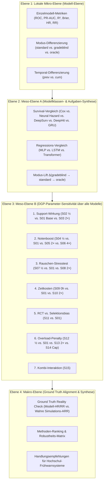

# Implementierungsplan: Hierarchisches Cross-Szenario Evaluierungs-Framework (S01–S15 × Alle Modelle)

Dieses Dokument definiert das systematische, mehrstufige Auswerte- und Vergleichskonzept zur vollständigen Synthese aller 15 simulierten Datenwelten ($S01$–$S15$), aller 10 trainierten Modellklassen, ihrer Kausal- und Prognosemetriken sowie deren Abgleich mit der experimentellen Simulations-Ground-Truth.

---

## User Review Required

> [!IMPORTANT]
> **Zweistufiger Ausführungsansatz:**
> 1. **Phase 1 (Analytische Infrastruktur & Aggregation):** Erstellung der modularen Auswerte-Engine [`src/analyze_cross_scenario_models.py`](file:///C:/GitHub_public/Abschlussprojekt/src/analyze_cross_scenario_models.py) und Generierung des vollständigen hierarchischen Synopse-Berichts für alle bereits gerechneten Modell- und Simulationsdaten.
> 2. **Phase 2 (Automatisierte Grid-Vervollständigung):** Parallele Batch-Ausführung der Fast Suite über alle Szenarien $S02$–$S15$ mit automatischer Einspeisung in die Synopse-Engine.

---

## 1. Vierstufige Hierarchie der Auswertung (Bottom-Up Architektur)



---

## 2. Detaillierte Spezifikation der 4 Ebenen

### Ebene 1: Lokale Mikro-Ebene (Modell- & Feature-Modus-Ebene)
Für jedes Szenario $S_i \in \{S01, \dots, S15\}$ und jedes Universum ($A$):
* **Klasse 1–4, 6–7 (Survival/Dropout):**
  * $\text{ROC-AUC}$, $\text{PR-AUC}$ (Dropout $y=1$), $\text{PR-AUC}_{\text{Baseline}}$ ($\pi_0 = N_{\text{drop}}/N$), Brier Score, Brier Skill Score ($1 - \text{Brier}/\text{Brier}_{\text{ref}}$).
* **Klasse 2a–b, 3 (Noten/GPA):**
  * $R^2$, RMSE, MAE, Median-AE.
* **Klasse 5, 8a, 8c (Kausalität & Kontrafaktik):**
  * Partielle & isolierte $\text{HR}_{\text{Fach}}$, $\text{HR}_{\text{Uebf}}$, $\text{HR}_{\text{Psych}}$, Relative Risks ($\text{RR}$), Noten-Deltas ($\Delta \text{Note}$).
* **Klasse 8b (Autoregression):**
  * Dual-Head Note-$R^2$, Bestehens-ROC-AUC, Next-Exam-Fail PR-AUC.

---

### Ebene 2: Meso-Ebene A (Modellklassen-Synthese innerhalb eines Szenarios)
* **Ökonometrie vs. Deep Learning:**
  * Wie schlägt sich der klassische Extended Cox (mit zeitabhängigen Kovariaten) gegenüber neuronalen Architekturen (Extended DeepSurv, Dynamic DeepHit, Recurrent GRU)?
* **Temporal-Wirkung (`prev` vs. `cum`):**
  * Bringt der kumulierte Leistungsbestand (`cum`) einen systematischen Informationsvorteil gegenüber reinen Vorsemester-Deltas (`prev`)?
* **Der Informationswert der Modi ($\Delta \text{Mode}$):**
  * $\Delta_{\text{Note}} = \text{Score}(\text{standard}) - \text{Score}(\text{gradeblind})$ $\to$ Welchen Vorhersagewert haben Noten über bloße Prüfungsversuche/CP hinaus?
  * $\Delta_{\text{Oracle}} = \text{Score}(\text{oracle}) - \text{Score}(\text{standard})$ $\to$ Welcher theoretische Informationsgewinn schlummert in unbeobachteten psychologischen DGP-Faktoren?

---

### Ebene 3: Meso-Ebene B (DGP-Parameter-Sensitivität über alle Modelle)
Systematischer Vergleich des Verhaltens **aller Modelle** entlang der 6 Simulationsachsen:

| Parameter-Dimension | Szenarien | Untersuchte Fragestellung über alle Modelle |
| :--- | :--- | :--- |
| **1. Support-Wirkung** | $S02 \ (0.5\times) \to S01 \ (1.0\times) \to S03 \ (2.0\times)$ | Reagieren die Kausalmodelle (Cox HR, DeepHit RR, DML) linear auf verdoppelte/halbierte Schutzwirkung? |
| **2. Notenboost** | $S04 \ (0.5\times) \to S01 \to S05 \ (2.0\times) \to S06 \ (4.0\times)$ | Steigt der vermittelte Anteil im Mediationsmodell (Imai/Pearl)? Verbessern sich die Notenregressoren ($R^2$)? |
| **3. Rauschen** | $S07 \ (0.5\times) \to S01 \to S08 \ (2.0\times)$ | **Stresstest:** Welche Architekturen (Transformer vs. GRU vs. Cox) sind bei hohem Rauschen am robustesten? |
| **4. Zeitkosten** | $S09 \ (0\text{h}) \to S01 \ (30\text{h}) \to S10 \ (60\text{h})$ | Erkennen Modelle den negativen Workload-Effekt bei Studierenden mit hoher Erwerbstätigkeit? |
| **5. Selektionsmechanismus** | $S11 \ (\text{RCT}) \text{ vs. } S01 \ (\text{Endogen})$ | Wie stark verzerrt der endogene Selektionsbias die Nicht-RCT-Schätzer im Vergleich zu DML/Orthogonal Cox? |
| **6. Overload-Penalty** | $S12 \ (0.5\times) \to S01 \to S13 \ (2.0\times) \to S14 \ (\text{Cap})$ | Bleibt die Kausal-Rangfolge der Maßnahmen bei verändertem Gesamt-Dropout-Niveau stabil? |
| **7. Kombi-Szenario** | $S15 \ (\text{Wirkung 2× + Kosten 2×})$ | Kann die Kausalanalyse den Netto-Effekt gegenläufiger Mechanismen korrekt auflösen? |

---

### Ebene 4: Makro-Ebene (Ground Truth Alignment & Methoden-Ranking)

1. **Der Ground Truth Reality Check:**
   $$\text{Bias}_{\text{Modell}} = \text{RR}_{\text{Modell}} - \text{RR}_{\text{Ground Truth}} \quad \text{mit} \quad \text{RR}_{\text{Ground Truth}} = \frac{\text{Dropout}_A}{\text{Dropout}_B}$$
   * Wir berechnen für jedes Modell und jedes Szenario den absoluten und relativen Schätzfehler gegenüber dem tatsächlichen experimentellen Effekt der Simulation.
2. **Das finale Methoden-Ranking:**
   * Scorecard nach 4 Dimensionen:
     1. **Prädiktive Güte:** ROC-AUC / PR-AUC auf Test-Set.
     2. **Kausale Treue:** Korrelation mit Ground Truth ARR/RR über alle 15 Szenarien.
     3. **Stresstest-Robustheit:** Resilienz gegen Rauschen ($S08$) und Selektionsbias ($S01$ vs $S11$).
     4. **Recheneffizienz:** Trainingszeit und Ressourcenbedarf.

---

## 3. Geplante Implementierungsschritte

### Komponente 1: Auswerte- und Aggregations-Engine
#### [NEW] [`src/analyze_cross_scenario_models.py`](file:///c:/GitHub_public/Abschlussprojekt/src/analyze_cross_scenario_models.py)
* Scannt alle Metriken-JSONs in `src/output_v4_grid_v41/S*/universe_A/metrics/`.
* Parst Modell-Typ, Temporal-Typ, Modus und Szenario.
* Merged mit `full_sensitivity_grid_results.json` (Ground Truth Raten $A, B, \dots, H$).
* Erzeugt konsolidierte Pandas DataFrames für alle 4 Ebenen.
* Exportiert synoptische Markdown-Tabellen und CSV-Dateien.

### Komponente 2: Visualisierungs-Suite
#### [NEW] [`src/plot_cross_scenario_synthesis.py`](file:///c:/GitHub_public/Abschlussprojekt/src/plot_cross_scenario_synthesis.py)
* **Plot 1:** Causal Calibration Plot (Ground Truth ARR vs. Model-Estimated Effects über alle 15 Szenarien).
* **Plot 2:** Noise-Degradation-Kurven (Performance-Abfall über $S07 \to S01 \to S08$ für alle Modellfamilien).
* **Plot 3:** Mode-Lift Radar Chart (Information Value von Noten und latenten Merkmalen).
* **Plot 4:** Causal Forest Plot (HRs aller 15 Szenarien mit Ground Truth Referenz).

### Komponente 3: Synoptischer Gesamtreport
#### [NEW] `Artifacts/v41_cross_scenario_gesamtreview.md`
* Vollständiger synoptischer Review-Bericht mit allen Tabellen, Grafiken, Parameter-Analysen und methodischen Handlungsempfehlungen.

---

## Verification Plan

### Automatisierte Tests
1. **Daten-Vollständigkeitsprüfung:**
   ```powershell
   python src/analyze_cross_scenario_models.py --verify-only
   ```
2. **Generierung der Synopse & Plots:**
   ```powershell
   python src/analyze_cross_scenario_models.py --export-all
   ```

### Manuelle Verifikation
* Plausibilitätsabgleich der Kausal-Rankings mit den bekannten DGP-Parametern (z.B. $S03$ muss stärkere Schutzeffekte zeigen als $S02$).
