# Implementierungsplan: Hierarchisches Cross-Szenario Evaluierungs-Framework (S01–S15 × Alle Modelle)

Dieses Dokument definiert das systematische, mehrstufige Auswerte- und Vergleichskonzept zur vollständigen Synthese aller 15 simulierten Datenwelten ($S01$–$S15$), aller 11 Modellklassen über alle 5 Feature-Modi (`standard`, `gradeblind`, `blind`, `oracle`, `realistic`) und 2 Temporal-Modi (`prev`, `cum`), ihrer Kausal- und Prognosemetriken sowie deren Abgleich mit der experimentellen Simulations-Ground-Truth.

---

## User Review & Anmerkungen (Eingearbeitet)

> [!NOTE]
> **Wichtigste Anpassungen basierend auf deinem Feedback:**
> 1. **Kein Vorab-Re-Run nötig:** Alle Simulationsdaten ($S01$–$S15 \times A\dots H = 120$ Welten) sowie alle V4.1- und V3.6-Modellruns liegen bereits vollständig berechnet vor und werden direkt aggregiert.
> 2. **Vollständige Modus- & Temporal-Matrix:** Alle 5 Modi (`standard`, `gradeblind`, `blind`, `oracle`, `realistic`) und beide Temporal-Typen (`prev` = Flow, `cum` = Stock) werden systematisch evaluiert.
> 3. **Fokus auf Methoden-Ranking, Robustheit & Ensemble/MoE-Potenziale:** Verzicht auf subjektive Handlungsempfehlungen – stattdessen quantitative Resilienz-Rankings, Stresstest-Vergleiche und eine Analyse der Fehler-Orthogonalität (Welche Modelle ergänzen sich für Stacking/MoE?).
> 4. **Erweiterte Metriken:** Lückenlose Erfassung von ROC-AUC, PR-AUC (auf Dropout $y=1$), $\pi_0$-Baseline, Brier Score, Brier Skill Score, C-Index, $R^2$, RMSE, MAE, Median-AE, partiellen/isolierten HRs & RRs, ATEs und Konfidenzbändern.
> 5. **Interaktives HTML/Plotly Dashboard:** Neben den Markdown-Reports wird ein interaktives Standalone-Dashboard mit Tab-Navigation, Modellfiltern und Plotly-Diagrammen erzeugt.

---

## 1. Vierstufige Hierarchie der Auswertung (Bottom-Up Architektur)

```mermaid
flowchart TD
    subgraph L1["Ebene 1: Lokale Mikro-Ebene (Modell- & Feature-Modus-Ebene)"]
        M1["Alle 11 Modellklassen (Klassisch, Neural, Deep Survival, Transformer, DML, Autoregressor)"]
        M2["5 Modi: standard, gradeblind, blind, oracle, realistic"]
        M3["2 Temporal-Typen: prev (Flow t-1) vs. cum (Stock)"]
        M4["Vollständige Metrik-Vektoren (ROC, PR-AUC, Brier, C-Index, R², MAE, HR, RR, ATE)"]
    end

    subgraph L2["Ebene 2: Meso-Ebene A (Modellklassen- & Aufgaben-Synthese)"]
        C1["Survival-Vergleich: Ökonometrischer Cox vs. Neural Hazard vs. DeepSurv vs. DeepHit vs. GRU vs. Transformer"]
        C2["Regressions-Vergleich: Landmark ML vs. Semester LSTM/Transformer vs. Exam GRU/Transformer"]
        C3["Modus-Lift: Δ(gradeblind → standard) [Notenwert] & Δ(standard → oracle) [Latentes Maximum] & Δ(realistic) [DSGVO-Verlust]"]
        C4["Temporal-Effekt: Δ(cum − prev) [Bestands- vs. Flussinformation]"]
    end

    subgraph L3["Ebene 3: Meso-Ebene B (DGP-Parameter-Sensitivität über alle Modelle)"]
        P1["1. Support-Wirkung (S02 0.5× vs. S01 Base vs. S03 2.0×)"]
        P2["2. Notenboost (S04 0.5× vs. S01 vs. S05 2.0× vs. S06 4.0×)"]
        P3["3. Rauschen-Stresstest (S07 0.5× vs. S01 vs. S08 2.0×)"]
        P4["4. Zeitkosten & Workload (S09 0h vs. S01 vs. S10 2.0×)"]
        P5["5. RCT vs. Observational Selektionsbias (S11 vs. S01)"]
        P6["6. Overload-Penalty (S12 0.5× vs. S01 vs. S13 2.0× vs. S14 Cap)"]
        P7["7. Kombi-Interaktion (S15)"]
    end

    subgraph L4["Ebene 4: Makro-Ebene (Ground Truth Alignment, Ranking & Ensemble/MoE)"]
        G1["Ground Truth Reality Check: Modell-HR/RR vs. Wahre Simulations-ARR (B - A)"]
        G2["Methoden-Ranking & Robustheits-Matrix (Resilienz gegen Rauschen & Bias)"]
        G3["Ensemble- & MoE-Potenzialanalyse (Fehler-Orthogonalität & Komplementarität)"]
        G4["Interaktives HTML/Plotly Dashboard & Synoptischer Gesamtreport"]
    end

    L1 --> L2
    L2 --> L3
    L3 --> L4
```



---

## 2. Detaillierte Spezifikation der 4 Ebenen

### Ebene 1: Systematische & Lückenlose Metriken-Matrix (Über alle 9 Modellbereiche)

| Modellklasse | Konkrete Architekturen | Vollständige, standardisierte Metriken-Batterie |
| :--- | :--- | :--- |
| **1. Landmark Klassifikation** | Logistic Regression, Random Forest, SVM, Naive Bayes, MLP Baseline | • `accuracy` & `balanced_accuracy`<br>• `roc_auc_ovr_macro` & `roc_auc_ovr_weighted`<br>• **`pr_auc_dropout`** ($y=1$) & **`pr_auc_abschluss`** ($y=0$)<br>• **`relative_precision_gain`** ($(\text{PR-AUC}-\pi_0)/(1-\pi_0)$)<br>• **`macro_f1`** ($\frac{1}{K}\sum F1_k$) & `weighted_f1`<br>• `per_class_f1` (Abschluss, Abbruch, Exmatrikulation, Zeitüberschreitung)<br>• **`mcc`** (Matthews Correlation Coefficient, $[-1, +1]$)<br>• `brier_score` & `brier_skill_score`<br>• **`ece`** (Expected Calibration Error über 10 Bins)<br>• **`top_10pct_risk_capture`** (Anteil erfasster Abbrecher im obersten Risikodezil) |
| **2a. Landmark Regression** | Ridge, Lasso, Random Forest, SVR, MLP GPA Regressor | • $R^2$ & Adj-$R^2$<br>• RMSE & MAE<br>• `median_ae` (ausreißerrobust) & `max_error`<br>• `explained_variance`<br>• `mean_residual_bias` & `residual_std`<br>• `grade_bracket_acc_0_3` (Genauigkeit $\pm 0.3$ Notenpunkte)<br>• `grade_bracket_acc_0_5` (Genauigkeit $\pm 0.5$ Notenpunkte) |
| **2b. Sequentielle Semester-Regression** | Timeseries Semester LSTM, Timeseries Semester Transformer | • Sequenz-$R^2$, Sequenz-RMSE, Sequenz-MAE<br>• `terminal_gpa_r2` (Korrelation mit finaler Abschlussnote)<br>• `residual_autocorrelation` (Durbin-Watson über Semesterpfad) |
| **3. Sequentielle Prüfungs-Regression** | Timeseries Exam GRU, Timeseries Exam Transformer | • Prüfungs-$R^2$, Prüfungs-RMSE, Prüfungs-MAE<br>• `exam_median_ae`<br>• `exam_grade_bracket_acc_0_3` & `_0_5` |
| **4. Klassisches & Ökonometrisches Survival** | Extended Cox Panel (PHReg mit TVCs), Kaplan-Meier / Nelson-Aalen | • Hazard Ratios ($\text{HR}_{\text{Fach}}, \text{HR}_{\text{Uebf}}, \text{HR}_{\text{Psych}}$)<br>• 95 % Konfidenzintervalle (`ci_lower_95`, `ci_upper_95`)<br>• p-Werte (`p_value_fach`, `p_value_uebf`, `p_value_psych`)<br>• `risk_reduction_pct` ($(1-\text{HR})\times 100\%$) & `log_likelihood`<br>• Harrell's **`c_index`** (unter Zensierung) & Schoenfeld-PH-Test |
| **5. Deep Survival Panel** | Extended DeepSurv (Breslow Loss), Extended Logistic Hazard (Neural Hazard) | • `roc_auc_panel`<br>• **`pr_auc_panel_dropout`** & **`pr_auc_panel_abschluss`**<br>• `relative_precision_gain`<br>• `brier_score_panel` & `brier_skill_score`<br>• **`ece_panel`** & **`top_10pct_risk_capture`**<br>• Partielle & Isolierte Hazard Ratios ($\text{HR}_{\text{part}}$, $\text{HR}_{\text{iso}}$) via Kontrafaktik |
| **6. Sequentielles Semester-Survival & Competing Risks** | Recurrent Survival GRU, Transformer Survival, Dynamic DeepHit Competing Risks | • **`cause_specific_roc_auc`** (Dropout vs. Abschluss)<br>• **`cause_specific_pr_auc`** (Dropout vs. Abschluss)<br>• `brier_score_competing_risks`<br>• `cause_specific_c_index`<br>• Cause-Specific Relative Risks ($\text{RR}_{\text{Fach}}, \text{RR}_{\text{Uebf}}, \text{RR}_{\text{Psych}}$)<br>• `student_level_terminal_roc_auc` |
| **7. Sequentielles Prüfungs-Survival** | Recurrent Exam Survival GRU, Transformer Exam Survival | • Prüfungs-Ebene ROC-AUC & **PR-AUC (Dropout & Pass)**<br>• `exam_brier_score` & `exam_mcc`<br>• **`top_10pct_exam_risk_capture`**<br>• Studierenden-Ebene aggregierte ROC-AUC |
| **8a. Kausale & Orthogonale Schätzer** | Double Machine Learning (DML) Orthogonal Survival, Transformer DML | • ATE (Average Treatment Effect für Fach, Überfach, Psych)<br>• Partielle Relative Risks ($\text{RR}$)<br>• Asymptotische 95 % Konfidenzbänder<br>• `nuisance_r2_treatment` (Propensity-Fit) & `nuisance_auc_outcome`<br>• **`causal_alignment_bias`** ($|\text{RR}_{\text{DML}} - \text{RR}_{\text{Ground Truth}}|$) |
| **8b. Autoregressives Multi-Task Lernen** | Autoregressive Next-Exam Dual-Head, Autoregressive Deep Transformer (SinCos PE) | • Note ($t_{k+1}$): $R^2$, RMSE, MAE, Median-AE<br>• Bestehen ($t_{k+1}$): ROC-AUC, **PR-AUC (Fail 16.4 %)**, **PR-AUC (Pass 83.6 %)**<br>• **`next_exam_mcc`** & **`next_exam_brier_score`**<br>• `fail_relative_precision_gain` |
| **8c. Spezial- & Diagnose-Pipelines** | Strukturelle Mediation (Imai/Pearl), Kalibrierungs-Reliability, Oracle Lift, DSGVO | • `total_effect_or` (Gesamteffekt)<br>• `direct_effect_or` (ADE) & `mediated_effect_or` (ACME via Note)<br>• **`proportion_mediated_pct`** ($\frac{\text{ACME}}{\text{Total}}\times 100\%$)<br>• **`oracle_lift_delta_auc`** ($\text{AUC}_{\text{Oracle}} - \text{AUC}_{\text{Standard}}$)<br>• **`dsgvo_penalty_delta_auc`** ($\text{AUC}_{\text{Standard}} - \text{AUC}_{\text{Realistic}}$) |
| **9. Ensemble- & MoE-Synergien** | Cross-Model Blend & Mixture-of-Experts Analyse | • **`prediction_correlation_matrix`** (Inter-Modell Korrelation der Risikoscores)<br>• **`residual_orthogonality`** (Fehler-Unkorreliertheit für Stacking-Potenzial)<br>• **`subgroup_dominance_mapping`** (Wer führt bei Erstakademikern, Workload, Fachbereich?)<br>• **`theoretical_ensemble_lift`** (Maximaler Informationsgewinn durch Blending) |

---

### Ebene 2: Meso-Ebene A (Modellklassen-Synthese & Modus-Lift)
* **Ökonometrie vs. Deep Learning:**
  * Wo übertrifft der Extended Cox (starke Annahmen, hohe Interpretierbarkeit) neuronale Architekturen und wo brechen lineare TVCs ein?
* **Temporal-Wirkung (`prev` vs. `cum`):**
  * Quantifizierung des Informationsgewinns von kumulativen Bestandsdaten (`cum`) gegenüber lokalen Vorsemester-Flüssen (`prev`).
* **Der Informationswert der Modi ($\Delta \text{Mode}$):**
  * $\Delta_{\text{Note}} = \text{Score}(\text{standard}) - \text{Score}(\text{gradeblind})$ $\to$ Noten-Prädiktionswert.
  * $\Delta_{\text{Oracle}} = \text{Score}(\text{oracle}) - \text{Score}(\text{standard})$ $\to$ Theoretischer Informationsgewinn durch latente Motivation/Integration.
  * $\Delta_{\text{DSGVO}} = \text{Score}(\text{standard}) - \text{Score}(\text{realistic})$ $\to$ Informationsverlust bei Ausschluss geschützter soziodemografischer Merkmale.

---

### Ebene 3: Meso-Ebene B (DGP-Parameter-Sensitivität über alle Modelle)
Systematischer Vergleich des Verhaltens **aller Modelle** entlang der 6 Simulationsachsen:

| Parameter-Dimension | Szenarien | Untersuchte Fragestellung über alle Modelle |
| :--- | :--- | :--- |
| **1. Support-Wirkung** | $S02 \ (0.5\times) \to S01 \ (1.0\times) \to S03 \ (2.0\times)$ | Reagieren die Kausalmodelle (Cox HR, DeepHit RR, DML) linear/proportional auf verdoppelte bzw. halbierte Schutzwirkung? |
| **2. Notenboost** | $S04 \ (0.5\times) \to S01 \to S05 \ (2.0\times) \to S06 \ (4.0\times)$ | Steigt der vermittelte Anteil im Mediationsmodell (Imai/Pearl)? Wie stark verbessert sich das $R^2$ der Notenregressoren? |
| **3. Rauschen** | $S07 \ (0.5\times) \to S01 \to S08 \ (2.0\times)$ | **Stresstest:** Welche Architekturen (Transformer vs. GRU vs. Cox) verlieren bei starkem Rauschen am wenigsten Diskriminierung? |
| **4. Zeitkosten** | $S09 \ (0\text{h}) \to S01 \ (30\text{h}) \to S10 \ (60\text{h})$ | Erkennen Modelle den negativen Workload-Effekt bei Studierenden mit hoher Erwerbstätigkeit? |
| **5. Selektionsmechanismus** | $S11 \ (\text{RCT}) \text{ vs. } S01 \ (\text{Endogen})$ | Wie stark verzerrt der endogene Selektionsbias die Nicht-RCT-Schätzer im Vergleich zu DML/Orthogonal Cox? |
| **6. Overload-Penalty** | $S12 \ (0.5\times) \to S01 \to S13 \ (2.0\times) \to S14 \ (\text{Cap})$ | Bleibt die Kausal-Rangfolge der Maßnahmen bei verändertem Gesamt-Dropout-Niveau stabil? |
| **7. Kombi-Szenario** | $S15 \ (\text{Wirkung 2× + Kosten 2×})$ | Kann die Kausalanalyse den Netto-Effekt gegenläufiger Mechanismen korrekt auflösen? |

---

### Ebene 4: Makro-Ebene (Ground Truth Alignment, Ranking & Ensemble/MoE)

1. **Der Ground Truth Reality Check:**
   $$\text{Bias}_{\text{Modell}} = \text{RR}_{\text{Modell}} - \text{RR}_{\text{Ground Truth}} \quad \text{mit} \quad \text{RR}_{\text{Ground Truth}} = \frac{\text{Dropout}_A}{\text{Dropout}_B}$$
   * Absoluter und relativer Schätzfehler der Modelle gegenüber dem tatsächlichen experimentellen Effekt der Simulation über alle 15 Szenarien.
2. **Das finale Methoden-Ranking & Robustheits-Matrix:**
   * Scorecard nach 4 Dimensionen:
     1. **Prädiktive Güte:** ROC-AUC / PR-AUC auf Test-Set.
     2. **Kausale Treue:** Korrelation mit Ground Truth ARR/RR über alle 15 Szenarien.
     3. **Stresstest-Robustheit:** Resilienz gegen Rauschen ($S08$) und Selektionsbias ($S01$ vs $S11$).
     4. **Recheneffizienz:** Trainingszeit und Ressourcenbedarf.
3. **Ensemble- & Mixture-of-Experts (MoE) Synergie-Potenzial:**
   * Analyse der Vorhersage-Residuen und Fehler-Korrelationen zwischen den Modellfamilien (z. B. Cox vs. Transformer vs. DeepHit).
   * Identifikation von Studierenden-Subpopulationen, bei denen spezifische Modelle komplementäre Stärken aufweisen.

---

## 3. Geplante Implementierungsschritte

### Komponente 1: Auswerte- und Aggregations-Engine
#### [NEW] [`src/analyze_cross_scenario_models.py`](file:///C:/GitHub_public/Abschlussprojekt/src/analyze_cross_scenario_models.py)
* Scannt alle Metriken-JSONs in `src/output_v4_grid_v41/` und `src/output_dl/`.
* Parst Modell-Typ, Temporal-Typ, Modus und Szenario.
* Merged mit `full_sensitivity_grid_results.json` (Ground Truth Raten $A, B, \dots, H$).
* Erzeugt konsolidierte Pandas DataFrames für alle 4 Ebenen.
* Exportiert synoptische Markdown-Tabellen und CSV-Dateien.

### Komponente 2: Interaktives HTML/Plotly Dashboard & Visualisierungs-Suite
#### [NEW] [`src/generate_interactive_dashboard.py`](file:///C:/GitHub_public/Abschlussprojekt/src/generate_interactive_dashboard.py)
* Erzeugt ein interaktives Standalone HTML-Dashboard (`Artifacts/dashboard_cross_scenario.html`) mit Plotly.js:
  * **Tab 1: Modell-Benchmark & Rankings** (interaktive Scatterplots, Filter nach Modus/Temporal).
  * **Tab 2: Causal Ground Truth Calibration** (Modell-Effekte vs. wahre Simulations-ARR über alle 15 Szenarien).
  * **Tab 3: Parameter-Stresstests** (Rauschen-, Overload- und Selektions-Sensitivitäten).
  * **Tab 4: Ensemble & MoE Synergien** (Fehler-Korrelationsmatrix und Subgruppen-Analyse).
  * **Tab 5: V3.6 vs. V4.1 Versionsvergleich** (Auswirkungen des DGP-Updates auf die Modelle).

### Komponente 3: Synoptischer Gesamtreport
#### [NEW] `Artifacts/v41_cross_scenario_gesamtreview.md`
* Vollständiger synoptischer Review-Bericht mit allen Tabellen, eingebetteten Plots, Parameter-Analysen und dem methodischen Ranking.

---

## Verification Plan

### Automatisierte Tests (über `C:\GitHub_public\.venv`)
1. **Aggregations- & Konsistenz-Test:**
   ```powershell
   & C:\GitHub_public\.venv\Scripts\python.exe src/analyze_cross_scenario_models.py --verify
   ```
2. **Dashboard- & Report-Generierung:**
   ```powershell
   & C:\GitHub_public\.venv\Scripts\python.exe src/generate_interactive_dashboard.py
   ```
3. **Ploterstellung & Markdown-Export:**
   ```powershell
   & C:\GitHub_public\.venv\Scripts\python.exe src/analyze_cross_scenario_models.py --export-all
   ```

### Manuelle Verifikation
* Überprüfung der generierten `Artifacts/dashboard_cross_scenario.html` im Browser auf interaktive Filterbarkeit und korrekte Tooltips.
* Validierung der Kausal-Rankings gegen die bekannten Simulationsparameter.
