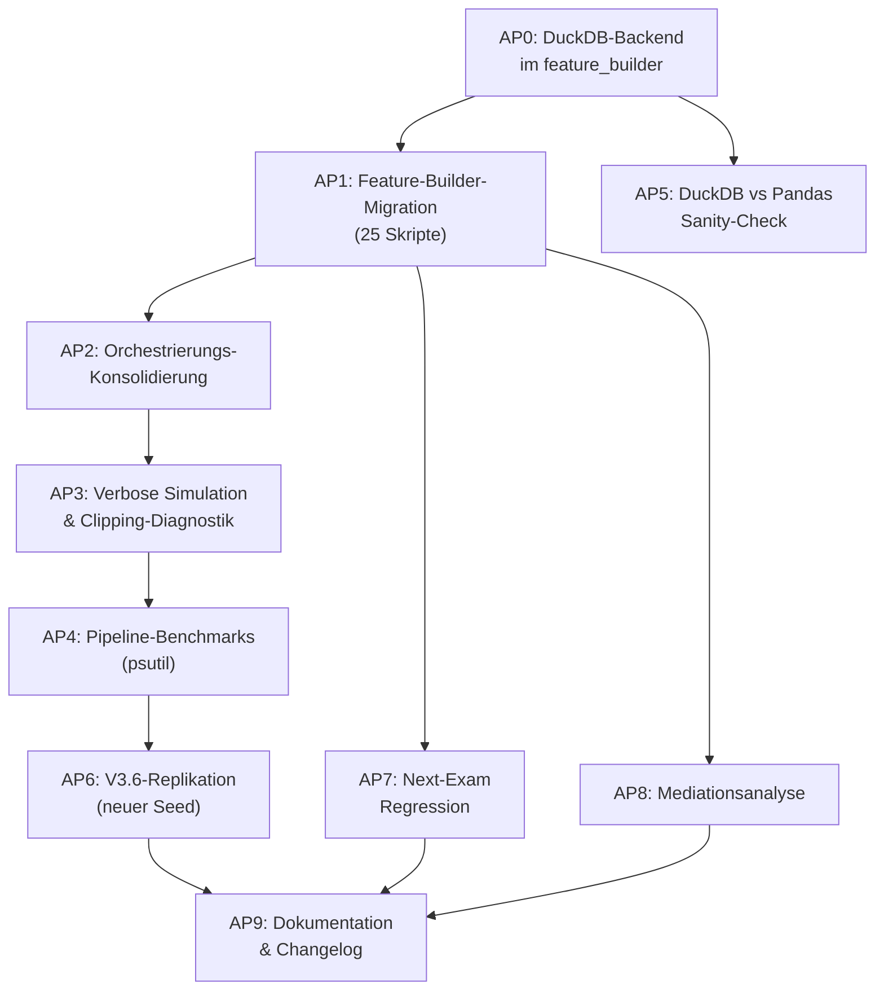

# Implementation Plan V5.1: Feature-Migration, Diagnostik, Nachtlauf V3.6

## \u00dcbersicht der Arbeitspakete (Reihenfolge = Abh\u00e4ngigkeit)



---

## AP0: DuckDB-Backend im Feature Builder (klein, \u00fcberschaubar, Performance-Gewinn)

### Motivation
Der Benchmark ([`walkthrough9.md`](file:///C:/GitHub_public/Abschlussprojekt/Artifacts/walkthrough9.md#L65-L72)) zeigt **10.6\u00d7 Speedup** (3.5 s \u2192 0.33 s) f\u00fcr Window-Functions auf 812k Pr\u00fcfungszeilen. Da `feature_builder.py` die zentrale Datenschicht ist und nach AP1 von **allen** Skripten genutzt wird, lohnt sich die DuckDB-Migration hier am meisten.

### Umfang
- Interne Implementierung der 4 Hauptfunktionen als DuckDB-SQL-Varianten.
- Backend-Auswahl per Parameter: `backend='pandas'` (Default/Fallback) oder `backend='duckdb'`.
- Keine \u00c4nderung der Funktionssignaturen oder R\u00fcckgabetypen.

### Proposed Changes

#### [MODIFY] [`src/feature_builder.py`](file:///C:/GitHub_public/Abschlussprojekt/src/feature_builder.py)
- Neue interne Hilfsfunktionen `_load_raw_data_duckdb()`, `_build_semester_agg_duckdb()`, `_build_exam_agg_duckdb()`.
- Schl\u00fcsselstellen: Ersetze `df.groupby(...).agg(...)` und `expanding().mean()` durch SQL `PARTITION BY ... ORDER BY ... ROWS BETWEEN UNBOUNDED PRECEDING AND CURRENT ROW`.
- Fallback bei `ImportError: duckdb` auf Pandas-Pfad.

---

## AP1: Feature-Builder-Migration \u2014 Detaillierter Ist/Soll-Plan

### Vorbemerkung

Dies ist das **Kernprojekt** dieses Plans. Ziel: Alle 25 Trainings-Skripte nutzen ausschlie\u00dflich `feature_builder.py` f\u00fcr ihre Datenzugriffe und unterst\u00fctzen damit automatisch alle 5 Modi (`standard`, `gradeblind`, `blind`, `oracle`, `realistic`).

### Schritt 1: Erweiterungen am Feature Builder selbst

Bevor die Skripte migriert werden k\u00f6nnen, m\u00fcssen **5 L\u00fccken** im `feature_builder.py` geschlossen werden:

| # | Erweiterung | Betroffene Funktion | Grund |
|:--|:-----------|:-------------------|:------|
| E1 | **Competing-Risks Dual-Target** | `build_semester_sequence_tensor` | `dynamic_deephit_model.py` und `*_delta.py` ben\u00f6tigen `y_dropout` + `y_grad` (zwei separate Targets) |
| E2 | **GPA-Regressions-Target** | `build_semester_sequence_tensor`, `build_exam_sequence_tensor` | `timeseries_*.py` und `deep_transformer_regression.py` ben\u00f6tigen Durchschnitts-GPA als Target statt bin\u00e4rem Hazard |
| E3 | **Konfigurierbares Landmark-Target** | `build_landmark_dataset` | `train_mlp_baseline.py` ben\u00f6tigt Multi-Class `status`; `train_mlp_regression.py` ben\u00f6tigt `abschlussnote` (kontinuierlich, nur Absolventen) |
| E4 | **[NEU] `build_exam_panel_df`** | Neue Funktion | `extended_exam_survival.py` ben\u00f6tigt eine 2D Counting-Process-Tabelle auf **Pr\u00fcfungsebene** (~824k Zeilen). Aktuell existiert nur `build_semester_panel_df`. |
| E5 | **Diskretes Hazard-Target-Grid** | `build_landmark_dataset` | `deep_survival.py` ben\u00f6tigt eine diskrete Hazard-Matrix $y_{\text{disc}} \in \{0,1\}^{N \times T_{\max}}$ f\u00fcr die Logistic-Hazard-Architektur |

### Schritt 2: Migration der Trainings-Skripte (Ist/Soll-Tabelle)

> [!IMPORTANT]
> **Kernregel:** Jedes Skript beh\u00e4lt seine Modellarchitektur und Trainingslogik exakt bei. Nur der Datenlade-Block wird durch einen `feature_builder`-Aufruf ersetzt. Die Funktionssignaturen der Trainings-Funktionen bleiben stabil.

#### Klasse 1: Statische Landmark-Klassifikation

| Skript | Ist-Zustand (Datenladung) | Soll-Zustand | Erweiterung? |
|:-------|:--------------------------|:------------|:-------------|
| [`train_mlp_baseline.py`](file:///C:/GitHub_public/Abschlussprojekt/src/train_mlp_baseline.py) | Inline `pd.read_csv('agg_abschluesse.csv')` (L75), eigene `LEAKAGE_COLUMNS`-Filterung, Multi-Class `status` Target | `build_landmark_dataset(data_dir, t0=2, mode=...)` | **E3** (Multi-Class Target) |
| [`train_erwerb_blind_models.py`](file:///C:/GitHub_public/Abschlussprojekt/src/train_erwerb_blind_models.py) | Inline `pd.read_csv('agg_abschluesse.csv')` | `build_landmark_dataset(data_dir, t0=2, mode='realistic')` | \u2014 |

#### Klasse 2a: Statische Landmark-Regression

| Skript | Ist-Zustand | Soll-Zustand | Erweiterung? |
|:-------|:-----------|:------------|:-------------|
| [`train_mlp_regression.py`](file:///C:/GitHub_public/Abschlussprojekt/src/train_mlp_regression.py) | Inline `pd.read_csv('agg_abschluesse.csv')` (L79), `graduates_only` Filter, `abschlussnote` Target | `build_landmark_dataset(data_dir, t0=2, mode=..., target='abschlussnote', graduates_only=True)` | **E3** (Regressionstarget) |

#### Klasse 2b: Semester-Sequenz-Regression

| Skript | Ist-Zustand | Soll-Zustand | Erweiterung? |
|:-------|:-----------|:------------|:-------------|
| [`timeseries_semester.py`](file:///C:/GitHub_public/Abschlussprojekt/src/timeseries_semester.py) | L\u00e4dt **8 rohe relationale CSVs** direkt (L47\u201358: `studierende.csv`, `studiengaenge.csv`, `einschreibungen.csv`, `pruefungen.csv`, `module.csv`, `support_angebote.csv`, `support_modul_zuordnung.csv`, `support_teilnahmen.csv`) | `build_semester_sequence_tensor(data_dir, mode=..., target_type='gpa')` | **E2** (GPA-Target) |
| [`timeseries_semester_transformer.py`](file:///C:/GitHub_public/Abschlussprojekt/src/timeseries_semester_transformer.py) | Importiert `create_semester_timeseries_dataset` aus `timeseries_semester` (L26) | `build_semester_sequence_tensor(data_dir, mode=..., target_type='gpa')` | **E2** |

#### Klasse 3: Exam-Sequenz-Regression

| Skript | Ist-Zustand | Soll-Zustand | Erweiterung? |
|:-------|:-----------|:------------|:-------------|
| [`timeseries_exam.py`](file:///C:/GitHub_public/Abschlussprojekt/src/timeseries_exam.py) | `studierende.csv`, `studiengaenge.csv`, `agg_pruefungen.csv` (L48\u201354), Inline Lag-Features | `build_exam_sequence_tensor(data_dir, mode=..., target_type='gpa')` | **E2** (GPA-Target) |
| [`timeseries_exam_transformer.py`](file:///C:/GitHub_public/Abschlussprojekt/src/timeseries_exam_transformer.py) | Importiert aus `timeseries_exam` (L26) | `build_exam_sequence_tensor(data_dir, mode=..., target_type='gpa')` | **E2** |

#### Klasse 4: Statische Landmark-Survival

| Skript | Ist-Zustand | Soll-Zustand | Erweiterung? |
|:-------|:-----------|:------------|:-------------|
| [`deep_survival.py`](file:///C:/GitHub_public/Abschlussprojekt/src/deep_survival.py) | Inline `pd.read_csv('agg_abschluesse.csv')` (L365), Landmark $T_0=3$, diskrete Hazard-Matrix | `build_landmark_dataset(data_dir, t0=3, mode=...)` + Hazard-Hilfs-Fn. | **E5** (Hazard-Grid) |

#### Klasse 5: Semester-Panel-Survival (Counting Process)

| Skript | Ist-Zustand | Soll-Zustand | Erweiterung? |
|:-------|:-----------|:------------|:-------------|
| [`extended_cox_survival.py`](file:///C:/GitHub_public/Abschlussprojekt/src/extended_cox_survival.py) | Eigene `build_person_semester_panel()` (L23\u201332) | `build_semester_panel_df(data_dir, mode=...)` | \u2014 \u2705 |
| [`extended_deep_survival.py`](file:///C:/GitHub_public/Abschlussprojekt/src/extended_deep_survival.py) | Importiert `build_person_semester_panel` aus `extended_cox_survival` (L34) | `build_semester_panel_df(data_dir, mode=...)` | \u2014 \u2705 |
| [`extended_cox_delta.py`](file:///C:/GitHub_public/Abschlussprojekt/src/extended_cox_delta.py) | Eigene `build_delta_panel()` (L22\u201348), merged `studierende.csv` | `build_semester_panel_df(data_dir, mode=...)` | \u2014 \u2705 |
| [`extended_deep_survival_delta.py`](file:///C:/GitHub_public/Abschlussprojekt/src/extended_deep_survival_delta.py) | Importiert `build_delta_panel` aus `extended_cox_delta` (L30) | `build_semester_panel_df(data_dir, mode=...)` | \u2014 \u2705 |
| [`dml_orthogonal_survival.py`](file:///C:/GitHub_public/Abschlussprojekt/src/dml_orthogonal_survival.py) | Importiert `build_delta_panel` aus `extended_cox_delta` (L30) | `build_semester_panel_df(data_dir, mode=...)` | \u2014 \u2705 |
| [`train_oracle_models.py`](file:///C:/GitHub_public/Abschlussprojekt/src/train_oracle_models.py) | Importiert `build_delta_panel` aus `extended_cox_delta` (L21) | `build_semester_panel_df(data_dir, mode='oracle')` | \u2014 \u2705 |

#### Klasse 5b: Exam-Panel-Survival (Counting Process)

| Skript | Ist-Zustand | Soll-Zustand | Erweiterung? |
|:-------|:-----------|:------------|:-------------|
| [`extended_exam_survival.py`](file:///C:/GitHub_public/Abschlussprojekt/src/extended_exam_survival.py) | Eigene `build_person_exam_panel()` (L36\u201348), ~824k Zeilen | `build_exam_panel_df(data_dir, mode=...)` | **E4** (Neue Funktion!) |

#### Klasse 6: Semester-Sequenz-Survival (GRU/Transformer/DeepHit)

| Skript | Ist-Zustand | Soll-Zustand | Erweiterung? |
|:-------|:-----------|:------------|:-------------|
| [`recurrent_survival_model.py`](file:///C:/GitHub_public/Abschlussprojekt/src/recurrent_survival_model.py) | Eigene `build_recurrent_survival_dataset()` (L46\u201355), 13 Features | `build_semester_sequence_tensor(data_dir, mode=...)` | \u2014 \u2705 |
| [`recurrent_survival_model_delta.py`](file:///C:/GitHub_public/Abschlussprojekt/src/recurrent_survival_model_delta.py) | Eigene `build_recurrent_survival_dataset_delta()` (L28\u201337) | `build_semester_sequence_tensor(data_dir, mode=...)` | \u2014 \u2705 |
| [`transformer_survival_model.py`](file:///C:/GitHub_public/Abschlussprojekt/src/transformer_survival_model.py) | Importiert aus `recurrent_survival_model` (L37) | `build_semester_sequence_tensor(data_dir, mode=...)` | \u2014 \u2705 |
| [`dynamic_deephit_model.py`](file:///C:/GitHub_public/Abschlussprojekt/src/dynamic_deephit_model.py) | Eigene `build_competing_risks_dataset()` (L30\u201339), **Dual-Target** | `build_semester_sequence_tensor(data_dir, mode=..., competing_risks=True)` | **E1** (Dual-Target) |
| [`dynamic_deephit_delta_model.py`](file:///C:/GitHub_public/Abschlussprojekt/src/dynamic_deephit_delta_model.py) | Eigene `build_competing_risks_dataset_delta()` (L28\u201337) | `build_semester_sequence_tensor(data_dir, mode=..., competing_risks=True)` | **E1** |

#### Klasse 7: Exam-Sequenz-Survival

| Skript | Ist-Zustand | Soll-Zustand | Erweiterung? |
|:-------|:-----------|:------------|:-------------|
| [`recurrent_exam_survival.py`](file:///C:/GitHub_public/Abschlussprojekt/src/recurrent_exam_survival.py) | Eigene `build_recurrent_exam_dataset()` (L42\u201351), 9 Features | `build_exam_sequence_tensor(data_dir, mode=...)` | \u2014 \u2705 |
| [`recurrent_exam_survival_v2.py`](file:///C:/GitHub_public/Abschlussprojekt/src/recurrent_exam_survival_v2.py) | Eigene `build_recurrent_exam_dataset_v2()` (L43\u201352), 12 Features | `build_exam_sequence_tensor(data_dir, mode=...)` | \u2014 \u2705 |
| [`recurrent_exam_survival_delta.py`](file:///C:/GitHub_public/Abschlussprojekt/src/recurrent_exam_survival_delta.py) | Eigene `build_recurrent_exam_dataset_delta()` (L28\u201337) | `build_exam_sequence_tensor(data_dir, mode=...)` | \u2014 \u2705 |
| [`transformer_exam_survival.py`](file:///C:/GitHub_public/Abschlussprojekt/src/transformer_exam_survival.py) | Importiert aus `recurrent_exam_survival` (L28) | `build_exam_sequence_tensor(data_dir, mode=...)` | \u2014 \u2705 |

#### Klasse 8: Deep Transformer Suite (4 Sub-Modelle)

| Skript | Ist-Zustand | Soll-Zustand | Erweiterung? |
|:-------|:-----------|:------------|:-------------|
| [`deep_transformer_regression.py`](file:///C:/GitHub_public/Abschlussprojekt/src/deep_transformer_regression.py) | Importiert `create_semester_timeseries_dataset` (L224, 8 CSVs) + `create_exam_timeseries_dataset` (L256, 3 CSVs) + eigene `build_canonical_exam_survival_dataset` (L157\u2013169) | Sub-Modell 1: `build_semester_sequence_tensor(..., target_type='gpa')`; Sub-Modell 2\u20134: `build_exam_sequence_tensor(...)` | **E2** (GPA) |

#### Klasse 9: Kausal-DML (Cross-Modal)

| Skript | Ist-Zustand | Soll-Zustand | Erweiterung? |
|:-------|:-----------|:------------|:-------------|
| [`train_transformer_dml.py`](file:///C:/GitHub_public/Abschlussprojekt/src/train_transformer_dml.py) | Importiert aus `recurrent_survival_model` (L22) + `extended_cox_delta` (L24). Ben\u00f6tigt **beide** Formate: 3D-Sequenz f\u00fcr Pretraining + 2D-Panel f\u00fcr DML-Stage. | Stage 1: `build_semester_sequence_tensor(data_dir)`; Stage 2: `build_semester_panel_df(data_dir)` | \u2014 \u2705 |

### Schritt 3: Migrationsstatistik

| Kategorie | Skripte | Direkt migrierbar (\u2705) | Ben\u00f6tigt Erweiterung | Neue Funktion n\u00f6tig |
|:----------|:-------:|:---------------------:|:---------------------:|:-------------------:|
| Panel-Survival (Klasse 5) | 6 | 6 | 0 | 0 |
| Semester-Seq.-Survival (Klasse 6) | 5 | 3 | 2 (E1) | 0 |
| Exam-Seq.-Survival (Klasse 7) | 4 | 4 | 0 | 0 |
| Semester-Regression (Klasse 2b) | 2 | 0 | 2 (E2) | 0 |
| Exam-Regression (Klasse 3) | 2 | 0 | 2 (E2) | 0 |
| Landmark (Klasse 1, 2a, 4) | 4 | 1 | 3 (E3, E5) | 0 |
| Exam-Panel (Klasse 5b) | 1 | 0 | 0 | 1 (E4) |
| Cross-Modal DML (Klasse 9) | 1 | 1 | 0 | 0 |
| **Gesamt** | **25** | **15** | **9** | **1** |

**Fazit:** 15 Skripte k\u00f6nnen sofort migriert werden. 9 brauchen Feature-Builder-Erweiterungen (E1\u2013E3, E5). 1 ben\u00f6tigt eine neue Funktion (E4).

---

## AP2: Orchestrierungs-Konsolidierung

### Ist-Zustand

| Datei | Status | Problem |
|:------|:-------|:--------|
| [`main.py`](file:///C:/GitHub_public/Abschlussprojekt/src/main.py) | \u274c Veraltet (V1) | Importiert nur `simulation.py` (V1). Keine Universen, kein V3. |
| [`run_all_experiments.py`](file:///C:/GitHub_public/Abschlussprojekt/src/run_all_experiments.py) | \u26a0\ufe0f Teils veraltet | 10 Stufen, enth\u00e4lt Baselines (NB, SVM, RF) \u2014 fehlt die V3.3 CF-Suite. |
| [`run_retrain_all.py`](file:///C:/GitHub_public/Abschlussprojekt/src/run_retrain_all.py) | \u2705 Aktuell | 27 Schritte (V3.3), aber ohne Baselines und ohne Grid-Runner. |
| [`run_overnight.py`](file:///C:/GitHub_public/Abschlussprojekt/src/run_overnight.py) | \u26a0\ufe0f Falsche Verkn\u00fcpfung | Ruft `run_all_experiments.run_all()` statt `run_retrain_all` auf. Transformer-DML ist separat (Schritt 5), weil es cross-modal arbeitet (3D\u21922D Embedding-Extraktion f\u00fcr DML-Stage). |

### Erkl\u00e4rung: Warum war Transformer-DML separat?

Das [`train_transformer_dml.py`](file:///C:/GitHub_public/Abschlussprojekt/src/train_transformer_dml.py) ist ein **Cross-Modal-Hybrid**: Es trainiert zuerst einen 2-Block Causal Transformer auf 3D-Sequenzen, extrahiert dann 64-dim. Embeddings und projiziert diese in den 2D-DML-Panel-Rahmen f\u00fcr Robinson-Orthogonalisierung. Es war separat, weil es auf den Ergebnissen der vorherigen Modelle (3D-Repr\u00e4sentationen) aufbaut.

Die **Deep Transformer Suite** ([`deep_transformer_regression.py`](file:///C:/GitHub_public/Abschlussprojekt/src/deep_transformer_regression.py)) trainiert tats\u00e4chlich **4 Sub-Modelle** in einem Skript: Semester-Regressor (Klasse 2b), Exam-Regressor (Klasse 3), Exam Causal Survival (7a) und Exam Masked Survival (7b). Das ist korrekt und kein Halluzination!

### Soll-Zustand: Eine konsolidierte Pipeline

#### [MODIFY] [`src/run_overnight.py`](file:///C:/GitHub_public/Abschlussprojekt/src/run_overnight.py) \u2192 V3.6-Edition

```
Phase 0: Konfiguration (Seed, Output-Dir, Verbose)
Phase 1: Simulation V3 (8 Universen A\u2013H) [~40 Min.]
Phase 2: Validierung & Ground Truth [~2 Min.]
Phase 3: Baselines (Klasse 1 & 2a) [~5 Min.]
Phase 4: Alle Modell-Trainings (aus run_retrain_all, 27 Schritte) [~90 Min.]
Phase 5: Feature-Grid Benchmark (jetzt alle Modelle \u00d7 5 Modi) [~45 Min.]
Phase 6: Next-Exam Regression (AP7) [~10 Min.]
Phase 7: Mediationsanalyse (AP8) [~5 Min.]
Phase 8: Backbone-Sanity-Check (AP5) [~2 Min.]
Phase 9: V3/V3.6-Vergleich (falls V3.6-Modus) [~1 Min.]
Phase 10: Analysen & Reports [~5 Min.]
Gesch\u00e4tzte Gesamtdauer: ~3,5\u20134,5 Stunden
```

---

## AP3: Verbose-Modus & Clipping-Diagnostik

### Klarstellung zum Datenformat

Die Clipping-Statistiken werden **nicht** in die CSVs geschrieben. Sie werden als separate Dateien in `output_dl/diagnostics/` gespeichert:
- `clipping_diagnostics_{universe}.json` (pro Universum)
- `clipping_diagnostics_summary.md` (aggregiert \u00fcber alle 8 Universen)

Zum Datenformat: Aktuell exportiert die Simulation nach wie vor **CSV**. Der geplante Umstieg auf Parquet/DuckDB ist Teil des DuckDB-Backends (AP0), aber betrifft den `feature_builder` (Leseweg), nicht den `export.py` (Schreibweg). F\u00fcr einen sp\u00e4teren Schritt k\u00f6nnte `exportiere_csv` zu `exportiere_parquet` erweitert werden (→ Backlog A3).

### Proposed Changes

#### [MODIFY] [`src/simulation_v3.py`](file:///C:/GitHub_public/Abschlussprojekt/src/simulation_v3.py)
- `ClippingTracker`-Klasse mit Z\u00e4hlern f\u00fcr alle 30+ Clip-Stellen.
- `main(population_seed=12345, verbose=False)` Signatur.
- Am Ende jedes Universums: JSON-Export der Statistiken.
- Markdown-Summary \u00fcber alle Universen.

---

## AP4: Pipeline-Benchmarks (Laufzeit, Speicher, CPU)

### Granularit\u00e4t

Nicht pro Codezeile, sondern pro **logischem Trainingsschritt** \u2014 z.B. \u201e*Extended Cox Delta Training*\u201c, \u201e*Counterfactual RR Logistic Hazard Delta*\u201c, \u201e*Simulation Universum A*\u201c etc.

### Proposed Changes

#### [MODIFY] [`src/run_overnight.py`](file:///C:/GitHub_public/Abschlussprojekt/src/run_overnight.py)
- `run_step()` erweitert um `psutil.Process().memory_info().rss` und `psutil.cpu_percent()`.
- Export: `pipeline_benchmark.json` + `pipeline_benchmark.md`.

---

## AP5: DuckDB vs. Pandas Backbone-Sanity-Check

#### [NEW] [`src/benchmark_backbone_sanity_check.py`](file:///C:/GitHub_public/Abschlussprojekt/src/benchmark_backbone_sanity_check.py)
- Vergleicht Pandas- vs. DuckDB-Pfad f\u00fcr `build_exam_sequence_tensor` und `build_semester_panel_df`.
- Elementweiser Vergleich (`np.allclose` / `pd.testing.assert_frame_equal`).
- Timing und Speicherverbrauch beider Pfade.
- Output: `backbone_sanity_check.md` + `.json`.

---

## AP6: V3.6-Replikation mit neuem Seed

### Namensgebung (gem\u00e4\u00df Ihrer Anmerkung)

Version **3.6** (nicht \u201eV4\u201c), da die Simulationsmechanik unver\u00e4ndert bleibt. V4 w\u00e4re erst nach Finetuning der DGP-Parameter (basierend auf Clipping-Diagnostik-Ergebnissen).

### Proposed Changes

#### [MODIFY] [`src/simulation_v3.py`](file:///C:/GitHub_public/Abschlussprojekt/src/simulation_v3.py#L107)
- Per-Student-Seed mit Population-Seed salzen:
  ```python
  base_seed = (zlib.crc32(studi.studierenden_id.encode('utf-8')) ^ POPULATION_SEED) & 0xFFFFFFFF
  ```
- `main(population_seed=12345, output_base=None, verbose=False)`.

#### [MODIFY] [`src/config.py`](file:///C:/GitHub_public/Abschlussprojekt/src/config.py)
- `output_dir` \u00fcberschreibbar per Env-Var: `os.environ.get('DEEPSUPPORT_OUTPUT_DIR', 'output_dl')`.

#### [NEW] `src/compare_v3_v36.py`
- Automatischer Vergleich der Makro-Effekte zwischen `output_dl/` und `output_dl_v36/`.

---

## AP7: Next-Exam Autoregressive Regression

### Architektur-Diskussion: Dual-Head vs. Single-Head vs. Branched Networks

#### Ihre R\u00fcckfrage zur Dual-Head-Architektur

> *\u201eDa die zusammen trainiert werden, k\u00f6nnte ich vermuten, dass die schlechter performen als separate Netze mit je einem der K\u00f6pfe.\u201c*

Das ist eine berechtigte Sorge. Die Antwort h\u00e4ngt vom **Grad der Aufgabenverwandtschaft** ab:

| Szenario | Dual-Head besser? | Begr\u00fcndung |
|:---------|:-----------------:|:-------------|
| **Note (Regression) + Fail (Klassifikation)** | \u2705 Wahrscheinlich ja | Die Tasks sind stark korreliert: `Fail = (Note > 4.0)`. Der gemeinsame Encoder lernt eine geteilte Repr\u00e4sentation, die beide Tasks informiert. Hard Parameter Sharing wirkt als Regularisierung. |
| **Dropout (bin\u00e4r) + Graduation (bin\u00e4r)** | \u2705 Ja (wie bei Dynamic DeepHit) | Identische Datenbasis, komplement\u00e4re Events. Multi-Task-Learning ist hier Standard. |
| **Note (Regression) + Dropout (bin\u00e4r)** | \u26a0\ufe0f Unklar | Verschiedene Granularit\u00e4t (Pr\u00fcfung vs. Semester). W\u00fcrde branched Network erfordern. |

**Vorschlag:** Wir implementieren **drei Varianten** und vergleichen:
1. **Dual-Head** (Note + Fail als gemeinsames Multi-Task-Modell)
2. **Single-Head Note** (reiner Regressor)
3. **Single-Head Fail** (reiner Klassifikator)

Das Ergebnis zeigt empirisch, ob Multi-Task-Learning hier Synergie oder Interferenz erzeugt.

#### Ihre R\u00fcckfrage zu Branched/Fused Networks

> *\u201eLohnt es sich, zwei verschiedene Netze zu kombinieren? Eines f\u00fcr Verlaufsdaten, eines f\u00fcr statische Informationen?\u201c*

Ja, das ist ein bew\u00e4hrtes Architektur-Pattern (\u201e**Late Fusion**\u201c):

```
           Sequenz-Encoder                    Statischer Encoder
     (\u00c9Prüfungshistorie)                  (HZB, Erwerb, Demografie)
           │                                      │
    GRU/Transformer                           Dense(32)
    h_k ∈ ℝ^64                               s ∈ ℝ^16
           │                                      │
           └──────────── Concat ──────────────────┘
                          │
                   Dense(64) → LN → Dropout
                          │
                    ┌─────┴─────┐
                    │           │
              Dense(1)    Dense(1, sigmoid)
              (Note)       (P(Fail))
```

**Vorteil:** Statische Features haben eine andere Granularit\u00e4t (1 Wert pro Student) als die Sequenz (1 Wert pro Pr\u00fcfung). Separate Encoder verhindern, dass der Sequenz-Encoder die statischen Features \u201e\u00fcberrollt\u201c.

**Nachteil:** Mehr Parameter, l\u00e4ngeres Training.

**Vorschlag:** Wir implementieren Variante A (Full-History GRU) sowohl als Single-Encoder als auch als **Late-Fusion-Variante** und vergleichen. Das ist ein sauberes Experimental Design.

### Proposed Changes

#### [NEW] [`src/next_exam_regression.py`](file:///C:/GitHub_public/Abschlussprojekt/src/next_exam_regression.py)
- 4 Modellvarianten: Single-Head Note, Single-Head Fail, Dual-Head, Late-Fusion Dual-Head.
- 5-Mode Grid.
- Counterfactual Noten-ATE.

#### [NEW] [`src/next_exam_transformer.py`](file:///C:/GitHub_public/Abschlussprojekt/src/next_exam_transformer.py)
- Sliding-Window Transformer ($w = 8$) + Summary-Features + Dual Head.

---

## AP8: Strukturelle Mediationsanalyse (Imai/Pearl)

#### [NEW] [`src/mediation_analysis.py`](file:///C:/GitHub_public/Abschlussprojekt/src/mediation_analysis.py)
- Mediator-Modell: OLS Note auf Treatment + Kovariaten.
- Outcome-Modell: Logit Dropout auf Treatment + Mediator + Kovariaten.
- Bootstrap ACME/ADE ($B = 1000$).

---

## AP9: Dokumentationspflege & Changelog

### Zu aktualisierende Dateien

| Datei | Art der Aktualisierung | Wann |
|:------|:----------------------|:-----|
| [`README.md`](file:///C:/GitHub_public/Abschlussprojekt/README.md) | Modellz\u00e4hlung korrigieren (\u201e13+\u201c \u2192 tats\u00e4chliche Zahl), Projektstatus updaten | Nach AP1\u2013AP2 |
| [`ToDo.md`](file:///C:/GitHub_public/Abschlussprojekt/ToDo.md) | Abgeschlossene Items markieren, neue APs referenzieren | Laufend |
| [`LIMITATIONEN_FUTURE_WORK.md`](file:///C:/GitHub_public/Abschlussprojekt/LIMITATIONEN_FUTURE_WORK.md) | DML-Abschnitt updaten (Transformer-DML existiert), Mediationsanalyse erg\u00e4nzen | Nach AP8 |
| [`Artifacts/script_registry2.md`](file:///C:/GitHub_public/Abschlussprojekt/Artifacts/script_registry2.md) | Neue Skripte registrieren (next_exam_*.py, mediation_analysis.py, benchmark_*.py) | Nach AP7\u2013AP8 |
| [`Artifacts/feature_engine_design.md`](file:///C:/GitHub_public/Abschlussprojekt/Artifacts/feature_engine_design.md) | Neue Funktionen (E1\u2013E5) dokumentieren, DuckDB-Backend beschreiben | Nach AP0\u2013AP1 |
| [`Artifacts/model_feature_overview.md`](file:///C:/GitHub_public/Abschlussprojekt/Artifacts/model_feature_overview.md) | Ist/Soll-Migration-Status updaten | Nach AP1 |
| [Artefakte-Verzeichnis `project_index.md`](file:///C:/Users/wilfr/.gemini/antigravity/brain/16832ed6-a522-415e-9395-ef24e16fef79/project_index.md) | Neue Dateien aufnehmen | Nach jeder Phase |
| [Artefakte-Verzeichnis `dokumentation_der_dokumentation.md`](file:///C:/Users/wilfr/.gemini/antigravity/brain/16832ed6-a522-415e-9395-ef24e16fef79/dokumentation_der_dokumentation.md) | Neue Artefakte scannen und katalogisieren | Nach AP9 |
| [`walkthrough.md` (aktuell)](file:///C:/Users/wilfr/.gemini/antigravity/brain/16832ed6-a522-415e-9395-ef24e16fef79/walkthrough.md) | Neuen Abschnitt \u201eV3.6\u201c hinzuf\u00fcgen (nicht rewrite!) | Nach Nachtlauf |

### Changelog-Pflege

Da bisher kein dedizierter Changelog existiert, wird einer im Repo angelegt:

#### [NEW] [`CHANGELOG.md`](file:///C:/GitHub_public/Abschlussprojekt/CHANGELOG.md)
- Format: [Keep a Changelog](https://keepachangelog.com/de/1.0.0/).
- Eintr\u00e4ge f\u00fcr alle bisherigen Meilensteine (retrospektiv aus den Walkthroughs extrahiert).
- Fortlaufende Pflege bei jedem AP-Abschluss.

> [!NOTE]
> **Keine gro\u00dfen L\u00f6schungen, kein vollst\u00e4ndiges Rewrite.** Bestehende Dokumentation wird inkrementell erg\u00e4nzt, nicht ersetzt. Ergebnisse aus dem Nachtlauf werden als neue Abschnitte angeh\u00e4ngt, nicht als Ersatz f\u00fcr bisherige Analysen.

---

## Backlog (separates Dokument)

Das vollst\u00e4ndige Backlog mit allen zur\u00fcckgestellten Projekten ist separat verf\u00fcgbar: **[\u2192 backlog.md](file:///C:/Users/wilfr/.gemini/antigravity/brain/16832ed6-a522-415e-9395-ef24e16fef79/backlog.md)**

---

## Verification Plan

### Automatisierte Tests
```powershell
# Feature-Builder-Erweiterungen testen
python -u src/feature_builder.py --self-test

# Vollst\u00e4ndiger V3.6-Nachtlauf
python -u src/run_overnight.py --seed 99999 --output-dir output_dl_v36 --verbose

# Backbone-Sanity-Check
python -u src/benchmark_backbone_sanity_check.py
```

### Verifikationskriterien
1. **AP1:** Alle 25 Skripte importieren ausschlie\u00dflich aus `feature_builder.py`. Kein Skript l\u00e4dt CSVs direkt.
2. **AP1:** Grid-Runner l\u00e4uft mit **allen** Modellklassen \u00d7 5 Modi durch.
3. **AP3:** Clipping-Report zeigt quantitative Statistiken f\u00fcr alle 30+ Cap-Stellen.
4. **AP5:** DuckDB- und Pandas-Pfad liefern identische Tensoren (`np.allclose` = True).
5. **AP6:** Makro-Dropout-Raten V3 vs. V3.6 weichen um $< 2\sigma$ ab.
6. **AP7:** Next-Exam $R^2 \in [0{,}50, 0{,}78]$, Fail ROC-AUC $> 0{,}75$.
7. **AP8:** ACME > 0 mit 95 %-Bootstrap-KI.
