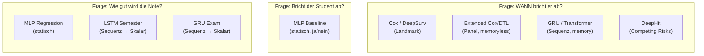
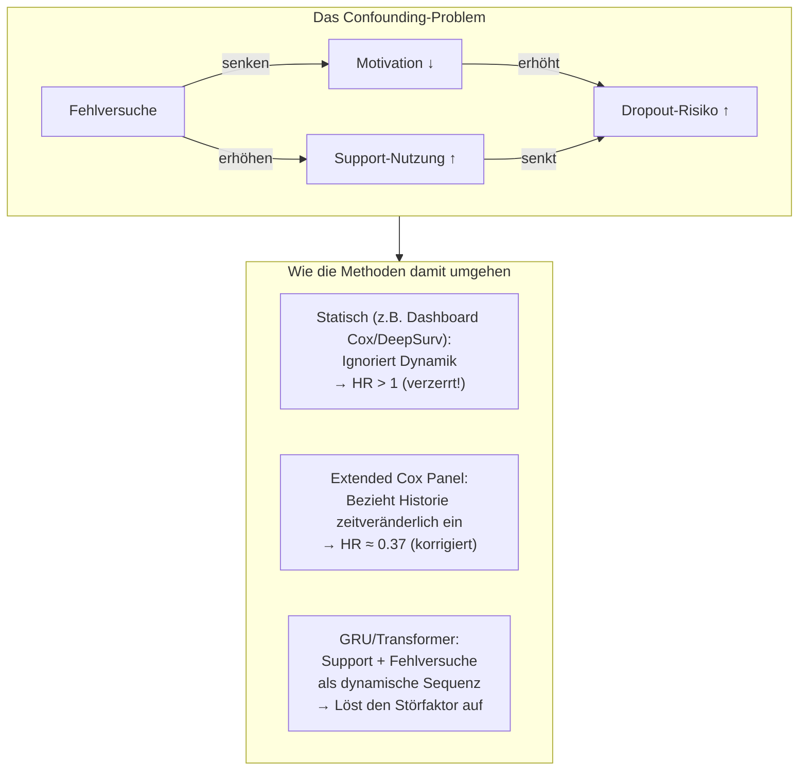

# Methodenvergleich: Alle Modelle im Überblick

Kompakter Vergleich aller Analysemethoden — fokussiert auf die konzeptionellen Unterschiede und Ergebnisse, ohne Preprocessing-Details.

---

## 1. Kompaktvergleich

| # | Skript | Ansatz | Daten | Schrittweite | Zielgröße | Loss | Confounding | Zensierung |
| :---: | :--- | :--- | :--- | :--- | :--- | :--- | :---: | :---: |
| 1 | `train_mlp_baseline` | MLP Klassifikation | 2D Snapshot | — | Status | BCE | ❌ | ❌ |
| 2 | `train_mlp_regression` | MLP Regression | 2D Snapshot | — | Abschlussnote | MSE | ❌ | ❌ |
| 3 | `timeseries_semester` | LSTM Regression | 3D Sequenz | Semester | Ø GPA | MSE | ❌ | ❌ |
| 4 | `timeseries_exam` | GRU Regression | 3D Sequenz | Prüfung | Ø Note | MSE | ❌ | ❌ |
| 5 | `dashboard_survival_dl` | Cox + DeepSurv + DTL | 2D Landmark | — | $h(t)$ | PL / BCE | ⚠️ $T_0=3$ | ✅ |
| 6 | `deep_survival` | DeepSurv + DTL | 2D Landmark | — | $h(t)$ | PL / BCE | ⚠️ $T_0=3$ | ✅ |
| 7 | `extended_cox_survival` | Extended Cox PH | Panel | Semester | $h(t)$ | PL | ✅ $X_i(t)$ | ✅ |
| 8 | `extended_deep_survival` | Ext. DeepSurv + DTL | Panel | Semester | $h(t)$ | PL / BCE | ✅ $X_i(t)$ | ✅ |
| 9 | `extended_exam_survival` | Ext. DeepSurv + DTL | Panel | Prüfung | $h(t)$ | PL / BCE | ✅ $X_i(t)$ | ✅ |
| 10 | `recurrent_survival` | GRU Survival | 3D Sequenz | Semester | $h(t \mid X_{1..t})$ | Masked BCE | ✅✅ Memory | ✅ |
| 11 | `recurrent_exam` | GRU Exam Survival | 3D Sequenz | Prüfung | $h(t \mid X_{1..t})$ | Masked BCE | ✅✅ Memory | ✅ |
| 12 | `transformer_survival` | Causal Transformer | 3D Sequenz | Semester | $h(t \mid X_{1..t})$ | Masked BCE | ✅✅ Attention | ✅ |
| 13 | `dynamic_deephit` | Multi-Task GRU | 3D Sequenz | Semester | $h_1(t), h_2(t)$ | Masked BCE ×2 | ✅✅✅ CR | ✅ |

**Legende:** PL = Partial Likelihood, BCE = Binary Cross-Entropy, CR = Competing Risks, $X_i(t)$ = zeitveränderliche Exposition

---

## 2. Was modelliert was?

---

## 3. Architektur-Vergleich

### 3.1 Statische Modelle (kein Zeitbezug)

| Modell | Typ | Parameter (ca.) | Input |
| :--- | :--- | :---: | :--- |
| Naive Bayes | Generativ | — | Tabelle |
| Random Forest | Ensemble | ~100k | Tabelle |
| SVM/SVR | Kernel | $O(N^2)$ | Tabelle |
| Keras MLP | Feed-Forward NN | ~3k–5k | Tabelle |

### 3.2 Panel-Modelle (Zeile = Zeitschritt, kein Gedächtnis)

| Modell | Typ | Besonderheit |
| :--- | :--- | :--- |
| `statsmodels.phreg` | Semi-parametrisch | Interpretierbar (HRs, CIs), Breslow-Ties |
| Extended DeepSurv | Neural Cox | Nicht-linearer Risk Score, `use_bias=False` |
| Extended DTL | Neural Logistic Hazard | Freie $h(t)$ pro Zeitschritt |

### 3.3 Sequenzmodelle (3D Tensor, dynamisches Gedächtnis)

| Modell | Kern-Layer | Gedächtnis-Mechanismus | Kausal |
| :--- | :--- | :--- | :---: |
| **LSTM Semester** | `LSTM(64) → LSTM(32)` | Cell State + Hidden State | ✅ (inhärent) |
| **GRU Semester** | `GRU(32)` + `TimeDistributed` | Hidden State (vereinfacht) | ✅ (inhärent) |
| **GRU Exam** | `GRU(32)` + `TimeDistributed` | Hidden State | ✅ (inhärent) |
| **Causal Transformer** | `MultiHeadAttention(4,8)` + `PositionalEncoding` | Attention über alle $t' \le t$ | ✅ (`use_causal_mask`) |
| **DeepHit** | Shared `GRU(32)` + 2 Heads | Geteiltes Hidden State | ✅ (inhärent) |

> [!TIP]
> **GRU vs. Transformer:** GRU verarbeitet die Sequenz strikt von links nach rechts und komprimiert die Historie in einen fixen Hidden State. Der Transformer kann via Attention **selektiv** auf beliebige vergangene Zeitschritte zugreifen — theoretisch mächtiger für lange Sequenzen, aber hier bei $T \le 16$ fast gleichauf.

---

## 4. Zeitliche Modellierung im Vergleich

| Eigenschaft | Statisch | Panel | GRU Sequenz | Transformer | DeepHit |
| :--- | :---: | :---: | :---: | :---: | :---: |
| **Zeitveränderliche Features** | ❌ | ✅ | ✅ | ✅ | ✅ |
| **Sequenzgedächtnis** | ❌ | ❌ | ✅ (Hidden State) | ✅ (Attention) | ✅ (Hidden State) |
| **Zukunft ausgeschlossen** | N/A | ✅ (Zeitschritte strikt getrennt) | ✅ (autoregressiv) | ✅ (Causal Mask) | ✅ (autoregressiv) |
| **Zensierung behandelt** | ❌ | ✅ (Counting) | ✅ (Masked Loss) | ✅ (Masked Loss) | ✅ (Masked Loss) |
| **Competing Risks** | ❌ | ❌ | ❌ | ❌ | ✅ (Multi-Task) |

---

## 5. Performance-Vergleich (wo vergleichbar)

### 5.1 Survival-Modelle (Dropout-Vorhersage, Semesterebene)

| Modell | Stufe | ROC-AUC | PR-AUC | C-Index | Anmerkung |
| :--- | :---: | :---: | :---: | :---: | :--- |
| Landmark Cox PH | 1 | — | — | 0.785 | Referenz-Baseline |
| Landmark DTL | 1 | 0.899 | 0.829 | 0.786 | Diskrete Zeit |
| Landmark DeepSurv | 1 | — | — | 0.788 | Non-lineare Baseline |
| Ext. DeepSurv (Sem.) | 2 | 0.523 | 0.065 | — | Panel ROC-AUC |
| Ext. DTL (Sem.) | 2 | 0.759 | 0.191 | — | Panel ROC-AUC |
| **Ext. DTL (Prüfung)** | 2 | **0.879** | 0.163 | — | Panel ROC-AUC (Exam-Step) |
| GRU Sem. Survival | 3 | 0.8223 | 0.2841 | 0.832 | Sequenz ROC-AUC & Concordance |
| **Causal Transformer** | 3 | 0.8247 | **0.2926** | 0.828 | Bester single-event PR-AUC |
| **DeepHit (Dropout)** | 4 | **0.8261** | 0.2847 | 0.826 | Bester overall ROC-AUC |
| DeepHit (Abschluss) | 4 | 0.9997 | 0.9968 | — | Trivial (hohe Basis-Rate) |

> [!IMPORTANT]
> **Achtung bei der Vergleichbarkeit:** Stufe-1-Werte (Landmark C-Index) und Stufe-2-Werte (Panel ROC-AUC) sind **nicht direkt** mit Stufe-3-Werten (Sequenz ROC-AUC) vergleichbar, da die Evaluationseinheiten unterschiedlich sind (Student vs. Person-Semester vs. Student-Zeitschritt).

### 5.2 Interpretationshinweise

| Metrik | Was sie misst | Wann verwenden |
| :--- | :--- | :--- |
| **C-Index** | Paarweise Ranking-Konkordanz (Ranking der Überlebenszeiten) | Genereller Survival-Vergleich |
| **ROC-AUC** | Globale Trennfähigkeit Event/Non-Event | Alle Modelle |
| **PR-AUC** | Performance auf der seltenen Klasse (Dropout ~2–5%) | **Gold-Standard** bei Imbalance |
| **Brier Score** | Kalibration (Vorhergesagte $p$ ≈ beobachtete Rate?) | Kalibrationsprüfung |
| **F1 @5%** | Precision/Recall bei fixem Alarm-Schwellwert | Operativ (Frühwarnsystem) |

---

## 6. Confounding-Behandlung: Der zentrale Vergleich

| Methode | Support-HR (Fachlich) | Interpretation |
| :--- | :---: | :--- |
| **Landmark Cox (statisch)** | ≈ 1.15 | ❌ „Support schadet" (Confounding-Artefakt) |
| **Extended Cox (zeitveränderlich)** | **0.37** | ✅ „Support halbiert das Risiko" (kausal korrekt) |
| **GRU/Transformer** | Nicht direkt ablesbar | ✅ Modelliert den Feedback-Loop (Counterfactual Inference für HR nötig) |

> [!TIP]
> **Für die Präsentation:** Der Wechsel von HR > 1 (statisch) zu HR ≈ 0.37 (zeitveränderlich) ist das stärkste Ergebnis des Projekts. Es zeigt, dass die korrekte Methodik entscheidend ist, um den wahren Effekt einer Intervention zu erkennen.
