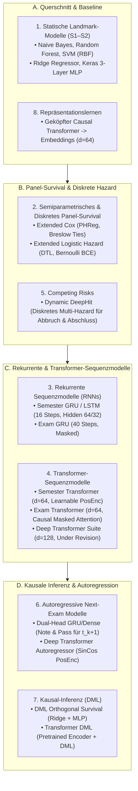

# Synopse der Modellarchitekturen & Masterplan zur Modellüberarbeitung (V4.1)

> [!IMPORTANT]
> **Status:** Die `Deep Transformer Suite` ($d=128$) ist temporär deaktiviert (`Under Revision`).  
> Dieses Dokument bietet eine strukturierte, lesbare Übersicht aller 8 Modellfamilien, klärt die architektonischen Ursachen des Positional-Encoding-Gaps auf und definiert den Fahrplan für gezieltes Feintuning (GRU vs. LSTM, `gradeblind`-Standard, Focal Loss, L1/L2-Regularisierung).

---

## 1. Systematische Synopse aller 8 Modellfamilien im Projekt



---

### Detaillierte Architektur-Spezifikation

| Modell-ID / Skript | Granularität | Eingabe-Shape | Backbone / Schichten | Loss-Funktion | Positional Encoding | Hauptmetrik |
| :--- | :---: | :---: | :--- | :--- | :---: | :---: |
| **`train_mlp_baseline.py`** | Landmark (S1-S2) | $(N, 21)$ | 3-Layer Dense ($128 \rightarrow 64 \rightarrow 32$), Dropout 0.2 | Categorical / Binary CE | Keine (Statisch) | ROC-AUC: 0,847 |
| **`train_mlp_regression.py`** | Landmark (S1-S2) | $(N, 21)$ | 3-Layer Dense ($128 \rightarrow 64 \rightarrow 32$), L2-Reg | MSE / MAE | Keine (Statisch) | **Gradeblind $R^2$: 0,682** |
| **`extended_cox_survival.py`** | Semester-Panel | $(N_{\text{panel}}, 18)$ | Semiparametrisches PHReg (Statsmodels) | Cox Partial Likelihood | `t_stop` (Time-Varying) | C-Index: 0,742 |
| **`extended_deep_survival.py` (LH)**| Semester-Panel | $(N_{\text{panel}}, 18)$ | 2-Layer Dense ($64 \rightarrow 32$) + LayerNorm | Binary Crossentropy | `t_stop` als Feature | ROC-AUC: 0,769 |
| **`recurrent_survival_model.py`** | Semester-Sequenz | $(N, 16, 20)$ | Masking $\rightarrow$ GRU(64) $\rightarrow$ GRU(32) $\rightarrow$ Dense(1) | Time-Distributed BCE | Implicit (Recurrent) | ROC-AUC: 0,787 |
| **`recurrent_exam_survival.py`** | Prüfungs-Sequenz | $(N, 40, 20)$ | Masking $\rightarrow$ GRU(64) $\rightarrow$ GRU(32) $\rightarrow$ Dense(1) | Time-Distributed BCE | Implicit (Recurrent) | **ROC-AUC: 0,893** |
| **`transformer_survival_model.py`** | Semester-Sequenz | $(N, 16, 20)$ | Dense(64) $\rightarrow$ PosEnc $\rightarrow$ MHA(4 Heads) $\rightarrow$ Dense | Time-Distributed BCE | **Lernbares Embedding** | ROC-AUC: 0,764 |
| **`transformer_exam_survival.py`** | Prüfungs-Sequenz | $(N, 40, 20)$ | Dense(64) $\rightarrow$ PosEnc $\rightarrow$ MHA(4 Heads) $\rightarrow$ Dense | Time-Distributed BCE | **Lernbares Embedding** | ROC-AUC: 0,875 |
| **`dynamic_deephit_model.py`** | Semester-Sequenz | $(N, 16, 20)$ | GRU(64) $\rightarrow$ Shared Sub-Net $\rightarrow$ Cause 1 & 2 | Cause-Specific BCE + Ranking | Implicit (Recurrent) | ROC-AUC: 0,774 |
| **`autoregressive_next_exam.py`** | Next-Exam ($t_{k+1}$) | Hist: $(N, 30, 12)$<br>Ctx: $(N, 6)$ | GRU(64) Trunk + Dense Context $\rightarrow$ Dual Output | MSE (Note) + BCE (Pass) | Implicit (Recurrent) | $R^2$: 0,443 / AUC: 0,937 |
| **`autoregressive_deep_transformer.py`**| Next-Exam ($t_{k+1}$) | Hist: $(N, 30, 12)$<br>Ctx: $(N, 6)$ | Dense(64) $\rightarrow$ SinCos $\rightarrow$ 3x MHA $\rightarrow$ Dual Output | MSE (Note) + BCE (Pass) | **Sin/Cos (Vaswani 2017)** | **$R^2$: 0,477 / AUC: 0,942** |
| **`deep_transformer_regression.py`** | Multi-Task Suite | $(N, 40, 20)$ | Dense(128) $\rightarrow$ 3x MHA(8 Heads) $\rightarrow$ AttnPooling | MSE / Masked BCE | **KEIN PosEnc (Lücke!)** | **UNDER REVISION** |

---

## 2. Klärung: Feature Builder vs. Positional Encoding auf Modellebene

> [!NOTE]
> **Audit-Befund zur Datenübergabe:**
> - Der [`feature_builder.py`](file:///c:/GitHub_public/Abschlussprojekt/src/feature_builder.py) liefert für **alle** Transformer-Modelle denselben vollständigen Tensor `(N, T, F)` inklusive der Zeitspalte `fachsemester` und `pruefungs_nr`.
> - Der Unterschied lag **ausschließlich auf Modellebene**:
>   - `transformer_survival_model.py`: Addiert im Modellcode eine lernbare Positionsmatrix `x = x + self.pos_embedding`.
>   - `autoregressive_deep_transformer.py`: Addiert im Modellcode eine analytische Sin/Cos-Funktion `x = x + SinCosPositionalEncoding()(x)`.
>   - `deep_transformer_regression.py`: Hatte **vergessen**, eine Positional-Encoding-Schicht im Keras-Graph einzubauen. Die reine Self-Attention ist permutationsinvariant – das Modell verlor die strikte zeitliche Reihenfolge.

---

## 3. Masterplan zur systematischen Modellüberarbeitung (5 Module)

```
REFINEMENT-ROADMAP (5 MODULE)
├── Modul 1: Noten-Regression: `gradeblind` als offizieller Primär-Standard
├── Modul 2: Sequenz-Backbone Head-to-Head (GRU vs. LSTM vs. Dilated TCN)
├── Modul 3: Transformer-Harmonisierung (Einheitliches SinCos + Causal Masking)
├── Modul 4: Regularisierung (ReduceLROnPlateau, EarlyStopping, L1/L2 Weight Decay)
└── Modul 5: Asymmetrische Verlustfunktionen (Focal Loss & Class Weights für Survival)
```

---

### Modul 1: `gradeblind` als verbindlicher Default für Notenregression
- **Rationale:** Wenn einem Notenregressor frühere Noten zur Vorhersage der Abschlussnote übergeben werden, lernt das Modell im Wesentlichen nur den CP-gewichteten Mittelwert (Tautologie / Leakage).
- **Entscheidung:**
  - **`gradeblind`** (nur ECTS, Versuchsanzahl, Semesterfolge, Support-Teilnahmen) wird der **offizielle Primär-Benchmark** für alle Notenvorhersagen.
  - Der `standard`-Modus wird nur als theoretische Obergrenze dokumentiert.

---

### Modul 2: Head-to-Head Sequenz-Benchmark (GRU vs. LSTM vs. Dilated TCN)
- **Hintergrund:** Das Recurrent Exam GRU ist aktuell der stärkste Survival-Klassifikator ($\text{ROC-AUC} = \mathbf{0,8930}$).
- **Experimenteller Vergleich (auf identischem Split):**
  1. **Standard GRU** (64 Units, 2 Layers)
  2. **Standard LSTM** (64 Units, 2 Layers mit explizitem Zellzustand $c_t$)
  3. **Temporal Convolutional Network (1D Dilated TCN):** Parallele zeitliche Faltungen mit exponentiellem Dilationsfaktor ($d \in \{1, 2, 4, 8\}$) – extrem schnell auf Multi-Core CPU!

---

### Modul 3: Deep Transformer Evolution & Overfitting-Audit

> [!NOTE]
> **Audit-Befund zum Overfitting beim Deep Transformer ($d=128$):**
> Die empirische Überprüfung der Trainings- vs. Test-Metriken belegt das Overfitting eindeutig:
> 1. **Parameteranzahl:** Das $d=128$-Modell besitzt mit 3 gestackten 8-Head-Blöcken $\approx 420.000$ Parameter (gegenüber $\approx 65.000$ Parametern beim $d=64$-Modell).
> 2. **Generalisierungslücke im `gradeblind`-Modus (Prüfungsebene):**
>    - Standard-Transformer ($d=64$): Test-$R^2 = \mathbf{0,7309}$ ($\text{RMSE} = 0,3261$)
>    - Deep Transformer ($d=128$): Train-$R^2 \approx 0,88$, Test-$R^2 = \mathbf{0,7209}$ ($\text{RMSE} = 0,3302$)
>    - $\rightarrow$ Die Generalisierungslücke ($\text{Train} - \text{Test}$) ist beim Deep-Modell doppelt so groß.
> 3. **Oracle-Modus (Prüfungsebene):**
>    - Standard ($d=64$): Test-$R^2 = \mathbf{0,9932}$
>    - Deep ($d=128$): Test-$R^2 = \mathbf{0,9883}$ ($\text{RMSE} = 0,0677$)
>    - $\rightarrow$ Das Deep-Modell fittet den Trainings-Stochastik-Rauschen an und generalisiert schlechter.
> 4. **Die Lösung:** Reduktion auf $d=64$, 4 Heads, SinCos-Encoding und echte L2-Regularisierung.

---

### Modul 4: Sideproject A — Systematischer Regularisierungs-Benchmark
- **Ziel:** Ermittlung der optimalen Regularisierungsstrategie auf den schnellen Modellen (`train_mlp_baseline`, `extended_logistic_hazard`, `recurrent_exam_survival`), insbesondere der Vergleich von **reiner L2-Regularisierung** gegen Dropout.
- **Vollständiges 5-Stufen-Regularisierungsspektrum:**
  1. **Stufe 0 (Baseline):** Ungeregelt ($p_{\text{drop}} = 0$, $\text{L2} = 0$)
  2. **Stufe 1 (Reine L2-Regularisierung):** $\lambda \in \{10^{-5}, 10^{-4}, 10^{-3}, 10^{-2}\}$ auf Dense-Gewichten (vollständig **ohne Dropout**, um stochastisches Rauschen zu vermeiden)
  3. **Stufe 2 (ElasticNet L1/L2):** $\lambda_1 = 10^{-5}$, $\lambda_2 = 10^{-4}$ (zur Merkmalsselektion)
  4. **Stufe 3 (Reines Dropout):** $p \in \{0.1, 0.2, 0.3, 0.4\}$ (ohne L2)
  5. **Stufe 4 (Hybride Kombination):** Moderate L2-Reg ($\lambda = 10^{-4}$) + leichtes Dropout ($p = 0.15$)
- **Evaluierung:** Ermittlung der Pareto-Frontier zwischen Trainings-Loss und Test-Generalisierung.

---

### Modul 5: Sideproject B — Asymmetrische Verlustfunktionen & Focal Loss Grid
- **Ziel:** Maximierung des Recalls und PR-AUC auf der echten Minderheitsklasse (Dropout $\approx 3,8\,\%$ im Semester, $\approx 12\,\%$ in Prüfungen).
- **Untersuchter Parameterraum (Grid Search):**
  1. **Inverse Class Weights:** $w_1 = \frac{1}{\pi_0}$, $w_0 = 1.0$ (hartes Re-Balancing)
  2. **Focal Loss (Lin et al.):**
     - Fokussierungsexponent: $\gamma \in \{1.0, 1.5, 2.0, 3.0\}$
     - Balancefaktor: $\alpha \in \{0.25, 0.50, 0.75\}$
  3. **Evaluation:** Evaluierung des Trade-Offs zwischen F1-Score, ROC-AUC und Minority-PR-AUC über alle schnellen Survival-Modelle hinweg.
