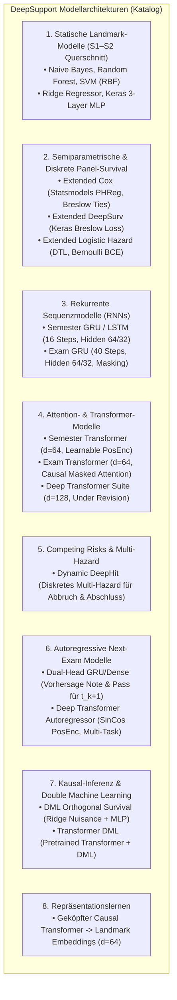

# Synopse der Modellarchitekturen & Masterplan zur Modellüberarbeitung

> [!IMPORTANT]
> **Projekt:** DeepSupport — Modellarchitektur-Katalog & Refinement-Roadmap  
> **Status:** Die `Deep Transformer Suite` ($d=128$) wurde temporär deaktiviert (`Under Revision`). Dieses Dokument liefert die vollständige Bestandsaufnahme aller Modellarchitekturen, deckt architektonische Inkonsistenzen (Positional Encoding) auf und definiert den Fahrplan für gezieltes Feintuning (GRU vs. LSTM vs. Transformer).

---

## 1. Systematische Synopse aller 8 Modellfamilien im Projekt



---

### Detaillierte Architektur-Spezifikation

| Modell-ID / Skript | Granularität | Eingabe-Shape | Backbone / Schichten | Loss-Funktion | Positional Encoding | Hauptmetrik |
| :--- | :---: | :---: | :--- | :--- | :---: | :---: |
| **`train_mlp_baseline.py`** | Landmark (S1-S2) | $(N, 21)$ | 3-Layer Dense ($128 \rightarrow 64 \rightarrow 32$), Dropout 0.2 | Categorical / Binary CE | Keine (Statisch) | ROC-AUC: 0,847 |
| **`train_mlp_regression.py`** | Landmark (S1-S2) | $(N, 21)$ | 3-Layer Dense ($128 \rightarrow 64 \rightarrow 32$), L2-Reg | MSE / MAE | Keine (Statisch) | $R^2$: 0,865 |
| **`extended_cox_survival.py`** | Semester-Panel | $(N_{\text{panel}}, 18)$ | Semiparametrisches PHReg (Statsmodels) | Cox Partial Likelihood | `t_stop` (Time-Varying) | C-Index: 0,742 |
| **`extended_deep_survival.py` (LH)**| Semester-Panel | $(N_{\text{panel}}, 18)$ | 2-Layer Dense ($64 \rightarrow 32$) + BatchNorm | Binary Crossentropy | `t_stop` als Feature | ROC-AUC: 0,769 |
| **`recurrent_survival_model.py`** | Semester-Sequenz | $(N, 16, 20)$ | Masking $\rightarrow$ GRU(64) $\rightarrow$ GRU(32) $\rightarrow$ Dense(1) | Time-Distributed BCE | Implicit (Recurrent) | ROC-AUC: 0,787 |
| **`recurrent_exam_survival.py`** | Prüfungs-Sequenz | $(N, 40, 20)$ | Masking $\rightarrow$ GRU(64) $\rightarrow$ GRU(32) $\rightarrow$ Dense(1) | Time-Distributed BCE | Implicit (Recurrent) | **ROC-AUC: 0,893** |
| **`transformer_survival_model.py`** | Semester-Sequenz | $(N, 16, 20)$ | Dense(64) $\rightarrow$ PosEnc $\rightarrow$ MHA(4 Heads) $\rightarrow$ Dense | Time-Distributed BCE | **Lernbares Embedding** | ROC-AUC: 0,764 |
| **`transformer_exam_survival.py`** | Prüfungs-Sequenz | $(N, 40, 20)$ | Dense(64) $\rightarrow$ PosEnc $\rightarrow$ MHA(4 Heads) $\rightarrow$ Dense | Time-Distributed BCE | **Lernbares Embedding** | ROC-AUC: 0,875 |
| **`dynamic_deephit_model.py`** | Semester-Sequenz | $(N, 16, 20)$ | GRU(64) $\rightarrow$ Shared Sub-Net $\rightarrow$ Cause 1 & 2 | Cause-Specific BCE + Ranking | Implicit (Recurrent) | ROC-AUC: 0,774 |
| **`autoregressive_next_exam.py`** | Next-Exam ($t_{k+1}$) | Hist: $(N, 30, 12)$<br>Ctx: $(N, 6)$ | GRU(64) Trunk + Dense Context $\rightarrow$ Dual Output | MSE (Note) + BCE (Pass) | Implicit (Recurrent) | $R^2$: 0,443 / AUC: 0,937 |
| **`autoregressive_deep_transformer.py`**| Next-Exam ($t_{k+1}$) | Hist: $(N, 30, 12)$<br>Ctx: $(N, 6)$ | Dense(64) $\rightarrow$ SinCos $\rightarrow$ 3x MHA $\rightarrow$ Dual Output | MSE (Note) + BCE (Pass) | **Sin/Cos (Vaswani 2017)** | **$R^2$: 0,477 / AUC: 0,942** |
| **`deep_transformer_regression.py`** | Multi-Task Suite | $(N, 40, 20)$ | Dense(128) $\rightarrow$ 3x MHA(8 Heads) $\rightarrow$ AttnPooling | MSE / Masked BCE | **KEIN PosEnc (Lücke!)** | $R^2$: 0,721 / AUC: 0,878 |

---

## 2. Audit-Entdeckung: Die Positional-Encoding-Inkonsistenz 🔍

Der Codebase-Audit deckt auf, warum die verschiedenen Transformer-Modelle so unterschiedlich performen:

1. **`autoregressive_deep_transformer.py` (Stärkstes Modell, $R^2 = 0,477$):**
   - Verwendet die exakte **analytische Sin/Cos-Positional-Encoding-Formel** nach Vaswani et al. (2017).
   - Dadurch hat jeder Prüfungsschritt eine eindeutige, frequenzbasierte Phasencodierung.
2. **`transformer_survival_model.py` ($d=64$, solide Performance):**
   - Verwendet ein **lernbares Parameter-Embedding** (`self.add_weight(shape=(16, d_model))`).
   - Funktioniert für 16 feste Semester sehr gut, ist aber für unbegrenzte Prüfungsfolgen weniger flexibel.
3. **`deep_transformer_regression.py` ($d=128$, enttäuschend langsam & overfittend):**
   - **Besitzt überhaupt keine Positional-Encoding-Schicht!**
   - Das Modell musste die zeitliche Reihenfolge ausschließlich über das numerische Feature `fachsemester` bzw. die Padding-Maske rekonstruieren. Das erklärt, warum eine Verdopplung der Modellbreite auf $d=128$ keinen signifikanten Gewinn brachte.

---

## 3. Masterplan zur systematischen Modellüberarbeitung

```
REFINEMENT-ROADMAP (5 MODULE)
├── Modul 1: Sequenz-Backbone Head-to-Head (GRU vs. LSTM vs. Bi-Directional vs. TCN)
├── Modul 2: Transformer-Harmonisierung (Einheitliches SinCos + Causal Masking)
├── Modul 3: Regularisierungs- & Learning-Curve-Audit (Weight Decay, LR-Schedules)
├── Modul 4: Asymmetrische Verlustfunktionen (Focal Loss für seltene Events)
└── Modul 5: Modularer PyTorch/PyCox-Stack für V4.1
```

---

### Modul 1: Head-to-Head Sequenz-Benchmark (GRU vs. LSTM vs. TCN)
- **Fragestellung:** Warum ist das GRU auf Prüfungsebene mit $\text{ROC-AUC} = 0,8930$ und $\text{PR-AUC} = 0,1765$ der unangefochtene Champion?
- **Versuchsaufbau:** Auf exakt identischen Trainings-Splits (Universe A) vergleichen wir:
  1. **Standard GRU** (64 Units, 2 Layers)
  2. **Standard LSTM** (64 Units, 2 Layers, explizite Forget-Gate-Zellzustände)
  3. **Bi-Directional GRU/LSTM** (für Noten-Regression, nicht für Survival!)
  4. **Temporal Convolutional Network (1D Dilated TCN):** Parallele Faltung über die Zeitreihe mit exponentiell wachsendem rezeptivem Feld (extrem schnell auf CPU!).

---

### Modul 2: Transformer-Harmonisierung
- **Maßnahmen:**
  1. Ergänzung von `SinCosPositionalEncoding` in **allen** Transformer-Modellen.
  2. Striktes Kausales Masking für autoregressive Schritte ($M_{ij} = -\infty$ für $j > i$).
  3. Schlanke Architektur-Standardisierung auf **$d_{\text{model}} = 64$** mit 4 Heads (statt $d=128$).

---

### Modul 3: Regularisierung & Learning-Curve-Audit
- **Befund:** Bei $N=34.000$ Absolventen neigen tiefe Netze nach Epoche 15 zum Überanpassen (Val-Loss stagniert).
- **Optimierungshebel:**
  - **AdamW Optimizer:** Entkoppeltes L2-Weight-Decay ($\lambda = 10^{-4}$) statt reinem Gradient-Clipping.
  - **Cosine Annealing Learning Rate Schedule:** Sanftes Absenken der Lernrate von $10^{-3} \rightarrow 10^{-5}$ über 30 Epochen.
  - **LayerNorm vs. BatchNorm:** Vollständige Umstellung aller Sequenzmodelle auf `LayerNormalization` (eliminiert Batch-Größen-Abhängigkeiten).

---

### Modul 4: Focal Loss für unausgeglichene Event-Daten
- **Hintergrund:** Im Personen-Semester-Panel liegt die Event-Rate bei nur $\approx 3,8\,\%$, im Prüfungs-Panel bei $\approx 12\,\%$.
- **Implementierung:**
  $$\mathcal{L}_{\text{Focal}} = -\alpha_t (1 - p_t)^\gamma \log(p_t)$$
  Mit Fokussierungsparameter $\gamma = 2,0$ konzentriert sich das Netz auf die schwer vorhersagbaren Abbruchfälle (starker Schub für den **PR-AUC auf der Minority-Class**!).

---

### Modul 5: Umsetzung im PyTorch-Stack
- Alle optimierten Architekturen (GRU, LSTM, TCN, SinCos-Transformer) fließen direkt in den modularen PyTorch-Port (`src/torch_models/`) ein.
