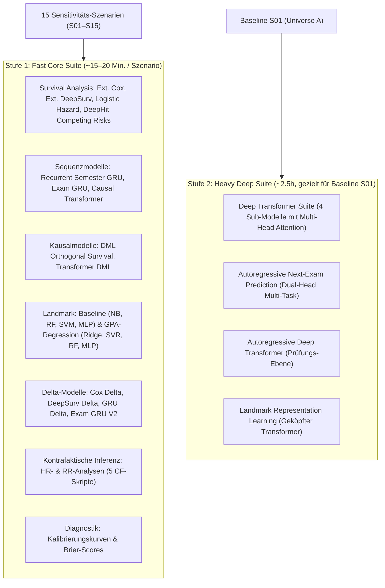

# Modelltraining V4.1 — Aktualisierter Master-Plan

> [!IMPORTANT]
> **Ziel:** Vollständige, reproduzierbare Modellierung der V4.1-Ergebnisse.
> **Neue Architektur:** Entkopplung in **Fast Core Suite** (~20 Min./Szenario) und **Heavy Deep Suite** (~2.5h für Baseline S01) mit sauberer Kausal-Inferenz und `prev` vs. `cum` A/B-Vergleich.

---

## 1. Datenlage & Aggregation ✅

- **V4.1 Baseline-Daten:** `src/output_v4_grid_v41/S01_baseline/universe_A/` (N=50.000, Seed 99999)
- **Aggregation:** `agg_abschluesse.csv` (50.000 Zeilen) und `agg_pruefungen.csv` (852.368 Zeilen) via `aggregate.py`.
- **Feature Builder (5 Formate verifiziert):**
  - Semester Tensor: `(50000, 16, 18)` (Standard) bzw. `(50000, 16, 23)` (Oracle) ✅
  - Exam Tensor: `(50000, 40, 24)` (Standard) bzw. `(50000, 40, 29)` (Oracle) ✅
  - Semester Panel: `(359402, 16)` (Standard) bzw. `(359402, 21)` (Oracle) ✅
  - Exam Panel: `(852368, 23)` (Standard) bzw. `(852368, 28)` (Oracle) ✅
  - Landmark: `(47973, 16)` (Standard) bzw. `(47973, 21)` (Oracle) ✅

---

## 2. Antworten & Klärung der Rückfragen

### A. Split-Proportionen (3-Way 70/15/15 vs. 80/20)
- **Alle Deep-Learning- & Sequenzmodelle** (GRU, Transformer, DeepHit, Autoregressoren, Keras-MLPs) nutzen den **3-Way Split 70 % Train / 15 % Val / 15 % Test** mit Stratifizierung auf `studi_events` und festem Seed (`random_state=42`).
- **Klassische statistische Schätzer** (wie `Statsmodels PHReg` für Extended Cox oder einfache Ridge-Regressionen) nutzten historisch einen 80/20 Train/Test-Split, da Closed-Form / Maximum-Likelihood-Schätzer ohne Epochen-Validierungsloop auskommen.
- **Gruppenkonsistenz:** In allen Modellen wird ausnahmslos auf Studierenden-Ebene (`unique_studis`) gesplittet (kein Sample Leakage!).

### B. Counterfactual-Analysen (Keine Multi-Universum-Daten nötig!)
- Alle 5 kontrafaktischen Inferenz-Skripte (`counterfactual_hr_delta.py`, `counterfactual_rr_logistic_hazard_delta.py`, `counterfactual_rr_deephit_delta.py`, `counterfactual_inference_semester_transformer.py`, `counterfactual_rr_exam_rnn_delta.py`) arbeiten rein **modellbasiert auf dem Test-Set von Universum A**.
- Es wird kein zweites Universum (B–H) benötigt, da die Interventionen durch Maskierung / Manipulation des Treatment-Vektors ($T=0$ vs. $T=\text{beobachtet}$) im gelernten Modell berechnet werden. Die Inferenz dauert **nur wenige Sekunden pro Modell**.

### C. Runner-Integration (Fast Suite vs. Heavy Suite)
Die früher fehlenden Modelle (Landmark DeepSurv, Delta-Varianten, Transformer-DML, Autoregressoren) sind nun vollständig modularisiert:
- **`src/run_fast_suite.py`:** Umfasst alle 25+ schnellen Modelle + DML + Landmark + **die gesamte Kontrafaktik-Suite** (~15–20 Min. pro Szenario).
- **`src/run_heavy_suite.py`:** Isoliert die 4 Deep Transformer Regressoren, die 2 Autoregressoren und das Representation Learning (~2,5 Stunden, gezielt für Baseline).
- **`src/run_master_suite.py`:** Einheitliche CLI mit `--suite fast|heavy|all`.

### D. Feature Grid Sweep & Laufzeit
- `run_feature_grid_experiments.py` war ein früheres Einzelskript, das 4 Modelltypen über alle 5 Modi verglich.
- Im neuen Konzept übernimmt **`run_fast_suite.py --modes standard,gradeblind`** genau diese Aufgabe – hochgradig optimiert und ohne tagelange Blockade durch die schweren Transformer.

---

## 3. Die Zwei-Stufen-Modellsuite im Detail



---

## 4. Versuchsplan für V4.1

### Phase 1: V3.6 Bereinigungslauf (Aktuell in Ausführung)
- Dient als sauberer, leak-freier Referenzstand.
- Läuft auf `output_dl_v36_clean`.

### Phase 2: V4.1 Baseline `prev` vs. `cum` A/B-Vergleich
- **Ziel:** Empirische Klärung, ob Sequenzmodelle besser mit lokalen Differenzen (`temporal=prev`) oder explizitem akkumuliertem Status (`temporal=cum`) arbeiten.
- **Ausführung:**
  ```bash
  # Lauf 1: Flow / Dynamik (prev)
  python src/run_master_suite.py --suite all --data_dir output_v4_grid_v41/S01_baseline/universe_A --temporal prev --modes standard,gradeblind

  # Lauf 2: Stock / Historie (cum)
  python src/run_fast_suite.py --data_dir output_v4_grid_v41/S01_baseline/universe_A --temporal cum --modes standard,gradeblind
  ```
- **Dauer:** ca. 3,5 Stunden gesamt.

### Phase 3: Sensitivitäts-Sweep über alle 15 Szenarien (Server/LXC)
- **Ausführung:** Fast Core Suite über alle 15 Szenarien (S01 bis S15, Universum A):
  ```bash
  for szenario in S01_baseline S02_support_half S03_support_double ... S15_kombi_double; do
      python src/run_fast_suite.py --data_dir output_v4_grid_v41/${szenario}/universe_A --modes standard,gradeblind
  done
  ```
- **Gesamtdauer:** ca. **4,5 bis 5 Stunden** (optimal für LXC-Container).
