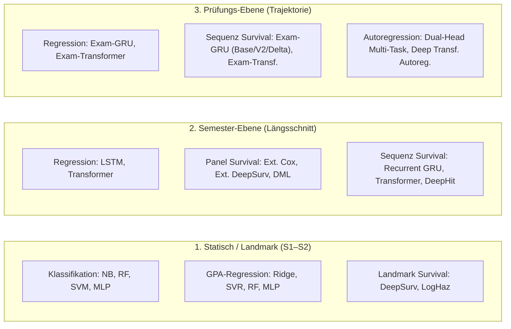

# Modelltraining V4.1 — Executive Master-Plan

> [!IMPORTANT]
> **Zwei-Stufen-Architektur:** Entkopplung in **Fast Core Suite** (~20 Min./Szenario) für alle 15 Sensitivitäts-Szenarien und **Heavy Deep Suite** (~2.5h) gezielt für die Baseline (S01).
> **Zentraler A/B-Vergleich:** `temporal='prev'` (Flow/Deltas) vs. `temporal='cum'` (Stock/Historie) auf der Baseline.

---

## 1. Zwei-Stufen-Architektur (Fast vs. Heavy)

| Dimension | ⚡ Stufe 1: Fast Core Suite | 🏋️ Stufe 2: Heavy Deep Suite |
| :--- | :--- | :--- |
| **Ziel** | Vollständige Modell- & Kausalsynopse über **alle 15 Szenarien** | Maximale Repräsentationsgüte & Autoregression auf **Baseline S01** |
| **Laufzeit** | **$\approx$ 15–20 Minuten** pro Szenario / Modus | **$\approx$ 2,5 Stunden** (einmalig für Baseline) |
| **Enthaltene Modelle** | 25+ Survival-Modelle (Cox, DeepSurv, LogHaz, DeepHit, GRU, Transf.), DML Orthogonal, Transf.-DML, Landmark (NB, RF, SVM, MLP), Timeseries LSTM/GRU, Delta-Varianten | 4 Deep Transformer Regressoren (Enlarged Capacity), Autoregressive Next-Exam Multi-Task, Deep Transformer Autoregressor, Landmark Repräsentationslernen |
| **Kausal-Inferenz** | **Vollständige 5-teilige Kontrafaktik-Suite** (HR/RR-Analysen) | Representation Learning via geköpftem Transformer |
| **Runner-Skript** | [`src/run_fast_suite.py`](file:///c:/GitHub_public/Abschlussprojekt/src/run_fast_suite.py) | [`src/run_heavy_suite.py`](file:///c:/GitHub_public/Abschlussprojekt/src/run_heavy_suite.py) |

---

## 2. Modell-Landschaft nach Granularität & Zielgröße



---

## 3. Parameter- & Modus-Matrix

| Modus | Beschreibung | Feature-Count (Sem / Exam) | Einsatzbereich |
| :--- | :--- | :---: | :--- |
| **`standard`** | Vollständige Baseline (alle Features inkl. Notenverlauf) | 18 / 24 | **Pflicht** (alle Szenarien) |
| **`gradeblind`** | Ohne Notenhistorie (nur ECTS-Speed, Fails, HZB, Kontext) | 17 / 23 | **Pflicht** (echtes Kausal- & Notensignal) |
| **`oracle`** | +5 latente DGP-Variablen (Motivation, Soziale Integr., Overload, Puffer) | 23 / 29 | **Baseline S01** (Theoretisches Maximum) |
| **`blind`** | Reine Eingangsprognose vor Studienbeginn (ohne Verlaufsdaten) | 13 / 17 | Optional / Baseline |
| **`realistic`** | DSGVO-konform (ohne Migration, Erstakademiker, Erwerb) | 14 / 20 | Optional / Baseline |

### Temporale Steuerung (A/B-Vergleich auf Baseline S01)
- **`temporal='prev'` (Default):** Lokale Differenzen zum Vorsemester (`delta_cp_prev`, `fails_prev`, `gpa_prev`) $\rightarrow$ misst **akute Dynamik (Flow)**.
- **`temporal='cum'`:** Aufgelaufener Gesamtbestand (`cp_cum`, `fails_cum`, `gpa_cum`) $\rightarrow$ misst **akkumulierten Rucksack (Stock)**.

---

## 4. Ausführungs-Matrix & CLI-Steuerung

```
+-----------------------------------------------------------------------------------+
|                            run_master_suite.py                                    |
|                                                                                   |
|   +------------------------------------+   +----------------------------------+   |
|   |         --suite fast               |   |         --suite heavy            |   |
|   |  - 25+ Survival- & DML-Modelle     |   |  - Deep Transformer Suite (4x)   |   |
|   |  - Landmark & Timeseries           |   |  - Autoregressive Next-Exam      |   |
|   |  - Komplette Kontrafaktik (5x)     |   |  - Deep Autoregressor (Exam)     |   |
|   |  - Kalibrierung & ROC/PR Plots     |   |  - Landmark Repraesentation      |   |
|   |  Laufzeit: ~20 Min. pro Szenario   |   |  Laufzeit: ~2.5 Std. (Baseline)  |   |
|   +------------------------------------+   +----------------------------------+   |
+-----------------------------------------------------------------------------------+
```

### CLI-Befehle:

```bash
# 1. Schnelle Suite ueber alle 15 Szenarien (Standard + Gradeblind):
python src/run_master_suite.py --suite fast --data_dir output_v4_grid_v41/S01_baseline/universe_A --modes standard,gradeblind

# 2. Baseline A/B-Vergleich: Flow (prev) vs. Stock (cum):
python src/run_fast_suite.py --data_dir output_v4_grid_v41/S01_baseline/universe_A --temporal prev --modes standard,gradeblind
python src/run_fast_suite.py --data_dir output_v4_grid_v41/S01_baseline/universe_A --temporal cum --modes standard,gradeblind

# 3. Schwere Suite gezielt auf Baseline S01:
python src/run_master_suite.py --suite heavy --data_dir output_v4_grid_v41/S01_baseline/universe_A --modes standard,gradeblind
```

---

## 5. Status des Referenzlaufs (V3.6)

- **Datensatz:** `src/output_dl_v36_clean` (N=50.000, Seed 12345)
- **Status:** Phase 1 läuft aktiv im Hintergrund (`standard` abgeschlossen ✅, `gradeblind` fast vollständig ✅).
- **Nächster Schritt:** Quantitativer Vorher-Nachher-Vergleichsbericht direkt nach Abschluss.
