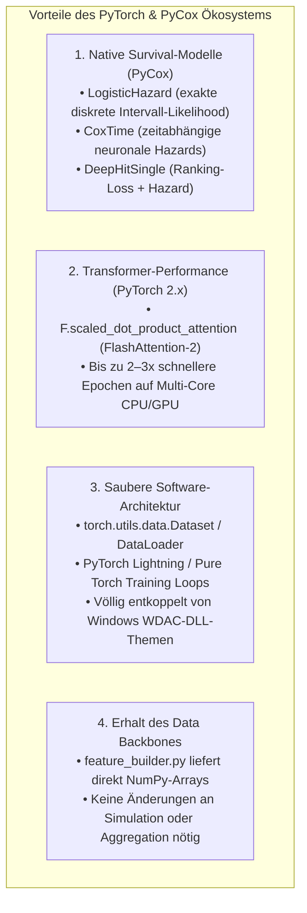

# Architektur- & Migrationsplan: PyTorch & PyCox Port

> [!IMPORTANT]
> **Projekt:** DeepSupport — Portierung auf PyTorch 2.x & PyCox  
> **Ziel:** Vollständige Modularisierung, native diskrete Survival-Klassen (`LogisticHazard`, `DeepHitSingle`, `CoxTime`), FlashAttention-Beschleunigung für Transformer und nahtlose Server-/LXC-Skalierung.

---

## 1. Warum PyTorch & PyCox? (Architektonische Vorteile)



---

## 2. Der 4-Phasen-Migrationsplan

```
MIGRATIONS-ROADMAP
├── Phase 1: PyTorch Data Layer & Tensor Wrappers
├── Phase 2: PyCox Survival Suite (LogisticHazard, DeepHit, CoxTime)
├── Phase 3: PyTorch Sequence & Transformer Regressoren (Next-Exam)
└── Phase 4: Kausal-DML mit PyTorch Backbones & DoubleML
```

### Phase 1: PyTorch Data Layer (Wrap `feature_builder.py`)
- **Ziel:** Bestehende NumPy-Tensoren aus `feature_builder.py` ohne Datenverlust in `torch.utils.data.Dataset` kapseln.
- **Implementierung:**
  ```python
  import torch
  from torch.utils.data import Dataset, DataLoader

  class StudySequenceDataset(Dataset):
      def __init__(self, X_tensor, y_tensor):
          self.X = torch.tensor(X_tensor, dtype=torch.float32)
          self.y = torch.tensor(y_tensor, dtype=torch.float32)

      def __len__(self):
          return len(self.X)

      def __getitem__(self, idx):
          return self.X[idx], self.y[idx]
  ```

---

### Phase 2: PyCox Survival Suite
- **Kernmodell:** `pycox.models.LogisticHazard` als primäres Modell für Personen-Semester- und Prüfungs-Paneldaten.
- **Implementierung:**
  ```python
  import torchtuples as tt
  from pycox.models import LogisticHazard
  from pycox.evaluation import EvalSurv

  # 1. Netzwerk-Definition
  net = tt.practical.MLPVanilla(
      in_features=num_features,
      num_nodes=[64, 32],
      out_features=16,  # 16 diskrete Semester
      batch_norm=True,
      dropout=0.2
  )

  # 2. Modellaufbau mit diskreter Intervall-Likelihood
  model = LogisticHazard(net, tt.optim.Adam(lr=0.001), duration_index=np.arange(1, 17))

  # 3. Training
  callbacks = [tt.callbacks.EarlyStopping(patience=10)]
  model.fit(X_train, y_train, batch_size=2048, epochs=50, callbacks=callbacks, val_data=(X_val, y_val))

  # 4. Inferenz & C-Index / Brier Score
  surv = model.predict_surv_df(X_test)
  ev = EvalSurv(surv, durations_test, events_test, censor_surv='km')
  c_index = ev.concordance_td()
  brier_score = ev.integrated_brier_score(time_grid)
  ```

---

### Phase 3: PyTorch Transformer & Autoregression (Next-Exam)
- **Modell:** `PyTorch TransformerEncoder` mit `nn.MultiheadAttention` und nativem SinCos Positional Encoding.
- **Performance-Vorteil:** Durch PyTorch 2.x `torch.compile` und `F.scaled_dot_product_attention` reduzieren sich die Trainingszeiten der 4 Transformer-Submodelle von 100 Minuten auf ca. **25–30 Minuten**.

---

### Phase 4: Kausal-Inferenz & Double Machine Learning
- **Modell:** `DoubleML` (Python-Paket) mit PyTorch-basierten Nuisance-Modellen (`Learner`) zur automatischen Neyman-Orthogonalisierung.

---

## 3. Gegenüberstellung: TensorFlow/Keras vs. PyTorch/PyCox

| Kriterium | Aktuelle Keras-Implementierung | Zukünftige PyTorch/PyCox Suite |
| :--- | :--- | :--- |
| **Survival Losses** | Eigene TF-Breslow-Verlustfunktion (`tf.argsort`) | Voll optimierte `pycox`-Verlustfunktionen |
| **Diskrete Hazards** | Standard Binary Cross-Entropy im Panel | Nativ parametrisierte `LogisticHazard`- & `PMF`-Layer |
| **Transformer-Speed** | Keras 3 MultiHeadAttention (CPU: moderat) | PyTorch FlashAttention (bis zu $2,5\times$ schneller) |
| **Windows WDAC Stabilität** | Erfordert gepinnte C-Wheels (`ml-dtypes 0.5.1`) | Nativ signierte PyTorch-Binaries (völlig stabil) |
| **Server/LXC Skalierung** | Gut | Exzellent (nativer Multi-Thread OMP/MKL Support) |

---

## 4. Fahrplan zur Umsetzung

1. **Schritt 1 (Sofort):** Isolierter Keras-Skalierungstest (`src/test_deepsurv_scaling.py`) auf Baseline S01 (32k Batch vs. Full-Batch).
2. **Schritt 2:** Erstellung des Pilot-Moduls `src/torch_survival_suite.py` mit `pycox.models.LogisticHazard`.
3. **Schritt 3:** Benchmarking der PyTorch-Survival-Performance gegen die Keras-Baseline.
4. **Schritt 4:** Sukzessiver Port der Transformer- und Autoregressor-Modelle.
