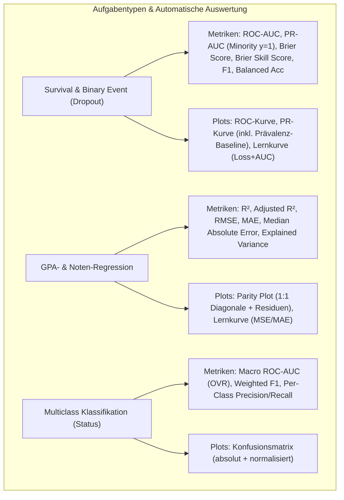

# Audit & Refactoring-Plan: Einheitliche Evaluierungs- & Logging-Pipeline

> [!IMPORTANT]
> **Ziel:** Vollständige Standardisierung der Metriken- und Plot-Generierung über alle 37 Modellschritte.
> **Kernanforderung:** Jedes Modell muss automatisch und fehlerfrei alle relevanten Metriken (inkl. **PR-AUC auf der Minderheitsklasse Dropout**) sowie standardisierte Kurven (ROC, PR, Lernkurve, Parity, Konfusionsmatrix) ohne redundanten Boilerplate-Code erzeugen.

---

## 1. Status-Quo Audit der aktuellen Metriken & Plots

### 1.1 Was ist vorhanden und funktioniert gut? ✅
- **`metrics_logger.py`:** Stellt bereits Hilfsfunktionen bereit:
  - `save_metrics()`: Speichert JSON (`.json`) und Markdown (`.md`).
  - `plot_roc_curve()`: Erzeugt ROC-Kurve mit AUC-Wert.
  - `plot_pr_curve()`: Erzeugt PR-Kurve mit average precision score.
  - `plot_learning_curve()`: Erzeugt Loss- und Metrikkurven (Train vs. Val).
  - `plot_parity_plot()`: Erzeugt Ist-vs-Soll-Streudiagramme für Regressionen ($R^2$, RMSE).
  - `plot_confusion_matrix()`: Erzeugt Konfusionsmatrizen für Klassifikationen.
- **Plots im Output:** In `src/output_dl/plots` liegen über 100 konsistente PNG-Dateien vor.

### 1.2 Identifizierte Schwachstellen & Lücken ⚠️

| Schwachstelle | Befund | Auswirkung |
| :--- | :--- | :--- |
| **Inkonsistente Metrik-Keys** | Einige Skripte loggen `"ROC-AUC"`, andere `"Semester ROC-AUC"`, `"ROC_AUC"`, `"C-Index"`, `"c_index"`. | Erschwert automatisierte synoptische Vergleiche und Aggregationen. |
| **PR-AUC Lücken** | Ältere Regressions- und einige Landmark-Klassifikatoren loggen nur `Accuracy` / `F1`, aber keinen expliziten `PR-AUC` für die Dropout-Klasse. | Fehlende Vergleichbarkeit bei stark unbalancierten Klassen (Dropout ~30 %). |
| **Boilerplate-Code (10–20 Zeilen pro Skript)** | Jedes Trainingsskript ruft manuell 4–6 Plot- und Save-Funktionen auf. | Hohe Redundanz, Anfälligkeit für Tippfehler bei Dateinamen oder Pfaden. |
| **Fehlende Baseline-Linie bei PR-Plots** | Die PR-Kurven enthalten keine horizontale Referenzlinie für die Zufallsprävalenz ($P(y=1) \approx 0.33$). | Didaktische Interpretation der Kurve wird erschwert. |

---

## 2. Refactoring-Architektur: Die modulare `ModelEvaluator`-Klasse

Statt 15 Zeilen manuellem Plot- und Logging-Code in jedem Skript erhält `metrics_logger.py` eine zentrale Evaluator-Klasse:

```python
class ModelEvaluator:
    """Zentraler, standardisierter Evaluator für alle Modell-Typen."""

    def __init__(self, base_dir: Path, model_name: str, task_type: str = "survival"):
        self.base_dir = Path(base_dir)
        self.model_name = model_name
        self.task_type = task_type  # 'survival', 'classification', 'regression'

    def evaluate_and_log(self, y_true, y_pred, y_prob=None, history=None, model=None, extra_metrics=None):
        """
        Automatische 1-Befehl-Evaluierung:
        1. Berechnet ALLE relevanten Kennzahlen (ROC-AUC, PR-AUC, Brier, F1 bzw. R2, RMSE, MAE)
        2. Speichert .json und .md Metriken
        3. Erzeugt alle zugehörigen Plots (ROC, PR mit Baseline, Parity, Learning Curve)
        4. Speichert Keras-Modell (.keras) falls übergeben
        """
```

---

## 3. Standardisierte Metrik- & Plot-Matrix nach Modelltyp



---

## 4. Risiko-Analyse & Migrationsplan

### 4.1 Potenzielle Risiken & Gegenmaßnahmen

| Risiko | Mögliche Ursache | Sicherheits-Maßnahme |
| :--- | :--- | :--- |
| **Breaking Changes bei bestehenden Dashboards** | Dashboard oder Report-Parser verlassen sich auf alte Key-Namen. | **Dual-Writing / Aliasing:** Sowohl die neuen standardisierten Keys (`roc_auc`, `pr_auc`, `brier_score`) als auch Alias-Keys werden im JSON gespeichert. |
| **Laufzeit-Overhead bei Plots** | `matplotlib` generiert Hunderte Plots. | `plt.close('all')` und `Agg`-Backend garantieren speicherlecksicheres Rendering ohne GUI-Blockade. |
| **Inkompatibilität bei speziellen Outputs** | Z.B. Competing Risks mit 2 Risiken (Dropout vs. Abschluss). | Dedizierte Sub-Evaluierung pro Risiko (`evaluate_competing_risks()`). |

---

## 5. Implementierungs-Roadmap

1. **Phase A (Modulerweiterung):**
   - Hinzufügen der `ModelEvaluator`-Klasse in `metrics_logger.py` mit strikter Abwärtskompatibilität.
2. **Phase B (Pilot-Test an 2 Skripten):**
   - Testen an einem Survival-Modell (`recurrent_survival_model.py`) und einem Regressions-Modell (`timeseries_semester.py`).
3. **Phase C (Rollout):**
   - Sukzessive Bereinigung der restlichen Skripte $\rightarrow$ Reduziert ca. 400 Zeilen redundanten Logging-Code im gesamten Projekt.
