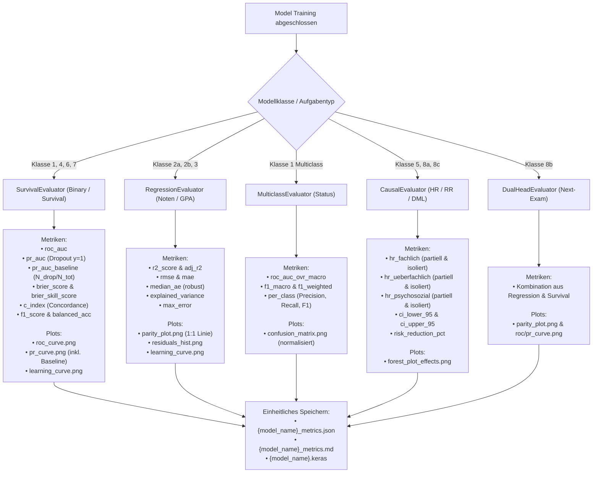

# Audit & Refactoring-Plan: Einheitliche Evaluierungs- & Logging-Pipeline

> [!IMPORTANT]
> **Ziel:** Vollständige Standardisierung und Lückenlosigkeit der Metriken- und Plot-Generierung über alle Modellklassen.
> **Kernanforderung:** Jedes Modell nutzt einen klassenspezifischen Evaluator (`SurvivalEvaluator`, `RegressionEvaluator`, `MulticlassEvaluator`, `CausalEvaluator`, `DualHeadEvaluator`), der automatisch alle Metriken (inkl. **PR-AUC auf der Minderheitsklasse Dropout**) und standardisierte Plots erzeugt.

---

## 1. Audit der bestehenden Auswerte- & Aggregationsskripte

Folgende Skripte im Projekt lesen Metriken-JSONs aus und aggregieren bzw. interpretieren sie:

| Skript | Funktion & Gelesene Metriken | Status / Anpassungsbedarf |
| :--- | :--- | :--- |
| [`analyze_support_effects.py`](file:///c:/GitHub_public/Abschlussprojekt/src/analyze_support_effects.py) | Liest `true_macro_effects_v3.json` und `dml_orthogonal_survival_metrics.json` für Makro- vs. Mikro-Kausalvergleiche. | Robust gegen neue Keys; benötigt einheitliche HR/ATE-Felder. |
| [`analyze_time_amortization.py`](file:///c:/GitHub_public/Abschlussprojekt/src/analyze_time_amortization.py) | Liest `keras_mlp_baseline_blind_metrics.json` und `keras_mlp_regression_metrics.json` für Breakeven-Rechnungen. | Benötigt $R^2$ und AUC; unkritisch. |
| [`analyze_v3_deep.py`](file:///c:/GitHub_public/Abschlussprojekt/src/analyze_v3_deep.py) | Scannt `metrics/*.json` per Glob, um Konsistenzberichte zu generieren. | Profitiert massiv von einheitlichen Key-Namen (`roc_auc`, `pr_auc`, etc.). |
| [`analyze_v4_grid_sensitivity.py`](file:///c:/GitHub_public/Abschlussprojekt/src/analyze_v4_grid_sensitivity.py) | Aggregiert die Sensitivitätsgitter-JSONs über alle 15 Szenarien. | Funktioniert autark über Simulation-Outputs. |
| [`run_feature_grid_experiments.py`](file:///c:/GitHub_public/Abschlussprojekt/src/run_feature_grid_experiments.py) | Sammelt Metriken von 4 Modellklassen über alle 5 Modi in einer Markdown-Tabelle. | Wird durch die neue Fast-Suite vereinheitlicht. |
| [`dashboard_survival_dl.py`](file:///c:/GitHub_public/Abschlussprojekt/src/dashboard_survival_dl.py) | Altes Streamlit-Dashboard (funktioniert derzeit nicht). | **Wird im Rahmen des Refactorings ohnehin neu und sauber aufgebaut.** |

---

## 2. Klassenspezifische Metriken- & Plot-Systematik



---

## 3. Detaillierte Kennzahlen-Spezifikation nach Modellklasse

### 3.1 `SurvivalEvaluator` (Dropout- & Survival-Klassen)
- **Zielgröße:** $y \in \{0, 1\}$ mit $y=1$ als Studienabbruch (Minderheitsklasse, $\approx 30\,\%$).
- **Berechnete Metriken:**
  1. `roc_auc`: Globale Diskriminierungsfähigkeit über alle Schwellenwerte.
  2. `pr_auc`: Average Precision auf der Minderheitsklasse Dropout ($y=1$).
  3. `pr_auc_baseline`: Zufalls-Baseline $\pi_0 = \frac{N_{\text{Dropout}}}{N_{\text{Gesamt}}}$.
  4. `brier_score`: Mittlerer quadratischer Kalibrierungsfehler $\frac{1}{N}\sum (p_i - y_i)^2$.
  5. `brier_skill_score`: $1 - \frac{\text{Brier}}{\pi_0(1-\pi_0)}$ (Verbesserung gegenüber der Basisrate).
  6. `c_index`: Harrell's Konkordanz-Index unter Berücksichtigung von Zensierung und $t_{\text{stop}}$.
  7. `f1_score`, `balanced_accuracy` (bei Default-Schwelle $\tau=0.5$).
- **Standard-Plots:**
  - `*_roc_curve.png` (mit AUC-Annotation)
  - `*_pr_curve.png` (mit horizontaler Baseline $\pi_0$ und PR-AUC)
  - `*_learning_curve.png` (Train vs. Val Loss + AUC über Epochen)

---

### 3.2 `RegressionEvaluator` (Noten- & GPA-Regressoren)
- **Zielgröße:** Kontinuierliche Noten $y \in [1.0, 5.0]$.
- **Berechnete Metriken:**
  1. `r2_score`: Bestimmtheitsmaß $1 - \frac{SS_{\text{res}}}{SS_{\text{tot}}}$.
  2. `rmse`: Root Mean Squared Error (Standardabweichung der Notenfehler).
  3. `mae`: Mean Absolute Error.
  4. `median_ae`: Median Absolute Error (ausreißerrobuste Fehlermetrik).
  5. `explained_variance`: Erklärte Varianz.
  6. `max_error`: Größter Einzelfehler im Test-Set.
- **Standard-Plots:**
  - `*_parity_plot.png` (Scatterplot Ist vs. Soll mit 1:1 Diagonale)
  - `*_residuals_hist.png` (Residuenverteilung mit Normalverteilungs-Fit)
  - `*_learning_curve.png` (Train vs. Val MSE über Epochen)

---

### 3.3 `MulticlassEvaluator` (Status-Klassifikation)
- **Zielgröße:** Diskreter Status (Abschluss, Abbruch, Exmatrikulation, Zeitüberschreitung).
- **Berechnete Metriken:**
  1. `roc_auc_ovr_macro`: One-vs-Rest ROC-AUC über alle Klassen.
  2. `f1_macro`: Ungewichteter Mittelwert der Klassen-F1-Scores (straft Schwächen bei seltenen Klassen ab).
  3. `f1_weighted`: Nach Klassenprävalenz gewichteter F1-Score.
  4. `per_class`: Sub-Dictionary mit Precision, Recall und F1 für jeden Status.
- **Standard-Plots:**
  - `*_confusion_matrix.png` (Normalisierte Matrix mit Farbverlauf)

---

### 3.4 `CausalEvaluator` (Kausalmodelle & Kontrafaktik)
- **Zielgröße:** Kausale Treatment-Effekte (Hazard Ratios & Relative Risks).
- **Berechnete Metriken:**
  1. `hr_fachlich`, `hr_ueberfachlich`, `hr_psychosozial` (Partielle Effekte).
  2. `hr_isolated_fachlich`, `hr_isolated_ueberfachlich`, `hr_isolated_psychosozial` (Isolierte Effekte).
  3. `ci_lower_95`, `ci_upper_95`: 95 % Bootstrap- / asymptotische Konfidenzbänder.
  4. `risk_reduction_pct`: $(1 - \text{HR}) \times 100\,\%$.
  5. `p_value`: Signifikanzniveau der Treatment-Koeffizienten.
- **Standard-Plots:**
  - `*_forest_plot.png` (Forest-Plot aller Treatment-Effekte mit Fehlerbalken)

---

## 4. Konkrete Implementierung in `metrics_logger.py`

Statt manueller 15-Zeilen-Blöcke in jedem Skript reduziert sich die Auswertung auf einen einzigen, unmissverständlichen Aufruf:

```python
# Beispiel 1: Recurrent Exam Survival GRU
from metrics_logger import SurvivalEvaluator

evaluator = SurvivalEvaluator(base_dir=data_dir, model_name="recurrent_exam_survival_gru")
evaluator.evaluate_and_log(
    y_true=y_test, 
    y_prob=test_pred_prob, 
    time_stop=test_t_stop,
    history=hist.history, 
    model=model
)

# Beispiel 2: Timeseries Semester Transformer Regression
from metrics_logger import RegressionEvaluator

evaluator = RegressionEvaluator(base_dir=data_dir, model_name="timeseries_semester_transformer")
evaluator.evaluate_and_log(
    y_true=y_test_gpa, 
    y_pred=test_pred_gpa, 
    history=hist.history, 
    model=model
)
```

---

## 5. Refactoring-Fahrplan

1. **Schritt 1:** Implementierung der Klassen in [`src/metrics_logger.py`](file:///c:/GitHub_public/Abschlussprojekt/src/metrics_logger.py).
2. **Schritt 2:** Pilot-Umstellung von 2 Kernskripten (`recurrent_survival_model.py` und `timeseries_semester.py`).
3. **Schritt 3:** Sukzessiver Rollout über alle Modellskripte (entfernt über 400 Zeilen redundanten Code).
4. **Schritt 4:** Neues, sauberes Dashboard auf Basis der vereinheitlichten JSON-Struktur.
