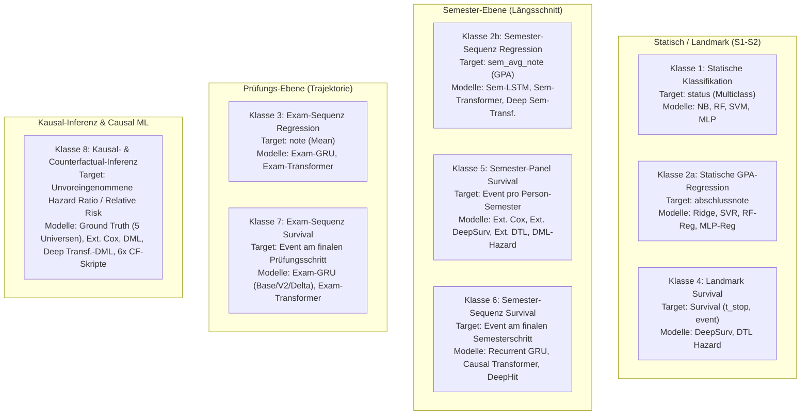

# Vollständiges Skript-Register & Modellarchitektur-Handbuch

**Projekt:** DeepSupport – Causal Machine Learning & Survival Analysis in Higher Education (V3.3)  
**Datum:** 21. August 2026  
**Status:** Vollständige Inventarisierung aller 69 Python-Skripte (`src/*.py`)

---

## 1. Übersicht der Codebasis nach Kategorien

Die Codebasis im Verzeichnis `c:\GitHub_public\Abschlussprojekt\src\` umfasst insgesamt **69 Python-Dateien**, die sich in 5 funktionale Hauptgruppen unterteilen:

```
GESAMT: 69 PYTHON-SKRIPTE
├── A. Modell-Trainings- & Schätzskripte (25 Skripte)
│   ├── Statische Klassifikatoren & Regressoren (4 Skripte)
│   ├── Semester-Sequenz & Zeitreihen (5 Skripte)
│   ├── Exam-Sequenz & Prüfungs-Trajektorien (5 Skripte)
│   ├── Landmark- & Panel-Survival (5 Skripte)
│   └── Causal ML, DML & Transformer-Architekturen (6 Skripte)
│
├── B. Counterfactual- & Kausal-Inferenzskripte (13 Skripte)
│   ├── Landmark- & Panel-Inferenz (4 Skripte)
│   ├── Semester-Sequenz Inferenz (5 Skripte)
│   └── Exam-Sequenz Inferenz (4 Skripte)
│
├── C. Simulation, Universen & Datenvalidierung (6 Skripte)
│   ├── Simulationskerne V1, V2, V3.3 (3 Skripte)
│   ├── Ground-Truth & Makro-Effekte (1 Skript)
│   └── Export, Aggregation & Validierung (2 Skripte)
│
├── D. Spezialisierte empirische Analyseskripte (12 Skripte)
│   ├── Support-, Noten- & Breakeven-Analysen (4 Skripte)
│   ├── Überlastungs-, Abwurf- & Zeitbudget-Analysen (4 Skripte)
│   └── Mechanik-, Exmatrikulations- & Kalibrierungsanalysen (4 Skripte)
│
└── E. Orchestrierung, Dashboards & Hilfsmodule (13 Skripte)
    ├── Master-Runner & Nachtlauf-Steuerung (3 Skripte)
    ├── Dashboards & Visualisierung (3 Skripte)
    └── Konfiguration, Metrics-Logger & Utilities (7 Skripte)
```

---

## 2. Detailliertes Register: Modell-Trainingsskripte (Kategorie A)

### A1. Statische Klassifikation & Regression (Landmark S1–S2)

#### 1. [`train_mlp_baseline.py`](file:///c:/GitHub_public/Abschlussprojekt/src/train_mlp_baseline.py)
- **Funktion:** Trainiert 4 statistische und neuronale Baseline-Klassifikatoren auf dem statischen Studierenden-Querschnitt. Unterstützt einen `blind=True`-Modus zur Vermeidung von Leistungs- und Notenbias.
- **Trainierte Modelle:**
  1. `GaussianNB` (Naive Bayes)
  2. `RandomForestClassifier` (100 Bäume, max_depth=12)
  3. `SVC` (RBF-Kernel, C=1.0, Probability=True)
  4. `Keras MLP Classifier` (Dense(64) $\rightarrow$ LayerNorm $\rightarrow$ Dropout(0.3) $\rightarrow$ Dense(32) $\rightarrow$ Dense(K, Softmax))
- **Features:** 11 Merkmale (`hzb_note`, `erwerbstaetigkeit_std`, `erstakademiker`, `stg_name`, `hzb_typ`, `AVG_note_sem1-2`, `AVG_cp_sem1-2`, `fehlversuche_sem12`, `Fach_supp_sem12`, `Uebf_supp_sem12`, `Psych_supp_sem12`). Im Blind-Modus werden Notenfeatures maskiert.
- **Target:** `status` (Mehrklassen-Ziel: `abgeschlossen`, `abgebrochen`, `exmatrikuliert`, `zeitueberschreitung`).
- **Datenquelle:** `output_dl/agg_abschluesse.csv`
- **Output:** `output_dl/metrics/*_baseline_metrics.json` und `output_dl/models/mlp_baseline_classification.keras`.

#### 2. [`train_mlp_regression.py`](file:///c:/GitHub_public/Abschlussprojekt/src/train_mlp_regression.py)
- **Funktion:** Trainiert statische Regressionsmodelle zur Vorhersage der finalen Abschlussnote auf Basis früher Studienleistungen.
- **Trainierte Modelle:**
  1. `Ridge(alpha=1.0)` (Lineare Regression)
  2. `SVR(kernel='rbf', C=1.0)` (Support Vector Regression)
  3. `RandomForestRegressor(n_estimators=100)`
  4. `Keras MLP Regressor` (Dense(64) $\rightarrow$ LayerNorm $\rightarrow$ Dropout(0.2) $\rightarrow$ Dense(32) $\rightarrow$ Dense(1, linear))
- **Features:** Identisch mit `train_mlp_baseline.py` (Demographie + S1–S2 Performance).
- **Target:** `abschlussnote` (Abschlussnote der Absolventen bzw. imputiert).
- **Datenquelle:** `output_dl/agg_abschluesse.csv`
- **Output:** `output_dl/metrics/*_regression_metrics.json` und `output_dl/models/mlp_baseline_regression.keras`.

---

### A2. Semester-Sequenz- & Zeitreihenmodelle

#### 3. [`timeseries_semester.py`](file:///c:/GitHub_public/Abschlussprojekt/src/timeseries_semester.py)
- **Funktion:** Standard-Referenzimplementierung für zeitliche Sequenzmodellierung auf Semesterebene mittels rekurrentem LSTM.
- **Trainiertes Modell:** `Semester-LSTM` (Masking(-99.0) $\rightarrow$ LSTM(64, seq=True) $\rightarrow$ Dropout(0.3) $\rightarrow$ LSTM(32) $\rightarrow$ Dense(1, linear)).
- **Features:** 7 zeitvariable Merkmale pro Semester (`sem_cp_earned`, `sem_cp_attempted`, `sem_fail_count`, `sem_support_fachlich_relevant`, `sem_support_fachlich_sonst`, `sem_support_ueberfachlich`, `sem_support_psychosozial`) + 5 statische Merkmale (`hzb_note`, `erwerbstaetigkeit_std`, `erstakademiker`, `stg_name`, `hzb_typ`).
- **Target:** `sem_avg_note` (Gesamt-Notendurchschnitt GPA über alle Semester).
- **Datenquelle:** Alle 8 relationalen Primärtabellen (`studierende.csv`, `module.csv`, `einschreibungen.csv`, `pruefungen.csv`, `support_angebote.csv`, `support_teilnahmen.csv`, `support_modul_zuordnung.csv`, `studiengaenge.csv`).
- **Output:** `output_dl/metrics/timeseries_semester_lstm_metrics.json`, `output_dl/models/timeseries_semester_lstm.keras`.

#### 4. [`timeseries_semester_transformer.py`](file:///c:/GitHub_public/Abschlussprojekt/src/timeseries_semester_transformer.py)
- **Funktion:** Transformer-basierte Semester-Zeitreihenregression unter Nutzung der identischen Datenpipeline aus `timeseries_semester.py`.
- **Trainiertes Modell:** `Semester-Transformer Regressor` (Dense(64) $\rightarrow$ 2 gestapelte Transformer Encoder-Blöcke mit MultiHeadAttention(4 Heads) + FFN $\rightarrow$ GlobalAveragePooling1D $\rightarrow$ Dense(32) $\rightarrow$ Dense(1, linear)).
- **Features & Target:** Exakt identisch mit `timeseries_semester.py` (Vollständige Äquivalenz der Klasse 2b).
- **Output:** `output_dl/metrics/timeseries_semester_transformer_metrics.json`, `output_dl/models/timeseries_semester_transformer.keras`.

#### 5. [`recurrent_survival_model.py`](file:///c:/GitHub_public/Abschlussprojekt/src/recurrent_survival_model.py)
- **Funktion:** Rekurrentes Survival-Modell auf Semesterebene mit `TimeDistributed`-Hazard-Prediction zur kontinuierlichen Dropout-Früherkennung. Unterstützt `blind=True`.
- **Trainiertes Modell:** `Recurrent Survival GRU` (Masking(-99.0) $\rightarrow$ GRU(32, seq=True) $\rightarrow$ LayerNorm $\rightarrow$ Dropout(0.2) $\rightarrow$ TimeDistributed(Dense(16)) $\rightarrow$ TimeDistributed(Dense(1, Sigmoid))).
- **Features:** 8 Merkmale pro Zeitschritt (`sem_gpa`, `sem_cp`, `sem_fails`, `fach_supp_cum`, `uebf_supp_cum`, `psych_supp_cum`, `hzb_note`, `erwerbstaetigkeit_std`).
- **Target:** Binary Dropout Event am finalen Semesterschritt ($y_{i,t}=1.0$ bei Abbruch).
- **Datenquelle:** `agg_abschluesse.csv`, `agg_pruefungen.csv`.
- **Output:** `output_dl/metrics/recurrent_survival_gru_metrics.json` (bzw. `*_blind_metrics.json`), `output_dl/models/recurrent_survival_gru.keras`.

#### 6. [`recurrent_survival_model_delta.py`](file:///c:/GitHub_public/Abschlussprojekt/src/recurrent_survival_model_delta.py)
- **Funktion:** Semester-Survival-Modell erweitert um Leistungsdeltas und aktiven Semester-Support.
- **Features:** 9 Merkmale (`sem_gpa`, `sem_cp`, `sem_fails`, `cp_rueckstand`, `fach_act`, `uebf_act`, `psych_act`, `hzb_note`, `erwerbstaetigkeit_std`).
- **Output:** `output_dl/metrics/recurrent_survival_model_delta_metrics.json`, `output_dl/models/recurrent_survival_model_delta.keras`.

#### 7. [`transformer_survival_model.py`](file:///c:/GitHub_public/Abschlussprojekt/src/transformer_survival_model.py)
- **Funktion:** Causal Transformer für Survival-Analyse auf Semesterebene mit kausaler Attention-Maske (`use_causal_mask=True`) und Positionskodierung.
- **Trainiertes Modell:** `Causal Transformer Survival` (PositionalEncoding $\rightarrow$ MultiHeadAttention(4 Heads) $\rightarrow$ TimeDistributed(Dense(1, Sigmoid))).
- **Features & Target:** Identisch mit `recurrent_survival_model.py` (8 Merkmale).
- **Output:** `output_dl/metrics/transformer_survival_metrics.json`, `output_dl/models/transformer_survival.keras`.

#### 8. [`dynamic_deephit_model.py`](file:///c:/GitHub_public/Abschlussprojekt/src/dynamic_deephit_model.py) & [`dynamic_deephit_delta_model.py`](file:///c:/GitHub_public/Abschlussprojekt/src/dynamic_deephit_delta_model.py)
- **Funktion:** Multi-Task Deep Survival Modellierung konkurrierender Risiken (*Competing Risks*): Ursache 1 = Studienabbruch vs. Ursache 2 = Regulärer Studienabschluss.
- **Architektur:** Gemeinsames GRU-Backbone $\rightarrow$ Zwei getrennte `TimeDistributed`-Ausgabeköpfe (`dropout_head` und `graduation_head`).
- **Features:** 8 bzw. 9 Semester-Merkmale.
- **Output:** `output_dl/metrics/dynamic_deephit_*_metrics.json`, `output_dl/models/dynamic_deephit_*.keras`.

---

### A3. Exam-Sequenz- & Prüfungs-Trajektorienmodelle

#### 9. [`timeseries_exam.py`](file:///c:/GitHub_public/Abschlussprojekt/src/timeseries_exam.py)
- **Funktion:** Modellierung des Notenverlaufs auf Ebene der einzelnen Prüfungen ($k = 1 \dots K_i$) via Prüfungs-GRU.
- **Features:** 12 sequenzielle Merkmale (`fachsemester`, `versuch`, `cp`, `schwierigkeit`, 6x Support-Merkmale vor/gleichzeitig, `fails_cum_lag`, `cp_cum_lag`, `support_genutzt`) + 5 statische Demographiemerkmale.
- **Target:** Prüfungsnote (`note`).
- **Output:** `output_dl/metrics/timeseries_exam_gru_metrics.json`, `output_dl/models/timeseries_exam_gru.keras`.

#### 10. [`timeseries_exam_transformer.py`](file:///c:/GitHub_public/Abschlussprojekt/src/timeseries_exam_transformer.py)
- **Funktion:** Transformer-Regressor auf Prüfungsebene unter Nutzung derselben Pipeline wie `timeseries_exam.py`.
- **Output:** `output_dl/metrics/timeseries_exam_transformer_metrics.json`, `output_dl/models/timeseries_exam_transformer.keras`.

#### 11. [`recurrent_exam_survival.py`](file:///c:/GitHub_public/Abschlussprojekt/src/recurrent_exam_survival.py)
- **Funktion:** Basis-Prüfungs-Survival GRU. Verfolgt das Ausfallrisiko Prüfung für Prüfung.
- **Features:** 6 Merkmale (`versuch`, `schwierigkeit`, `cp`, `fach_supp_cum`, `uebf_supp_cum`, `psych_supp_cum`).
- **Target:** Event-Signal beim finalen Prüfungsschritt bei Abbrechern.
- **Output:** `output_dl/metrics/recurrent_exam_survival_metrics.json`, `output_dl/models/recurrent_exam_survival.keras`.

#### 12. [`recurrent_exam_survival_v2.py`](file:///c:/GitHub_public/Abschlussprojekt/src/recurrent_exam_survival_v2.py)
- **Funktion:** Erweiterte Fassung von `recurrent_exam_survival.py` zur Vermeidung von Confounding durch Einbindung rollierender Leistungsindikatoren.
- **Features:** 9 Merkmale (6 Basismerkmale + `fails_cum`, `cp_cum`, `gpa_cum`).
- **Output:** `output_dl/metrics/recurrent_exam_survival_v2_metrics.json`, `output_dl/models/recurrent_exam_survival_v2.keras`.

#### 13. [`recurrent_exam_survival_delta.py`](file:///c:/GitHub_public/Abschlussprojekt/src/recurrent_exam_survival_delta.py)
- **Funktion:** Prüfungs-Survival GRU mit aktiven Semester-Supportflags und Demographie.
- **Features:** 8 Merkmale (`note`, `cp`, `is_fail`, `fach_act`, `uebf_act`, `psych_act`, `hzb_note`, `erwerbstaetigkeit_std`).
- **Output:** `output_dl/metrics/recurrent_exam_survival_delta_metrics.json`, `output_dl/models/recurrent_exam_survival_delta.keras`.

#### 14. [`transformer_exam_survival.py`](file:///c:/GitHub_public/Abschlussprojekt/src/transformer_exam_survival.py)
- **Funktion:** Exam-Level Causal Transformer für Survival-Prognosen mit kausaler Attention-Maskierung.
- **Features:** 6 Merkmale wie Base-GRU.
- **Output:** `output_dl/metrics/transformer_exam_survival_metrics.json`, `output_dl/models/transformer_exam_survival.keras`.

---

### A4. Landmark- & Panel-Survival-Modelle

#### 15. [`deep_survival.py`](file:///c:/GitHub_public/Abschlussprojekt/src/deep_survival.py)
- **Funktion:** Standard-Landmark-Survival-Analyse ab Semester 3 (T0=3). Vergleicht nicht-lineares Neural Cox (`DeepSurv`) mit `Discrete-Time Logistic Hazard`.
- **Trainierte Modelle:**
  1. `DeepSurv Landmark` (Neuronales Cox-Modell mit Breslow Tie-Handling)
  2. `Discrete-Time Logistic Hazard Landmark` (14 Sigmoid-Hazard Ausgänge)
- **Features:** Demographie + Semester-1–2 Leistungs- und Support-Aggregate.
- **Output:** `output_dl/metrics/deepsurv_landmark_metrics.json`, `output_dl/metrics/logistic_hazard_landmark_metrics.json`, `.keras`-Modelle.

#### 16. [`extended_deep_survival.py`](file:///c:/GitHub_public/Abschlussprojekt/src/extended_deep_survival.py) & [`extended_deep_survival_delta.py`](file:///c:/GitHub_public/Abschlussprojekt/src/extended_deep_survival_delta.py)
- **Funktion:** Extended Neural Survival Modelle auf dem vollständigen Längsschnitt-Panel (Counting Process Format $(t_{\text{start}}, t_{\text{stop}}, \text{event}, X_{it})$).
- **Trainierte Modelle:** `Extended DeepSurv Panel/Delta` (Breslow Loss über Person-Semester) und `Extended Logistic Hazard Panel/Delta`.
- **Output:** `output_dl/metrics/extended_deepsurv_*_metrics.json`, `output_dl/metrics/extended_logistic_hazard_*_metrics.json`, `.keras`-Modelle.

#### 17. [`extended_cox_delta.py`](file:///c:/GitHub_public/Abschlussprojekt/src/extended_cox_delta.py) & [`extended_cox_survival.py`](file:///c:/GitHub_public/Abschlussprojekt/src/extended_cox_survival.py)
- **Funktion:** Statistisches Extended Cox Proportional Hazards Modell via `statsmodels.formula.api.phreg` mit zeitveränderlicher Support-Exposition und Leistungs-Deltas.
- **Features:** Formel: `t_stop ~ fach_supp_active + uebf_supp_active + psych_supp_active + fails_prev + delta_cp_prev + cp_rueckstand + hzb_note + erwerbstaetigkeit_std + erstakademiker`.
- **Output:** Parameter-Schätzungen, Schoenfeld-Residuen, `output_dl/metrics/extended_cox_delta_metrics.json`.

#### 18. [`extended_exam_survival.py`](file:///c:/GitHub_public/Abschlussprojekt/src/extended_exam_survival.py)
- **Funktion:** Panel-basiertes Extended Survival Modell auf Ebene von über 800.000 einzelnen Prüfungszeilen.
- **Trainierte Modelle:** Extended Cox, Extended DeepSurv Exam und Extended DTL Hazard Exam.
- **Output:** `output_dl/metrics/extended_logistic_hazard_exam_metrics.json`, `output_dl/metrics/extended_deepsurv_exam_metrics.json`.

---

### A5. Causal ML, DML & Spezial-Transformer

#### 19. [`dml_orthogonal_survival.py`](file:///c:/GitHub_public/Abschlussprojekt/src/dml_orthogonal_survival.py)
- **Funktion:** Double Machine Learning (DML) mit orthogonalisierter Score-Funktion nach Chernozhukov et al.
- **Methodik:**
  - Stage 1: Propensity Score Schätzung via Logistic Regression: $\hat{e}(W) = P(A=1|W)$.
  - Stage 2: Orthogonalisiertes Hazard-Netzwerk auf Confounder-Matrix $W$ und Residuen $\tilde{A} = A - \hat{e}(W)$.
- **Output:** `output_dl/metrics/dml_orthogonal_survival_metrics.json`, `output_dl/models/dml_orthogonal_survival.keras`.

#### 20. [`train_transformer_dml.py`](file:///c:/GitHub_public/Abschlussprojekt/src/train_transformer_dml.py)
- **Funktion:** Hochdimensionales Causal Deep Learning. Nutzt ein tiefes Transformer-Backbone zur Repräsentationserzeugung über die Semesterzeitreihe und schätzt die Kausaleffekte via DML Cross-Fitting.
- **Methodik:** Transformer Latent Features ($h_0 \dots h_{63}$) $\rightarrow$ DML Residual Regression (Ridge / Logistic Regression).
- **Output:** `output_dl/analysis/deep_transformer_dml_results.json`.

#### 21. [`deep_transformer_regression.py`](file:///c:/GitHub_public/Abschlussprojekt/src/deep_transformer_regression.py)
- **Funktion:** Hochkapazitäre Transformer-Architektur ($d_{\text{model}}=128$, 8 Heads, 3 Blöcke, gelerntes `AttentionPooling`) für Semester-GPA-Regression, Exam-Regression und Exam-Survival.
- **Status:** Wird im anstehenden Refactoring vollständig an die kanonischen Datenpipelines der Klassen 2b und 7 angeglichen.
- **Output:** `output_dl/metrics/deep_transformer_regression_metrics.json`.

#### 22. [`train_oracle_models.py`](file:///c:/GitHub_public/Abschlussprojekt/src/train_oracle_models.py)
- **Funktion:** Trainiert Baseline- vs. Oracle-Modelle unter Hinzunahme der latenten Ground-Truth-Variablen (`hidden_motivation_prev`, `hidden_soziale_integration_prev`, `hidden_erwartete_note_prev`) zur Bestimmung des maximalen Information-Lifts.
- **Output:** `output_dl/metrics/oracle_lift.json`.

#### 23. [`train_erwerb_blind_models.py`](file:///c:/GitHub_public/Abschlussprojekt/src/train_erwerb_blind_models.py)
- **Funktion:** DML-Evaluation mit und ohne Berücksichtigung der Erwerbstätigkeit zur Analyse von sozialer Verzerrung und Diskriminierungsfreiheit.

---

## 3. Detailliertes Register: Counterfactual- & Kausal-Inferenzskripte (Kategorie B)

Alle nachfolgenden Skripte implementieren kontrafaktische Simulationen nach dem Potential Outcomes Framework ($Y(1)$ vs. $Y(0)$) auf trainierten Modellen:

| # | Skriptname | Geladenes Keras-Modell | Methodische Vorgehensweise | Output & Ziel |
| :---: | :--- | :--- | :--- | :--- |
| 1 | [`counterfactual_deepsurv.py`](file:///c:/GitHub_public/Abschlussprojekt/src/counterfactual_deepsurv.py) | `deepsurv_landmark.keras` | 100-facher Bootstrap über Testdaten mit modifizierten Support-Indikatoren. | Pseudo-Hazard-Ratios (Mean, 95%-KI) für Landmark-DeepSurv. |
| 2 | [`counterfactual_hr_analyzer.py`](file:///c:/GitHub_public/Abschlussprojekt/src/counterfactual_hr_analyzer.py) | `extended_deepsurv_panel.keras` | Berechnung $HR_i = \exp(h_{i, \text{treat}} - h_{i, \text{ctrl}})$ über alle Person-Semester Zeilen. | Empirische HR-Verteilung (Mean, Median, Q05, Q95). |
| 3 | [`counterfactual_hr_delta.py`](file:///c:/GitHub_public/Abschlussprojekt/src/counterfactual_hr_delta.py) | `extended_deepsurv_delta.keras` | Kontrafaktische HR-Bestimmung auf dem Extended DeepSurv Delta Modell. | Kausale HR-Kennzahlen für das Delta-Modell. |
| 4 | [`counterfactual_rr_logistic_hazard_delta.py`](file:///c:/GitHub_public/Abschlussprojekt/src/counterfactual_rr_logistic_hazard_delta.py) | `extended_logistic_hazard_delta.keras` | Kontrafaktisches Risikoverhältnis $RR_i = p_{i, \text{treat}} / p_{i, \text{ctrl}}$ auf Person-Semester Ebene. | Relative Risiken (Mean, Median, 5%-95% Bandbreite). |
| 5 | [`counterfactual_rr_deephit_delta.py`](file:///c:/GitHub_public/Abschlussprojekt/src/counterfactual_rr_deephit_delta.py) | `dynamic_deephit_delta.keras` | Kontrafaktisches RR auf dem Multi-Task Dropout-Kopf von DeepHit Delta. | Speichert `counterfactual_rr_deephit_delta_metrics.json`. |
| 6 | [`counterfactual_inference_deephit.py`](file:///c:/GitHub_public/Abschlussprojekt/src/counterfactual_inference_deephit.py) | `dynamic_deephit_competing.keras` | Kontrafaktische Hazard-Ratio Analyse auf dem Standard-DeepHit Modell. | Ausgabe der Dropout-Risikoreduktion. |
| 7 | [`counterfactual_deephit_fixed.py`](file:///c:/GitHub_public/Abschlussprojekt/src/counterfactual_deephit_fixed.py) | `dynamic_deephit_competing.keras` | Korrigierte Fassung der DeepHit-Inferenz mit robuster Division ($p_{\text{ctrl}} + \epsilon$). | Speichert `counterfactual_rr_deephit_fixed_metrics.json`. |
| 8 | [`counterfactual_inference_semester_transformer.py`](file:///c:/GitHub_public/Abschlussprojekt/src/counterfactual_inference_semester_transformer.py) | `transformer_survival.keras` | Kontrafaktische HR auf dem Causal Semester-Transformer Survival Modell. | Globale & instanzbasierte HR-Werte. |
| 9 | [`counterfactual_rnn_semester_delta.py`](file:///c:/GitHub_public/Abschlussprojekt/src/counterfactual_rnn_semester_delta.py) | `recurrent_survival_model_delta.keras` | Kontrafaktische RR-Analyse auf dem Semester-GRU Delta Modell. | Speichert `counterfactual_rr_rnn_semester_delta_metrics.json`. |
| 10 | [`counterfactual_inference.py`](file:///c:/GitHub_public/Abschlussprojekt/src/counterfactual_inference.py) | `recurrent_exam_survival.keras` | Kontrafaktische HR-Berechnung auf dem Base Prüfungs-GRU Sequenzmodell. | Evaluierung der Prüfungs-Dropout Dynamik. |
| 11 | [`counterfactual_rr_exam_rnn_delta.py`](file:///c:/GitHub_public/Abschlussprojekt/src/counterfactual_rr_exam_rnn_delta.py) | `recurrent_exam_survival_delta.keras` | Kontrafaktische RR-Berechnung auf dem Prüfungs-GRU Delta Modell. | Speichert `counterfactual_rr_exam_rnn_delta_metrics.json`. |
| 12 | [`counterfactual_rnn.py`](file:///c:/GitHub_public/Abschlussprojekt/src/counterfactual_rnn.py) | `recurrent_exam_survival_v2.keras` | Kontrafaktische Global-Simulation (All-Support vs. No-Support) auf Exam V2. | Konsolenausgabe des aggregierten RR. |
| 13 | [`counterfactual_rnn_delta.py`](file:///c:/GitHub_public/Abschlussprojekt/src/counterfactual_rnn_delta.py) | `recurrent_exam_survival_v2.keras` | Differenzierte RR-Berechnung pro Support-Typ auf Exam V2. | Speichert `counterfactual_rr_rnn_delta_metrics.json`. |

---

## 4. Detailliertes Register: Simulation, Analyse & Hilfsmodule (Kategorien C, D, E)

### C. Simulation & Universen-Generierung
- [`simulation_v3.py`](file:///c:/GitHub_public/Abschlussprojekt/src/simulation_v3.py): **Aktueller Simulationskern (V3.3)** mit 4 isolierten RNG-Streams (`rng_init`, `rng_support`, `rng_social`, `rng_dropout`), positionsunabhängigem Prüfungs-Noise Hash, Carry-Over Support-Mechanik und 5 parallelen Universen (A = Baseline, B = Kein Support, C = Kein Fach-Support, D = Kein ÜF-Support, E = Kein Psych-Support).
- [`simulation_v2.py`](file:///c:/GitHub_public/Abschlussprojekt/src/simulation_v2.py) & [`simulation.py`](file:///c:/GitHub_public/Abschlussprojekt/src/simulation.py): Frühere Simulationskerne (V2 und V1) zur Reproduktion historischer Benchmark-Läufe.
- [`calculate_true_effect.py`](file:///c:/GitHub_public/Abschlussprojekt/src/calculate_true_effect.py): Berechnet die exakte Ground Truth (ATE, ATT, RR) durch kontrafaktischen Abgleich identischer Studierender zwischen Universum A und B/C/D/E.
- [`export.py`](file:///c:/GitHub_public/Abschlussprojekt/src/export.py): Konvertiert simulierte Objektstrukturen in relationale Pandas DataFrames und CSV-Dateien.
- [`aggregate.py`](file:///c:/GitHub_public/Abschlussprojekt/src/aggregate.py): Erzeugt aggregierte Analyse- und Featuretabellen (`agg_abschluesse.csv`, `agg_pruefungen.csv`, `agg_einschreibungen.csv`).
- [`validate.py`](file:///c:/GitHub_public/Abschlussprojekt/src/validate.py): Umfassende Integritätsprüfung aller exportierten CSV-Dateien auf Konsistenz, Wertebereiche und fehlende Werte.

### D. Spezialisierte Analyseskripte
- [`analyze_support_effects.py`](file:///c:/GitHub_public/Abschlussprojekt/src/analyze_support_effects.py): Tiefenanalyse der Support-Nutzung, Selektionseffekte und Teilnahmewahrscheinlichkeiten.
- [`analyze_grade_effects.py`](file:///c:/GitHub_public/Abschlussprojekt/src/analyze_grade_effects.py): Empirische Überprüfung des Noten-Lifts durch fachlichen Support.
- [`plot_breakeven.py`](file:///c:/GitHub_public/Abschlussprojekt/src/plot_breakeven.py) & [`analyze_time_amortization.py`](file:///c:/GitHub_public/Abschlussprojekt/src/analyze_time_amortization.py): Analyse des Trade-Offs zwischen investierter Support-Zeit (30h) und ersparter Prüfungswiederholungszeit.
- [`analyze_overload_victims.py`](file:///c:/GitHub_public/Abschlussprojekt/src/analyze_overload_victims.py) & [`analyze_module_drops.py`](file:///c:/GitHub_public/Abschlussprojekt/src/analyze_module_drops.py): Untersuchung von Studierenden mit Überlastungsstrafen (`overload_penalty`) und Modulabwürfen.
- [`analyze_g1_exmatrikulation_and_workload.py`](file:///c:/GitHub_public/Abschlussprojekt/src/analyze_g1_exmatrikulation_and_workload.py) & [`analyze_exmat_remaining.py`](file:///c:/GitHub_public/Abschlussprojekt/src/analyze_exmat_remaining.py): Analyse von Exmatrikulationen nach 3 Fehlversuchen vs. regulärem Studienabbruch.
- [`analyze_mechanics_deepdive.py`](file:///c:/GitHub_public/Abschlussprojekt/src/analyze_mechanics_deepdive.py), [`analyze_v3_deep.py`](file:///c:/GitHub_public/Abschlussprojekt/src/analyze_v3_deep.py), [`analyze_v3_followup.py`](file:///c:/GitHub_public/Abschlussprojekt/src/analyze_v3_followup.py): Validierung der V3.3-Simulationsmechanik und RNG-Synchronisation.
- [`plot_calibration_curves.py`](file:///c:/GitHub_public/Abschlussprojekt/src/plot_calibration_curves.py): Erzeugt Zuverlässigkeitsdiagramme (*Calibration Curves*) und Brier-Score Vergleiche über alle Survival-Modelle.

### E. Orchestrierung & Hilfsmodule
- [`run_fast_suite.py`](file:///c:/GitHub_public/Abschlussprojekt/src/run_fast_suite.py): **Fast Core Suite** (V4.1) — Führt 25+ schlanke Modelle, DML, Landmark & alle 5 Kontrafaktik-Skripte in 15–20 Min. pro Szenario aus.
- [`run_heavy_suite.py`](file:///c:/GitHub_public/Abschlussprojekt/src/run_heavy_suite.py): **Heavy Deep Suite** (V4.1) — Isoliertes Training der großen Deep Transformer- & Autoregressor-Netzwerke (~2.5h, gezielt für Baseline).
- [`run_master_suite.py`](file:///c:/GitHub_public/Abschlussprojekt/src/run_master_suite.py): **Master Suite Orchestrator** (V4.1) — Einheitliche CLI mit `--suite fast|heavy|all`, `--temporal prev|cum`, `--modes`.
- [`run_overnight_v41.py`](file:///c:/GitHub_public/Abschlussprojekt/src/run_overnight_v41.py): Erweiterter 37-Schritte-Runner für vollständige Monolith-Nachtläufe.
- [`run_all_experiments.py`](file:///c:/GitHub_public/Abschlussprojekt/src/run_all_experiments.py): Sequenzieller Master-Runner für alle ML- und DL-Modelltrainings.
- [`run_overnight.py`](file:///c:/GitHub_public/Abschlussprojekt/src/run_overnight.py): Master-Orchestrierung für vollständige Nachtläufe (Simulation $\rightarrow$ Aggregation $\rightarrow$ Training $\rightarrow$ DML $\rightarrow$ Evaluation).
- [`main.py`](file:///c:/GitHub_public/Abschlussprojekt/src/main.py): Einstiegspunkt für Standard-Einzellauf der Basissimulation.
- [`config.py`](file:///c:/GitHub_public/Abschlussprojekt/src/config.py) & [`extract_config.py`](file:///c:/GitHub_public/Abschlussprojekt/src/extract_config.py): Zentrale Konfigurationsparameter (Workload-Schwellen, Support-Boosts, Caps, Semesterdauern).
- [`metrics_logger.py`](file:///c:/GitHub_public/Abschlussprojekt/src/metrics_logger.py): Einheitliche Hilfsfunktionen zum Speichern von Metriken (`.json`, `.md`), Keras-Modellen (`.keras`) und Plots (`.png`).
- [`models.py`](file:///c:/GitHub_public/Abschlussprojekt/src/models.py): Datenklassen und Typdefinitionen der Simulationsagenten (`Studierender`, `Modul`, `Pruefung`, etc.).
- [`dashboard_survival_dl.py`](file:///c:/GitHub_public/Abschlussprojekt/src/dashboard_survival_dl.py) & [`dashboard_educational.py`](file:///c:/GitHub_public/Abschlussprojekt/src/dashboard_educational.py): Interaktive Streamlit-Dashboards zur Exploration der Simulations- und Modellergebnisse.

---

## 5. Das 8-Klassen-Schema zur Modellharmonisierung

Zur Sicherstellung wissenschaftlicher Vergleichbarkeit werden alle Modelle strikt in folgende 8 Klassen gruppiert:



---

## 6. Zusammenfassendes Fazit & Nächste Schritte

Mit dieser systematischen Dokumentation ist die gesamte Struktur der 69 Skripte vollständig erfasst:
1. **Feature-Harmonisierung:** Alle Datenpipelines der Klassen 2b, 6 und 7 werden auf einheitliche Datensätze umgestellt.
2. **Runner-Vervollständigung:** `extended_cox_delta.py`, `recurrent_exam_survival_v2.py` sowie die Counterfactual-Analysen werden fest im Runner verankert.
3. **Reproduzierbarkeit:** Alle Modell-Artefakte, Metriken und Kausalvergleiche folgen ab sofort einem standardisierten, lückenlosen Ablaufschema.
