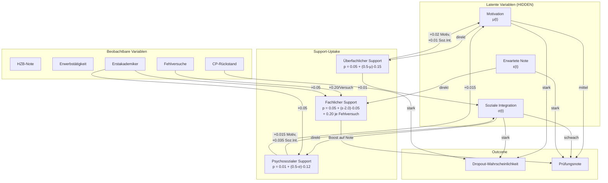

# Selektionsbias in der Supportwirkungsanalyse: Mechanismen, Kontrollstrategien & Verbesserungsvorschläge

**Projekt:** DeepSupport – Kausale Wirksamkeitsanalyse  
**Datum:** 22. August 2026

---

## 1. Wie Selektionsbias in der Simulation entsteht

Die Supportinanspruchnahme in [`simulation_v3.py`](file:///c:/GitHub_public/Abschlussprojekt/src/simulation_v3.py#L171-L204) ist **nicht zufällig**, sondern endogen: Studierende mit schlechteren Startbedingungen suchen häufiger Hilfe. Das erzeugt eine **negative Konfundierung** (Confounding by Indication).

### 1.1 Uptake-Wahrscheinlichkeiten im DGP (Simulationscode)

### 1.2 Mathematische Formulierung des Selektionsmechanismus

Die Uptake-Wahrscheinlichkeiten (Code: [`simulation_v3.py:175–190`](file:///c:/GitHub_public/Abschlussprojekt/src/simulation_v3.py#L175-L190)):

$$p_{\text{fach}}(t) = \text{clip}\Big(0{,}05 + (\varepsilon_i(t) - 2{,}0) \cdot 0{,}05 + 0{,}20 \cdot \mathbb{1}[\text{Fehlversuch}] + 0{,}05 \cdot \mathbb{1}[\text{Erstakademiker}],\ 0,\ 0{,}9\Big)$$

$$p_{\text{uebf}}(t) = \text{clip}\Big(0{,}05 + (0{,}5 - \mu_i(t)) \cdot 0{,}15,\ 0,\ 0{,}9\Big)$$

$$p_{\text{psych}}(t) = \text{clip}\Big(0{,}01 + (0{,}5 - \sigma_i(t)) \cdot 0{,}12 + 0{,}05 \cdot \mathbb{1}[\text{Erstakademiker}],\ 0,\ 0{,}9\Big)$$

> [!IMPORTANT]
> **Kern des Problems:** Die gleichen latenten Variablen ($\mu, \sigma, \varepsilon$), die die **Supportinanspruchnahme** treiben, sind auch direkte Treiber der **Dropout-Wahrscheinlichkeit** und **Prüfungsnoten**. Ohne ihre Beobachtbarkeit bleibt Konfundierung unvermeidlich.

### 1.3 Dropout-Formel und geteilte Treiber

Die Dropout-Wahrscheinlichkeit (Code: [`simulation_v2.py:166–172`](file:///c:/GitHub_public/Abschlussprojekt/src/simulation_v2.py#L166-L172)):

$$p_{\text{drop}}(t) = 0{,}5 \cdot \text{clip}\Big(\underbrace{0{,}01}_{\text{Basis}} + \underbrace{\max(0, 0{,}4 - \mu) \cdot 0{,}30}_{\text{Motivation}} + \underbrace{\max(0, 0{,}4 - \sigma) \cdot 0{,}20}_{\text{Soz. Integration}} + \underbrace{\min(\Delta CP / 30, 1) \cdot 0{,}15}_{\text{CP-Rückstand}} + \underbrace{n_{\text{fail}} \cdot 0{,}04}_{\text{Durchfälle}} + \underbrace{\min(o, 0{,}3) \cdot 0{,}10}_{\text{Overload}},\ 0,\ 0{,}45\Big)$$

| Geteilter Treiber | Treibt Support-Uptake für | Treibt Dropout über | Im Modell beobachtbar? |
|:---|:---|:---|:---:|
| **Motivation** $\mu(t)$ | Überfachlich | Dropout (direkt, Koeffizient 0,30) | ❌ Nein (latent) |
| **Soziale Integration** $\sigma(t)$ | Psychosozial | Dropout (direkt, Koeffizient 0,20) | ❌ Nein (latent) |
| **Erwartete Note** $\varepsilon(t)$ | Fachlich | Prüfungsnoten → Fehlversuche → Dropout | ❌ Nein (latent) |
| **Fehlversuche** | Fachlich (+0,20/Versuch) | Dropout (+0,04/Durchfall) | ✅ Ja (`cum_fails`, `fails_prev`) |
| **Erstakademiker** | Fachlich, Psychosozial (+0,05) | Indirekt (über soz. Integration) | ✅ Ja |
| **HZB-Note** | Indirekt (über $\varepsilon$) | Indirekt (über $\varepsilon$ → Noten → Fails) | ✅ Ja |

---

## 2. Confounding-Kontrollstrategien je Modell

### 2.1 Übersicht der verfügbaren Confounder-Kontrolle

| Modell | Confounder im Feature-Set | Kausale Entzerrung | Kontrollniveau |
|:---|:---|:---|:---:|
| [Extended Cox Panel](file:///c:/GitHub_public/Abschlussprojekt/src/extended_cox_survival.py#L132) | `cum_cp`, `cum_fails`, `hzb_note`, `erwerb`, `erstakademiker` | FWL (linear partialling) | 🟡 Mittel |
| [Extended Cox Delta](file:///c:/GitHub_public/Abschlussprojekt/src/extended_cox_delta.py#L142) | `fails_prev`, `delta_cp_prev`, `cp_rueckstand`, `hzb_note`, `erwerb`, `erstakademiker` | FWL (linear partialling) | 🟡 Mittel |
| [DeepSurv Panel / Delta](file:///c:/GitHub_public/Abschlussprojekt/src/extended_deep_survival_delta.py#L62-L64) | Gleiche obs. Confounder wie Cox Delta + `stg_name` | Keine spezifische | 🔴 Gering |
| [Logistic Hazard Delta](file:///c:/GitHub_public/Abschlussprojekt/src/extended_logistic_hazard_delta.py) | Gleiche obs. Confounder | Keine spezifische | 🔴 Gering |
| [Semester GRU / Transformer](file:///c:/GitHub_public/Abschlussprojekt/src/recurrent_survival_model_delta.py#L58) | `sem_gpa`, `sem_cp`, `sem_fails`, `cp_rueckstand`, `hzb_note`, `erwerb` | Keine (kein `erstakademiker`, kein `stg_name`) | 🔴 Gering |
| [DML Orthogonal](file:///c:/GitHub_public/Abschlussprojekt/src/dml_orthogonal_survival.py#L40-L44) | `hzb_note`, `erwerb`, `erstakademiker`, `stg_name`, `fails_prev`, `delta_cp_prev`, `cp_rueckstand` | Robinson-Residualisierung (Stufe 1 Ridge) | 🟢 Hoch (beobachtbar) |
| [Oracle-Modelle](file:///c:/GitHub_public/Abschlussprojekt/src/train_oracle_models.py) | Alle obs. + `hidden_motivation_prev`, `hidden_soz_int_prev`, `hidden_erwartete_note_prev` | Vollständige Konditionalität | ✅ Maximal |

### 2.2 Warum Deep-Learning-Modelle schlechter entzerren als Cox

Die lineare Cox-Regression profitiert vom **Frisch-Waugh-Lovell-Theorem (FWL)**:

$$\hat{\beta}_{\text{support}} = \frac{\text{Cov}(\tilde{T}, \tilde{X})}{\text{Var}(\tilde{X})}$$

wobei $\tilde{T}$ und $\tilde{X}$ die Residuen nach Herauspartialisierung aller Confounder $W$ sind. In der linearen Spezifikation wird der Treatment-Effekt **analytisch sauber** von den Confoundern isoliert — solange die lineare Spezifikation korrekt ist.

Deep Neural Networks hingegen:
1. **Optimieren auf prädiktive Genauigkeit**, nicht auf kausale Identifikation → der starke prädiktive Beitrag von `cum_fails` und `cp_rueckstand` dominiert die Gewichtsverteilung
2. **Regularisierung (Dropout, LayerNorm) schrumpft schwache Signale**: Die Support-Zählvariablen sind spärlich (>60% der Semester-Zeilen haben Wert 0), während Leistungsvariablen in jedem Zeitschritt variieren
3. **Non-lineare Absorption**: Das Netz lernt, dass Support-Nutzung mit schwachen Studierenden korreliert, und nutzt dies als prädiktives Signal — also genau den Selektionsbias als Feature

> [!NOTE]
> **Extended Cox Panel:** Die auffallend guten Schätzungen ($HR_{\text{fach}} = 0{,}9234$, $HR_{\text{psych}} = 0{,}9005$) sind ein direktes Resultat der analytischen FWL-Entzerrung. Die HRs werden als $\exp(\hat{\beta})$ aus Koeffizienten extrahiert, nicht durch kontrafaktische Simulation gemittelt. Allerdings: Ohne $\mu$, $\sigma$ und $\varepsilon$ im Modell sind auch die Cox-Schätzungen verzerrt — die Verzerrung ist nur weniger stark als bei den Netzen, weil die lineare Spezifikation den Treatment-Effekt nicht durch Interaktionen mit Confoundern absorbiert.

### 2.3 DML: Stärken und Grenzen

Das [DML-Modell](file:///c:/GitHub_public/Abschlussprojekt/src/dml_orthogonal_survival.py) implementiert die Robinson-Residualisierung:

**Stufe 1:** $\hat{A}_i = E[A_i \mid W_i]$ (Ridge auf beobachtbare Confounder)  
**Stufe 2:** $\tilde{A}_i = A_i - \hat{A}_i$ (Residualisierter Treatment)  
**Stufe 3:** Neural Network: $P(\text{event} \mid W, \tilde{A})$

> [!WARNING]
> **Fundamentale Grenze von DML ohne latente Proxies:** Die Orthogonalisierung entfernt nur den durch **beobachtbare** Confounder $W$ erklärten Teil der Treatment-Variation. Da die primären Selektionsvariablen $\mu(t)$, $\sigma(t)$, $\varepsilon(t)$ nicht in $W$ enthalten sind, verbleibt der **residuale Confounding-Anteil** in $\tilde{A}$.
>
> **Ergebnis:** DML korrigiert die Richtung (Fachlich: $RR = 0{,}80$, Psychosozial: $RR = 0{,}91$), überschätzt aber die Effektstärke (Ground Truth: $0{,}96$ bzw. $0{,}95$) oder verfehlt die Richtung (Überfachlich: $RR = 1{,}10$ statt $0{,}94$). Die Überkompensation beim fachlichen Support deutet darauf hin, dass die Ridge-Propensity den beobachtbaren Teil zu aggressiv entfernt und dabei kausale Variation mitabsorbiert.

---

## 3. Oracle-Modelle und die Frage des Ausmaßes

Sie haben zurecht angemerkt, dass die Oracle-Modelle nahezulegen scheinen, die latenten Variablen könnten gut abgeschätzt werden. Hier die Fakten:

| Modell | ROC-AUC | PR-AUC | Lift gegenüber Standard |
|:---|:---:|:---:|:---:|
| Logistic Hazard (Standard) | 0,7617 | — | — |
| Logistic Hazard (Oracle + latent) | 0,7721 | — | **+0,0104** |
| DeepSurv (Standard) | 0,5517 | 0,0523 | — |
| DeepSurv (Oracle + latent) | — | — | gering |

Der geringe AUC-Lift (+0,0104) lässt zwei Interpretationen zu:

1. **Ihre These:** Die latenten Variablen werden durch Proxies (GPA-Trajektorie, Fehlversuchsmuster, CP-Verlauf) bereits gut approximiert → der marginale Informationsgewinn ist klein → die Confounder-Verzerrung durch fehlende Latente ist ebenfalls begrenzt.

2. **Alternative These:** Die AUC misst **prädiktive** Güte (Ranking), nicht **kausale** Identifikation. Ein Modell kann exzellent vorhersagen, wer abbricht (weil GPA, Fails, CP-Rückstand hohe prädiktive Kraft haben), ohne den *kausalen Effekt* von Support korrekt zu identifizieren. Die latenten Variablen sind weniger wichtig für die *Vorhersage*, aber entscheidend für die *Entzerrung*.

> [!TIP]
> **Prüfungsvorschlag:** Um zu klären, welche Interpretation zutrifft, könnte man die kontrafaktischen RR/HR für Oracle-Modelle berechnen (analog zu den bestehenden Counterfactual-Skripten). Wenn die Oracle-HRs deutlich näher an der Ground Truth liegen als die Standard-HRs, bestätigt sich, dass der prädiktive Lift klein, aber der kausale Identifikationslift groß sein kann.

---

## 4. Konkrete Verbesserungsvorschläge

### 4.1 Sofort umsetzbare Maßnahmen

| # | Maßnahme | Effekt | Aufwand |
|:---|:---|:---|:---:|
| 1 | **Fehlende beobachtbare Confounder ergänzen**: `erstakademiker` und `stg_name` in Semester-GRU/Transformer einbauen | Konsistentes Confounder-Set über alle Modelle | Gering |
| 2 | **`stg_name` in Cox-Formel aufnehmen**: Interaktion Studiengang × Support | Studiengangs-spezifische Effekte | Gering |
| 3 | **Oracle-Counterfactuals berechnen**: RR/HR für Oracle-Modelle → kausaler Identifikations-Lift | Klärung der latenten Variablen-Frage | Mittel |
| 4 | **GPA-Trajektorie als Motivations-Proxy**: Sequenz $(\Delta GPA_{t-2}, \Delta GPA_{t-1})$ als zeitverschobener Proxy für Motivationsänderungen | Bessere Annäherung an $\mu(t)$ | Mittel |

### 4.2 Fortgeschrittene kausale Strategien

| # | Strategie | Prinzip | Erwarteter Nutzen |
|:---|:---|:---|:---:|
| 5 | **IPW (Inverse Probability Weighting)** | Gewichtung mit $w_i = 1/\hat{P}(A_i \mid W_i)$ in der Verlustfunktion | Rebalancierung der Treatment-Gruppen auf beobachtbare Confounder |
| 6 | **AIPW (Augmented IPW)** | Doppelt robust: IPW + Outcome-Regression | Konsistente Schätzung, wenn entweder Propensity oder Outcome korrekt |
| 7 | **Marginal Structural Models (MSMs)** | Stabilisierte IPW-Gewichte für zeitveränderliches Treatment | Angemessen für das Panel mit semesterweiser Support-Entscheidung |
| 8 | **Sensitivitätsanalyse (E-Value / Rosenbaum Bounds)** | Quantifizierung: Wie stark müsste unmeasured confounding sein, um die Schätzung zu erklären? | Gibt Vertrauen in die Robustheit der Ergebnisse |
| 9 | **Latent-Variable-Proxies aus dem Aggregator nutzen**: CP-Verlaufsmuster, Prüfungszeitpunkte, Wiederholungsmuster als informative Proxies für $\mu, \sigma$ | Anreicherung des beobachtbaren Confounder-Sets | Hoch |

### 4.3 Anknüpfungspunkte ans Feature-Set

Die Aggregation in [`aggregate.py`](file:///c:/GitHub_public/Abschlussprojekt/src/aggregate.py) erstellt bereits reichhaltige Variablen, die als Motivations-/Integrations-Proxies dienen könnten:

- **`cp_rueckstand`**: Proxy für Leistungsprobleme → korreliert mit $\mu$ und $\varepsilon$
- **`fails_prev`** / **`cum_fails`**: Direkte Fehlversuchszählung → stärkster beobachtbarer Proxy für $\varepsilon$
- **`delta_cp_prev`**: CP-Differenz zum Vorsemester → *Änderungs*proxy für Motivationsschwankungen
- **GPA-Differenz** ($\text{GPA}_t - \text{GPA}_{t-1}$): Bisher nicht als Feature → potenziell starker Proxy für $\Delta\mu$
- **Support-Teilnahme-Sequenz** selbst: Wiederholte Inanspruchnahme über Semester → Längsschnitt-Pattern als Proxy (aber Vorsicht: Feedback-Loop)

> [!IMPORTANT]
> **Empfehlung für die nächste Iteration:** Die vielversprechendste Einzelmaßnahme wäre **Oracle-Counterfactuals** (Punkt 3), da sie unmittelbar klären, ob die kausale Identifikation durch Zugang zu latenten Variablen substantiell besser wird. Wenn ja → Proxy-Strategien (4, 9) priorisieren. Wenn nein → Ihre These ist bestätigt, und der verbleibende Bias ist primär durch Selektionsbias auf *beobachtbaren* Variablen getrieben, den IPW/AIPW (5, 6) adressieren können.

---

## 5. Warum Extended Cox Panel so gut performt

Die [Untersuchung](file:///C:/Users/wilfr/.gemini/antigravity/brain/f4d0d69d-196b-4788-afb6-3572c3825404/.system_generated/logs/transcript.jsonl) hat ergeben:

1. **Analytische HR-Extraktion statt Durchschnittssimulation**: Cox berechnet $\text{HR} = \exp(\hat{\beta})$ direkt aus den geschätzten Koeffizienten. Das ist ein **populationsweiter Schätzer**, der nicht durch die Spärlichkeit der Support-Nutzung verdünnt wird.

2. **Kontrafaktische Verdünnung bei Deep-Learning-Modellen**: Die DL-Counterfactual-Skripte berechnen $\text{RR} = \text{mean}(p_{\text{treated}} / p_{\text{control}})$ über **alle** Test-Beobachtungen. Da >60–80% der Semester-Zeilen keine Support-Teilnahme haben ($X_{\text{treated}} = X_{\text{control}} = 0 \implies RR = 1{,}0$), wird der Mittelwert stark Richtung 1,0 verdünnt.

3. **Unpenalisierte MLE vs. regularisierte Netze**: Cox-PHReg löst die partielle Likelihood exakt (Newton-Raphson), ohne Dropout oder LayerNorm, die schwache Treatment-Signale schrumpfen.

4. **Linearer FWL-Vorteil** (siehe §2.2): In der additiven Spezifikation werden Confounder-Effekte sauber herauspartialisiert.

> [!NOTE]
> **Kein Leakage:** Die Cox-Features (`cum_cp`, `cum_fails`) sind strikt gelaggt auf $t-1$. Treatment-Zählungen messen das aktuelle Semester $(t-1, t]$. Das Event tritt am Ende von $t$ ein. Es gibt keine zeitliche Überlappung.

---

## 6. Exam GRU V2 Delta: Indexierungsfehler

Die anomalen Werte (Überfachlich: $RR = 4{,}58$) wurden auf einen **kritischen Feature-Index-Fehler** in [`counterfactual_rnn_delta.py`](file:///c:/GitHub_public/Abschlussprojekt/src/counterfactual_rnn_delta.py#L64-L72) zurückgeführt:

| Im Counterfactual-Skript (FALSCH) | Tatsächliche Features (V2-Dataset) | Ergebnis |
|:---|:---|:---|
| Index 6–7 → "Fachlich" | Index 6 = `support_glz_ueberfachlich`, 7 = `support_vorher_psychosozial` | Falsches Feature nullgesetzt |
| Index 8–9 → "Überfachlich" | Index 8 = `support_glz_psychosozial`, **9 = `fails_cum`** | **`fails_cum` nullgesetzt → $RR = 4{,}58$** |
| Index 10–11 → "Psychosozial" | **10 = `cp_cum`**, **11 = `gpa_cum`** | CP und GPA eliminiert → instabil |

**Korrekte Indizes** wären: Fachlich = (3, 4), Überfachlich = (5, 6), Psychosozial = (7, 8).

---

## 7. Fehlende Isoliert-Werte: Extended Cox & DML

### Extended Cox Panel
Im log-linearen Cox-Modell ohne Interaktionsterme sind partielle und isolierte HRs mathematisch **identisch**: $\exp(\beta_1)$ ist unabhängig von den Werten der anderen Kovariaten. Die Spalte kann mit demselben Wert befüllt werden.

### DML Orthogonal
Der Code in [`dml_orthogonal_survival.py`](file:///c:/GitHub_public/Abschlussprojekt/src/dml_orthogonal_survival.py#L193-L209) implementiert **bereits** die isolierte Evaluation. Die JSON-Datei auf der Festplatte stammt jedoch aus einem Lauf **vor** dem Dual-Strang-Update. Ein Neulauf des DML-Skripts erzeugt die fehlenden Werte.

---

## 8. Zur Frage: Mean oder Median?

Alle Modelle in der Synopse-Tabelle verwenden den **Mean** der individuellen $RR_i = p_i(\text{treated}) / p_i(\text{control})$ über alle Test-Beobachtungen. 

Der **Median ist bei fast allen Modellen exakt 1,0000**, da Support-Teilnahme spärlich ist: In >60% der Beobachtungen gilt $X_{\text{treated}} = X_{\text{control}} = 0 \implies RR_i = 1$. Der Mean erfasst den tatsächlichen Treatment-Effekt über die gesamte Kohorte, während der Median die modale Erfahrung (kein Support in diesem Semester) widerspiegelt.

Extended Cox Panel ist der Sonderfall: Hier gibt es keinen individuellen RR — der HR ist ein **populationsweiter Koeffizient** $\exp(\hat{\beta})$.
