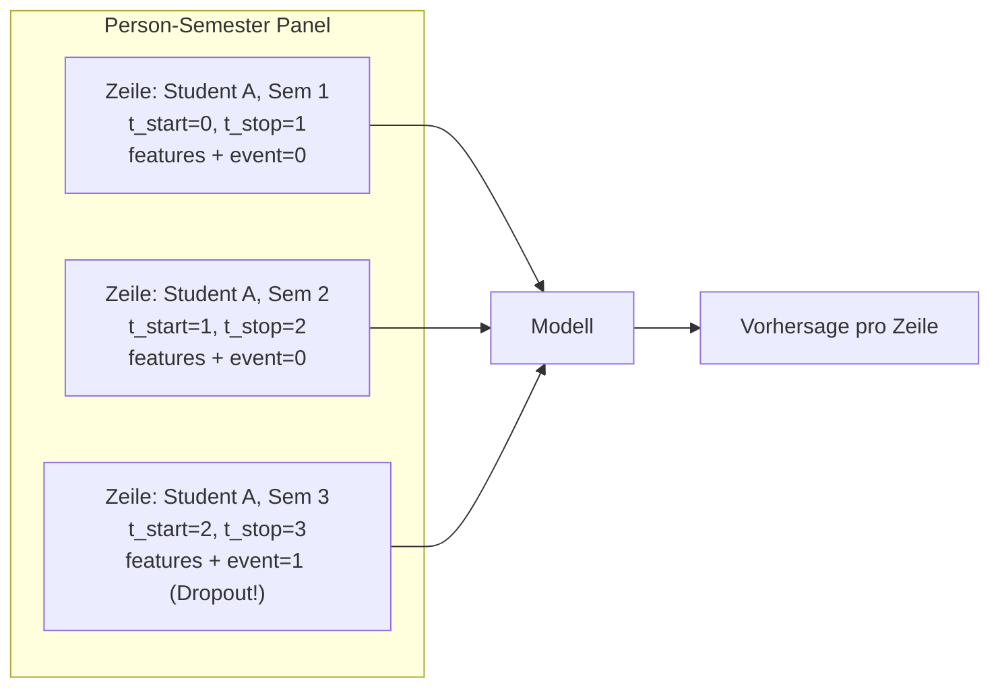
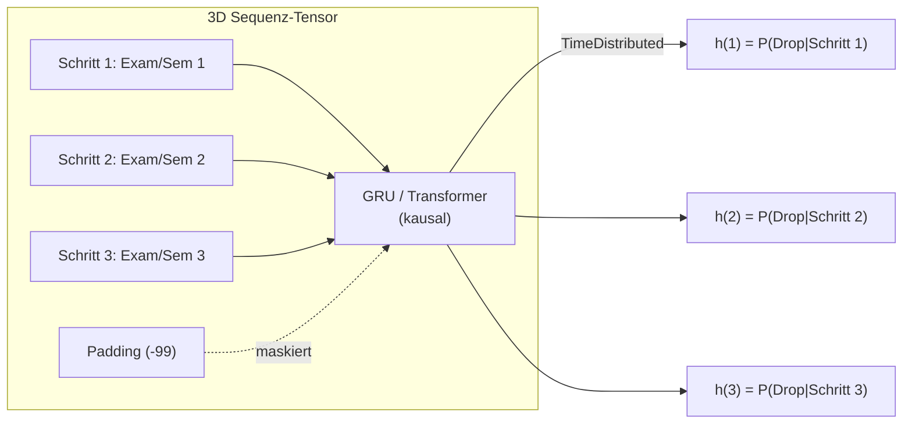
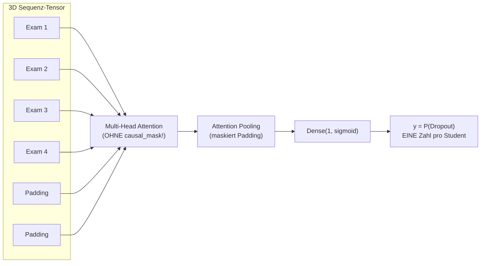

# Erläuterung: Sequenzlänge, Zensierung und Schritt-für-Schritt-Vorhersage in den Survival-Modellen

**Datum:** 21. August 2026  
**Kontext:** Klärung der Frage, welche Wahrscheinlichkeit die verschiedenen Modelle schätzen und ob/wie die Sequenzlänge das Ergebnis verzerrt.

---

## 1. Die zentrale Frage

> „Wird bei jedem Schritt die Dropout-Wahrscheinlichkeit geschätzt? Oder nur am Ende der Sequenz? Sehen nicht ALLE Modelle die Sequenzlänge?"

Die Antwort hängt fundamental davon ab, **welche Architekturklasse** das Modell verwendet. Es gibt drei verschiedene Ansätze im Projekt:

---

## 2. Die drei Architekturklassen

### Klasse A: Panel-Modelle (Person-Semester-Zeilen)
**Modelle:** Extended Cox, DeepSurv Panel/Delta, Logistic Hazard Delta, DML



**Was wird geschätzt?** Die bedingte Hazard-Wahrscheinlichkeit $h(t \mid X_t)$ für **jede einzelne Person-Semester-Zeile** unabhängig.

**Sieht das Modell die Gesamtlänge?** **Nein.** Jede Zeile ist eine eigenständige Beobachtung. Das Modell sieht *nicht*, wie viele Zeilen ein Student insgesamt hat. Es kennt $t_{\text{start}}$ und $t_{\text{stop}}$ (also welches Semester gerade aktiv ist), aber nicht ob danach weitere Semester folgen.

**Zensierungsmechanik:**
- Absolventen (`status = 'abgeschlossen'`) haben `event = 0` in **allen** Semestern, inklusive ihrem letzten. Sie werden als **rechts-zensiert** behandelt.
- Abbrecher haben `event = 1` **nur** in ihrem letzten Semester.
- Im Cox-Modell mit `entry = t_start` definiert der **Risk Set** $\mathcal{R}(t) = \{k : t_{\text{start},k} < t \le t_{\text{stop},k}\}$ automatisch, wer zum Zeitpunkt $t$ noch „at risk" ist. Studierende, die bereits abgebrochen oder abgeschlossen haben, sind nicht mehr im Risk Set.

$$\text{Partial Likelihood: } \ell(\beta) = \sum_{j: E_j=1} \left[ X_j \beta - \ln\sum_{k \in \mathcal{R}(t_j)} \exp(X_k \beta) \right]$$

> [!NOTE]
> **Kein Sequenzlängen-Leakage bei Panel-Modellen.** Jede Zeile steht für sich. Das Modell weiß nicht, ob der Student im nächsten Semester noch da sein wird.

---

### Klasse B: Sequenzielle Hazard-Modelle (Schritt-für-Schritt)
**Modelle:** Recurrent GRU (Semester), Recurrent Exam Survival (Base & V2), Causal Transformer Survival



**Was wird geschätzt?** Die bedingte Hazard-Wahrscheinlichkeit $h(k) = P(\text{Dropout bei Schritt } k \mid \text{Überlebt bis } k, X_{1:k})$ an **jedem einzelnen Zeitschritt**.

**Wie ist das Target konstruiert?**
- Für alle Schritte $k < T_i$ (vor dem letzten): $y_k = 0$
- Am letzten Schritt $k = T_i$: $y_{T_i} = 1$ falls Dropout, $y_{T_i} = 0$ falls Absolvent
- Padding-Schritte: $y = -99$ (durch `masked_binary_crossentropy` ignoriert)

**Sieht das Modell die Gesamtlänge?** **Nein** – und zwar aus zwei Gründen:

1. **Keras `Masking`-Layer:** Bei GRU-Modellen propagiert die `Masking(mask_value=-99)` Schicht eine Boolean-Maske durch alle folgenden Schichten. Der Hidden State wird bei Padding-Schritten **nicht aktualisiert**. Das Modell „weiß" am Schritt $k$ nicht, ob danach weitere Schritte kommen oder Padding.

2. **Kausale Attention (`use_causal_mask=True`):** Beim Causal Transformer Survival ist die Attention-Maske so konstruiert, dass Schritt $k$ nur die Schritte $1, \ldots, k$ sehen kann – nicht die Zukunft. Padding-Schritte nach $T_i$ sind für die Attention unsichtbar.

**Loss-Funktion:** `masked_binary_crossentropy` – ignoriert alle Padding-Positionen:
```python
def masked_binary_crossentropy(y_true, y_pred):
    mask = tf.cast(tf.not_equal(y_true, PADDING_VALUE), tf.float32)
    y_true_clean = tf.maximum(y_true, 0.0)
    bce = K.binary_crossentropy(y_true_clean, y_pred)
    return tf.reduce_sum(bce * mask) / (tf.reduce_sum(mask) + 1e-7)
```

> [!NOTE]
> **Kein Sequenzlängen-Leakage bei korrekt maskierten Sequenzmodellen.** Am Schritt $k$ kennt das Modell weder die Gesamtlänge der Sequenz noch ob nach $k$ weitere Schritte folgen. Es muss seine Vorhersage allein auf die bis dahin beobachteten Features stützen.

---

### Klasse C: Statischer Sequenz-Klassifikator (der Problemfall)
**Modell:** Deep Exam-Transformer Survival (in `deep_transformer_regression.py`)



**Was wird geschätzt?** Eine **einzige** binäre Klassifikation pro Student: $P(\text{Dropout} \mid \text{gesamte Prüfungshistorie})$.

**Das ist fundamental anders!** Dieses Modell ist **kein** sequenzieller Hazard-Schätzer, sondern ein **statischer binärer Klassifikator**, der zufällig eine Sequenz als Input bekommt. Es gibt keine Schritt-für-Schritt-Vorhersage und keine Zensierungsmechanik.

**Warum ist die Sequenzlänge hier ein Problem?**

1. **Multi-Head Attention ohne `causal_mask`:** Die Attention-Blöcke im Backbone erhalten **keine** `attention_mask` und **keine** `use_causal_mask=True`. Jeder Token kann jeden anderen Token sehen – inklusive der Padding-Tokens.

2. **AttentionPooling maskiert nur die finale Aggregation:**
   ```python
   is_padded = tf.reduce_all(tf.equal(inputs, PADDING_VALUE), axis=-1, keepdims=True)
   padding_mask = tf.cast(is_padded, tf.float32) * -1e9
   scores = scores + padding_mask  # Padding-Tokens bekommen -∞
   weights = tf.nn.softmax(scores, axis=1)
   pooled = tf.reduce_sum(inputs * weights, axis=1)
   ```
   Das unterdrückt Padding in der finalen Pooling-Schicht, aber die **Multi-Head-Attention-Blöcke im Backbone** haben die Padding-Tokens bereits in ihre Repräsentationen eingearbeitet.

3. **Empirischer Beweis:**
   - Absolventen: durchschnittlich **18,7 Prüfungen** (min 15, max 43)
   - Abbrecher: durchschnittlich **10,7 Prüfungen** (min 1, max 44)
   - 90,1% der Abbrecher haben < 20 Prüfungen
   
   Bei einem Tensor der Größe `(N, 40, 9)` hat ein Absolvent ca. 19 echte Tokens und 21 Padding-Tokens. Ein Abbrecher hat ca. 11 echte Tokens und 29 Padding-Tokens. Dieses Muster ist für die Attention trivial erkennbar.

4. **Resultat:** ROC-AUC = 0,9999 – das Modell klassifiziert Dropout vs. Absolvent nahezu perfekt, weil es die Sequenzlänge als Proxy nutzt.

> [!CAUTION]
> **Der Deep Exam-Transformer Survival ist kein Survival-Modell.** Er ist ein statischer Klassifikator, der die gesamte Prüfungshistorie sieht und daraus eine einzelne Dropout-Wahrscheinlichkeit ableitet. Die Sequenzlänge verrät direkt das Ergebnis. Die ROC-AUC von 0,9999 ist ein Artefakt, keine echte Modellleistung.

---

## 3. Zusammenfassende Vergleichstabelle

| Eigenschaft | Panel (Cox/DeepSurv) | Sequenzieller Hazard (GRU/Causal Transformer) | Statischer Klassifikator (Deep Exam-Transformer) |
|:---|:---|:---|:---|
| **Vorhersage-Typ** | $h(t)$ pro Zeile | $h(k)$ pro Schritt | $P(\text{Drop})$ pro Student |
| **Granularität** | Ein Wert pro Person-Semester | Ein Wert pro Schritt (Exam/Semester) | **Ein einziger Wert** |
| **Sieht Gesamtlänge?** | Nein (Zeilen unabhängig) | Nein (Masking/Causal Mask) | **Ja** (keine Backbone-Maske) |
| **Zensierung** | Risk Set / $t_{\text{start}}, t_{\text{stop}}$ | Padding + Masked Loss | **Keine** |
| **Leakage-Risiko** | ✅ Keins | ✅ Keins (bei korrektem Masking) | ⛔ **Massiv** |
| **Kontrafaktische Inferenz** | Toggle auf Zeilen-Ebene | Toggle über Sequenz-Schritte | Toggle auf gesamte Sequenz |

---

## 4. Lösung für den Deep Exam-Transformer

### Option A: Umbau zum sequenziellen Hazard-Modell (empfohlen)
- `use_causal_mask=True` in den Multi-Head-Attention-Blöcken
- `TimeDistributed(Dense(1, sigmoid))` als Output statt globaler Pooling → Dense
- `masked_binary_crossentropy` als Loss
- Sequenzielles Target $y_k$ wie bei den RNN-Modellen

### Option B: Keras-Masking + Backbone-Attention-Mask
- `Masking(mask_value=-99)` als erste Schicht
- `compute_mask`-Propagation durch die Attention-Blöcke
- Behält das statische Klassifikator-Design, eliminiert aber das Sequenzlängen-Leakage

> [!IMPORTANT]
> **Option A ist konzeptionell sauberer**, weil sie den Deep Exam-Transformer in die gleiche Modellklasse überführt wie die RNN-Hazard-Modelle. Das macht die Ergebnisse direkt vergleichbar und eliminiert das Leakage-Problem an der Wurzel.
