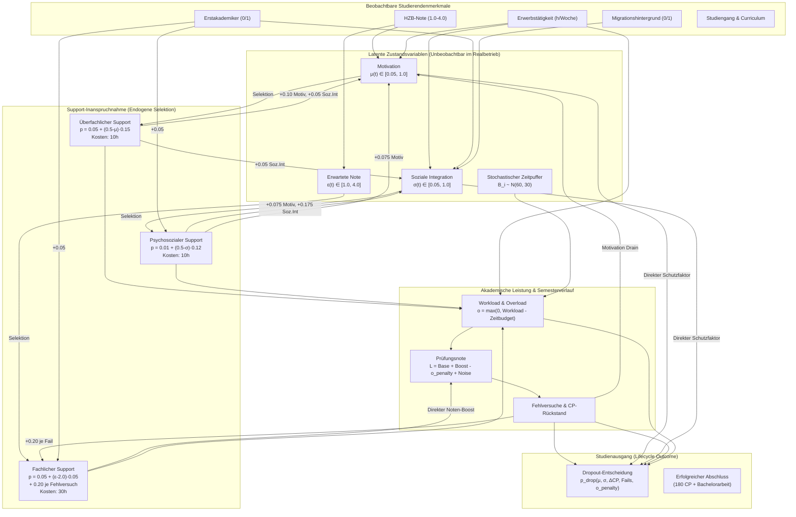

# Kausale Architektur & Datengenerierender Prozess (DGP) der Simulation V3.3

**Projekt:** DeepSupport – Wirksamkeitsanalyse von Hochschulsupport  
**Autor:** Antigravity / Wilfried Keller  
**Stand:** August 2026 (Version 3.3 Dual-Strang)

---

## 1. Übersicht & Zielsetzung

Die Simulations-Engine in [`src/simulation_v3.py`](file:///c:/GitHub_public/Abschlussprojekt/src/simulation_v3.py) erzeugt realitätsnahe, synthetische Studienverläufe für $N = 50.000$ Studierende pro Universum. 
Ziel der Simulation ist es, ein kontrolliertes Laboratorium bereitzustellen, in dem die **wahre kausale Wirkung** von Unterstützungsangeboten (Ground Truth) exakt bekannt ist, während gleichzeitig die typischen empirischen Verzerrungen realer Hochschuldaten (Endogenität, Confounding by Indication, Immortal-Time-Bias, unbeobachtbare Heterogenität) präzise modelliert werden.

---

## 2. Kausales Flussdiagramm des DGP

---

## 3. Mathematische Spezifikation der Mechanismen

### 3.1 Initialisierung der Studierenden ($t = 0$)

Für jeden Studierenden $i \in \{1, \dots, N\}$:

$$\text{HZB}_i \sim \text{clip}\left(\mathcal{N}(2{,}4,\, 0{,}55^2),\, 1{,}0,\, 4{,}0\right)$$

$$\text{Erwerb}_i \sim \text{Discrete}(\{0, 5, 10, 15, 20, 25, 30\},\, \mathbf{p})$$

$$\varepsilon_i(0) = \text{clip}\left(\text{HZB}_i + \delta_{\text{typ}},\, 1{,}0,\, 4{,}0\right)$$

$$\mu_i(0) = \text{clip}\left(0{,}70 + (2{,}5 - \text{HZB}_i) \cdot 0{,}20 - \text{Erwerb}_i \cdot 0{,}005 + \varepsilon_{\mu},\, 0{,}05,\, 1{,}0\right)$$

$$\sigma_i(0) = \text{clip}\left(0{,}75 - 0{,}12 \cdot \mathbb{1}[\text{Erstakademiker}] - 0{,}08 \cdot \mathbb{1}[\text{Migration}] - \text{Erwerb}_i \cdot 0{,}006 + \varepsilon_{\sigma},\, 0{,}05,\, 1{,}0\right)$$

$$B_i \sim \text{clip}\left(\mathcal{N}(60{,}0,\, 30{,}0^2),\, 0{,}0,\, 180{,}0\right) \quad (\text{Stochastischer Zeitpuffer})$$

---

### 3.2 Endogene Support-Inanspruchnahme ($t \ge 1$)

Die Teilnahmeentscheidung erfolgt semesterweise zu Beginn des Semesters:

$$p_{\text{fach}, i}(t) = \text{clip}\Big(0{,}05 + (\varepsilon_i(t) - 2{,}0) \cdot 0{,}05 + 0{,}20 \cdot \sum_{m} \mathbb{1}[\text{Versuch}_{m} > 1] + 0{,}05 \cdot \mathbb{1}[\text{Erstakademiker}],\ 0,\ 0{,}9\Big)$$

$$p_{\text{uebf}, i}(t) = \text{clip}\Big(0{,}05 + (0{,}5 - \mu_i(t)) \cdot 0{,}15,\ 0,\ 0{,}9\Big)$$

$$p_{\text{psych}, i}(t) = \text{clip}\Big(0{,}01 + (0{,}5 - \sigma_i(t)) \cdot 0{,}12 + 0{,}05 \cdot \mathbb{1}[\text{Erstakademiker}],\ 0,\ 0{,}9\Big)$$

---

### 3.3 Wirkungsmechanismen der Supportangebote

1. **Fachlicher Support:**  
   Wirkt direkt auf die Prüfungsleistung des zugeordneten Moduls:
   $$\text{Boost}_m(t) = \text{clip}\left(\sum_{a \in \text{Angebote}} w_{m, a} \cdot \text{Multiplier} \cdot \gamma_{\text{boost}},\, 0{,}0,\, 0{,}40\right)$$
   Zusätzlich: $2/3$ Carry-Over-Wirkung in Folgesemestern bei Wiederholungsprüfungen.

2. **Überfachlicher Support (Lerncoaching, Zeitmanagement):**  
   Wirkt auf die psychosozialen Ressourcen bei geringem Zeitaufwand ($10\text{h}$).  
   *(Anmerkung zur Notation: Der Pfeil $\leftarrow$ steht für eine Zuweisung bzw. ein direktes Überschreiben der Eigenschaft im laufenden Semester).*
   $$\mu_i(t) \leftarrow \min(1{,}0,\, \mu_i(t) + 0{,}02 \times 5{,}0 = +0{,}10)$$
   $$\sigma_i(t) \leftarrow \min(1{,}0,\, \sigma_i(t) + 0{,}01 \times 5{,}0 = +0{,}05)$$

3. **Psychosozialer Support (Krisenberatung, Integration):**  
   $$\mu_i(t) \leftarrow \min(1{,}0,\, \mu_i(t) + 0{,}015 \times 5{,}0 = +0{,}075)$$
   $$\sigma_i(t) \leftarrow \min(1{,}0,\, \sigma_i(t) + 0{,}035 \times 5{,}0 = +0{,}175)$$

---

### 3.4 Prüfungsnote & Dropout-Wahrscheinlichkeit

Die latente Prüfungsleistung $L_{i,m}$ bestimmt die Note (wobei $S_m$ die feste fachliche **S**chwierigkeit des Moduls $m$ ist und $V_m$ die **V**ersuchsnummer der Prüfung):

$$L_{i,m} = 0{,}55 + (2{,}5 - \varepsilon_i) \cdot 0{,}15 + (\mu_i - 0{,}5) \cdot 0{,}12 + (\sigma_i - 0{,}5) \cdot 0{,}05 - S_m \cdot 0{,}20 + (V_m - 1) \cdot 0{,}05 - o_{\text{penalty}} + \text{Boost}_{i,m} + \xi_{i,m}$$

Die Dropout-Wahrscheinlichkeit am Semesterende:

$$p_{\text{drop}, i}(t) = 0{,}5 \cdot \text{clip}\Big(\dots,\, 0,\, 0{,}45\Big)$$

*(Anmerkung zur Cap von 0.45: Eine empirische Prüfung der Simulationsverläufe zeigt, dass dieses theoretische Maximum fast nie (in deutlich unter 0,1% der Fälle) auslöst, da selbst die extremsten Kombinationen aus Motivation = 0, Fehlversuchen = 5 und maximalem CP-Rückstand im ersten Semester ($p_{raw} \approx 0{,}79$) nach Multiplikation mit dem Basis-Hazard-Faktor 0,5 immer noch unter 0,45 bleiben. Die Cap dient lediglich als Fail-Safe für den Stochastik-Prozess.)*

---

## 4. Das 8-Universen Counterfactual-Design

Durch getrennte Zufallszahlengenerator-Streams (`base_seed = crc32(studierenden_id)`) erhalten Studierende in allen 8 Welten **identische Startbedingungen und Prüfungsrauschen**. Die einzige Manipulation ist die selektive Blockierung von Supportangeboten:

| Universum | Fachlich | Überfachlich | Psychosozial | Zweck & Evaluation |
|:---|:---:|:---:|:---:|:---|
| **A (Baseline)** | Aktiv | Aktiv | Aktiv | Reale Beobachtungswelt (Faktische Welt) |
| **B (Null-Support)** | Blockiert | Blockiert | Blockiert | Vollständige Kontrollwelt (Kontrafaktische Null-Baseline) |
| **C (Ohne Fachlich)** | Blockiert | Aktiv | Aktiv | Partieller Wegnahme-Effekt für Fachlich ($R_A / R_C$) |
| **D (Ohne Überfachlich)** | Aktiv | Blockiert | Aktiv | Partieller Wegnahme-Effekt für Überfachlich ($R_A / R_D$) |
| **E (Ohne Psychosozial)** | Aktiv | Aktiv | Blockiert | Partieller Wegnahme-Effekt für Psychosozial ($R_A / R_E$) |
| **F (Nur Fachlich)** | Aktiv | Blockiert | Blockiert | Isolierte Einzelwirkung Fachlich ($R_F / R_B$) |
| **G (Nur Überfachlich)** | Blockiert | Aktiv | Blockiert | Isolierte Einzelwirkung Überfachlich ($R_G / R_B$) |
| **H (Nur Psychosozial)** | Blockiert | Blockiert | Aktiv | Isolierte Einzelwirkung Psychosozial ($R_H / R_B$) |

---

## 5. Ground Truth Benchmark-Ergebnisse ($N = 50.000$)

### A. Dropout-Risiko (Relativrisiko $RR$)

| Support-Typ | 1. Partieller Effekt ($R_A / R_{\text{ohne}}$) | 2. Isolierter Effekt ($R_{\text{nur}} / R_B$) |
|:---|:---:|:---:|
| **Fachlicher Support** | $\mathbf{RR = 0{,}9579}$ ($-4{,}21\%$) | $\mathbf{RR = 0{,}9518}$ ($-4{,}82\%$) |
| **Überfachlicher Support** | $\mathbf{RR = 0{,}9387}$ ($-6{,}13\%$) | $\mathbf{RR = 0{,}9317}$ ($-6{,}83\%$) |
| **Psychosozialer Support** | $\mathbf{RR = 0{,}9514}$ ($-4{,}86\%$) | $\mathbf{RR = 0{,}9472}$ ($-5{,}28\%$) |
| **Alle Supports kombiniert** | $\mathbf{RR = 0{,}8462}$ ($-15{,}38\%$) | $\mathbf{RR = 0{,}8462}$ ($-15{,}38\%$) |

### B. Prüfungsnoten & Studiendauer

| Support-Typ | Notendifferenz (Partiell) | Notendifferenz (Isoliert) | Bestehensquoten-Lift (pp) | Dropout-Dauer (Mean) |
|:---|:---:|:---:|:---:|:---:|
| **Fachlicher Support** | $\mathbf{-0{,}0900}$ Notenpunkte | $\mathbf{-0{,}0758}$ Notenpunkte | $\mathbf{+1{,}84\text{pp}}$ | $4{,}66\text{ Sem.}$ |
| **Überfachlicher Support** | $-0{,}0215$ Notenpunkte | $-0{,}0054$ Notenpunkte | $+1{,}70\text{pp}$ | $4{,}62\text{ Sem.}$ |
| **Psychosozialer Support** | $-0{,}0408$ Notenpunkte | $-0{,}0359$ Notenpunkte | $+1{,}07\text{pp}$ | $4{,}51\text{ Sem.}$ |
| **Alle kombiniert (A vs B)** | $\mathbf{-0{,}1352}$ Notenpunkte | — | $\mathbf{+5{,}29\text{pp}}$ | $4{,}48\text{ vs. }4{,}94\text{ Sem.}$ |
