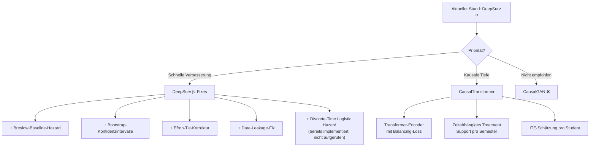

# Vergleichende Evaluation: Survival-Analyse-Ansätze für die Supportwirkungsanalyse

## Überblick

Diese Analyse vergleicht vier methodische Ansätze zur Survival-Analyse der Supportwirkung auf den Studienverlauf:

| # | Ansatz | Status | Kausale Belastbarkeit |
|---|--------|--------|----------------------|
| A | **Cox PH Regression** (altes Dashboard) | ✅ Implementiert | ⚠️ Mittel (unter Annahmen) |
| B | **DeepSurv** (aktuelle Implementierung) | ✅ Implementiert | ⚠️ Gering–Mittel |
| C | **CausalGAN** | ❌ Nicht implementiert | ⚠️ Theoretisch hoch, praktisch fragil |
| D | **CausalTransformer** | ❌ Nicht implementiert | ✅ Hoch (unter Annahmen) |

---

## A. Altes Dashboard: Cox Proportional Hazards (statsmodels)

### Methodik

Das alte Dashboard ([Dashboard_Survival.ipynb](file:///c:/Users/wilfr/OneDrive/Dokumente/Data%20Science/Abschlussprojekt/Projekt_DA/Dashboard_Survival.ipynb) / [Dashboard_Survival_beta.ipynb](file:///c:/Users/wilfr/OneDrive/Dokumente/Data%20Science/Abschlussprojekt/Projekt_DA/Dashboard_Survival_beta.ipynb)) implementiert einen dreistufigen statistischen Ansatz:

1. **Kaplan-Meier-Schätzer** (nicht-parametrisch): Überlebenskurven $\hat{S}(t)$ mit 95%-Konfidenzintervallen (Greenwood-Formel / simultane Konfidenz\-bänder via `statsmodels.SurvfuncRight`).
2. **Log-Rank-Test**: Nicht-parametrischer Hypothesentest ($\chi^2$, $p$-Wert) zum Vergleich der Überlebenskurven mit vs. ohne Support.
3. **Cox Proportional Hazards Regression**: Semi-parametrisches Modell mit Breslow-Tie-Korrektur:
$$h(t \mid X) = h_0(t) \cdot \exp\left(\beta_{\text{support}} \cdot \text{Support} + \sum_j \beta_j X_j\right)$$

### Stärken gegenüber DeepSurv

| Merkmal | Altes Dashboard | Aktueller DeepSurv |
|---------|----------------|-------------------|
| **Konfidenzintervalle** | ✅ 95%-Wald-KI für alle HR + Greenwood-Bänder für $S(t)$ | ❌ Keine |
| **Forest Plot** | ✅ Interaktiver Plotly-Forest-Plot mit Error-Bars auf Log-Skala | ❌ Nicht vorhanden |
| **Tie-Korrektur** | ✅ Breslow-Methode (`ties='breslow'`) | ❌ Nicht implementiert (problematisch bei diskreten Semesterzeiten) |
| **Baseline-Hazard** | ✅ Implizit nicht-parametrisch (Breslow-Schätzer) | ❌ Hardcoded $h_0 = 0.03$ (unrealistisch) |
| **Interaktivität** | ✅ Wählbare Kontrollvariablen, Studiengänge, Zielereignisse, Expositionsgruppen | ❌ Statisch |
| **CP-Reskalierung** | ✅ HR pro 5 ECTS (interpretierbar) | ❌ Nicht anwendbar |
| **Separation-Check** | ✅ Erkennt perfekte Separation und warnt | ❌ Nicht vorhanden |

### Bekannte Limitationen des alten Dashboards

> [!WARNING]
> **Proportional-Hazards-Annahme nicht geprüft**: Beide Notebooks warnen explizit, dass keine Schoenfeld-Residuen-Tests durchgeführt wurden. Die PH-Annahme besagt, dass das Risikoverhältnis zwischen Gruppen über die gesamte Studienzeit **konstant** bleibt — eine starke und in diesem Kontext vermutlich verletzte Annahme.

- **Immortal-Time-Bias**: Support-Nutzung wird als statisches binäres Merkmal kodiert ("jemals genutzt"). Studierende, die länger eingeschrieben sind, haben mehr Gelegenheit, Support zu nutzen, was zu einem systematischen Bias führt.
- **Keine formale kausale Inferenz**: Keine Propensity-Score-Methoden, kein Inverse Probability Weighting (IPW), keine Instrumentalvariablen.
- **Confounding by Indication**: Studierende, die Support nutzen, sind systematisch anders als solche, die es nicht tun (Selbstselektion).

---

## B. Aktueller DeepSurv (Keras/TensorFlow)

### Methodik

Das aktuelle Skript ([deep_survival.py](file:///c:/Users/wilfr/OneDrive/Dokumente/Data%20Science/Abschlussprojekt/src/deep_survival.py)) implementiert ein **Deep Cox Neural Network** (DeepSurv nach Katzman et al., 2018):

- **Architektur**: Dense(32, ReLU) → BN → Dropout(0.2) → Dense(16, ReLU) → BN → Dropout(0.1) → Dense(1, linear, no bias)
- **Loss**: Negative Cox Partial Log-Likelihood (Custom TensorFlow Loss)
- **Landmark-Analyse**: Start ab Semester 3 ($T_0 = 3$), Sem. 1–2 als Prädiktoren
- **Hazard Ratios**: Kontrafaktischer Vergleich $\text{HR}_i = \exp(g(x_i^{\text{mit}}) - g(x_i^{\text{ohne}}))$

### Stärken gegenüber dem alten Dashboard

| Merkmal | DeepSurv | Altes Dashboard |
|---------|----------|----------------|
| **Nicht-lineare Interaktionen** | ✅ Lernt automatisch Interaktionseffekte (z.B. HZB-Note × Erwerbstätigkeit × Support) | ❌ Nur lineare additive Effekte (ohne manuell spezifizierte Interaktionsterme) |
| **Landmark-Design** | ✅ Reduziert Immortal-Time-Bias durch Start ab Sem. 3 | ❌ Nicht implementiert |
| **PH-Annahme** | ⚠️ Immer noch implizit (Cox-Modell), aber flexibler durch nicht-lineare $g(x)$ | ⚠️ Strikt linear |
| **Heterogene Treatment Effects** | ✅ Individuelle $\text{HR}_i$ pro Student berechenbar | ❌ Nur globaler $\text{HR}$ |
| **C-Index** | ✅ Berichtet ($C = 0.81$) | ❌ Nicht berechnet |

### Identifizierte Schwächen des aktuellen DeepSurv

> [!IMPORTANT]
> Die folgenden Punkte sind **behebbar** und stellen keine fundamentalen methodischen Probleme dar:

1. **Hardcoded Baseline-Hazard** ($h_0 = 0.03$): Sollte durch den **Breslow-Schätzer** ersetzt werden:
$$\hat{H}_0(t) = \sum_{t_i \le t} \frac{d_i}{\sum_{j \in R(t_i)} \exp(g(x_j))}$$

2. **Mini-Batch Cox Loss**: Risk-Sets werden nur innerhalb des Mini-Batches ($B=128$) berechnet statt über den gesamten Datensatz. Dies führt zu verrauschten Gradienten, besonders bei seltenen Ereigniszeitpunkten.

3. **Keine Tie-Korrektur**: Bei diskreten Semesterzeiten sind Ties häufig. Efron- oder Breslow-Tie-Korrektur fehlt.

4. **Keine Konfidenzintervalle**: Weder Bootstrap-KI noch Monte-Carlo-Dropout für Unsicherheitsquantifizierung.

5. **Data Leakage**: Der `ColumnTransformer` wird vor dem Train/Test-Split auf dem gesamten Datensatz gefittet.

6. **Psychosozialer Support ausgeklammert** (beabsichtigt, per User-Vorgabe).

---

## C. CausalGAN — Bewertung für dieses Szenario

### Was ist CausalGAN?

CausalGAN (Kocaoglu et al., 2018) ist ein Generative Adversarial Network, das einen **kausalen Graphen** (Structural Causal Model, SCM) in die GAN-Architektur einbettet. Es lernt die kausalen Mechanismen $X_i = f_i(\text{Pa}(X_i), U_i)$ und kann damit echte **interventionelle** Verteilungen $P(Y \mid \text{do}(X))$ generieren — im Gegensatz zu rein beobachtenden Verteilungen $P(Y \mid X)$.

### Eignung für das Studienverlaufs-Szenario

| Aspekt | Bewertung | Begründung |
|--------|-----------|------------|
| **Kausale Belastbarkeit** | ⚠️ Theoretisch hoch | CausalGAN kann echte $\text{do}$-Interventionen modellieren, **aber**: der kausale Graph muss **a priori korrekt spezifiziert** werden. Fehler im DAG propagieren sich als systematischer Bias in alle kausalen Schätzungen. |
| **Dateneffizienz** | ❌ Schlecht | GANs benötigen typischerweise $>50.000$ Samples für stabiles Training. Mit $N \approx 10.000$ Studierenden ist der Datensatz zu klein für ein GAN mit kausaler Struktur. |
| **Survival-Modellierung** | ❌ Nicht nativ | CausalGAN wurde für Bildgenerierung und tabellarische Daten entwickelt. Time-to-event-Daten mit Zensierung sind nicht nativ unterstützt. Kombination mit Survival-Objectives wäre ein eigenständiges Forschungsprojekt. |
| **Mode Collapse** | ❌ Hohes Risiko | GANs sind berüchtigt für Mode Collapse, besonders bei kleinen, heterogenen Datensätzen mit vielen kategorischen Variablen. |
| **Implementierungsaufwand** | ❌ Sehr hoch | Erfordert: (1) Spezifikation eines vollständigen DAG, (2) Implementierung kausaler Generator-/Diskriminator-Paare pro Knoten, (3) Custom Survival-Loss, (4) Extensive Hyperparameter-Tuning. Geschätzter Aufwand: **3–5 Wochen** für einen funktionierenden Prototypen. |
| **Interpretierbarkeit** | ⚠️ Mittel | Die generierten kontrafaktischen Samples sind interpretierbar, aber die internen Mechanismen des GAN bleiben opak. |

> [!CAUTION]
> **Fazit CausalGAN**: Für dieses Szenario **nicht empfehlenswert**. Der Datensatz ist zu klein, die Survival-Modellierung nicht nativ unterstützt, und der Implementierungsaufwand steht in keinem Verhältnis zum erwarteten Erkenntnisgewinn gegenüber einfacheren kausalen Methoden.

---

## D. CausalTransformer — Bewertung für dieses Szenario

### Was ist ein CausalTransformer?

Der **Causal Transformer** (Melnychuk, Frauen & Feuerriegel, 2022) ist eine Transformer-basierte Architektur für die Schätzung **individueller kausaler Behandlungseffekte (ITE)** aus **Längsschnitt-Beobachtungsdaten** mit zeitabhängigen Treatments und Confoundern. Er basiert auf drei Kernideen:

1. **Balancing Representation Learning**: Der Encoder lernt eine **balancierte** Repräsentation $\Phi(H_t)$ der Behandlungshistorie, die die Verteilungen der Treatment-Gruppen aneinander angleicht (ähnlich wie Propensity-Score-Balancing, aber im latenten Raum). Dies adressiert **zeitabhängiges Confounding**.

2. **Multi-Head Self-Attention über die Zeitachse**: Der Transformer verarbeitet die gesamte Sequenz $(X_1, A_1, Y_1, X_2, A_2, Y_2, \dots, X_T, A_T, Y_T)$ und lernt langreichweitige zeitliche Abhängigkeiten zwischen Covariaten $X_t$, Treatments $A_t$ und Outcomes $Y_t$.

3. **Kontrafaktische Vorhersage**: Für einen gegebenen Studierenden mit beobachteter Historie $H_t$ kann das Modell vorhersagen: "Was wäre passiert, wenn dieser Student ab Semester $t$ Support erhalten hätte vs. nicht?" — d.h. es schätzt $\mathbb{E}[Y_{t+\tau}(\bar{a}) \mid H_t]$ für verschiedene hypothetische Treatment-Sequenzen $\bar{a}$.

### Eignung für das Studienverlaufs-Szenario

| Aspekt | Bewertung | Begründung |
|--------|-----------|------------|
| **Kausale Belastbarkeit** | ✅ Hoch | Adressiert explizit zeitabhängiges Confounding durch Balancing. Propensity-Score-äquivalente Anpassung im latenten Raum. Unter der **Sequential Ignorability**-Annahme $(Y_{t+1}(\bar{a}) \perp\!\!\!\perp A_t \mid H_t)$ sind die geschätzten Treatment-Effekte kausal interpretierbar. |
| **Zeitabhängiger Support** | ✅ Ideal | Modelliert Support als **zeitabhängiges Treatment** $A_t$ pro Semester, nicht als statisches Merkmal. Löst das Immortal-Time-Bias-Problem fundamental. |
| **Survival-Modellierung** | ⚠️ Indirekt | Nativ auf Outcome-Regression ausgelegt ($\hat{Y}_{t+\tau}$), nicht auf Time-to-Event. Aber: Das Outcome kann als binäre Variable "noch eingeschrieben in Semester $t+1$?" modelliert werden, was einer diskreten Hazard-Rate entspricht. |
| **Dateneffizienz** | ⚠️ Mittel | Transformer brauchen mehr Daten als einfache RNNs. $N = 10.000$ mit $T \le 16$ Semestern ist grenzwertig, aber mit Regularisierung und kleiner Architektur machbar. |
| **Heterogene Treatment Effects** | ✅ Nativ | Gibt individuelle Treatment-Effekte (ITE) pro Student und Zeitpunkt aus. |
| **Implementierungsaufwand** | ⚠️ Hoch | Erfordert: (1) Transformer-Encoder mit Balancing-Loss (z.B. IPM/MMD-Regularisierung), (2) Treatment-History-Encoding, (3) Counterfactual Decoder. Geschätzter Aufwand: **2–3 Wochen** für einen Prototypen (mit existierenden Referenz-Implementierungen als Vorlage). |
| **Interpretierbarkeit** | ✅ Gut | Attention-Weights zeigen, welche historischen Zeitpunkte für die aktuelle Vorhersage relevant sind. ITE-Schätzungen sind direkt interpretierbar. |

> [!NOTE]
> **Fazit CausalTransformer**: Methodisch der **stärkste** Ansatz für dieses Szenario — insbesondere wegen der nativen Behandlung zeitabhängiger Treatments und der Balancing-Eigenschaft. Allerdings mit erheblichem Implementierungsaufwand verbunden und für ein Abschlussprojekt möglicherweise over-engineered, es sei denn, der kausale Aspekt steht im Zentrum der Arbeit.

---

## Gesamtvergleich & Empfehlung

### Tabellarischer Vergleich

| Kriterium | Cox PH (alt) | DeepSurv (aktuell) | CausalGAN | CausalTransformer |
|-----------|:---:|:---:|:---:|:---:|
| PH-Annahme nötig? | ✅ Ja | ⚠️ Implizit | ❌ Nein | ❌ Nein |
| Nicht-lineare Effekte | ❌ | ✅ | ✅ | ✅ |
| Zeitabhängiger Support | ❌ Statisch | ❌ Statisch (Landmark) | ⚠️ Möglich | ✅ Nativ |
| Konfidenzintervalle | ✅ Wald-KI | ❌ | ❌ | ⚠️ Via Bootstrap |
| Kausale Belastbarkeit | ⚠️ Mittel | ⚠️ Gering | ⚠️ Fragil | ✅ Hoch |
| Immortal-Time-Bias | ❌ Vorhanden | ⚠️ Reduziert (Landmark) | ⚠️ Abhängig von DAG | ✅ Gelöst |
| Datenbedarf ($N$) | ✅ Gering | ✅ Gering–Mittel | ❌ Hoch ($>50k$) | ⚠️ Mittel–Hoch |
| Implementierungsaufwand | ✅ Gering (fertig) | ✅ Gering (fertig) | ❌ 3–5 Wochen | ⚠️ 2–3 Wochen |
| Interpretierbarkeit | ✅ Direkt (HR, KI, $p$) | ⚠️ Mittel (HR ohne KI) | ⚠️ Mittel | ✅ Gut (ITE, Attention) |

### Empfohlene Strategie (Pragmatisch)

### Meine konkrete Empfehlung

> [!IMPORTANT]
> **Kurzfristig (nächster Schritt)**: Den bestehenden DeepSurv zu einer **robusten β-Version** ausbauen:
> 1. Breslow-Baseline-Hazard statt $h_0 = 0.03$
> 2. Bootstrap-Konfidenzintervalle für Hazard Ratios (1.000 Resamples)
> 3. Data-Leakage-Fix (Preprocessor nur auf Train-Daten fitten)
> 4. Den bereits implementierten (aber nicht aufgerufenen) **Discrete-Time Logistic Hazard** aktivieren — dieser hebt die PH-Annahme vollständig auf
> 5. Optionale IPW-Gewichtung (Inverse Probability Weighting) als leichtgewichtige kausale Korrektur
>
> **Geschätzter Aufwand**: 1–2 Stunden.

> [!TIP]
> **Mittelfristig (wenn kausale Analyse im Zentrum steht)**: Ein **vereinfachter CausalTransformer** mit:
> - Kleiner Architektur (2 Attention-Heads, 2 Layers, $d_{\text{model}} = 32$)
> - Semester-weiser Support als zeitabhängiges Treatment $A_t \in \{0, 1\}$
> - MMD-Balancing-Loss zur Confounding-Reduktion
> - Die bereits erstellten Semester-Zeitreihen aus [timeseries_semester.py](file:///c:/Users/wilfr/OneDrive/Dokumente/Data%20Science/Abschlussprojekt/src/timeseries_semester.py) als Datengrundlage
>
> **Geschätzter Aufwand**: 2–3 Wochen (inkl. Validierung).

> [!CAUTION]
> **CausalGAN**: Für dieses Szenario **nicht empfehlenswert**. Die Datenmenge ist zu gering ($N = 10.000$ bei $>50.000$ empfohlen), Survival-Zensierung ist nicht nativ unterstützt, und der Implementierungsaufwand (3–5 Wochen) steht in keinem Verhältnis zum Erkenntnisgewinn.

---

## Methodische Einordnung: Was bedeutet "kausal belastbar"?

Die zentrale Frage ist: Schätzen wir $P(Y \mid X = x)$ (Beobachtung/Assoziation) oder $P(Y \mid \text{do}(X = x))$ (Intervention/Kausalität)?

### Stufen kausaler Belastbarkeit

| Stufe | Methode | Was wird geschätzt? | Annahmen |
|-------|---------|-------------------|----------|
| 1 | **Unkontrollierter Vergleich** | $P(\text{Abgang} \mid \text{Support})$ | Keine Confounding-Korrektur |
| 2 | **Cox PH mit Kovariaten** (altes Dashboard) | $\text{HR}_{\text{adj}}$ adjustiert für beobachtete Confounder | PH-Annahme + **keine unbeobachteten Confounder** |
| 3 | **DeepSurv** (aktuell) | Nicht-linearer adjustierter $\text{HR}$ | PH implizit + keine unbeobachteten Confounder |
| 4 | **IPW / Propensity Scores** | ATE gewichtet nach Treatment-Wahrscheinlichkeit | **Starke Ignorability**: $Y(a) \perp\!\!\!\perp A \mid X$ |
| 5 | **CausalTransformer** | ITE mit zeitabhängigem Balancing | **Sequential Ignorability**: $Y_{t+1}(\bar{a}) \perp\!\!\!\perp A_t \mid H_t$ |
| 6 | **RCT** (Randomisiertes Experiment) | Wahrer kausaler Effekt | Randomisierung eliminiert alle Confounder |

Da wir mit **synthetischen Daten** arbeiten, in denen der kausale Mechanismus (Counterfactual Ground Truth via `note_counterfactual`) **bekannt** ist, können wir die kausale Belastbarkeit der Modelle tatsächlich empirisch validieren — ein seltener Luxus, den wir nutzen sollten!
