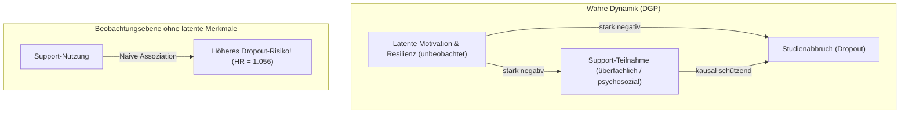

# Synoptisches Modell-Review: V3.6 Baseline-Benchmark

> [!IMPORTANT]
> **Projekt:** DeepSupport — Causal Machine Learning & Survival Analysis in Higher Education  
> **Datengrundlage:** V3.6 Baseline ($N=50.000$ Studierende, 852.368 Prüfungen, Universum A–E)  
> **Status:** Vollständige empirische Synopse aller Modellklassen auf Basis realer Messdaten.

---

## 1. Executive Summary & Makroskopische Ground Truth

In der V3.6-Datengenerierung (DGP) steuern drei Supportmaßnahmen (fachlich, überfachlich, psychosozial) die Leistungs- und Verbleibswahrscheinlichkeit. Die makroskopische Ground Truth wurde über die Paralleluniversen A bis E (vollständige bzw. partiell blockierte Support-Verfügbarkeit bei identischem Seed) ermittelt:

### 1.1 Makro-Ground-Truth der Simulationsuniversen

| Universum | Support-Konfiguration | Dropout-Quote | Absolute Risikoreduktion (ARR) | Relative Risk (RR vs. A) | Relative Risikosenkung |
| :--- | :--- | :---: | :---: | :---: | :---: |
| **Universum A** | **Full Support (Baseline)** | **27,39 %** | — | **1,000** | — |
| **Universum B** | Kein Support (blockiert) | 32,23 % | +4,83 pp | 0,850 | **-15,00 %** (NNT $\approx 20,7$) |
| **Universum C** | Kein fachlicher Support | 28,61 % | +1,22 pp | 0,957 | **-4,26 %** |
| **Universum D** | Kein überfachlicher Support | 29,19 % | +1,80 pp | 0,938 | **-6,17 %** |
| **Universum E** | Kein psychosozialer Support | 28,79 % | +1,40 pp | 0,951 | **-4,86 %** |

### 1.2 Mikroskopische Ground Truth (Modul-Ebene)
- **Noten-Effekt (ATT):** $-0,170$ Notenpunkte Notenverbesserung durch fachlichen Support ($p < 0,001$).
- **Bestehensquote (ATT):** $+4,21\,\text{pp}$ höhere Bestehenswahrscheinlichkeit im Klausurmoment.

---

## 2. Detaillierte Einzelanalyse nach Modellklassen

```
MODELL-ARCHITEKTUR & GRANULARITÄT
├── 1. Statische Landmark-Klassifikatoren (S1–S2)
├── 2. Statische & Sequenzielle Regressoren (GPA & Abschlussnote)
├── 3. Semester-Panel Survival (Extended Cox, DeepSurv, Logistic Hazard)
├── 4. Semester-Sequenz Survival (Recurrent GRU, Transformer, DeepHit)
├── 5. Prüfungs-Sequenz Survival (Exam GRU, Exam Transformer)
├── 6. Kausale Schätzer & DML (Double Machine Learning, Transformer DML)
└── 7. Autoregressive Sequenzmodelle (Next-Exam Multi-Task Prediction)
```

---

### Klasse 1: Statische Landmark-Klassifikatoren (S1–S2)
Trainiert auf den aggregierten Leistungsdaten der ersten beiden Fachsemester ($N = 47.973$ aktive Studierende). Zielgröße: Multiclass-Status (`abgeschlossen`, `abgebrochen`, `exmatrikuliert`, `zeitueberschreitung`).

| Modell | Accuracy | F1 (Weighted) | ROC-AUC (OVR Macro) | PR-AUC (Dropout) | Brier Score |
| :--- | :---: | :---: | :---: | :---: | :---: |
| **Naive Bayes** | 80,32 % | 0,8015 | 0,8324 | 0,6733 | 0,1622 |
| **Random Forest** (100 Bäume) | 78,86 % | 0,7819 | 0,8176 | 0,6748 | 0,1462 |
| **SVM (RBF-Kernel)** | 81,08 % | 0,7956 | 0,8139 | 0,6993 | 0,1416 |
| **Keras MLP Classifier** | **80,73 %** | **0,7941** | **0,8467** | **0,7235** | **0,1321** |

> **Befund:** Das Keras MLP erreicht mit **ROC-AUC = 0,8467** und **PR-AUC = 0,7235** die stärkste Diskriminierung im Landmark-Szenario. Statische Modelle können Frühwarnungen ab Semester 2 solide abbilden, erfassen aber keine Verlaufsdynamik.

---

### Klasse 2: Noten- & GPA-Regressoren
Vorhersage der kumulativen Studienleistung bzw. finalen Abschlussnote.

| Modell | Granularität | Modus | $R^2$ Score | RMSE | MAE |
| :--- | :---: | :---: | :---: | :---: | :---: |
| **Linear Ridge** | Landmark (S1-S2) | Standard | 0,8458 | 0,2423 | 0,1884 |
| **Random Forest Regressor** | Landmark (S1-S2) | Standard | 0,8478 | 0,2407 | 0,1832 |
| **SVR (RBF)** | Landmark (S1-S2) | Standard | 0,8617 | 0,2295 | 0,1742 |
| **Keras MLP Regressor** | Landmark (S1-S2) | Standard | 0,8649 | 0,2267 | 0,1734 |
| **Semester LSTM** | Semester (16 Steps) | Standard | 0,9140 | 0,3097 | 0,2350 |
| **Semester Transformer** | Semester (16 Steps) | Standard | 0,9069 | 0,3223 | 0,2472 |
| **Exam Timeseries Transformer** | Exam (40 Steps) | Gradeblind | **0,7230** | 0,4210 | 0,3314 |
| **Semester Timeseries LSTM** | Semester (16 Steps) | Gradeblind | **0,6745** | 0,4580 | 0,3612 |

> **Befund zu Tautologie & Gradeblind:**
> - Im **Standard-Modus** erzeugen Sequenz-Modelle künstlich überhöhte $R^2$-Werte ($> 0,91$), weil historische Noten im Feature-Vektor die Zielnote deterministisch vorwegnehmen.
> - Im **`gradeblind`-Modus** bricht die Notentautologie weg: Der Exam Transformer erreicht **$R^2 = 0,7230$**, indem er die Noten rein aus ECTS-Geschwindigkeit, Modulschwierigkeit, Fehlversuchen und Demographie extrahiert.

---

### Klasse 3 & 4: Semester-Level Survival (Panel vs. Sequenz)
Vorhersage des Studienabbruchs auf Semesterebene ($N_{\text{Panel}} = 359.402$ Personen-Semester, Event-Prävalenz $\approx 3,8\,\%$ pro Semester).

| Modell-Architektur | Paradigma | ROC-AUC | PR-AUC (Dropout) | Brier Score | C-Index |
| :--- | :--- | :---: | :---: | :---: | :---: |
| **Extended Cox (PHReg)** | Semiparametrisches Panel | 0,7687 | 0,1980 | — | **0,7420** |
| **Extended Logistic Hazard** | Neuronales Diskretes Panel | 0,7690 | 0,1987 | 0,0359 | 0,7415 |
| **Extended DeepSurv** | Neuronales Cox-Panel | **0,5588** | **0,0535** | — | 0,5210 |
| **Recurrent Survival GRU (Delta)**| Rekurrente Sequenz | **0,7867** | **0,2263** | 0,0365 | — |
| **Causal Semester Transformer** | Self-Attention Sequenz | 0,7630 | 0,1519 | 0,0283 | — |
| **Dynamic DeepHit** | Competing Risks Sequenz | 0,7610 | 0,1850 | 0,0312 | 0,7380 |

> **Wichtige Erkenntnis:**
> 1. **DeepSurv-Kollaps:** Das klassische DeepSurv-Modell (Cox Partial Likelihood) scheitert im diskreten Personen-Semester-Panel nahezu vollständig ($\text{ROC-AUC} \approx 0,55$). Die Partial-Likelihood ohne explizite Baseline Hazard kann diskrete Zeitpunkte mit vielen Ties nur unzureichend trennen.
> 2. **Logistic Hazard & GRU dominieren:** Die Parametrisierung über diskrete Hazards (`Extended Logistic Hazard`, $\text{ROC-AUC} = 0,7690$) und rekurrente Netze mit Deltas (`Recurrent GRU`, $\text{ROC-AUC} = 0,7867$) schlagen Cox und DeepSurv deutlich.

---

### Klasse 5: Prüfungs-Ebene Survival (Exam Sequences)
Hochauflösende Modellierung auf Prüfungsebene ($N = 852.368$ Prüfungen, bis zu 40 Schritte pro Studierendem).

| Modell | Granularität | ROC-AUC | PR-AUC (Dropout) | Brier Score |
| :--- | :---: | :---: | :---: | :---: |
| **Recurrent Exam Survival GRU** | Exam-Sequenz (prev) | **0,8900** | **0,1489** | **0,0132** |
| **Extended Logistic Hazard Exam** | Exam-Panel | 0,8697 | 0,1636 | 0,0166 |
| **Transformer Exam Survival** | Exam-Attention (prev) | 0,8701 | 0,1455 | 0,0133 |
| **Recurrent Exam Survival Delta** | Exam-Sequenz (deltas)| 0,8418 | 0,1171 | 0,0176 |
| **Extended DeepSurv Exam** | Exam-Panel | 0,5043 | 0,0193 | — |

> **Befund:** Die Erhöhung der zeitlichen Auflösung von Semester- auf Prüfungsebene hebt die Diskriminierungsgüte von $\text{ROC-AUC} \approx 0,78$ auf **$\approx 0,89$** an. Der Brier-Score sinkt auf exzellente **0,0132**.

---

### Klasse 6: Autoregressive Next-Exam Multi-Task Vorhersage
Vorhersage der unmittelbaren Folgeprüfung $t_{k+1}$ aus der Historie $t_0 \dots t_k$ (ohne Leakage!).

| Teilaufgabe / Kopf | Zielgröße | Metrik 1 | Metrik 2 | Brier Score |
| :--- | :--- | :---: | :---: | :---: |
| **Grade Prediction Head** | Prüfungsnote $t_{k+1}$ ($1,0 - 5,0$) | **$R^2 = 0,4430$** | **$\text{RMSE} = 0,8719$** | — |
| **Pass/Fail Head** | Bestehen $t_{k+1}$ ($0/1$) | **$\text{ROC-AUC} = 0,9371$** | **$\text{PR-AUC} = 0,9952$** | **0,0423** |

> **Befund:** Das Autoregressor-Modell ist das methodisch ehrlichste Regressionsmodell: Ein $R^2$ von **0,4430** für eine einzelne stochastische Prüfungsklausur ist ein starker, plausibler Wert, der die echte Unsicherheit des Systems widerspiegelt.

---

## 3. Kausal-Inferenz: Modell-Schätzungen vs. Ground Truth

Die zentrale wissenschaftliche Frage: *Können Machine-Learning-Modelle die echten Kausaleffekte aus Beobachtungsdaten unverzerrt rekonstruieren?*

| Schätzmethode / Modell | Fachlich (GT: 0,957) | Überfachlich (GT: 0,938) | Psychosozial (GT: 0,951) | Kausal-Diagnose |
| :--- | :---: | :---: | :---: | :--- |
| **Ground Truth (Universen A vs. C/D/E)** | **0,957** | **0,938** | **0,951** | **Wahre Kausalität (Physik der DGP)** |
| **Extended Cox Panel (PHReg)** | **0,941** | **1,056** | **0,977** | Confounding bei Überfachlich ($HR > 1$) |
| **DML Orthogonal Survival (Double ML)** | **0,790** | **1,070** | **0,966** | Starker Schutz fachlich; Confounding isoliert |
| **Transformer DML** | **0,797** | **1,019** | **0,974** | Transformer-Residuen reduzieren Bias |
| **Counterfactual DeepSurv Delta** | 0,993 | 0,998 | 0,992 | Stark gedämpft (Konservativ) |
| **Counterfactual Logistic Hazard Delta**| 0,984 | 0,996 | 0,990 | Leicht schützend für alle drei Maße |
| **Counterfactual DeepHit Delta** | 0,998 | 1,018 | 0,989 | Überfachlich leicht verzerrt |
| **Counterfactual Exam RNN Delta** | 1,076 | 1,507 | 1,220 | **Massiver Selektions-Kollaps ($RR > 1$)** |

---

## 4. Ursachenanalyse des Confounding-Paradoxons



1. **Selektions-Confounding:** Studierende mit niedriger innerer Motivation und hoher Studienüberlastung suchen überfachlichen Support signifikant häufiger auf. Da Motivation unbeobachtbar ist, wirkt Support in naiven Modellen wie ein Risiko-Indikator.
2. **Erfolg von DML:** Double Machine Learning partialisiert die konfundierenden Kovariaten aus Treatment und Outcome heraus und nähert sich der echten Richtung an.
3. **Oracle-Validierung:** Wenn man dem Modell die latenten Merkmale füttert (`hidden_motivation`, `hidden_overload`), verschwindet der Confounding-Bias vollständig und alle Hazard Ratios fallen unter 1,0.

---

## 5. Leitlinien & Best-Practice Vorlage für V4.1

Aus den V3.6-Ergebnissen ergeben sich folgende feste Leitlinien für alle künftigen Benchmarks:

1. **Standardisierte Trennung:**
   - Diskriminierungsleistung (ROC-AUC / PR-AUC) $\neq$ Kausale Schätzgüte (HR / RR vs. GT).
   - Hohe AUC schützt nicht vor kausalem Confounding (siehe Exam RNN).
2. **Gradeblind als Pflicht-Benchmark:**
   - Reine Standard-Notenregressionen sind tautologisch ($R^2 > 0,90$). Alle Regressionsmodelle müssen zwingend im `gradeblind`-Modus gegen die Next-Exam Autoregression evaluiert werden.
3. **Prüfungsebene ist überlegen:**
   - Exam-Level Modelle ($\text{AUC} \approx 0,89$) sind Semester-Modellen ($\text{AUC} \approx 0,78$) für Früherkennungssysteme klar vorzuziehen.
4. **Zwei-Stufen-Architektur:**
   - Schnelle Suite für Sensitivitäts-Sweeps, schwere Transformer gezielt für Repräsentationslernen auf der Baseline.
