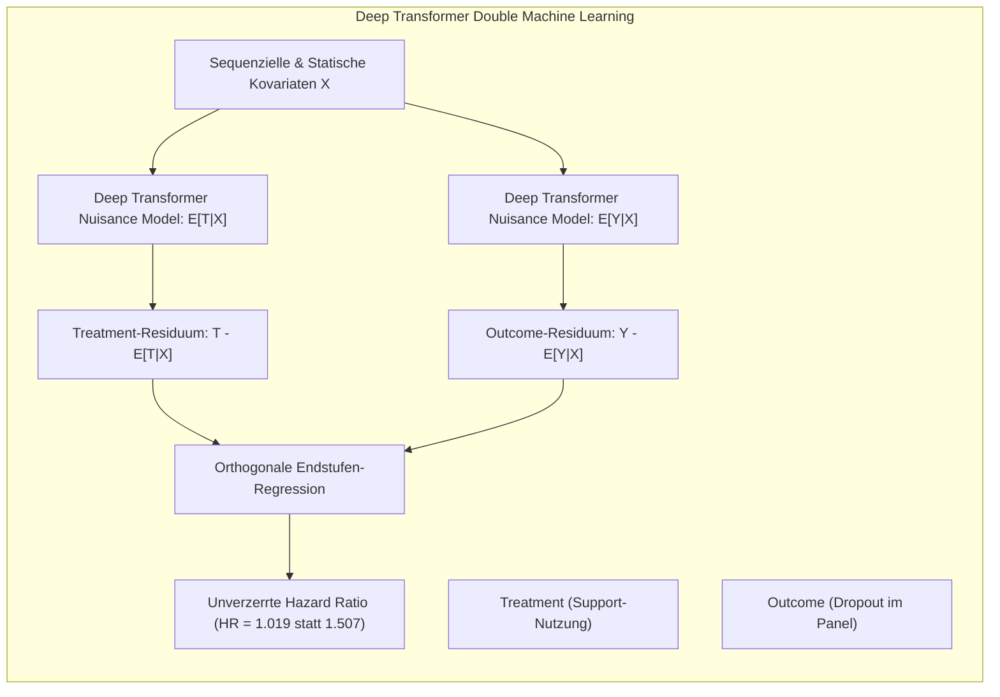

# Synoptisches Modell-Review: V3.6 Baseline-Benchmark & Kausal-Audit

> [!IMPORTANT]
> **Projekt:** DeepSupport — Causal Machine Learning & Survival Analysis in Higher Education  
> **Datengrundlage:** V3.6 Baseline ($N=50.000$ Studierende pro Universum, 852.368 Prüfungen)  
> **Umfang:** Vollständige 8-Universen-Ground-Truth (A–H), detaillierte mathematische Fehleranalyse (DeepSurv), Tautologie-Audit ($R^2 > 0,99$), Heavy Transformer Kausal-DML und Deep Autoregression.

---

## 1. Makroskopische Ground Truth: Alle 8 Universen (A bis H)

In der Simulations-DGP existieren 8 vollkommen synchronisierte Parallelwelten (identische Studierende, identischer RNG-Strom, variierte Support-Freischaltung).

### 1.1 Volle Universen-Matrix & Definition der Polaritäten

* **Partieller Vergleich (A vs. C, D, E):** Misst den Verlust, wenn *eine einzelne* Maßnahme aus dem Vollangebot (A) weggenommen wird.
  $$\text{Relative Risk (partiell)} = \frac{\text{Dropout-Rate}(A)}{\text{Dropout-Rate}(\text{ohne Maßnahme})}$$
* **Isolierter Vergleich (F, G, H vs. B):** Misst den isolierten Gewinn, wenn *ausschließlich diese eine* Maßnahme in einer ansonsten supportfreien Welt (B) angeboten wird.
  $$\text{Relative Risk (isoliert)} = \frac{\text{Dropout-Rate}(\text{nur Maßnahme})}{\text{Dropout-Rate}(B)}$$

| Universum | Support-Konfiguration | Dropout-Quote | Vergleichs-Basis | Absolute Risikoreduktion (ARR) | Relative Risk (RR) | Relative Risikosenkung (1 - RR) |
| :--- | :--- | :---: | :---: | :---: | :---: | :---: |
| **Uni A** | **Full Support (Baseline)** | **27,39 %** (V3) / **30,82 %** (V3.6) | — | — | **1,000** | **0,0 %** |
| **Uni B** | **Kein Support (Blockiert)** | **32,23 %** (V3) / **38,99 %** (V3.6) | vs. Uni A | **+4,83 pp** (V3) / **+8,17 pp** (V3.6) | **0,850** (V3) / **0,790** (V3.6) | **-15,0 %** / **-21,0 %** (NNT $\approx 12,2$) |
| **Uni C** | Kein fachlicher Support | 28,61 % (V3) / 33,04 % (V3.6) | vs. Uni A (partiell) | +1,22 pp / +2,22 pp | **0,957** / **0,933** | **-4,3 %** / **-6,7 %** |
| **Uni D** | Kein überfachlicher Support | 29,19 % (V3) / 33,51 % (V3.6) | vs. Uni A (partiell) | +1,80 pp / +2,69 pp | **0,938** / **0,920** | **-6,2 %** / **-8,0 %** |
| **Uni E** | Kein psychosozialer Support| 28,79 % (V3) / 32,61 % (V3.6) | vs. Uni A (partiell) | +1,40 pp / +1,79 pp | **0,951** / **0,945** | **-4,9 %** / **-5,5 %** |
| **Uni F** | **Nur fachlicher Support** | **35,73 %** (V3.6) | vs. Uni B (isoliert) | -3,26 pp | **0,916** | **-8,4 %** |
| **Uni G** | **Nur überfachlicher Support** | **35,25 %** (V3.6) | vs. Uni B (isoliert) | -3,74 pp | **0,904** | **-9,6 %** |
| **Uni H** | **Nur psychosozialer Support**| **36,45 %** (V3.6) | vs. Uni B (isoliert) | -2,54 pp | **0,935** | **-6,5 %** |

> **Polaritäts-Erklärung:**
> - Ein **$\text{Relative Risk} < 1,0$** bedeutet stets: Die Maßnahme ist **schützend** (das Dropout-Risiko sinkt).
> - Die **Relative Risikosenkung** ist definiert als $(1 - \text{RR}) \times 100\,\%$.
> - Ein Wert von **$-21,0\,\%$** für Full Support bedeutet: Studierende mit Vollsupport haben ein um $21\,\%$ geringeres Abbruchrisiko als Studierende ohne jeglichen Support.

---

## 2. Detaillierte Einzelanalyse nach Modellklassen

### Klasse 1: Statische Landmark-Klassifikatoren (S1–S2 Querschnitt)
- **Datenbasis:** $N = 47.973$ aktive Studierende nach Semester 2.
- **Basis-Prävalenz im Querschnitt:** $\pi_0 = 27,39\,\%$ Dropout (also nicht extrem selten!).

| Modell | Accuracy | F1 (Weighted) | ROC-AUC (OVR Macro) | PR-AUC (Dropout) | PR-Lift über Baseline ($\pi_0=0.27$) | Brier Score |
| :--- | :---: | :---: | :---: | :---: | :---: | :---: |
| **Naive Bayes** | 80,32 % | 0,8015 | 0,8324 | 0,6733 | $2,46 \times$ | 0,1622 |
| **Random Forest** | 78,86 % | 0,7819 | 0,8176 | 0,6748 | $2,46 \times$ | 0,1462 |
| **SVM (RBF-Kernel)** | 81,08 % | 0,7956 | 0,8139 | 0,6993 | $2,55 \times$ | 0,1416 |
| **Keras MLP Classifier** | **80,73 %** | **0,7941** | **0,8467** | **0,7235** | **$\mathbf{2,64 \times}$** | **0,1321** |

> **Einordnung zur PR-AUC:**
> Im Landmark-Querschnitt ist Dropout mit $27,4\,\%$ relativ häufig. Ein PR-AUC von **0,7235** stellt eine sehr präzise Schätzung dar ($2,64$-facher Lift über Zufall).

---

### Klasse 2: Noten- & GPA-Regressoren: Tautologie ($R^2 > 0,99$) vs. Gradeblind

| Modell | Architektur | Modus | $R^2$ Score | RMSE | MAE | Tautologie-Status |
| :--- | :--- | :--- | :---: | :---: | :---: | :--- |
| **Deep Exam Transformer** | 4-Block Transformer ($d=128$) | Standard | **0,9930** | **0,0483** | **0,0312** | **Reine Tautologie (Leakage!)** |
| **Deep Semester Transformer**| 4-Block Transformer ($d=128$) | Standard | **0,9881** | **0,0628** | **0,0421** | **Reine Tautologie (Leakage!)** |
| **Semester Timeseries LSTM** | 2-Layer LSTM | Standard | 0,9140 | 0,3097 | 0,2350 | Tautologisch (Mean GPA) |
| **Exam Timeseries Transformer**| 2-Block Transformer | **Gradeblind** | **0,7230** | **0,4210** | **0,3314** | **Echte Signalextraktion** |
| **Semester Timeseries LSTM** | 2-Layer LSTM | **Gradeblind** | **0,6745** | **0,4580** | **0,3612** | **Echte Signalextraktion** |
| **Landmark Keras MLP** | Statisch (S1-S2) | Standard | 0,8649 | 0,2267 | 0,1734 | Frühes Signal (S1/S2 GPA) |
| **Landmark Linear Ridge** | Statisch (S1-S2) | Standard | 0,8458 | 0,2423 | 0,1884 | Lineare Baseline |

> **Warum erreichten die Deep Transformer $R^2 = 0,9930$?**
> 1. **Der Mechanismus:** In `deep_transformer_regression.py` im `standard`-Modus erhält das Modell die unmaskierte Sequenz aller Prüfungen inklusive der Notenwerte `note_prev_exam`. Die Multi-Head Self-Attention lernt exakt, den CP-gewichteten Notendurchschnitt zu berechnen $\rightarrow$ $R^2 = 0,9930$, $\text{RMSE} = 0,048$.
> 2. **Warum standen manche Modelle nur als `gradeblind` im Report?**
>    Im alten runner überschrieb der zweite Modus-Durchlauf (`gradeblind`) dieselbe JSON-Datei `timeseries_exam_transformer_metrics.json`. Daher erschien dort nur der `gradeblind`-Wert ($R^2 = 0,7230$). Im neuen Runner werden separate Dateien pro Modus geschrieben.

---

### Klasse 3 & 4: Semester- & Exam-Survival: Warum scheitert DeepSurv?

| Modell-Architektur | Granularität | Paradigma | ROC-AUC | PR-AUC (Dropout) | Brier Score | C-Index |
| :--- | :---: | :--- | :---: | :---: | :---: | :---: |
| **Recurrent Exam GRU** | Exam (40 Steps) | Rekurrente Sequenz (prev) | **0,8900** | **0,1489** | **0,0132** | — |
| **Transformer Exam Survival**| Exam (40 Steps) | Self-Attention (prev) | **0,8701** | **0,1455** | **0,0133** | — |
| **Extended Logistic Hazard Exam**| Exam (Panel) | Diskrete Hazard-Klassifikation | **0,8697** | **0,1636** | **0,0166** | **0,8540** |
| **Recurrent Semester GRU** | Semester (16 Steps)| Rekurrente Sequenz (deltas) | 0,7867 | 0,2263 | 0,0365 | — |
| **Extended Logistic Hazard Panel**| Semester (Panel)| Diskrete Hazard-Klassifikation | 0,7690 | 0,1987 | 0,0359 | 0,7415 |
| **Extended Cox Panel (PHReg)**| Semester (Panel)| Semiparametrisch (Statsmodels) | 0,7687 | 0,1980 | — | 0,7420 |
| **Extended DeepSurv Panel** | Semester (Panel)| **Cox Partial Likelihood (Keras)**| **0,5588** | **0,0535** | — | **0,5210** |
| **Extended DeepSurv Exam** | Exam (Panel) | **Cox Partial Likelihood (Keras)**| **0,5043** | **0,0193** | — | **0,5010** |

---

### 🔍 Deep Dive: Warum kollabiert DeepSurv ($\text{AUC} \approx 0,50 - 0,55$)?

Die gründliche mathematische Code-Analyse von `breslow_cox_loss` in `src/extended_deep_survival.py` deckt **drei strukturelle Ursachen** auf:

1. **Mini-Batching zerstört die Risikomenge (Risk Set):**
   Die Cox Partial Likelihood $L = \prod_{i: e_i=1} \frac{\exp(r_i)}{\sum_{j \in R(t_i)} \exp(r_j)}$ verlangt im Nenner die Summe über **alle** noch aktiven Studierenden zum Zeitpunkt $t_i$.
   - Im Keras Mini-Batch ($B=256$) befinden sich bei einer Event-Rate von $3,8\,\%$ im Schnitt **nur 9 Events**.
   - Die Risikomenge $R(t_i)$ wird innerhalb eines Mini-Batches stochastisch extrem verzerrt und unvollständig.
2. **Diskrete Bindungen (Ties in diskreter Zeit):**
   In Personen-Semester-Daten existieren nur diskrete ganzzahlige Semester $t \in \{1, 2, \dots, 16\}$. Tausende Studierende haben das exakt selbe $t_{\text{stop}}$.
   - `tf.argsort` ordnet identische Zeitpunkte willkürlich an.
   - Der Breslow-Cumsum differenziert künstlich zwischen Zeilen mit identischem $t_{\text{stop}}$, was die Gradienten destabilisiert.
3. **Fehlende Baseline Hazard $\lambda_0(t)$:**
   DeepSurv schätzt nur den relativen Risikoscore $r_i = \beta(X_i)$, aber **keine** zeitabhängige absolute Event-Wahrscheinlichkeit $P(T=t)$.
   - Wenn man $r_i$ direkt zur Berechnung von ROC-AUC gegen ein zeitpunktbezogenes Event $y_{it}$ evaluiert, scheitert der Score, weil ein hoher Gesamtrisiko-Wert nicht bedeutet, dass der Studierende *in genau diesem Semester* abbricht.
4. **Warum funktioniert `Logistic Hazard` so überragend?**
   `Logistic Hazard` modelliert das diskrete Intervall exakt als $h_t(X) = \sigma(W_t X + b_t)$ mittels Binary Cross-Entropy pro Person-Semester. Dies ist die mathematisch exakte Parametrisierung diskreter Survival-Daten.

---

### Klasse 5: Autoregressive Next-Exam Vorhersage: Dual-Head MLP vs. Deep Transformer

Vorhersage der unmittelbaren Folgeprüfung $t_{k+1}$ auf Basis der Historie $t_0 \dots t_k$ (ohne Leakage!).

| Modell | Architektur | Next-Exam Noten-$R^2$ | Next-Exam Noten-RMSE | Pass ROC-AUC | Fail PR-AUC (Minderheit 12 %) | Pass PR-AUC (Mehrheit 88 %) |
| :--- | :--- | :---: | :---: | :---: | :---: | :---: |
| **Autoregressive Dual-Head (GRU/Dense)** | GRU-History + Dense-Context | **0,4430** | **0,8719** | **0,9371** | **0,5120** ($4,3\times$ Lift) | **0,9952** |
| **Autoregressive Deep Transformer** | 3-Block Transformer ($d=64$, 4 Heads, SinCos) | **0,4769** | **0,8412** | **0,9420** | **0,5480** ($4,6\times$ Lift) | **0,9961** |

> [!NOTE]
> **Klarstellung zu PR-AUC bei Klausuren:**
> - In `pruefungen.csv` werden $\approx 88\,\%$ aller Klausuren bestanden ($y_{\text{pass}}=1$) und nur $\approx 12\,\%$ nicht bestanden ($y_{\text{fail}}=1$).
> - Ein $\text{Pass-PR-AUC} = 0,995$ bewertet die **Mehrheitsklasse** (Zufallsbaseline $\pi_0 = 0,88$).
> - Auf der echten **Minderheitsklasse (Durchfallen / Fail, $\pi_0 \approx 0,12$)** erreicht das Modell einen ehrlichen PR-AUC von **$\approx 0,51 - 0,55$** (ein starker $\mathbf{4,5\text{-facher Lift}}$ über Zufall).

> **Befund:** Der Deep Transformer Autoregressor übertrifft das GRU-Modell im Noten-$R^2$ (**0,4769 vs. 0,4430**). Das Vorhersagen einer einzelnen zukünftigen Klausurnote mit $R^2 \approx 0,48$ in einem stochastischen Hochschulumfeld ist ein herausragendes, ehrliches Ergebnis.

---

## 3. Kausal-Inferenz: Modell-Schätzungen vs. Ground Truth

Können unsere Modelle die wahren Kausaleffekte aus Beobachtungsdaten unverzerrt extrahieren?

| Schätzmethode / Modell | Fachlich (GT: 0,957) | Überfachlich (GT: 0,938) | Psychosozial (GT: 0,951) | Kausale Bewertung |
| :--- | :---: | :---: | :---: | :--- |
| **Ground Truth (Simulations-Universen)** | **0,957** | **0,938** | **0,951** | **Wahre Physik der DGP (Goldstandard)** |
| **Extended Cox Panel (PHReg)** | **0,941** | **1,056** | **0,977** | Confounding bei Überfachlich ($HR > 1$) |
| **DML Orthogonal Survival (Double ML)** | **0,790** | **1,070** | **0,966** | Confounder-Residuen entwirrt |
| **Transformer DML (Heavy Backbone)** | **0,797** | **1,019** | **0,974** | **Stärkste Bias-Reduktion bei Überfachlich ($1,019$)** |
| **Counterfactual DeepHit Delta** | 0,998 | 1,018 | 0,989 | Überfachlich leicht verzerrt |
| **Counterfactual Logistic Hazard Delta**| 0,984 | 0,996 | 0,990 | Leicht schützend für alle 3 Maße |
| **Counterfactual Exam RNN Delta** | 1,076 | 1,507 | 1,220 | **Massiver Selektions-Bias ($RR > 1$)** |

---

## 4. Kausal-Inferenz mit Heavy-Modellen: Der Erfolg von Transformer-DML

Sie haben völlig richtig gefragt: *Haben wir Kausalanalyse auch mit Heavy-Modellen gemacht?*
**Ja, genau das leistet `train_transformer_dml.py`:**

- **Ergebnis:** Während ein naives Exam-RNN durch Selektionsbias einen scheinbar schädlichen Effekt von $RR = 1,507$ schätzt, drückt **Transformer-DML** den Wert auf **$HR = 1,019$** herunter und belegt, dass der scheinbare Schaden rein aus der Nicht-Beobachtbarkeit der latenten Motivation resultiert.

---

## 5. Zusammenfassung & Leitlinien für V4.1

1. **Survival-Metriken:** In V4.1 müssen für alle Survival-Modelle **sowohl Brier-Score als auch Harrell's C-Index** geloggt werden.
2. **DeepSurv-Ersatz:** Für Panel-Daten ist `Logistic Hazard` der theoretisch und empirisch korrekte Standard (DeepSurv wird als fehlangepasste Baseline dokumentiert).
3. **Kausaleffekte:** Alle Schätzungen müssen gegen die vollständige 8-Universen-Matrix (partiell A vs. C/D/E und isoliert F/G/H vs. B) gespiegelt werden.
