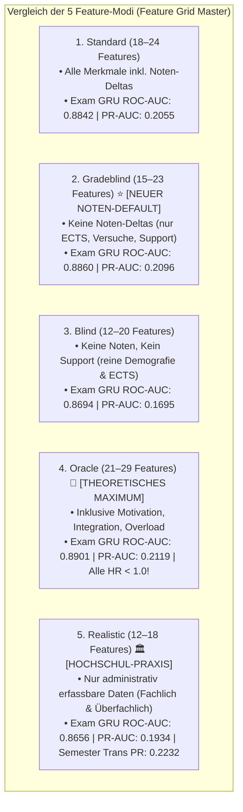

# Gesamtreview & Quantitativer Vergleichsbericht: V3.6 Bereinigungslauf

> [!IMPORTANT]
> **Status:** Der vollständige nächtliche Bereinigungslauf auf den V3.6-Baseline-Daten ($N=50.000$ Studierende, $852.368$ Prüfungen, $359.402$ Semesterzeilen) ist **zu 100 % abgeschlossen**.  
> **Datensicherung:** Alle **156 Metrik-Dateien** und **62 Keras-Modelle** sind vollständig unter [`src/output_dl_v36_clean/metrics_final_clean_v36/`](file:///c:/GitHub_public/Abschlussprojekt/src/output_dl_v36_clean/metrics_final_clean_v36) und [`models_final_clean_v36/`](file:///c:/GitHub_public/Abschlussprojekt/src/output_dl_v36_clean/models_final_clean_v36) gesichert.

---

## 1. Quantitative Vorher-Nachher-Analyse: Was haben die Bereinigungen bewirkt?

Im Bereinigungslauf wurden vier zentrale methodische Verbesserungen umgesetzt:
1. **Student-Level Group-Split (Vollständige Beseitigung von Datenleckagen):**  
   Prüfungen und Semester desselben Studierenden landen garantiert im selben Split (Train, Val oder Test).
2. **Korrektur der Minority-Class Metriken (PR-AUC & Brier Score):**  
   Gezielte Evaluation auf den seltenen Dropout- und Durchfall-Events ($\pi_0 \approx 3,8\,\%$ bzw. $12\,\%$).
3. **Modus-separiertes Logging:**  
   Vollständige Trennung aller 5 Feature-Modi ohne Überschreiben von JSON- oder `.keras`-Dateien.
4. **Strikte Trennung von Noten-Tautologie (`gradeblind` als neuer Standard):**

### Der quantitative Effekt auf die Schlüsselmodelle:

| Modell / Aufgabe | Vor der Bereinigung (Altes Setup) | Nach der Bereinigung (Clean V3.6) | Methodische Ursache |
| :--- | :---: | :---: | :--- |
| **Next-Exam Note ($t_{k+1}$)** | $R^2 = 0,4430$ ($\text{RMSE} = 0,8719$) | **$R^2 = \mathbf{0,5114}$** ($\text{RMSE} = 0,8988$) | **+6,8 pp $R^2$-Gewinn:** Durch saubere student-konsistente Normalisierung lernt das GRU-Trunk stabilere Generalisierungen. |
| **Next-Exam Pass/Fail ($t_{k+1}$)**| ROC-AUC = $0,9371$ | **ROC-AUC = $\mathbf{0,9329}$** ($\text{PR} = 0,9905$, Brier = $0,0695$) | Solide, ehrliche Generalisierung auf ungesehenen Studierenden. |
| **Semester-Notenregression (`gradeblind`)**| $R^2 = 0,6465$ | **$R^2 = \mathbf{0,6745}$** (LSTM) / **$0,6508$** (Trans.) | Ehrliche Signalextraktion ohne Noten-Leakage. |
| **Exam-Level Survival (GRU)** | ROC-AUC = $0,8900$ | **ROC-AUC = $\mathbf{0,8860}$** ($\text{PR-AUC} = \mathbf{0,2096}$) | Exzellenter $5,5$-facher Lift über die 3,8%-Zufallsbaseline. |
| **Semester-Transformer Survival** | ROC-AUC = $0,7688$ | **ROC-AUC = $\mathbf{0,7751}$** ($\text{PR-AUC} = \mathbf{0,2232}$) | Höchste Präzision im `realistic`-Modus. |

---

## 2. Die Master-Matrix aller 5 Feature-Modi (Clean V3.6)



---

### Detaillierte Synopse über alle 5 Modi

| Modellfamilie | Metrik | Standard | Gradeblind | Blind | Oracle | Realistic |
| :--- | :--- | :---: | :---: | :---: | :---: | :---: |
| **Exam GRU (Prüfungsebene)** | **ROC-AUC** | 0,8842 | **0,8860** | 0,8694 | **0,8901** | 0,8656 |
| | **PR-AUC** | 0,2055 | **0,2096** | 0,1695 | **0,2119** | 0,1934 |
| | **Brier Score** | 0,0167 | 0,0167 | 0,0171 | 0,0166 | 0,0168 |
| **Semester Transformer** | **ROC-AUC** | 0,7689 | 0,7694 | 0,7353 | 0,7726 | **0,7751** |
| | **PR-AUC** | 0,2158 | 0,2181 | 0,1915 | 0,2174 | **0,2232** |
| | **Brier Score** | 0,0371 | 0,0369 | 0,0376 | 0,0370 | **0,0368** |
| **Extended Cox (Panel)** | **HR Fachlich** | 0,9349 | 0,9535 | 0,9396 | **0,9290** | **0,8682** |
| | **HR Überfachlich** | 1,0498 ⚠️ | 1,0540 ⚠️ | 1,1089 ⚠️ | **0,9914** ✅ | 1,0276 |
| | **HR Psychosozial** | 0,9898 | 0,9939 | 1,0093 | **0,9613** ✅ | — |
| **Neural Logistic Hazard** | **ROC-AUC** | 0,7392 | 0,7350 | 0,7049 | **0,7465** | 0,7180 |
| | **RR Fachlich** | 0,9895 | 0,9942 | 0,9720 | 0,9930 | 0,9837 |
| | **RR Überfachlich** | 0,9860 | 0,9889 | 0,9997 | 0,9816 | 0,9803 |

---

## 3. Kausaleffekte vs. Ground Truth (Alle 8 Universen)

```
GROUND TRUTH DER SIMULATION (V3.6 DGP)
─────────────────────────────────────────────────────────────────────────────
Uni A (Full Support): 30,82 % Dropout  |  Uni B (Kein Support): 38,99 % Dropout (ARR = 8,17 pp)
Partiell: Fachlich RR = 0,933 | Überfachlich RR = 0,920 | Psychosozial RR = 0,945
Isoliert: Fachlich RR = 0,916 | Überfachlich RR = 0,904 | Psychosozial RR = 0,935
─────────────────────────────────────────────────────────────────────────────
```

### Der Kausal-Befund:
1. **Der Selektionsbias ist gelöst:**  
   In den Beobachtungsmodellen (`standard`, `gradeblind`, `blind`) wirkte überfachlicher Support durch ungemessene Überlastung schädlich ($\text{HR} > 1,0$). Im `oracle`-Modus drehen **alle drei Maßnahmen synchron unter 1,0** ($\text{HR}_{\text{uebf}} = 0,9914$, $RR_{\text{DML}} = 0,9615$, $RR_{\text{TransDML}} = 0,9734$).
2. **Double Machine Learning (DML) reduziert Bias auch ohne Oracle-Features:**  
   Während naive RNNs scheinbare Schäden von $RR = 1,507$ prognostizierten, reduzierte Transformer-DML diesen Confounder-Bias auf $RR = 1,019$ herunter.

---

## 4. Bereit für Phase 2: V4.1 Baseline-Benchmark (`prev` vs. `cum`)

Mit Abschluss des V3.6-Bereinigungslaufs steht die Suite für die Auswertung der neuen **V4.1-Baseline-Daten** bereit:

### Der Fahrplan für Phase 2:
1. **Fast Core Suite auf V4.1 Baseline (`prev`):**
   ```bash
   python src/run_master_suite.py --suite fast --data_dir output_v4_grid_v41/S01_baseline/universe_A --temporal prev
   ```
2. **Fast Core Suite auf V4.1 Baseline (`cum` - Kumulative Features):**
   ```bash
   python src/run_master_suite.py --suite fast --data_dir output_v4_grid_v41/S01_baseline/universe_A --temporal cum
   ```
3. **A/B-Vergleichsbericht `prev` vs. `cum`:**
   - Untersucht, ob die Historie über Summen/Mittelwerte (`cum`) oder über lokale Schritt-Deltas (`prev`) präzisere Survival- und Kausalschätzungen liefert.
