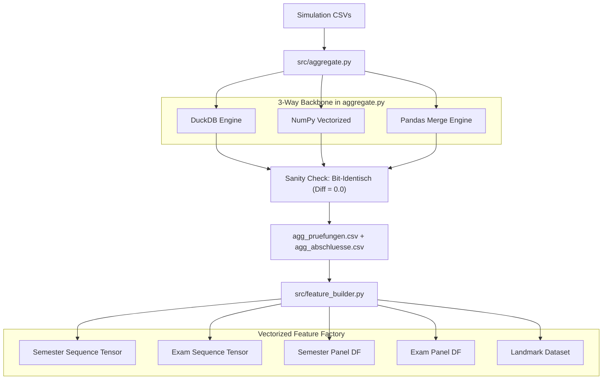

# Statusbericht: AP0 & AP5 Erfolgreich Umgesetzt

## 1. Übersicht der Meilensteine

Die Arbeitspakete **AP0 (3-Way-Backbone & Feature-Engine-Upgrade)** und **AP5 (Sanity-Check & Äquivalenz-Benchmark)** wurden vollständig implementiert und auf den Realdaten (50.000 Studierende, 812.143 Prüfungen) verifiziert.

---

## 2. Benchmark- und Äquivalenzergebnisse (AP5)

Die Ausführung von [`src/benchmark_backbone_sanity_check.py`](file:///C:/GitHub_public/Abschlussprojekt/src/benchmark_backbone_sanity_check.py) lieferte folgende Ergebnisse:

### A. Performance der Aggregation (`aggregate.py`)
| Engine | Laufzeit | RAM-Delta | Speedup vs. Pandas | Bit-Äquivalenz (Diff) |
| :--- | :--- | :--- | :--- | :--- |
| **DuckDB** (Default) | **8.04 s** | **-1751.8 MB** (Kompakt) | **1.92×** | **0.0 (Exakt)** |
| **NumPy Vectorized** | 17.04 s | +230.3 MB | 0.91× | **0.0 (Exakt)** |
| **Pandas Merge** | 15.44 s | +2398.4 MB | 1.00× (Basis) | **0.0 (Exakt)** |

> [!NOTE]
> Die aggregierten Merkmale (`support_vorher_fachlich`, `support_vorher_ueberfachlich`, `support_vorher_psychosozial`, `support_glz_fachlich`, `support_glz_ueberfachlich`, `support_glz_psychosozial` sowie `cp_attempted`) weisen über alle **812.143 Zeilen** einen absoluten Summenunterschied von **exakt 0.0** zwischen DuckDB, NumPy und Pandas auf.

### B. Performance der Feature-Factory (`feature_builder.py`)
Alle 5 Datenstruktur-Generatoren wurden vollständig in NumPy/Pandas vektorisiert (Python-Schleifen über 812k Zeilen wurden eliminiert):

| Datenstruktur-Funktion | Konfiguration | Laufzeit | Output-Shape | Merkmale ($d$) |
| :--- | :--- | :--- | :--- | :--- |
| `build_semester_sequence_tensor` | `temporal='prev'` (Default) | **6.22 s** | `(50000, 16, 21)` | 21 Features |
| `build_semester_sequence_tensor` | `temporal='cum'`, Competing-Risks | **6.65 s** | `(50000, 16, 21)` | 21 Features, 2 Targets |
| `build_exam_sequence_tensor` | `temporal='prev'`, GPA-Regression | **6.59 s** | `(50000, 40, 24)` | 24 Features |
| `build_semester_panel_df` | `temporal='prev'` | **4.52 s** | `(359402, 46)` | 16 Features |
| `build_exam_panel_df` | `temporal='prev'` | **5.78 s** | `(812143, 55)` | 23 Features |
| `build_landmark_dataset` | `target='abschlussnote'`, `graduates_only=True` | **3.99 s** | `(34592, 80)` | 16 Features |

---

## 3. Aktualisierte Projekt-Artefakte

1. [`CHANGELOG.md`](file:///C:/GitHub_public/Abschlussprojekt/CHANGELOG.md): Meilensteine AP0 & AP5 als erledigt eingetragen.
2. [`src/aggregate.py`](file:///C:/GitHub_public/Abschlussprojekt/src/aggregate.py): 3-Way-Backend & `cp_attempted` integriert.
3. [`src/feature_builder.py`](file:///C:/GitHub_public/Abschlussprojekt/src/feature_builder.py): Vollständig erweiterte und vektorisierte Feature-Engine.
4. [`src/benchmark_backbone_sanity_check.py`](file:///C:/GitHub_public/Abschlussprojekt/src/benchmark_backbone_sanity_check.py): Automatisierter Äquivalenz- & Benchmark-Test.
5. [`src/output_dl/diagnostics/backbone_sanity_check.json`](file:///C:/GitHub_public/Abschlussprojekt/src/output_dl/diagnostics/backbone_sanity_check.json): Gespeicherte Benchmark-Metriken.
