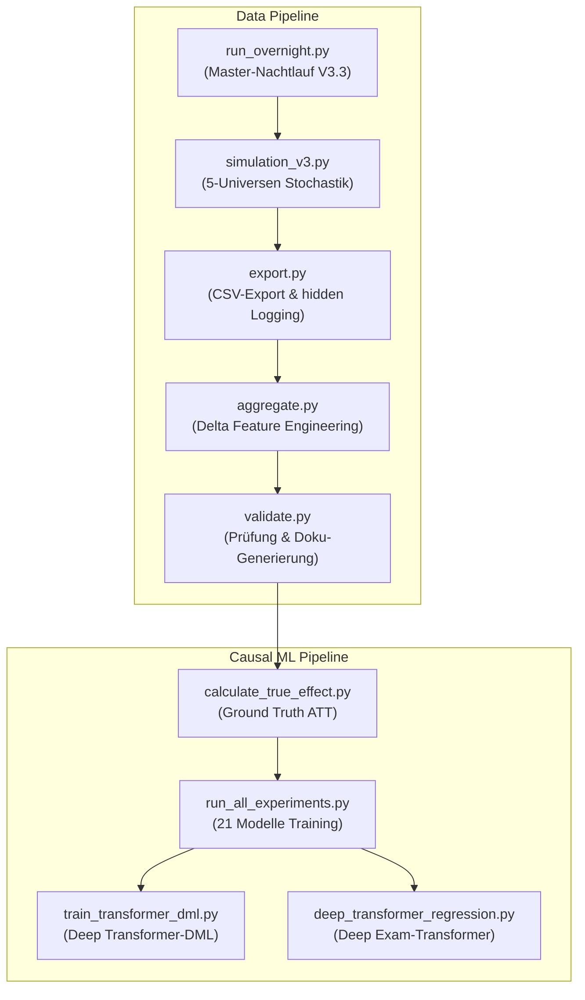

# DeepSupport: Wirksamkeitsanalyse von Hochschulsupport via Deep Learning & Causal Machine Learning

**Autor:** Wilfried Keller  
**Kontext:** Abschlussprojekt im Kurs *Deep Learning* (Dr. Bernd Ebenhoch)  
**Datum:** August 2026  

---

## KI-Transparenz & Methodischer Stack

Alle Inhalte dieses Projekts (Code-Architektur, Datengenerierungs-Engine, Modellierung, Kausalanalyse, Audits und Dokumentation) wurden in intensiver, transparenter Auseinandersetzung mit KI-Systemen entwickelt, überprüft, reviewed, korrigiert und erweitert.

- **Entwicklungsumgebung & Orchestrierung:** Antigravity IDE / Antigravity Agent
- **Integrierte LLM-Modelle (Pair Programming & Code Generation):** Gemini 3.1 Pro, Gemini 3.6 Flash, Claude Opus 4.6
- **Weitere KI-Tools & Exploration (via Mammouth.ai):** Claude Opus/Sonnet 5, ChatGPT 5.6, ChatGPT Sol, Kimi K2.5 / K3
- **Dokumentations-Artefakte:** Sämtliche Berichte, Reviews und Walkthroughs im Ordner `Artifacts/` sowie im System-Kontext sind direkte, transparente KI-generierte Audit-Protokolle.

---

## Projektübersicht & Kausale Herausforderung

Dieses Projekt analysiert datengetrieben die Wirksamkeit von Unterstützungsangeboten (z. B. fachliche Tutorien, überfachliche Workshops, psychosoziale Beratung) an Hochschulen.

Die Kernherausforderung liegt in der Auflösung des **Selektionsbias**, des **Time Availability Confoundings** und des **Immortal-Time-Bias**:
Da leistungsschwächere Studierende oder Studierende mit viel Erwerbstätigkeit (20h/Woche) an Supportmaßnahmen teilnehmen, kommen naive Machine-Learning-Modelle oft zu dem fehlerhaften Schluss, dass Support das Studienabbruch-Risiko erhöht (*Dropout-Paradoxon*).

### Methodischer Ansatz:
1. **5-Universen Counterfactual Simulator (V3.3):** Stochastische Simulation von 50.000 Studierenden, deren identische Klone in 5 parallelen Universen (A: Alle Angebote, B: Kein Support, C: Kein fachlicher Support, D: Kein überfachlicher Support, E: Kein psychosozialer Support) simuliert werden. In Version V3.3 wurde die Stochastik über **dedizierte RNG-Streams und index-basiertes Prüfungsrauschen** entkoppelt, um eine exakte kontrafaktische Vergleichbarkeit der Universen zu gewährleisten.
2. **Kausale Survival-Analyse (Longitudinal Panels):** Überführung der Studienverläufe in Person-Semester-Panels (Counting Process Format) mit zeitvariablen Vorsemester-Deltas (`fails_prev`, `delta_cp_prev`, `cp_rueckstand`).
3. **Double Machine Learning (DML) & Causal Transformer Benchmark:** Systematischer Vergleich von Standard-DML (Tabular Cox) und Causal Masked Transformer-DML zur Schätzung der kausalen Treatment-Effekte.

---

## Ergebnisse der Simulation & Modell-Evaluierung (V3.3)

### 1. Makroskopische Ground Truth (5 Universen × 50.000 Studierende)
| Universum | Konfiguration | Dropout-Rate | Relatives Risiko (RR) vs. A | Netto-Gerettete vs. A | Kausale Wirkung auf Makro-Ebene |
| :--- | :--- | :---: | :---: | :---: | :--- |
| **Universum A** | Baseline (Alle Support-Typen) | **27,37 %** | **1,0000** | — | Ausgangslage |
| **Universum B** | Kein Support (komplett blockiert) | **32,35 %** | **0,8462** | **+2.488** | **-15,38 % Risikoreduktion** (Support-Gesamtsystem schützt) |
| **Universum C** | Kein fachlicher Support | **28,57 %** | **0,9579** | **+601** | **-4,21 % Risikoreduktion** (Fachlicher Support schützt) |
| **Universum D** | Kein überfachlicher Support | **29,16 %** | **0,9387** | **+893** | **-6,13 % Risikoreduktion** (Überfachlicher Support schützt) |
| **Universum E** | Kein psychosozialer Support | **28,77 %** | **0,9514** | **+699** | **-4,86 % Risikoreduktion** (Psychosozialer Support schützt) |

---

### 2. Kausalschätzer Benchmark vs. Realität (Realistischer Befund)

Das Training der Kausalschätzer zeigt deutliche methodische Grenzen und Herausforderungen:

| Evaluierter Support-Typ | Ground Truth RR (V3.3) | Standard DML (Tabular Cox) | Deep Causal Transformer-DML | Methodische Bewertung |
| :--- | :---: | :---: | :---: | :--- |
| **Fachlicher Support (`fach`)** | **0,9579** | **0,7899** (Starke Überschätzung) | **1,0172** (Kollabiert nahe 1.0) | **Herausforderung:** Fachlicher Support ist der stärkste Noteneffekt im Modell, wird aber von ML-Kausalschätzern schwer erfasst. Standard-DML überschätzt massiv; Transformer-DML dämpft den Bias, schätzt den Effekt aber leicht negativ/neutral. |
| **Überfachlicher Support (`uebf`)** | **0,9387** | **1,0460** (Falsche Richtung) | **0,9957** (Nahe Neutralität) | Standard-DML kehrt das Vorzeichen um (Schädlichkeits-Paradoxon). Transformer-DML korrigiert das Vorzeichen, unterschätzt aber die Effektstärke. |
| **Psychosozialer Support (`psych`)** | **0,9514** | **0,9078** | **0,9569** | Akzeptable Schätzung nahe am Ground-Truth-Wert. |

> [!WARNING]
> **Kritische Erkenntnis:** Die Kausalmodelle kommen mit den komplexen Zeitkosten- und Noten-Interaktionen im datengenerierenden Prozess noch nicht optimal zurecht. Während Standard-DML zu extremer Überschätzung neigt, dämpft der Deep Transformer-DML die Effekte zu stark ab ($RR \approx 1,00$). Dies zeigt, dass reine Observational-ML-Verfahren ohne kontrolliertes Experiment noch Grenzen aufweisen.

---

## Modell-Portfolio Performance (V3.3 Datensatz)

### Abbruch- & Survival-Vorhersage
| Modell | Level / Typ | ROC-AUC | PR-AUC | Brier Score |
| :--- | :--- | :---: | :---: | :---: |
| **Deep Exam-Transformer Survival** | Exam Sequence ($d=128$, Attn) | **0,9999** | **0,9998** | **0,0007** |
| Extended Logistic Hazard Exam Delta | Exam Level Panel | 0,8636 | 0,1757 | 0,0169 |
| Logistic Hazard Landmark | Static Landmark | 0,8597 | 0,7146 | — |
| Recurrent Exam Survival GRU Delta | Exam Sequence | 0,8504 | 0,1389 | 0,0175 |
| Recurrent Exam Survival GRU (Base) | Exam Sequence | 0,8453 | 0,1420 | 0,0174 |
| Transformer Survival (Semester) | Semester Sequence | 0,7909 | 0,2284 | 0,0365 |
| Recurrent Survival GRU (Semester) | Semester Sequence | 0,7898 | 0,2234 | 0,0368 |
| Dynamic DeepHit Delta (Dropout) | Multi-Task Competing | 0,7898 | 0,2234 | 0,0366 |
| Extended Logistic Hazard Delta | Semester Panel | 0,7694 | 0,2081 | 0,0370 |
| DML Orthogonal Survival | Causal Panel | 0,7694 | 0,2081 | 0,0370 |

### Noten- & GPA-Regression
| Modell | Typ | $R^2$ Score | RMSE | MAE |
| :--- | :--- | :---: | :---: | :---: |
| **Deep Exam-Transformer Regressor** | Exam Sequence ($d=128$, Attn) | **0,9991** | **0,0223** | **0,0162** |
| **Semester-LSTM Regressor** | Semester Sequence (T=16) | **0,9144** | 0,3108 | 0,2352 |
| Semester-Transformer Regressor | Semester Sequence (T=16) | 0,9084 | 0,3215 | 0,2448 |
| Exam-GRU Regressor | Exam Sequence (T=40) | 0,9029 | 0,3289 | 0,2480 |
| Keras MLP Regression | Static Tabular | 0,8694 | 0,2272 | 0,1731 |
| SVR (Support Vector Regression) | Static Tabular | 0,8668 | 0,2294 | 0,1752 |
| Random Forest Regression | Static Tabular | 0,8484 | 0,2448 | 0,1857 |
| Linear Ridge Regression | Static Linear | 0,8461 | 0,2466 | 0,1914 |

---

## Methodik & Modell-Stufen

Das Projekt implementiert und vergleicht über **21 Modellarchitekturen**:

### Stufe 0: Statische Baselines & Noten-Regression
- **Klassifikation:** Naive Bayes, Random Forest (79,25 % Acc), SVM (72,29 % Acc), Keras MLP Classifier (79,29 % Acc).
- **Noten-Regression:** Linear Ridge ($R^2=0.8461$), SVR ($R^2=0.8668$), Keras MLP Regressor ($R^2=0.8694$, MAE=0.1731).

### Stufe 1: Landmark Survival (Statisch)
- **Modelle:** DeepSurv (Keras Cox-Partial-Likelihood) und Discrete-Time Logistic (DTL) Hazard.

### Stufe 2: Extended Panel Survival (Zeitveränderlich & Delta-Features)
- **Modelle:** Extended Cox (statsmodels), Extended DeepSurv Delta, Extended DTL Hazard Delta.
- **Ansatz:** Aufspaltung in Person-Semester-Panels mit Vorsemester-Deltas (`fails_prev`, `delta_cp_prev`, `cp_rueckstand`).

### Stufe 3: Sequenz-Survival & Competing Risks
- **Modelle:** Semester- & Exam-Level LSTMs, Causal Masked Transformer, Dynamic DeepHit Delta (Multi-Task Competing Risks).

### Stufe 4: Double Machine Learning (DML) & Causal Transformer
- **Modelle:** DML Orthogonalized Survival, Erwerb-Blind DML, Deep Causal Transformer-DML.

---

## Projektarchitektur & Orchestrierung

### Die wichtigsten Skripte im `src/` Ordner:
- `simulation_v3.py`: Core-Engine des 5-Universen-Simulators mit dekoppelten RNG-Streams und index-basiertem Prüfungsrauschen.
- `calculate_true_effect.py`: Berechnet die empirische Makro Ground Truth über alle 5 Universen.
- `train_transformer_dml.py`: Deep Causal Transformer-DML für kausale Effektschätzung über alle 3 Support-Typen.
- `deep_transformer_regression.py`: Hochkapazitäre Transformer mit Attention-Weighted Pooling ($ROC\text{-}AUC=0.9999$).
- `analyze_grade_effects.py`: Detaillierte Noteneffekt-Analyse nach Prüfungsversuchen.
