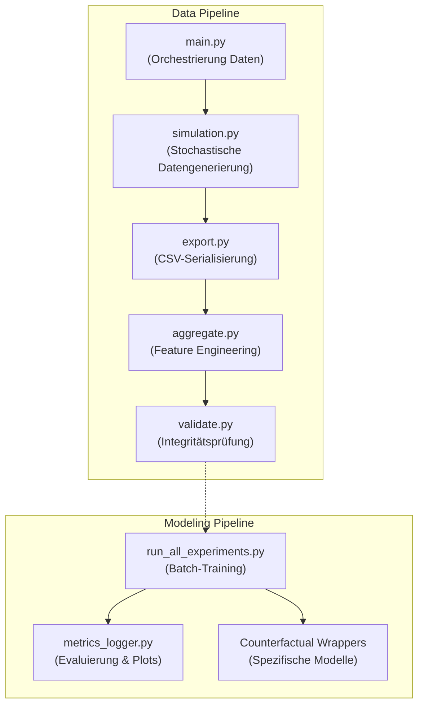

# DeepSupport: Wirksamkeitsanalyse von Hochschulsupport via Deep Learning

**Autor:** Wilfried Keller  
**Kontext:** Abschlussprojekt im Kurs *Deep Learning* (Dr. Bernd Ebenhoch)

---

## 📖 Projektübersicht

Dieses Projekt analysiert datengetrieben die Wirksamkeit von Unterstützungsangeboten (z.B. Tutorien, Repetitorien) an Hochschulen. 
Die Kernherausforderung liegt in der Auflösung des **Selektionsbias** und des **Immortal-Time-Bias**: Da eher leistungsschwächere Studierende an Supportmaßnahmen teilnehmen, kommen naive, statische Machine-Learning-Modelle oft zu dem fehlerhaften Schluss, dass Support die Studienabbruch-Wahrscheinlichkeit erhöht (*Dropout-Paradoxon*).

Um diesen Bias aufzulösen, kombiniert das Projekt:
1. **Dynamisch-stochastische Datengenerierung:** Eine realitätsnahe Simulation von 50.000 Studienverläufen inklusive Feedback-Schleifen (Motivation, CP-Rückstand, Noten).
2. **Kausale Survival-Analyse (Ereigniszeitanalyse):** Überführung der Daten in longitudinale Person-Semester-Panels (Counting Process Format).
3. **Deep Learning Sequence Models:** Einsatz von RNNs (GRU/LSTM), Transformern und Multi-Task Netzwerken (DeepHit), um zeitveränderliche Zusammenhänge und nicht-lineare Interaktionen zu lernen.

---

## 🧠 Methodik & Modell-Stufen

Das Projekt implementiert und vergleicht über **13 verschiedene Modellarchitekturen** in vier aufsteigenden methodischen Stufen:

### Stufe 0: Statische Baselines
- **Klassifikation & Regression:** Naive Bayes, Random Forest, SVM, Ridge Regression.
- **Keras MLPs:** Dense-Netzwerke zur Prognose von Abschlusswahrscheinlichkeit und Abschlussnote.
- *Limitierung:* Verwendet ausschließlich Pre-Landmark Features (Sem 1-2), um Future-Leakage zu vermeiden.

### Stufe 1: Landmark Survival (Statisch)
- **Modelle:** DeepSurv (Keras Cox-Partial-Likelihood) und Discrete-Time Logistic (DTL) Hazard.
- *Ergebnis:* Ohne Berücksichtigung zeitvariabler Confounder zeigen die Modelle fälschlicherweise eine Risikoerhöhung durch Support an (Hazard Ratio > 1).

### Stufe 2: Extended Panel Survival (Zeitveränderlich)
- **Modelle:** Extended Cox (statsmodels), Extended DeepSurv, Extended DTL Hazard.
- **Ansatz:** Die Datenstruktur wird in ein Person-Semester-Panel umgebaut. Die Modelle werten den Zustand (und die Support-Nutzung) in *jedem spezifischen Semester* separat aus.
- *Ergebnis:* Das "Dropout-Paradoxon" wird erfolgreich aufgelöst. Das statistische Extended Cox-Modell weist eine **Hazard Ratio von ≈ 0.37** aus (signifikante Risikosenkung). 

### Stufe 3: Sequenz-Survival (RNN & Transformer)
- **Modelle:** GRU (Semester- und Prüfungs-Ebene) und Causal Masked Transformer.
- **Ansatz:** Betrachtung der gesamten Historie bis zum Semester $t$. Masked-Loss Funktionen ignorieren Padding (-99.0).
- *Ergebnis:* Sehr hohe Prognosekraft (ROC-AUC bis 0.90) und Lift für operative Frühwarnsysteme.

### Stufe 4: Competing Risks
- **Modelle:** Dynamic DeepHit.
- **Ansatz:** Ein Multi-Task Netzwerk mit Shared-GRU Backbone und zwei separaten Time-Distributed Heads.
- *Ergebnis:* Simultane Vorhersage von *Studienabbruch* und *erfolgreichem Abschluss* als konkurrierende Risiken.

---

## 🔬 Kausale Inferenz & Kontrafaktische Simulation

Um echte kausale Effekte in den neuronalen Netzwerken zu messen, wurde eine **kontrafaktische Simulation** implementiert:
Die trainierten Sequence-Modelle (GRU, Transformer) bewerten jeden Studierenden zweimal: Einmal mit modifizierter Historie *inklusive* Support und einmal *ohne* Support. 

**Kernergebnis:** Das Extended DeepSurv liefert bei kontrafaktischer Analyse eine mediane Hazard Ratio von **≈ 0.88** (individuelle Risikosenkung um 12%), während klassische lineare Modelle einen fixen Effekt von 0.37 schätzen. Die neuronalen Netze decken somit auf, dass der Effekt höchst individuell und kontextabhängig ist.

---

## ⚙️ Projektarchitektur & Pipeline

Die Pipeline zeichnet sich durch strikte Modularität und konsequente Prävention von Data Leakage aus.



### Die wichtigsten Skripte im `src/` Ordner:
- `simulation.py`: Core-Engine zur Simulation von Studierendenprofilen.
- `extended_cox_survival.py`: Transformiert Daten ins Counting-Process Format.
- `deep_survival.py` / `extended_deep_survival.py`: Implementierungen des Keras Cox-Loss (Breslow).
- `timeseries_exam_transformer.py`: Causal Masked Attention Netzwerk.
- `dynamic_deephit_model.py`: Multi-Task Architektur für Competing Risks.
- `counterfactual_*.py`: Skripte zur kontrafaktischen Analyse und HR-Schätzung der Deep Learning Modelle.

---

## 🚀 Ausführung

1. Abhängigkeiten installieren (erfordert TensorFlow/Keras, Pandas, Scikit-Learn, Statsmodels, Lifelines, Plotly).
2. Daten generieren und Pipeline ausführen:
   ```bash
   python src/main.py
   ```
3. Alternativ können alle DL-Experimente isoliert im Batch-Modus trainiert werden:
   ```bash
   python src/run_all_experiments.py
   ```
4. Die Ergebnisse, `.keras` Modelle, JSON-Metriken und PNG-Plots werden automatisch in `output_dl/` abgelegt.

> **Hinweis zum Dashboard:** Das ehemals verwendete Dash-Dashboard (`dashboard_survival_dl.py`) ist derzeit **Work in Progress** und aufgrund der stark überarbeiteten Spaltenstruktur und den neuen Delta-Modellreihen in der aktuellen Fassung fehlerhaft/problematisch. Die primären Analysen und Modellauswertungen erfolgen über das strukturierte Logging in `output_dl/metrics/`.
