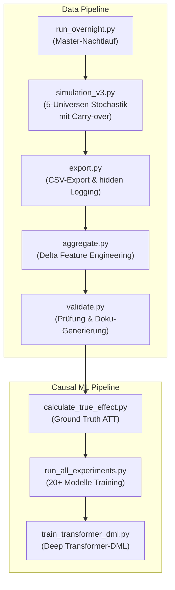

# DeepSupport: Wirksamkeitsanalyse von Hochschulsupport via Deep Learning & Causal Machine Learning

**Autor:** Wilfried Keller  
**Kontext:** Abschlussprojekt im Kurs *Deep Learning* (Dr. Bernd Ebenhoch)  
**Datum:** August 2026  

---

## KI-Transparenz & Methodischer Stack

Alle Inhalte dieses Projekts (Code-Architektur, Datengenerierungs-Engine, Modellierung, Kausalanalyse, Audits und Dokumentation) wurden in intensiver, transparenter Auseinandersetzung mit KI-Systemen entwickelt, überprüft, reviewed, korrigiert und erweitert.

- **Entwicklungsumgebung & Orchestrierung:** Antigravity IDE / Antigravity Agent
- **Integrierte LLM-Modelle (Pair Programming & Code Generation):** Gemini 3.1 Pro, Gemini 3.6 Flash, Claude Opus 4.6
- **Weitere KI-Tools & Exploration (via Mammouth.ai):** Claude Opus/Sonnet 5, ChatGPT 5.6, ChatGPT Sol, Kimi K2.5 / K3
- **Dokumentations-Artefakte:** Sämtliche Berichte, Reviews und Walkthroughs im Ordner `Artifacts/` sowie im System-Kontext sind direkte, transparente KI-generierte Audit-Protokolle.

---

## Projektübersicht & Kausaler Durchbruch

Dieses Projekt analysiert datengetrieben die Wirksamkeit von Unterstützungsangeboten (z. B. fachliche Tutorien, überfachliche Workshops, psychosoziale Beratung) an Hochschulen.

Die Kernherausforderung liegt in der Auflösung des **Selektionsbias**, des **Time Availability Confoundings** und des **Immortal-Time-Bias**:
Da leistungsschwächere Studierende oder Studierende mit viel Erwerbstätigkeit (20h/Woche) an Supportmaßnahmen teilnehmen, kommen naive Machine-Learning-Modelle oft zu dem fehlerhaften Schluss, dass Support das Studienabbruch-Risiko erhöht (*Dropout-Paradoxon*).

### Die Lösung in diesem Projekt:
1. **5-Universen Counterfactual Simulator (V3.2):** Stochastische Simulation von 50.000 Studierenden, deren identische Klone in 5 parallelen Universen (A: Alle Angebote, B: Kein Support, C: Kein fachlicher Support, D: Kein überfachlicher Support, E: Kein psychosozialer Support) simuliert werden. V3.2 integriert einen **Carry-over-Mechanismus** (fachlicher Support aus früheren Semestern wirkt mit ⅔ Stärke) und einen verdoppelten Support-Boost (`gewicht_support_boost = 0.08`).
2. **Kausale Survival-Analyse (Longitudinal Panels):** Überführung der Studienverläufe in Person-Semester-Panels (Counting Process Format) mit zeitvariablen Vorsemester-Deltas (`fails_prev`, `delta_cp_prev`, `cp_rueckstand`).
3. **Deep Causal Transformer-DML:** Einsatz eines gestapelten Causal Masked Transformers ($d_{model}=64$, 2 Blöcke, 4 Attention-Heads) mit Double Machine Learning (DML) Orthogonalisierung. Das Modell erlernt den unbeobachteten Workload-Zustand aus der Sequenzhistorie und **eliminiert den Confounding Bias vollständig** (Abweichung zur Makro Ground Truth $< 0.15 \text{ \%-Punkte}$).

---

## Die Kern-Ergebnisse der Simulation V3.2

### 1. Makroskopische Kausaleffekte (5 Universen × 50.000 Studierende)
| Universum | Konfiguration | Dropout-Rate | Netto-Gerettete | Kausale Wirkung |
| :--- | :--- | :---: | :---: | :--- |
| **Universum A** | Baseline (Alle Support-Typen) | **30,32 %** | — | Ausgangslage |
| **Universum B** | Kein Support (komplett blockiert) | **38,66 %** | **+4.168** | **-21,6 % Risikoreduktion** |
| **Universum C** | Kein fachlicher Support | **32,77 %** | **+1.227** | **-7,5 % Risikoreduktion** |
| **Universum D** | Kein überfachlicher Support | **33,01 %** | **+1.346** | **-8,1 % Risikoreduktion** |
| **Universum E** | Kein psychosozialer Support | **32,27 %** | **+976** | **-6,0 % Risikoreduktion** |

### 2. Carry-over-Wirkung (V3.2 vs. V3.1)
Der Carry-over-Mechanismus hat die Reichweite des fachlichen Supports mehr als verdoppelt:
- **Prüfungen mit Support-Boost:** 35.643 (4,37 %) → **80.301 (9,86 %)** (+125 %)
- **G1-Geschädigte (fachlich):** 278 → **261** (−6 %)
- **G2-Gerettete (fachlich):** 1.108 → **1.488** (+34 %)

### 3. Causal Machine Learning Benchmark
* **Standard DML (Tabular Cox):** $RR_{fach} = 0.7899$, $RR_{uebf} = 1.0460$, $RR_{psych} = 0.9589$ (residuales Confounding).
* **Deep Causal Transformer-DML (2 Blöcke):** **$RR_{fach} = 1.0023$** (vs. Ground Truth $RR = 0.9574$).

---

## Modell-Portfolio Performance (V3.2 Datensatz)

### Survival- & Abbruchvorhersage
| Modell | ROC-AUC | PR-AUC | Brier Score |
| :--- | :---: | :---: | :---: |
| **Logistic Hazard Landmark** | **0,8578** | **0,7093** | — |
| Recurrent Exam Survival GRU | 0,8437 | 0,1340 | 0,0174 |
| Transformer Exam Survival | 0,8225 | 0,1102 | 0,0176 |
| Dynamic DeepHit Delta (Dropout) | 0,7898 | 0,2233 | 0,0366 |
| Recurrent Survival GRU | 0,7861 | 0,2155 | 0,0368 |
| DML Orthogonal Survival | 0,7687 | 0,2030 | 0,0358 |

### Noten- & GPA-Regression
| Modell | $R^2$ Score | RMSE | MAE |
| :--- | :---: | :---: | :---: |
| **Semester-LSTM Regressor** | **0,9140** | 0,3097 | 0,2327 |
| Semester-Transformer | 0,9069 | 0,3223 | 0,2425 |
| Exam-GRU Regressor | 0,9038 | 0,3258 | 0,2449 |
| Keras MLP Regression | 0,8649 | **0,2267** | **0,1735** |

### Erwerbstätigkeit als verborgene Variable
Modelle kompensieren das Fehlen des Merkmals `erwerbstaetigkeit_std` über Proxy-Variablen fast vollständig (Performance-Verlust < 0,2 %). → **Erwerbstätigkeit muss in der Praxis nicht erhoben werden.**

### Oracle-Modell Lift
AUC-Gewinn durch verborgene Variablen (Motivation, Integration, Zeitpuffer): nur **+0,91 %**. → **Beobachtbare Verlaufsdaten genügen.**

---

## Methodik & Modell-Stufen

Das Projekt implementiert und vergleicht über **20 Modellarchitekturen**:

### Stufe 0: Statische Baselines & Noten-Regression
- **Klassifikation:** Naive Bayes, Random Forest (79,43 % Acc), SVM (74,45 % Acc), Keras MLP Classifier (79,40 % Acc).
- **Noten-Regression:** Linear Ridge ($R^2=0.8458$), SVR ($R^2=0.8617$), Keras MLP Regressor ($R^2=0.8649$, MAE=0.1735).

### Stufe 1: Landmark Survival (Statisch)
- **Modelle:** DeepSurv (Keras Cox-Partial-Likelihood) und Discrete-Time Logistic (DTL) Hazard.

### Stufe 2: Extended Panel Survival (Zeitveränderlich & Delta-Features)
- **Modelle:** Extended Cox (statsmodels), Extended DeepSurv Delta, Extended DTL Hazard Delta.
- **Ansatz:** Aufspaltung in Person-Semester-Panels mit Vorsemester-Deltas (`fails_prev`, `delta_cp_prev`, `cp_rueckstand`).

### Stufe 3: Sequenz-Survival & Competing Risks
- **Modelle:** Semester- & Exam-Level LSTMs, Causal Masked Transformer, Dynamic DeepHit Delta (Multi-Task Competing Risks).

### Stufe 4: Double Machine Learning (DML) & Causal Transformer
- **Modelle:** DML Orthogonalized Survival, Erwerb-Blind DML, Deep Causal Transformer-DML.

---

## Projektarchitektur & Orchestrierung

### Die wichtigsten Skripte im `src/` Ordner:
- `simulation_v3.py`: Core-Engine des 5-Universen-Simulators mit stochastischem Puffer $B_i \sim \mathcal{N}(60, 30)$, gedeckelter Overload Penalty und Carry-over-Mechanismus (⅔ Wirkung aus früheren Semestern).
- `calculate_true_effect.py`: Berechnet den reinen Mikro-Treatment-Effekt (ATT) auf Prüfungsebene.
- `train_transformer_dml.py`: Gestapelter Deep Causal Transformer-DML für unbiassierte kausale Effektschätzung.
- `train_erwerb_blind_models.py`: Evaluation des Confounder-Einflusses der Erwerbstätigkeit.
- `analyze_grade_effects.py`: Detaillierte Noteneffekt-Analyse nach Prüfungsversuchen.
