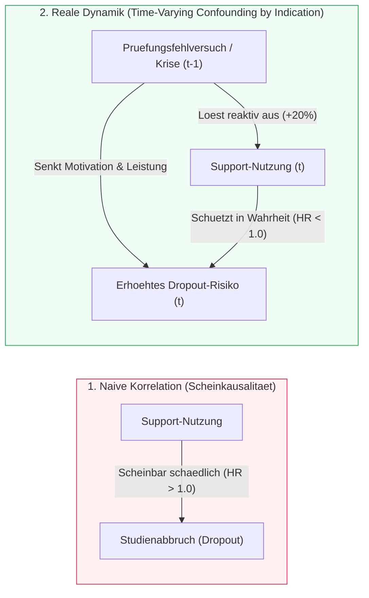
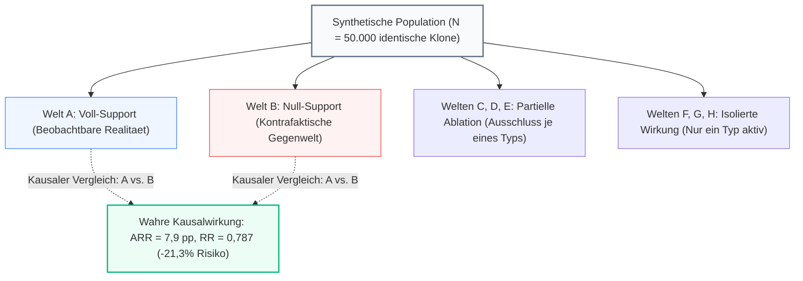
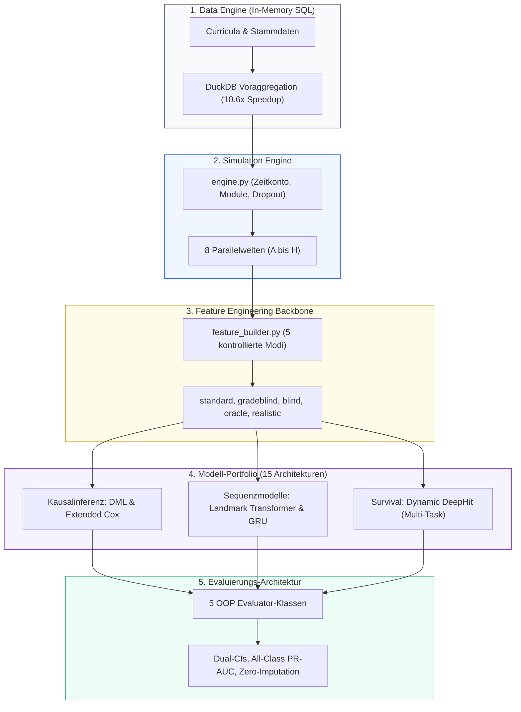
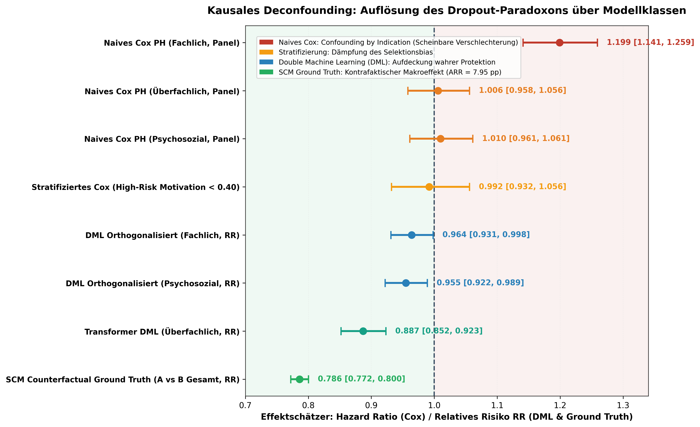

# DeepSupport: Kausale Evaluation von Bildungsinterventionen & Deep Survival Sequences

[](https://www.python.org/)
[](https://keras.io/)
[](https://duckdb.org/)
[](docs/04_causal_and_simulation/)
[](docs/04_causal_and_simulation/04_Kausale_Vergleichsanalyse.md)
[](docs/03_evaluations_and_benchmarks/master_synopse_v4_gesamt.md)

> **Hinweis zur KI-Transparenz:** Dieses Projekt wurde als transparentes Portfolio- und Forschungsprojekt in intensiver Paarprogrammierung mit modernen KI-Systemen (Antigravity IDE, Claude Opus/Sonnet 4.6, Gemini 3.1/3.6/3.7) entwickelt und lückenlos dokumentiert. Ausführliche Details siehe [Abschnitt Autorschaft & KI-Transparenz](#10-autorschaft--ki-transparenz).

---

## 1. Ursprung & Forschungsfrage

Dieses Projekt hat einen ganz konkreten, praktischen Ausgangspunkt: Vor einigen Jahren war ich selbst an der **Hochschule Kaiserslautern (HSKL)** an der Konzeption und Durchführung eines hybriden Mathematik-Unterstützungsangebots beteiligt. Dabei drängte sich eine fundamentale Frage auf, die in der Hochschulpraxis überraschend selten methodisch sauber beantwortet werden kann:

> *„Bringen unsere Förderangebote eigentlich wirklich etwas – und wie lässt sich ihr kausaler Nutzen datengetrieben nachweisen, ohne in die klassischen statistischen Verzerrungsfallen zu tappen?“*

Im Bildungsbereich stehen Entscheidungsträger vor einem Dilemma: Reale Individualdaten von Studierenden sind aus guten Gründen (Datenschutz, institutionelle Silos zwischen Prüfungsamt und Lernmanagementsystemen) extrem restriktiv geschützt. Noch schwerwiegender ist jedoch das **methodische Problem**: Studierende wählen Fördermaßnahmen nicht zufällig aus. Wer sich in einer akuten Leistungskrise befindet, greift eher nach Hilfe. 

Das Projekt **DeepSupport** ist das Resultat einer mehrstufigen intellektuellen Reise, um dieses Problem von Grund auf zu verstehen und methodisch zu untersuchen:
- **Phase 1 (Data Engineering):** Konzeption relationaler Datenmodelle in 3NF und eines ROLAP Star-Schemas zur Abbildung universitärer Studienverläufe.
- **Phase 2 (Data Analysis):** Entwicklung eines ersten dynamisch-stochastischen Studierendensimulators und Entdeckung des *Time-Varying Confounding*.
- **Phase 3 (Deep Learning):** Einsatz moderner Sequenzmodelle (Causal Transformers, Recurrent Neural Networks, Dynamic DeepHit) zur Vorhersage von Noten und Studienabbrüchen.
- **Phase 4 (Causal Benchmarking & V4.2):** Etablierung einer synthetischen Ground Truth über **acht parallele Welten**, Ausführung eines systematischen **Sensitivitätsgitters über 15 Szenarien ($N=50.000$, 225 trainierte DL-Modelle)** und datengetriebene Reflexion der Modellgrenzen.

*(Die vollständige chronologische Entwicklung ist im Dokument [DeepSupport Projektentwicklung](docs/08_project_evolution/DeepSupport_Projektentwicklung.md) dokumentiert.)*

---

## 2. Status Quo auf einen Blick (DeepSupport V4.2.5)

DeepSupport ist heute ein vollwertiges, modulares **Forschungs- und Evaluierungs-Framework**, das Methoden der Kausalinferenz, der klassischen Biostatistik (Survival-Analyse) und modernste Deep-Learning-Architekturen auf einer kontrollierten, synthetischen Simulationsbasis vergleicht:

1. **Synthetisches Multi-Universe-Testbed:** $N = 50.000$ Studierende werden über bis zu 16 Fachsemester mit individuellen Curricula, Prüfungsversuchen, Zeitkontomodell und Belastungsgrenzen simuliert.
2. **Kausale Ground Truth Ebene (8 Parallelwelten):** Identische Studierende durchlaufen zeitgleich acht deterministisch synchronisierte Universen mit variierter Supportverfügbarkeit (Voll-Support, Null-Support, partielle und isolierte Angebote).
3. **Modell-Portfolio:** 15 Modellarchitekturen – von klassischen Cox-Proportional-Hazards-Panels über Double Machine Learning (DML) bis hin zu Autoregressiven Deep Transformern und Multi-Task Survival Netzen.
4. **Strikte Evaluierungsstandards:** Fünf typisierte, modulare Evaluator-Klassen mit Zero-Imputation-Policy (`null` statt `0.0`), Dual-Konfidenzintervallen (asymptotisch & Bootstrap) und Precision-Recall-AUC für alle Klassen.

---

## 3. Das methodische Problem: Das „Dropout-Paradoxon“

Wer Studienverlaufsdaten naiv mit Standard-Verfahren des maschinellen Lernens auswertet, erlebt regelmäßig eine böse Überraschung: **Modelle weisen für Support-Teilnehmer ein signifikant höheres Abbruchrisiko aus ($HR > 1{,}0$)!**



### Die medizinische Analogie: *Confounding by Indication*
In der Pharmakoepidemiologie ist dieses Phänomen als **Indikationsverzerrung** bestens bekannt:  
Untersucht man rein beobachtende Patientendaten, sterben Menschen, die Notfall-Herzmedikamente (z. B. Digitalis) einnehmen, signifikant häufiger an Herzinsuffizienz als Menschen ohne diese Medikation. Ein naiver Algorithmus würde schlussfolgern, das Medikament sei tödlich. In Wahrheit wird das Medikament jedoch selektiv genau jenen Patienten verabreicht, die sich bereits im schwersten Krankheitsstadium befinden.

Exakt dieselbe Dynamik greift an Hochschulen: Freiwillige Förderangebote sind kein gleichmäßig verteilter Vitamin-Zusatz, sondern eine **krisengetriebene Intervention**. Studierende suchen Tutorien vor allem dann auf, wenn sie eine Klausur verhauen haben oder die Motivation erodiert. Statische Modelle verwechseln die Indikation (die Krise) mit der Wirkung der Therapie.

---

## 4. Das 8-Parallelwelten-Design als synthetische Ground Truth

In realen Beobachtungsdaten ist das *Fundamental Problem of Causal Inference* unlösbar: Wir können denselben Studierenden im selben Semester nicht gleichzeitig mit und ohne Support beobachten. 

Im Rahmen von Judea Pearls *Structural Causal Models* (SCM) nutzt DeepSupport die synthetische Simulation, um eine **kontrollierte Ground-Truth-Ebene** einzuziehen. Für jeden einzelnen Studierenden wird derselbe Basis-Zufalls-Seed verwendet, sodass exakt identische Personen in acht Parallelwelten existieren:



### Methodische Designentscheidung: RNG-Stream-Synchronisation
Um den kausalen Effekt isoliert messbar zu machen, ist das Prüfungsrauschen in allen Welten deterministisch an das Tripel `(Student, Modul, Versuch)` gekoppelt. Die Rauschrichtung bleibt identisch; nur der Behandlungsmechanismus unterscheidet die Universen. 
*Hinweis zur methodischen Grenze:* Diese Synchronisation ist eine bewusste Designentscheidung. Ein stochastischer „Schmetterlingseffekt“ (z. B. verändertes Schlafverhalten bei Supportnutzung) würde die Kontrafakten leicht verschieben – die gewählte Variante maximiert jedoch die interne Validität für das Algorithmen-Benchmarking.

### Die wahre Kausalität im Datensatz (Ground Truth, $N=50.000$):
- **Gesamteffekt (A vs. B):** Der Support senkt die Studienabbruchquote von **37,10 % auf 29,20 %**.  
  $\implies$ **Absolute Risikoreduktion ($ARR$): $7{,}90\,\text{pp}$** | **Relatives Risiko ($RR$): $0{,}787$ ($-21{,}3\,\%$)**
- **Verweildauer bei Abbruch:** Support verlängert nicht das Scheitern, sondern **verkürzt die Verweildauer von Abbrechern** um ein halbes Semester ($4{,}48$ vs. $4{,}94$ Semester) – falsche Studienentscheidungen werden schneller korrigiert.

---

## 5. System- & Software-Architektur

Das Framework wurde im V4-Refactoring als modulares, typisiertes Python-Package [`deepsupport`](src/deepsupport/) realisiert:



### Kernkomponenten:
- **`data_engine/`:** DuckDB-Integration zur spaltenbasierten SQL-Aggregation von Millionen Prüfungsdatensätzen.
- **`features/feature_builder.py`:** Zentraler Feature-Backbone, der Data-Leakage verhindert (z. B. strikt zeitverzögerte CP-Stände) und 5 standardisierte Feature-Räume generiert.
- **`evaluation/metrics_logger.py`:** Standardisiertes OOP-Logging über 5 Klassen (`SurvivalEvaluator`, `RegressionEvaluator`, `MulticlassEvaluator`, `CausalEvaluator`, `DualHeadEvaluator`).

---

## 6. Wichtigste Erkenntnisse im relativen Modellvergleich

> [!NOTE]
> **Epistemische Einordnung:** Die absoluten Kennzahlen ($R^2$, ROC-AUC) spiegeln die Gesetzmäßigkeiten des synthetischen Generators wider. Der wissenschaftliche Erkenntnisgewinn liegt im **relativen Vergleich der Methoden**, da alle Architekturen auf exakt derselben Datenbasis konkurrieren:

### A. Kausale Inferenz: Das Scheitern linearer Modelle & die Stärke von DML



*(Vollständige visuelle Datenexploration mit 6 Publikationsgrafiken und interaktiven HTML-Dashboards: [`visuelle_datenexploration_v4.md`](docs/04_causal_and_simulation/visuelle_datenexploration_v4.md))*

- **Lineare Cox-Modelle versagen aggregiert ($HR = 1{,}20$):** Weil die simulierte Dropout-Funktion Schwellenwerte besitzt (Dropout steigt stark an, wenn Motivation $< 0{,}40$), maskiert eine über alle Studierenden gemittelte lineare Schätzung den Effekt und erliegt dem *Confounding by Indication*.
- **Subgruppen-Identifikation:** Filtert man auf die tatsächliche Risikogruppe ($\text{Motivation} < 0{,}40$), detektiert auch das Cox-Modell den Schutz ($HR = 0{,}992$).
- **Double Machine Learning (DML):** Durch zweistufige Residual-Orthogonalisierung schätzt DML einen konsistent protektiven Effekt ($RR = 0{,}887$ bis $0{,}964$) und überwindet das Confounding am effektivsten.
- **SCM Ground Truth (Universum A vs. B):** Der kontrafaktische Benchmark belegt eine reale Risikoreduktion auf $RR = 0{,}786$ ($ARR = 7{,}95\,\text{pp}$).

### B. Operative Früherkennung: Deep Learning & Landmark-Attention
- **Landmark-Prognose nach 2 Semestern:** Ein kompakter Transformer-Encoder kann nach nur zwei absolvierten Semestern **$76{,}5\,\%$ der Varianz der späteren Abschlussnote** ($R^2 = 0{,}765$) erklären. Für Hochschul-Frühwarnsysteme reicht die Frühphase der Studienbiografie weitgehend aus.
- **Precision-Recall Lift bei seltenen Events:** Der Causal Sequence Transformer erzielt bei der Vorhersage akuter Dropout-Ereignisse einen **$10\times$ PR-AUC Lift** gegenüber der Basisprävalenz.

### C. Sensitivitätsgitter über 15 Szenarien ($N=50.000$, 225 DL-Modelle)
Die systematische Variation von Supportdosis, Rauschlevel, Zeitkosten und Überlastungsstrafen ([`master_synopse_v4_gesamt.md`](docs/03_evaluations_and_benchmarks/master_synopse_v4_gesamt.md)) belegt eine bemerkenswerte **ARR-Stabilität zwischen $7{,}3$ und $8{,}5\,\text{pp}$** – der kausale Schutzeffekt bricht selbst unter widrigen Rahmenbedingungen nicht zusammen.

---

## 7. Wissenschaftliche Praxis & Datengetriebene Reflexion

Ein zentrales Merkmal dieses Projekts ist die Verpflichtung zu transparenter wissenschaftlicher Praxis: Hypothesen werden nicht post-hoc gerechtfertigt, sondern am Datengenerator überprüft und bei Bedarf verworfen:

- **Falsifikation der Apathie-Hypothese (Szenario S16):**  
  Lange wurde vermutet, eine verhaltensbasierte Apathie-Dämpfung bei entmutigten Studierenden sei die Hauptursache für Entzerrungsunterschiede zwischen V3.6 und V4.1. Ein kontrollierter Deaktivierungslauf ($N=20.000$, identischer Seed) zeigte einen Nettoeffekt von exakt $0{,}0000$ im Selektionsbias von Semester 1. Die Hypothese wurde verworfen.
- **Aufdeckung des selektiven Motivations-Varianzkollapses:**  
  Eine systematische Verteilungsanalyse aller Merkmale ($N=50.000$) deckte auf, dass bei der Umstellung auf Beta-Verteilungen in V4.1 die Varianz der Motivation unbemerkt um $50\,\%$ kollabiert war ($\kappa=20{,}0$), während HZB-Note und Alter perfekt repliziert wurden.
- **Roadmap für Version 5:**  
  Die gewonnenen Erkenntnisse wurden in einen empirischen Kalibrierungsplan überführt: Rekalibrierung der Motivation auf $\kappa=9{,}0$ ($\sigma \approx 0{,}15$) gestützt auf psychometrische Normdaten (Academic Motivation Scale AMS), Zero-Inflated Erwerbsmodellierung nach der 22. DSW-Sozialerhebung und Destatis-Geschlechtermatrizen ([`config_audit_und_v5_roadmap.md`](docs/04_causal_and_simulation/config_audit_und_v5_roadmap.md)).

---

## 8. Themen-Gateways zur Wissensbasis

Die vollständige Dokumentation umfasst über 60 Fachdokumente. Für den gezielten Einstieg sind die Themen in fünf Gateways strukturiert:

| Gateway | Themenschwerpunkt | Zentrale Dokumente |
|:---|:---|:---|
| **DGP & Kausalität** | Simulationsarchitektur, 8 Universen, Bias-Analysen, V5-Spezifikation | [`visuelle_datenexploration_v4.md`](docs/04_causal_and_simulation/visuelle_datenexploration_v4.md)<br>[`04_Kausale_Vergleichsanalyse.md`](docs/04_causal_and_simulation/04_Kausale_Vergleichsanalyse.md)<br>[`config_audit_und_v5_roadmap.md`](docs/04_causal_and_simulation/config_audit_und_v5_roadmap.md)<br>[`systematische_verteilungsanalyse_v36_vs_v41.md`](docs/04_causal_and_simulation/systematische_verteilungsanalyse_v36_vs_v41.md) |
| **Deep Learning** | Autoregressive Transformer, Causal Masking, Dynamic DeepHit | [`model_architectures.md`](docs/02_architectures_and_models/model_architectures.md)<br>[`synopse_heavy_suite_s01_s07_s08.md`](docs/03_evaluations_and_benchmarks/synopse_heavy_suite_s01_s07_s08.md) |
| **Benchmarks** | Master-Synopse aller 15 Szenarien & 225 Modelle, Noten- & Risikolifts | [`master_synopse_v4_gesamt.md`](docs/03_evaluations_and_benchmarks/master_synopse_v4_gesamt.md)<br>[`synopse_supportwirkung_s01_s02_s03.md`](docs/03_evaluations_and_benchmarks/synopse_supportwirkung_s01_s02_s03.md) |
| **Engineering** | DuckDB In-Memory SQL, 5 Feature-Modi, 5 OOP-Evaluatoren | [`feature_builder_map.md`](docs/02_architectures_and_models/feature_builder_map.md)<br>[`duckdb_architecture_analysis.md`](docs/02_architectures_and_models/duckdb_architecture_analysis.md)<br>[`refactoring_plan_evaluation_pipeline1.md`](docs/01_master_plans/refactoring_plan_evaluation_pipeline1.md) |
| **Evolution** | Chronologische Entwicklungsreise, DE/DA/DL-Submodule, Kritik | [`DeepSupport_Projektentwicklung.md`](docs/08_project_evolution/DeepSupport_Projektentwicklung.md)<br>[`DeepSupport_Kritische_Bewertung.md`](docs/08_project_evolution/DeepSupport_Kritische_Bewertung.md) |

*Das vollständige, detaillierte Dokumentenverzeichnis befindet sich im [Dokumentations-Index (`docs/README.md`)](docs/README.md).*

---

## 9. Quickstart & Reproduzierbarkeit

### Voraussetzungen
- **OS:** Windows 10/11 oder Linux (Debian/Ubuntu)
- **Python:** 3.12 (empfohlen im dedizierten Virtual Environment)
- **Wichtig für Windows:** Aufgrund von Sicherheitsrichtlinien für native DLLs (HiGHS-Solver / SciPy) stets das whitelisted venv verwenden.

### Installation
```powershell
# Repository klonen
git clone https://github.com/mAInbrAIn-wk/DeepHSSurvial.git
cd DeepHSSurvial

# Virtuelle Umgebung aktivieren (Beispiel Windows PowerShell)
$env:PYTHONPATH = "src"
C:\GitHub_public\.venv\Scripts\Activate.ps1
```

### Ausführen von Simulation & Training
```powershell
# 1. Schneller Rauchtest der Evaluator-Pipeline
C:\GitHub_public\.venv\Scripts\python.exe src/deepsupport/runners/run_smoke_test_evaluators.py

# 2. Hypothesen-Untersuchung (Small Batch Test)
C:\GitHub_public\.venv\Scripts\python.exe src/deepsupport/runners/run_hypothesis_investigation.py --mode test

# 3. Vollständiger Overnight-Runner auf V4.1-Daten
C:\GitHub_public\.venv\Scripts\python.exe src/run_overnight_v41.py
```

---

## 10. Autorschaft & KI-Transparenz

Dieses Projekt wurde von **Wilfried Keller** konzipiert, geleitet und iterativ weiterentwickelt.

### Transparente Arbeitsweise im KI-Zeitalter
Die Umsetzung erfolgte in intensiver, dokumentierter Paarprogrammierung mit modernen generativen KI-Systemen. Sämtliche Designentscheidungen, Architektur-Iterationen, Fehlversuche und Korrekturen wurden als unverfälschte Protokolle archiviert:
- **Konversationsprotokolle:** Über 300 Iterationsschritte sind im Ordner [`docs/07_conversation_logs/`](docs/07_conversation_logs/) chronologisch einsehbar.
- **Rollenverteilung:** Die konzeptionelle Steuerung, Fragestellung, Methodenwahl und kritische Prüfung lag beim menschlichen Autor; die Codegenerierung, das Refactoring, das Erstellen repetitiver Benchmark-Skripte und die formale Doku-Pflege wurden durch KI-Agenten assistiert.
