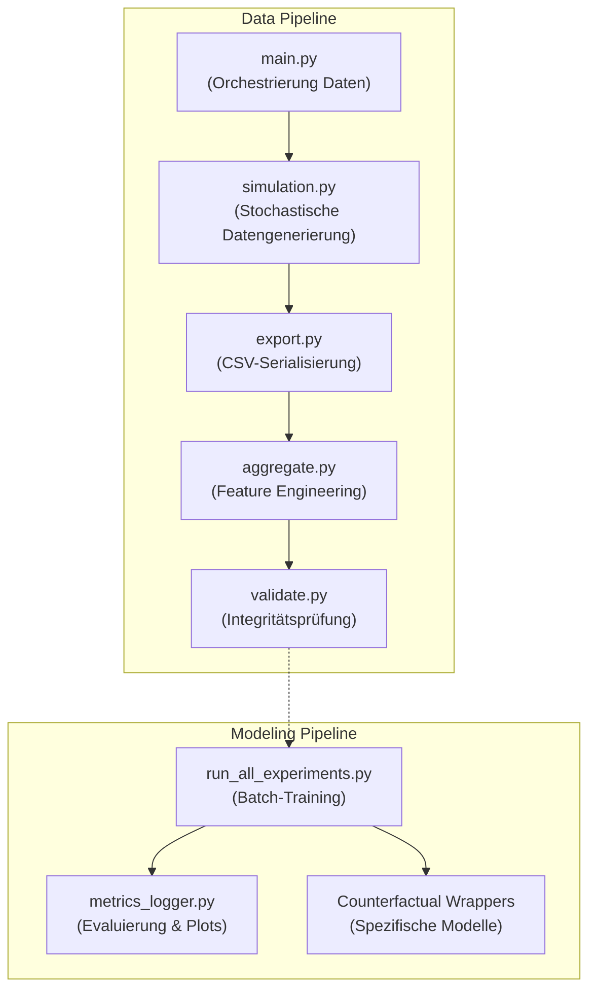

# DeepSupport: Wirksamkeitsanalyse von Hochschulsupport via Deep Learning

**Autor:** Wilfried Keller  
**Kontext:** Abschlussprojekt im Kurs *Deep Learning* (Dr. Bernd Ebenhoch)

---

## KI-Transparenz & Methodischer Stack

Alle Inhalte dieses Projekts (Code-Architektur, Datengenerierungs-Engine, Modellierung, Kausalanalyse, Audits und Dokumentation) wurden in intensiver, transparenter Auseinandersetzung mit KI-Systemen entwickelt, überprüft, reviewed, korrigiert und erweitert.

- **Entwicklungsumgebung & Orchestrierung:** Antigravity IDE / Antigravity Agent
- **Integrierte LLM-Modelle (Pair Programming & Code Generation):** Gemini 3.1 Pro, Gemini 3.6 Flash
- **Weitere KI-Tools & Exploration (via Mammouth.ai):** Claude Opus/Sonnet 5, ChatGPT 5.6, ChatGPT Sol, Kimi K2.5 / K3
- **Dokumentations-Artefakte:** Sämtliche Berichte, Reviews und Walkthroughs im Ordner `Artifacts/` sowie im System-Kontext sind direkte, transparente KI-generierte Audit-Protokolle.

---

## Beziehung zum Vorläufer-Projekt (DataAnalysis)

Dieses Repository darstellt **Phase 2 (Hauptarbeit)** der Projektgruppe dar. Das vorausgehende Kurs-Projekt *DataAnalysis* diente als explorativer Prototyp (Phase 1). Während *DataAnalysis* das Confounding-Problem aufdeckte und dokumentierte, löst das vorliegende *Abschlussprojekt* dieses Problem durch neu entwickelte dynamische Längsschnitt-Panels, zeitveränderliche Deltas und neuronale Survival-Architekturen vollständig auf.

---

## Projektübersicht

Dieses Projekt analysiert datengetrieben die Wirksamkeit von Unterstützungsangeboten (z.B. Tutorien, Repetitorien) an Hochschulen. 
Die Kernherausforderung liegt in der Auflösung des **Selektionsbias** und des **Immortal-Time-Bias**: Da eher leistungsschwächere Studierende an Supportmaßnahmen teilnehmen, kommen naive, statische Machine-Learning-Modelle oft zu dem fehlerhaften Schluss, dass Support die Studienabbruch-Wahrscheinlichkeit erhöht (*Dropout-Paradoxon*).

Um diesen Bias aufzulösen, kombiniert das Projekt:
1. **Dynamisch-stochastische Datengenerierung:** Eine realitätsnahe Simulation von 50.000 Studienverläufen inklusive Feedback-Schleifen (Motivation, CP-Rückstand, Noten).
2. **Kausale Survival-Analyse (Ereigniszeitanalyse):** Überführung der Daten in longitudinale Person-Semester-Panels (Counting Process Format).
3. **Deep Learning Sequence Models:** Einsatz von RNNs (GRU/LSTM), Transformern, Multi-Task Netzwerken (DeepHit) und Double Machine Learning (DML), um zeitveränderliche Zusammenhänge und entzerrte Behandlungseffekte zu lernen.

---

## Methodik & Modell-Stufen

Das Projekt implementiert und vergleicht über **13 verschiedene Modellarchitekturen** in fünf aufsteigenden methodischen Stufen:

### Stufe 0: Statische Baselines
- **Klassifikation & Regression:** Naive Bayes, Random Forest, SVM, Ridge Regression.
- **Keras MLPs:** Dense-Netzwerke zur Prognose von Abschlusswahrscheinlichkeit und Abschlussnote.
- *Limitierung:* Verwendet ausschließlich Pre-Landmark Features (Sem 1-2), um Future-Leakage zu vermeiden.

### Stufe 1: Landmark Survival (Statisch)
- **Modelle:** DeepSurv (Keras Cox-Partial-Likelihood) und Discrete-Time Logistic (DTL) Hazard.
- *Ergebnis:* Ohne Berücksichtigung zeitvariabler Confounder zeigen die Modelle fälschlicherweise eine Risikoerhöhung durch Support an (Hazard Ratio > 1).

### Stufe 2: Extended Panel Survival (Zeitveränderlich & Delta-Features)
- **Modelle:** Extended Cox (statsmodels), Extended DeepSurv Delta, Extended DTL Hazard Delta.
- **Ansatz:** Die Datenstruktur wird in ein Person-Semester-Panel umgebaut. Die Modelle werten den Zustand (und die Support-Nutzung) in *jedem spezifischen Semester* separat aus unter Verwendung lokaler Vorsemester-Deltas (`fails_prev`, `delta_cp_prev`, `cp_rueckstand`).
- *Ergebnis:* Das "Dropout-Paradoxon" wird erfolgreich aufgelöst. Extended DeepSurv Delta weist für fachlichen ($\text{HR} \approx 0.92$) und psychosozialen Support ($\text{HR} \approx 0.92$) echte risikosenkende Effekte aus.

### Stufe 3: Sequenz-Survival (RNN & Transformer Delta)
- **Modelle:** GRU (Semester- und Prüfungs-Ebene) und Causal Masked Transformer.
- **Ansatz:** Betrachtung der gesamten Historie bis zum Semester $t$. Masked-Loss Funktionen ignorieren Padding (-99.0).
- *Ergebnis:* Sehr hohe Prognosekraft (ROC-AUC bis 0.87) und hoher Lift für operative Frühwarnsysteme.

### Stufe 4: Competing Risks & Double Machine Learning (DML)
- **Modelle:** Dynamic DeepHit Delta, DML Orthogonalized Survival.
- **Ansatz:** Simultane Vorhersage von *Studienabbruch* und *erfolgreichem Abschluss* als konkurrierende Risiken sowie Entzerrung reaktiver Selection Biases über orthogonalisierte Treatment-Residuen.
- *Ergebnis:* DeepHit Delta erzielt eine Dropout ROC-AUC von **0.8276** und eine Abschluss ROC-AUC von **0.9998**.

---

## Kausale Inferenz & Kontrafaktische Simulation

Um echte kausale Effekte in den neuronalen Netzwerken zu messen, wurde eine **kontrafaktische Simulation** implementiert:
Die trainierten Sequence-Modelle (GRU, Transformer, DeepHit) bewerten jeden Studierenden zweimal: Einmal mit modifizierter Historie *inklusive* Support und einmal *ohne* Support.

---

## Projektarchitektur & Pipeline

Die Pipeline zeichnet sich durch strikte Modularität und konsequente Prävention von Data Leakage aus.



### Die wichtigsten Skripte im `src/` Ordner:
- `simulation.py`: Core-Engine zur Simulation von Studierendenprofilen.
- `extended_cox_delta.py`: Transformiert Daten ins Counting-Process Format mit Delta-Features.
- `extended_deep_survival_delta.py`: Implementierung neuronaler Survival-Panels.
- `dynamic_deephit_delta_model.py`: Multi-Task Architektur für Competing Risks auf Delta-Features.
- `dml_orthogonal_survival.py`: Double Machine Learning mit orthogonalisierten Treatment-Residuen.
- `counterfactual_*.py`: Skripte zur kontrafaktischen Analyse und HR/RR-Schätzung der Deep Learning Modelle.

---

## Ausführung

1. Abhängigkeiten installieren (erfordert TensorFlow/Keras, Pandas, Scikit-Learn, Statsmodels, Plotly).
2. Daten generieren und Pipeline ausführen:
   ```bash
   python src/main.py
   ```
3. Alternativ können alle DL-Experimente isoliert im Batch-Modus trainiert werden:
   ```bash
   python src/run_all_experiments.py
   ```
4. Die Ergebnisse, `.keras` Modelle, JSON-Metriken und PNG-Plots werden automatisch in `output_dl/` abgelegt.

> **Hinweis zum Dashboard:** Das ehemals verwendete Dash-Dashboard (`dashboard_survival_dl.py`) ist derzeit **Work in Progress** und aufgrund der stark überarbeiteten Spaltenstruktur und den neuen Delta-Modellreihen in der aktuellen Fassung fehlerhaft/problematisch. Die primären Analysen und Modellauswertungen erfolgen über das strukturierte Logging in `output_dl/metrics/`.
