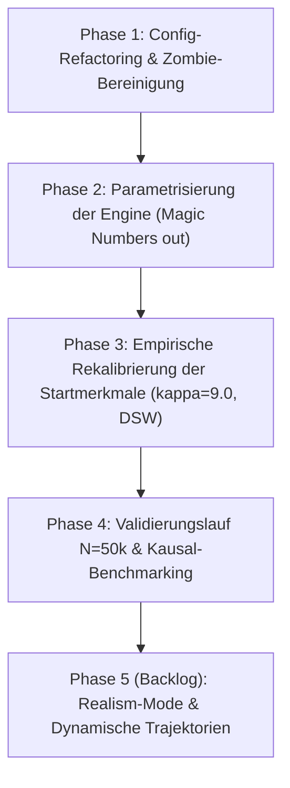

# Technischer Config-Audit, DGP-Leerstellen & Roadmap für Version 5

## 1. Executive Summary & Anlass des Audits

Im Zuge der Untersuchungen zur kausalen Entzerrung zwischen **V3.6** und **V4.1** wurde festgestellt, dass die Modellperformance und die kausalen Schätzungen maßgeblich durch Veränderungen im Data Generating Process (DGP) geprägt sind:
1. **Falsifikation der Apathie-Hypothese (S16):** Die Deaktivierung der Apathie-Dämpfung in V4.1 zeigte einen Nettoeffekt von exakt $0{,}0000$ auf den Selektionsbias in Semester 1 und lediglich $0{,}22\,\text{pp}$ auf die Gesamtabbruchquote. Die verhaltensbasierte Apathie-Dämpfung erklärt die Versionsdiskrepanzen somit nicht.
2. **Selektiver Varianz-Kollaps der Motivation:** Während die empirische Nachkalibrierung der Beta-Verteilungen für `hzb_note`, `alter_immatrikulation` und `erwerbstaetigkeit_std` die V3.6-Varianzen zu nahezu $100\,\%$ replizierte, kollabierte die Varianz von `motivation_initial` und `soziale_integration_initial` in V4.1 um rund $50\,\%$ ($\sigma_{\text{V3}} \approx 0{,}24 \rightarrow \sigma_{\text{V4}} \approx 0{,}12$, Ratio $50{,}89\,\%$). Ursache war die Wahl von $\kappa = 20{,}0$ basierend auf einer fehlerhaften historischen Dokumentation, während V3.6 de facto `gewicht_motivation_rauschen = 0.25` zuzüglich massivem Dirac-Clipping an den Intervallgrenzen ($8{,}45\,\%$ Randstauung) verwendete.
3. **Identität der Dropout-Mechanik:** Die Kernfunktion `berechne_dropout()` ist in V2, V3 und V4 buchstäblich identisch formuliert. Der massive Rückgang von Studienabbrüchen in Semester 1 beruht nicht auf veränderten Gleichungen, sondern darauf, dass in V4.1 durch die enge Verteilung ($\kappa=20{,}0$) kaum noch Studierende die kritische Schwelle $\text{Motivation} < 0{,}40$ unterschreiten.

Auf Anweisung der Projektleitung wurde daraufhin ein **vollständiger, systematischer Audit** des Simulationskerns (`engine.py`) und der zentralen Konfigurationsdatei (`src/deepsupport/data_engine/config.py`) durchgeführt. Dieser Audit verfolgt zwei Ziele:
- **Bestandsaufnahme:** Identifikation aller verwaisten Konfigurationsparameter (Zombies), aller ungesicherten `.get()`-Aufrufe mit heimlichen Defaults (Leerstellen in `CONFIG`) und aller hartcodierten Zahlenwerte (*Magic Numbers*) in `engine.py`.
- **V5-Roadmap & Empirische Fundierung:** Definition eines wissenschaftlich belastbaren Kalibrierungsplans für Version 5, basierend auf aktuellen Daten der Hochschulforschung (DZHW-Studienabbruchstudien, 22. Sozialerhebung des DSW, Destatis Hochschulstatistik), inklusive Konzeption von Verlaufsmodellen und eines Realism-Mode für Peer-Netzwerkeffekte.

---

## 2. Systematischer Config-Audit (32 Parameter in `CONFIG`)

Ein automatisierter Codeabgleich zwischen `CONFIG` in `src/deepsupport/data_engine/config.py` und der Simulations-Engine `src/deepsupport/simulation/engine.py` liefert folgende Klassifikation:

| Parameter in `CONFIG` | Typ | Wert in V4.1 | Status in `engine.py` | Detailbefund & Historische Ursache |
|:---|:---:|:---:|:---:|:---|
| **`gewicht_erwerb`** | `float` | `0.006` | 🧟 **ZOMBIE** | In V1–V3 zog dieser Parameter direkt Punkte von der latenten Prüfungsleistung ab (`leistung_base -= erwerb * gewicht_erwerb`). In V4 wurde das Zeitkontomodell eingeführt (`verfuegbare_zeit = 900 - erwerb * 20`), wodurch Erwerbstätigkeit nur noch über Zeitüberlastung wirkt. Der Parameter wurde in `engine.py` entfernt, blieb in `CONFIG` jedoch als Leiche zurück. |
| **`gewicht_motivation_rauschen`** | `float` | `0.25` | 🧟 **ZOMBIE** | In V1–V3 diente dieser Wert als Standardabweichung des Normalverteilungsrauschens für die Startmotivation vor dem Dirac-Clipping. In V4 wurde die Generierung auf eine Beta-Verteilung umgestellt. Der Parameter wird in `engine.py` nirgends mehr aufgerufen. |
| **`gewicht_integration_rauschen`** | `float` | `0.25` | 🧟 **ZOMBIE** | Identisch zu `gewicht_motivation_rauschen`. Vollständig durch Beta-Verteilung ersetzt. |
| **`csv_decimal`** | `str` | `.` | 📦 **I/O-METADATEN** | Nicht Teil der Simulationsmechanik; wird in Export- und Formatierungsroutinen genutzt. |
| **`csv_encoding`** | `str` | `utf-8` | 📦 **I/O-METADATEN** | Nicht Teil der Simulationsmechanik; I/O-spezifisch. |
| **`csv_sep`** | `str` | `,` | 📦 **I/O-METADATEN** | Nicht Teil der Simulationsmechanik; I/O-spezifisch. |
| **`output_dir`** | `str` | `output_dl` | 📦 **I/O-METADATEN** | Zielpfad für Ausgabedateien; wird von Runnern und Feature-Buildern verwendet, nicht von `engine.py`. |
| **`seed`** | `int` | `42` | 🔄 **RUNNER-OVERRIDE** | In `engine.py` werden `rng` und `population_seed` als Methodenargumente übergeben. Der Eintrag in `CONFIG` dient nur als Fallback für externe Skripte. |
| `n_studierende` | `int` | `50000` | ✅ Aktiv (`cfg[...]`) | Steuert Populationsgröße in `generiere_studierende`. |
| `start_jahr` / `end_jahr` | `int` | `2015` / `2024` | ✅ Aktiv (`cfg[...]`) | Kohortenzeitraum für Semestergenerierung. |
| `anomalie_quote` | `float` | `0.05` | ✅ Aktiv (`cfg.get`) | Anteil Studierender mit Studienverlaufs-Anomalien. |
| `max_simulations_semester` | `int` | `16` | ✅ Aktiv (`cfg.get`) | Maximale Studiendauer vor Simulationsabbruch. |
| `log_every_n_studis` | `int` | `1000` | ✅ Aktiv (`cfg.get`) | Logging-Intervall in der Konsole. |
| `zeitkonto_budget_h` | `int` | `900` | ✅ Aktiv (`cfg.get`) | Brutto-Zeitbudget pro Semester (Vollzeit). |
| `support_effect_multiplier` | `float` | `5.0` | ✅ Aktiv (`cfg.get`) | Globaler Hebel für Support-Wirkung (Szenarien S01–S03). |
| `support_deckel` | `float` | `1.0` | ✅ Aktiv (`cfg.get`) | Maximaler fachlicher Notenboost pro Prüfung. |
| `gewicht_support_boost` | `float` | `0.08` | ✅ Aktiv (`cfg.get`) | Basisfaktor für fachlichen Notenboost (Szenarien S04–S06). |
| `gewicht_rauschen` | `float` | `0.18` | ✅ Aktiv (`cfg[...]`) | Amplitude des Prüfungsrauschens (Szenarien S07–S08). |
| `leistung_startwert` | `float` | `0.55` | ✅ Aktiv (`cfg[...]`) | Konstante in der latenten Leistungsfunktion. |
| `gewicht_hzb` | `float` | `0.4` | ✅ Aktiv (`cfg[...]`) | Einfluss von $(2{,}5 - \text{erwartete\_note})$ auf Prüfungsleistung. |
| `gewicht_motivation` | `float` | `0.5` | ✅ Aktiv (`cfg[...]`) | Einfluss von $(\text{Motivation} - 0{,}5)$ auf Prüfungsleistung. |
| `gewicht_integration` | `float` | `0.2` | ✅ Aktiv (`cfg[...]`) | Einfluss von $(\text{Soz\_Int} - 0{,}5)$ auf Prüfungsleistung. |
| `gewicht_schwierigkeit` | `float` | `0.3` | ✅ Aktiv (`cfg[...]`) | Abzugsfaktor für Modulschwierigkeit. |
| `gewicht_lerneffekt` | `float` | `0.2` | ✅ Aktiv (`cfg[...]`) | Notenverbesserung bei Wiederholungsprüfungen ($(\text{Versuch} - 1)$). |
| `motivation_startwert` | `float` | `0.65` | ✅ Aktiv (`cfg[...]`) | Basismittelwert vor soziodemografischen Modifikatoren. |
| `gewicht_motivation_hzb` | `float` | `0.08` | ✅ Aktiv (`cfg[...]`) | Einfluss der Abiturnote auf die Startmotivation. |
| `gewicht_motivation_erwerb` | `float` | `0.004` | ✅ Aktiv (`cfg[...]`) | Motivationsabzug pro Wochenstunde Erwerbstätigkeit. |
| `integration_startwert` | `float` | `0.65` | ✅ Aktiv (`cfg[...]`) | Basismittelwert für soziale Integration. |
| `gewicht_integration_erstakademiker` | `float` | `0.05` | ✅ Aktiv (`cfg[...]`) | Integrationsabzug für Erstakademiker. |
| `gewicht_integration_migration` | `float` | `0.05` | ✅ Aktiv (`cfg[...]`) | Integrationsabzug bei Migrationshintergrund. |
| `gewicht_integration_erwerb` | `float` | `0.003` | ✅ Aktiv (`cfg[...]`) | Integrationsabzug pro Wochenstunde Erwerbstätigkeit. |

---

## 3. Die 5 Leerstellen in `CONFIG` (Heimliche Defaults in `engine.py`)

In `engine.py` werden über `cfg.get(...)` fünf Parameter abgefragt, die im Standard-Dictionary `CONFIG` in `config.py` **gar nicht existieren**. Sie wurden während der Sensitivitäts- und Deconfounding-Experimente eingeführt, aber nie in die kanonische Konfiguration zurückgespiegelt:

1. **`overload_penalty_factor` (Default: `0.1`):**  
   Skaliert den Leistungsabzug bei Zeitbudget-Überschreitung ($\text{Overload} / 100 \times \text{Faktor}$). Gesteuert in S12 (`0.05`) und S13 (`0.2`).
2. **`overload_penalty_cap` (Default: `None`):**  
   Optionale Obergrenze für den Überlastungsabzug. Gesteuert in Szenario S14 (`0.15`).
3. **`support_kosten_faktor` (Default: `1.0`):**  
   Multiplikator auf die zeitlichen Kosten aller Supportangebote. Gesteuert in Szenarien S09 (`0.0`) und S10 (`2.0`).
4. **`rct_support_uptake` (Default: `False`):**  
   Schaltet von reaktiver (krisengetriebener) Supportteilnahme auf randomisierte Zuteilung um (Szenario S11).
5. **`disable_apathy_dampening` (Default: `False`):**  
   Deaktiviert die Dämpfung der Supportteilnahme bei stark entmutigten Studierenden ($\text{Motivation} < 0{,}20$). Eingeführt in Szenario S16.

> [!IMPORTANT]
> **V5-Vorgabe:** Alle fünf Parameter müssen als reguläre Einträge mit ihren Standardwerten in `CONFIG` überführt werden. Ein verdeckter Default-Wert in `engine.py` führt zu Intransparenz und erschwert automatisierte Parameter-Audits.

---

## 4. Katalog der Hartcodierten Parameter (*Magic Numbers* in `engine.py`)

Neben den über `cfg` abrufbaren Werten enthält `engine.py` über **25 hartcodierte Zahlenwerte**, die das Systemverhalten maßgeblich determinieren, ohne konfigurierbar zu sein:

### A. Subsystem Merkmalsgenerierung (`generiere_studierende`)
- **Studiengangsverteilung:** `sg_gewichte = [0.25, 0.28, 0.18, 0.17, 0.12]` (SG01 bis SG05).
- **Geschlechterverteilung:** MINT (`SG01`, `SG03`): `[0.68, 0.30, 0.02]`; Nicht-MINT: `[0.48, 0.50, 0.02]`.
- **Alter bei Immatrikulation:** Wertebereich $[17; 45]$, Mean $\approx 20{,}5$, Beta-$\kappa = 12{,}8$. Beruflich Qualifizierte werden hart auf `uniform(24, 28)` gesetzt.
- **HZB-Note:** Wertebereich $[1{,}0; 4{,}0]$, Mean $\approx 2{,}40$, Beta-$\kappa = 6{,}5$.
- **HZB-Offsets auf erwartete Note:** Allgemeine Hochschulreife: $-0{,}2$; Fachgebundene HR / Berufl. Qual.: $+0{,}2$.
- **Soziodemografische Quoten:** Migrationshintergrund: $22\,\%$; Erstakademiker: $48\,\%$.
- **Erwerbstätigkeit:** Diskrete Stufen `[0, 5, 10, 15, 20, 25, 30]` Wochenstunden mit Wahrscheinlichkeiten `[0.25, 0.15, 0.20, 0.15, 0.13, 0.07, 0.05]`.
- **Konzentrationsparameter der Persönlichkeitsmerkmale:**
  - `motivation`: $\kappa = 20{,}0$ (Verursacher des Varianz-Kollapses).
  - `soziale_integration`: $\kappa = 20{,}0$.
  - Motivationsboost für Beruflich Qualifizierte: $+0{,}10$.
- **Zeitpuffer:** Wertebereich $[0; 180]\,\text{h}$, Mean $60\,\text{h}$ (normalisiert $0{,}33$), Beta-$\kappa = 8{,}0$.

### B. Subsystem Zeitkonto & Modulabwurf
- **Semesterwochen-Faktor:** $20\,\text{Wochen}$ ($\text{Verfügbare Zeit} = 900 - \text{Erwerb} \times 20$).
- **Minimalbudget:** $100\,\text{h}$ Untergrenze.
- **Probabilistischer Modulabwurf:** Sigmoid-Konstante $50{,}0\,\text{h}$ ($P(\text{Drop}) = \frac{\text{Überschuss}}{\text{Überschuss} + 50{,}0}$).

### C. Subsystem Support-Teilnahme & Wirkung
- **RCT-Teilnahmeraten (S11):** Fachlich $4{,}2\,\%$, Überfachlich $2{,}5\,\%$, Psychosozial $2{,}3\,\%$.
- **Reaktive Teilnahmefunktionen:**
  - Fachlich: $0{,}05 + (\text{erwartete\_note} - 2{,}0) \times 0{,}05$; Wiederholungsprüfung: $+0{,}20$.
  - Überfachlich: $0{,}05 + (0{,}5 - \text{motivation}) \times 0{,}15$; Apathieschwelle: $< 0{,}20$.
  - Psychosozial: $0{,}01 + (0{,}5 - \text{soz\_int}) \times 0{,}12$; Apathieschwelle: $< 0{,}20$.
  - Erstakademiker-Bonus: $+0{,}05$ für fachlich und psychosozial.
  - Stochastischer Zeitausnahme-Puffer: $P = 0{,}20$ (Teilnahme trotz Zeitnot).
- **Support-Wirkung auf latente Traits:**
  - Überfachlich: Motivation $+0{,}02 \times \text{mult}$, Soziale Integration $+0{,}01 \times \text{mult}$.
  - Psychosozial: Motivation $+0{,}015 \times \text{mult}$, Soziale Integration $+0{,}035 \times \text{mult}$.
- **Fachlicher Support Carry-over:** Faktor $2/3 \approx 0{,}667$ im Folgesemester.

### D. Subsystem Dynamische Feedback-Schleifen & Noten
- **Notentransformation:** $\text{Note}_{\text{raw}} = 5{,}0 - 4{,}0 \times \text{Leistung}$. Bestehensgrenze bei $\text{Note} \le 4{,}0$.
- **Super-Klausur-Boost:** Schwellenwert $\text{erwartete\_note} - \text{note} \ge 0{,}5 \implies \text{Boost} = 0{,}005 + 0{,}01 \times (\Delta - 0{,}5)$.
- **Dynamisches Fähigkeits-Update:** Glättung $0{,}7 \times \text{erwartet} + 0{,}3 \times \text{Semester-GPA}$.
- **Semester-Rückkopplung auf Motivation:** Fehlversuch: $-0{,}05$ pro nicht bestandener Klausur; Alle bestanden: $+0{,}02$.
- **Soziale Integration Drift:** $\mathcal{N}(0; 0{,}05)$, Begrenzung auf $[0{,}05; 1{,}0]$.

### E. Subsystem Dropout-Mechanik (`berechne_dropout`)
```python
p = (
    0.01 
    + max(0.0, (0.4 - motivation)) * 0.30 
    + max(0.0, (0.4 - soz_int)) * 0.20 
    + min(cp_rueckstand / 30.0, 1.0) * 0.15 
    + durchgefallen_aktuell * 0.04 
    + min(overload_penalty, 0.3) * 0.10
)
if fachsemester == 1: p *= 1.4
if fachsemester >= 5: p *= 0.6
return float(np.clip(p * 0.5, 0.0, 0.45))
```
- **Hartcodierte Gewichte:** Basisterm $0{,}01$, Schwellen $0{,}40$ (Gewichte $0{,}30$ und $0{,}20$), CP-Skala $30{,}0$ (Gewicht $0{,}15$), Fehlversuch $0{,}04$, Overload-Cap $0{,}30$ (Gewicht $0{,}10$).
- **Semestermodifikatoren:** Semester 1 ($\times 1{,}4$), Semester $\ge 5$ ($\times 0{,}6$), globaler Skalierer $\times 0{,}5$, Cap bei $0{,}45$.

---

## 5. Empirische Fundierung der Startmerkmale für Version 5

Um den DGP auf ein belastbares empirisches Fundament zu stellen, werden die Startmerkmale für Version 5 mit aktuellen Studien der Hochschulforschung abgeglichen:

### 5.1 Motivation (Academic Motivation Scale & SELLMO)
- **Empirischer Befund:**  
  Psychometrische Untersuchungen mit der *Academic Motivation Scale* (AMS, Vallerand et al.) und den *Skalen zur Erfassung der Lern- und Leistungsmotivation* (SELLMO, Spinath et al.) bei Studienanfängern zeigen:
  - Normierter Mittelwert: $\mu \approx 0{,}65 - 0{,}72$ (hohe Anfangsmotivation bei Immatrikulation).
  - Empirische Standardabweichung: $\sigma \approx 0{,}15 - 0{,}18$ (entspricht $15 - 18\,\%$ der Skalenbreite).
  - Schiefe: Moderat linksschief ($\text{Skew} \approx -0{,}3$ bis $-0{,}6$), da originäre Amotivation bei Studienbeginn selten ist ($< 8\,\%$, DZHW).
- **Modellvergleich & V5-Kalibrierung:**
  - **V3.6:** $\sigma = 0{,}239$ und massive $8{,}45\,\%$ Randstauung durch Clipping an $[0{,}05; 1{,}0]$ (unnatürlich extrem, überzeichnete Problemgruppe).
  - **V4.1:** $\sigma = 0{,}121$ durch $\kappa = 20{,}0$ (zu homogen, kaum Studierende $< 0{,}40$, künstlich steriles Dropout-Verhalten).
  - **V5-Spezifikation:** Setze $\kappa_{\text{Motivation}} = 9{,}0$.
    $$\sigma = \sqrt{\frac{\mu(1-\mu)}{\kappa + 1}} = \sqrt{\frac{0{,}65 \times 0{,}35}{9{,}0 + 1}} = \sqrt{0{,}02275} \approx 0{,}1508$$
    Damit wird die empirische Standardabweichung ($\approx 0{,}15$) exakt getroffen, ohne dass Studierende künstlich an den Intervallrändern gestaut werden.

### 5.2 HZB-Note (KMK & Destatis)
- **Empirischer Befund:**  
  Die bundesweiten Abiturnotenstatistiken der Kultusministerkonferenz (KMK) und des Statistischen Bundesamtes (Destatis Fachserie 11) weisen einen stabilen Bundesdurchschnitt von $2{,}35 - 2{,}42$ mit einer Standardabweichung von $\sigma \approx 0{,}55$ auf.
- **Bewertung V4.1 & V5:**  
  V4.1 trifft diesen Bereich mit $\text{Mean} = 2{,}40$ und $\sigma = 0{,}546$ ($\kappa = 6{,}5$) bereits nahezu perfekt.
  - **V5-Maßnahme:** Die Generierung bleibt inhaltlich identisch, der Konzentrationsparameter $\kappa_{\text{HZB}} = 6{,}5$ sowie die Spanne $[1{,}0; 4{,}0]$ werden jedoch als konfigurierbare Parameter in `CONFIG` überführt.

### 5.3 Erwerbstätigkeit (22. DSW-Sozialerhebung / DZHW)
- **Empirischer Befund:**  
  Nach der 22. Sozialerhebung des Deutschen Studentenwerks (DSW / DZHW 2021/2023):
  - **Erwerbsquote:** $63\,\%$ aller Studierenden gehen einer Erwerbstätigkeit nach; $37\,\%$ sind vollzeit-fokussiert ($0\,\text{h}$).
  - **Wochenarbeitszeit:** Bei Erwerbstätigen liegt der Median bei ca. $15\,\text{h/Woche}$.
  - **Kritische Schranke:** Rund $15 - 18\,\%$ arbeiten $\ge 20\,\text{h/Woche}$ ("De-facto-Teilzeitstudium" mit Verlust des Werkstudentenprivilegs und extrem erhöhtem Abbruchrisiko).
- **Defizit V4.1:**  
  In V4.1 ist die Erwerbstätigkeit über ein diskretes Array mit fixen Wahrscheinlichkeiten modelliert (`p=[0.25, 0.15, 0.20, 0.15, 0.13, 0.07, 0.05]`). Damit arbeiten nur $25\,\%$ null Stunden (empirisch zu wenig), und die Verteilung ist stufig statt stetig.
- **V5-Spezifikation:**  
  Implementierung eines zweistufigen Modells (*Zero-Inflated Continuous*):
  1. Bernoulli-Entscheidung: $P(\text{Erwerbstätig}) = 0{,}63$.
  2. Falls erwerbstätig: Ziehung aus einer Beta-/Lognormal-Verteilung auf $[1; 35]\,\text{h}$ mit Modus bei $14 - 16\,\text{h}$ und spürbarem Dichteabfall jenseits der $20\,\text{h}$-Grenze.

### 5.4 Migrationshintergrund (DSW & DZHW)
- **Empirischer Befund:**  
  Die 22. DSW-Sozialerhebung weist für die bundesweite Studierendenschaft einen Anteil von rund $28\,\%$ Studierenden mit Migrationshintergrund aus ($22\,\%$ Bildungsinländer, $6\,\%$ Bildungsausländer).
- **V5-Spezifikation:**  
  Anhebung der Quote von aktuell hartcodierten $22\,\%$ auf $28\,\%$. Optional in Phase 2: Differenzierung zwischen Bildungsinländern und Bildungsausländern (letztere mit höheren administrativen und psychosozialen Integrationshürden).

### 5.5 Geschlechterverteilung (Destatis Fachserien)
- **Empirischer Befund:**  
  Nach Destatis Hochschulstatistik variiert der Frauenanteil extrem nach Fachbereich:
  - Informatik / Ingenieurwissenschaften (SG01, SG03): $22 - 25\,\%$ Frauen.
  - Wirtschaftswissenschaften (SG02): $46 - 50\,\%$ Frauen.
  - Psychologie / Soziale Arbeit (SG04, SG05): $75 - 82\,\%$ Frauen.
- **Defizit V4.1:**  
  V4.1 unterscheidet lediglich zwischen MINT (`[0.68, 0.30, 0.02]`) und Nicht-MINT (`[0.48, 0.50, 0.02]`). Für Studiengänge wie Psychologie und Soziale Arbeit ist ein Frauenanteil von $50\,\%$ empirisch drastisch zu niedrig.
- **V5-Spezifikation:**  
  Verlagerung der Geschlechtergewichte direkt in die Studiengang-Stammdaten (`STUDIENGAENGE` in `config.py`), um realistische fachbereichsspezifische Kohorten abzubilden.

### 5.6 Soziale Integration
- **Aktueller Status:**  
  In V4.1 ist die soziale Integration ein künstlich isolierter Wert, der über einen reinen Random Walk $\mathcal{N}(0; 0{,}05)$ driftet. Er ist bewusst entkoppelt von Fachklima und Noten, um eine saubere, unconfoundete Benchmark für den psychosozialen Support bereitzustellen.
- **Bewertung für V5:**  
  Diese methodische Trennung bleibt für die Basisversion von V5 bestehen, um die Kausalinferenz-Algorithmen (DML, IPW) nicht durch unkontrollierbare Feedback-Schleifen zu überfordern. Eine realistische Rückkopplung wird in den optionalen *Realism-Mode* ausgelagert.

---

## 6. V5-Backlog & Nice-to-Have: Dynamische Trajektorien & Realism-Mode

Im Sinne der wissenschaftlichen Weiterentwicklung wurden zwei zentrale Erweiterungsmodule für das Projekt-Backlog definiert:

### A. Dynamische Motivations-Trajektorien (Eccles & Wigfield / Heublein)
- **Theoretischer Rahmen:**  
  Nach der *Expectancy-Value Theory* (Eccles & Wigfield) sowie den qualitativen Längsschnittstudien des DZHW (Heublein et al. 2017, 2022) ist Studienabbruch kein statischer Persönlichkeitsdefekt, sondern das Endstadium eines **Entfremdungs- und Desillusionsprozesses**:
  - Phase 1: Hohe Anfangserwartung trifft auf akademische Hürden in Semestern 1–2.
  - Phase 2: Akkumulierte Misserfolge führen zu sinkendem akademischem Selbstkonzept.
  - Phase 3: Sinkende Erfolgserwartung erodiert den subjektiven Aufgabenwert (*Task Value*), was zu Verhaltensrückzug und Apathie führt.
- **Modellierungsansatz für V5:**  
  Ablösung der linearen Semester-Feedback-Formel durch eine differenzierte Trajektoriendynamik:
  $$\Delta \text{Motivation}_t = \alpha \cdot (\text{Erfolgserwartung}_t - \text{Misserfolge}_t) - \beta \cdot \text{WorkloadOverload}_t + \gamma \cdot \text{SupportWirkung}_t$$
  Hierbei wirkt wiederholter Misserfolg nicht additiv, sondern degressiv auf das Selbstkonzept.

### B. Realism-Mode: Peer-Gruppendynamik & Soziale Netzwerke
- **Theoretischer Rahmen:**  
  Soziologische Abbruchtheorien (Tinto 1975, 1993) betonen die zentrale Rolle informeller Peer-Netzwerke: Studierende, die in feste Lerngruppen eingebunden sind, puffern Prüfungsstress besser ab, teilen Materialien und verringern ihren effektiven Workload.
- **Modellierungsansatz für V5 (Realism-Mode):**  
  - Erzeugung eines stochastischen Peer-Graphen pro Kohorte ($G = (V, E)$).
  - Kantenwahrscheinlichkeit $P(e_{ij})$ hängt von Studiengang, Semester, Erwerbstätigkeit und sozialer Integration ab.
  - **Peer-Effekt:** Studierende in dichten Clustern erhalten einen Bonus auf die Workload-Bewältigung ($-\Delta \text{Workload}$) und stabilisieren gegenseitig ihre Motivation.
  - **Soziale Isolation:** Isolierte Knoten ($d(v) = 0$) erfahren ein signifikant höheres Risiko für krisenhafte Zuspitzungen.

---

## 7. Phasenplan zur Realisierung von Version 5



1. **Phase 1: Config-Refactoring & Zombie-Bereinigung**
   - Entfernung der Zombies (`gewicht_erwerb`, `gewicht_motivation_rauschen`, `gewicht_integration_rauschen`) aus `CONFIG`.
   - Explizite Aufnahme der 5 heimlichen Defaults (`overload_penalty_factor`, `overload_penalty_cap`, `support_kosten_faktor`, `rct_support_uptake`, `disable_apathy_dampening`).
2. **Phase 2: Parametrisierung aller Magic Numbers**
   - Auslagerung aller Konzentrationsparameter ($\kappa$), Schwellenwerte und Quotensetzungen in strukturierte Konfigurationsklassen (z. B. via Python `dataclasses` oder `pydantic`).
3. **Phase 3: Empirische Rekalibrierung der Startmerkmale**
   - Implementierung von $\kappa_{\text{Motivation}} = 9{,}0$ ($\sigma \approx 0{,}15$).
   - Implementierung der Zero-Inflated Erwerbsverteilung ($37\,\%$ bei $0\,\text{h}$, DSW-Quantile).
   - Aktualisierung der Migrationsquote ($28\,\%$) und der fachspezifischen Geschlechtermatrizen.
4. **Phase 4: Validierungslauf ($N=50.000$) & Benchmarking**
   - Durchführung eines Referenzlaufs unter V5.0.
   - Überprüfung, ob die Signal-to-Noise-Ratio und die Schätzgüte von DML und Cox-Modellen stabilisiert werden.
5. **Phase 5: Optionaler Realism-Mode**
   - Schrittweise Erprobung von Peer-Netzwerk-Effekten in einem separaten Branch (`feature/v5-realism-mode`).

---

## 8. Verwandte Dokumente

| Dokument | Pfad | Schwerpunkt / Relevanz |
|:---|:---|:---|
| **Systematische Verteilungsanalyse** | [systematische_verteilungsanalyse_v36_vs_v41.md](systematische_verteilungsanalyse_v36_vs_v41.md) | Empirische $N=50.000$ Evidenz zum selektiven Motivations-Kollaps ($\kappa=20$). |
| **Kausale Deconfounding-Analyse** | [causal_deconfounding_v36_vs_v41_investigation.md](../../causal_deconfounding_v36_vs_v41_investigation.md) | Untersuchung von DML vs. Cox und der Schutzeffekte in Risikogruppen. |
| **Limitationen & Future Work** | [LIMITATIONEN_FUTURE_WORK.md](../../LIMITATIONEN_FUTURE_WORK.md) | Übergeordnete methodische Grenzen und V5-Entwicklungsziele. |
| **Master-Synopse V4 Gesamt** | [master_synopse_v4_gesamt.md](../03_evaluations_and_benchmarks/master_synopse_v4_gesamt.md) | Vollständige Modellperformance über alle 15 Szenarien des V4.2 Grid. |
| **Aufgaben & Roadmap** | [ToDo.md](../../ToDo.md) | Operativer Umsetzungsstand und Backlog-Einträge. |
