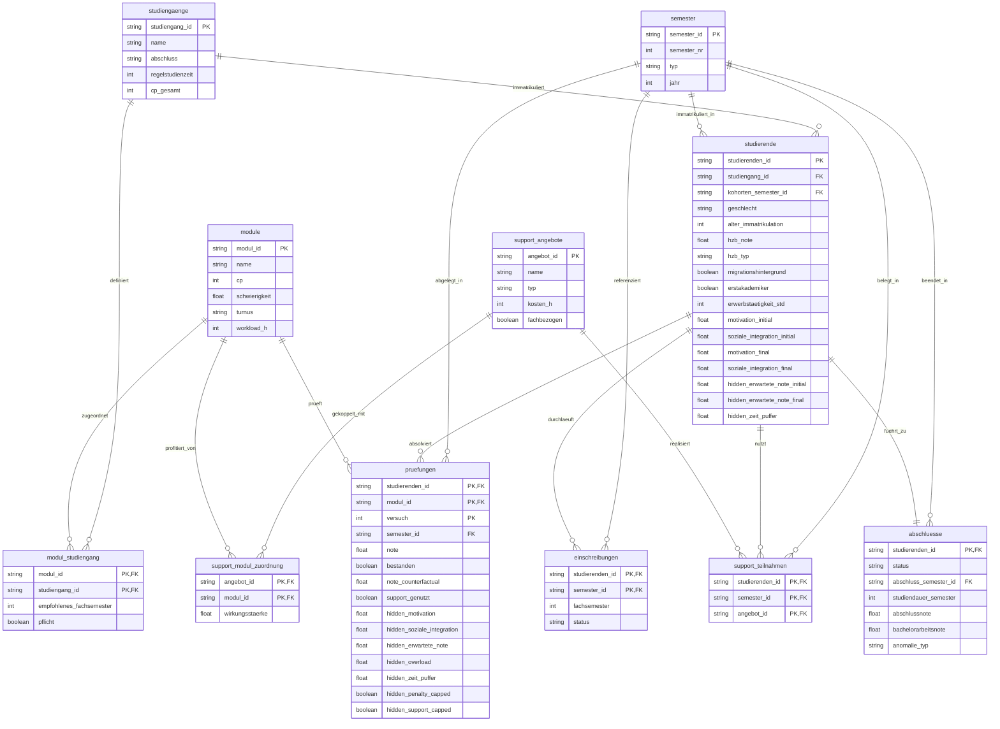
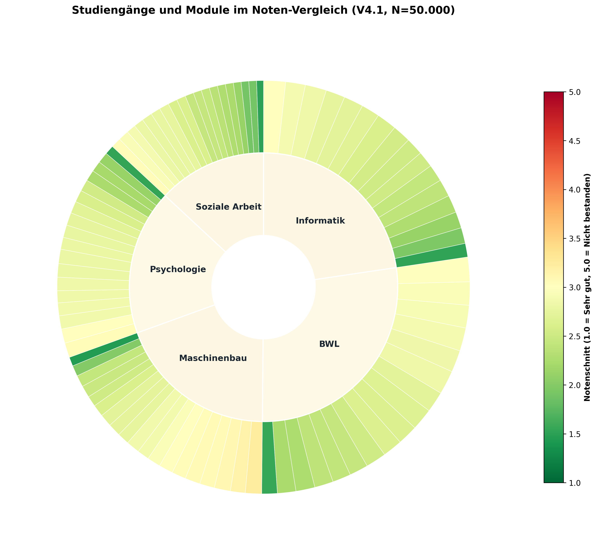
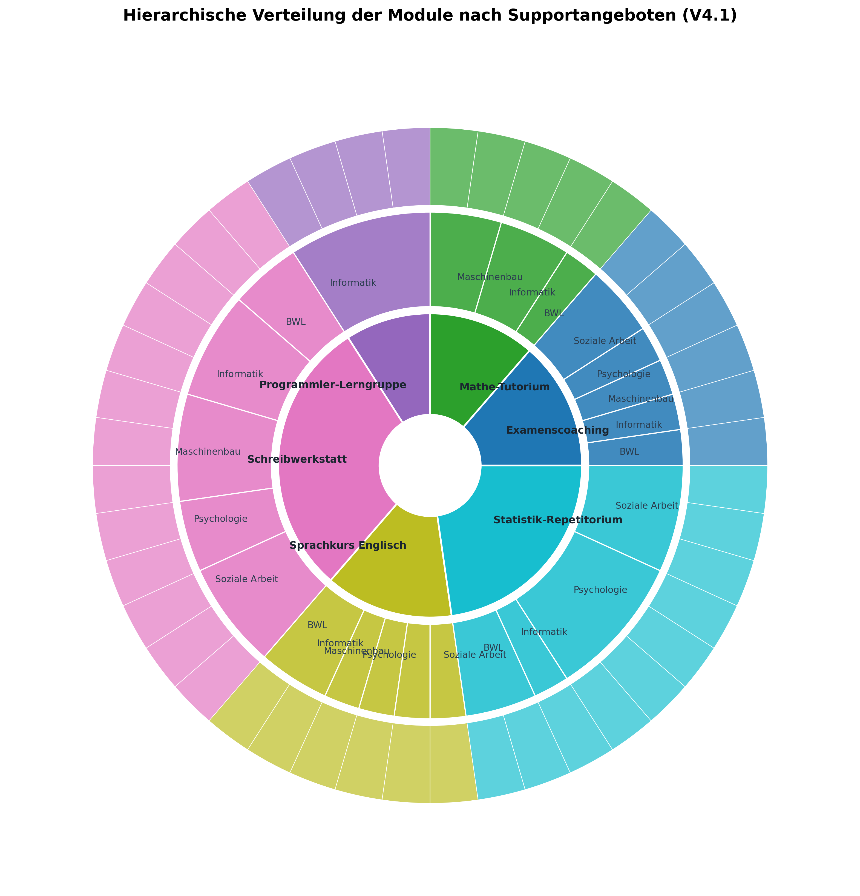
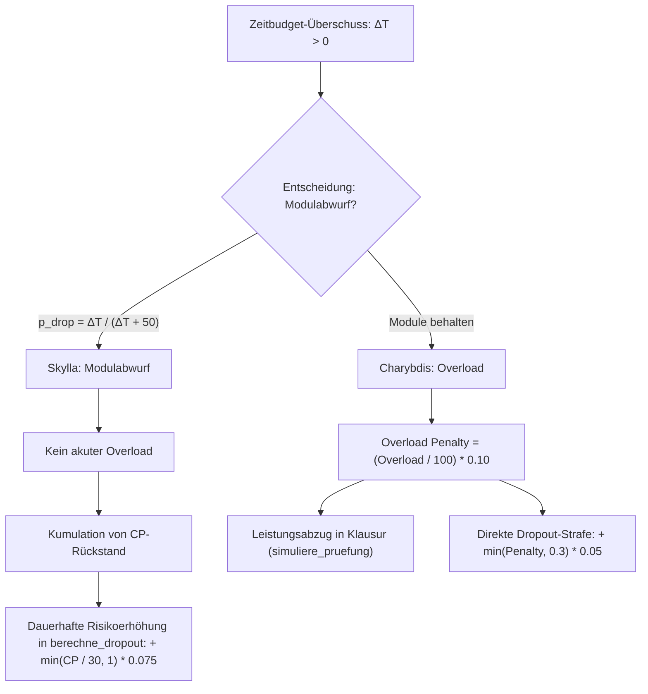
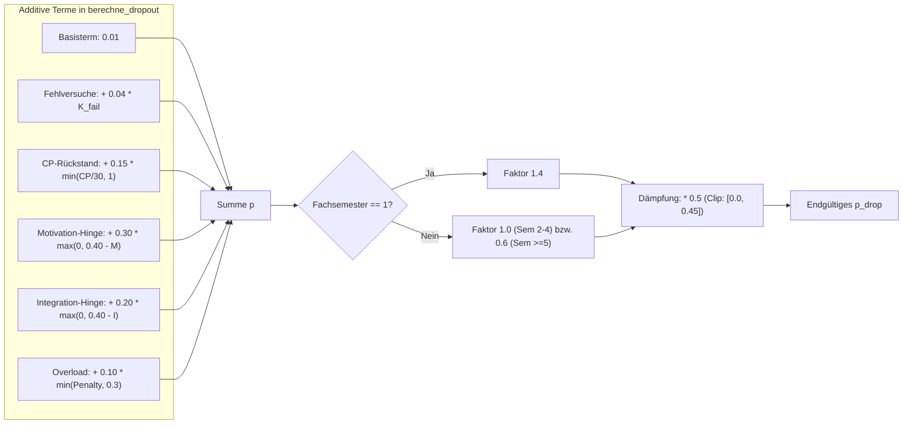
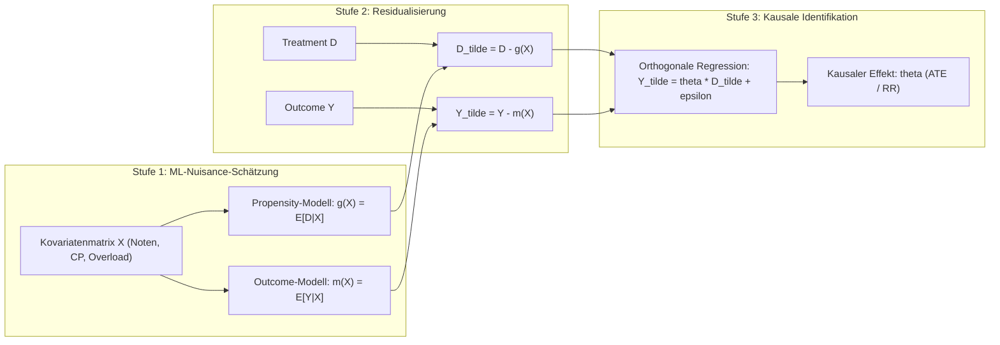

# Datenarchitektur, Relationales Schema & Explorative Datenanalyse (DeepSupport V4.1)

## 1. Relationale Datenbankarchitektur & Entity-Relationship-Modell

Die Simulations- und Analyseplattform DeepSupport basiert auf einem normalisierten, relationalen Datenmodell in Dritter Normalform (3NF) bzw. Boyce-Codd-Normalform (BCNF). Die Architektur gewährleistet strikte referenzielle Integrität (ACID-Eigenschaften) und trennt zeitinvariante institutionelle Stammdaten, soziodemografische Personenstammdaten, curriculare Regelwerke sowie dynamische Transaktions- und Verlaufsdaten voneinander.

### 1.1 Relationales Entity-Relationship-Diagramm (ERD)

Das Gesamtschema umfasst elf Kern-Entitäten. Das Curriculum wird als assoziative Relation zwischen Studiengängen und Modulen modelliert; Unterstützungsangebote bilden eine autonome Primärentität, die bei fachbezogenen Angeboten curricular an Module gekoppelt ist.

### 1.2 Normalisierungslogik und relationale Designentscheidungen

1. **Keine monolithische `curricula`-Tabelle:**  
   Die curriculare Zuordnung erfolgt über die assoziative Relation `modul_studiengang` mit dem zusammengesetzten Primärschlüssel `(modul_id, studiengang_id)`. Dadurch können Module (wie Höhere Mathematik I oder Programmierung I) von mehreren Studiengängen geteilt werden ($n:m$-Beziehung), wobei `empfohlenes_fachsemester` und `pflicht` studiengangspezifisch attribuiert werden.
2. **1:1-Isolation der administrativen Endpunkte (`abschluesse`):**  
   Die Tabelle `abschluesse` steht in einer echten 1:1-Relation zu `studierende`. Diese strikte Trennung separiert zeitlich invariante Ausgangsmerkmale (Geschlecht, HZB, Bildungsherkunft) von den erst am Studienende feststehenden Ergebniskriterien (Status, Gesamtnote, Dauer).
3. **Autonome Förderprogramm-Entität (`support_angebote`):**  
   Interventionen sind als eigenständige Primärentität modelliert. Während transversale Programme (Lerncoaching, psychologische Beratung) modulinvariant wirken, verknüpft `support_modul_zuordnung` fachspezifische Angebote (Mathe-Tutorium, Repetitorien) gezielt mit den jeweiligen Problemfächern unter Angabe einer modulspezifischen `wirkungsstaerke`.
4. **Prüfungsgranularität mit Kontrafaktum:**  
   In `pruefungen` wird neben der realisierten `note` der kontrafaktische Zwilling `note_counterfactual` (die Note bei identischem Zufallsrauschen ohne Förderboost) sowie der Satz latenter Systemzustände (`hidden_motivation`, `hidden_overload`) zeilenweise protokolliert. Dies ermöglicht eine rückwirkungsfreie Validierung kausaler Schätzer.

### 1.3 Schemadokumentation und Tabellenstatistik (Baseline $N = 50.000$)

| Tabelle | Datensätze | Schlüsselstruktur | Funktion im Gesamtsystem |
|:---|:---|:---|:---|
| `studiengaenge` | 5 | PK: `studiengang_id` | Definition der Studienprogramme, Regelstudienzeit und ECTS-Abschlussgrenzen. |
| `module` | 89 | PK: `modul_id` | Modulkatalog mit ECTS-Credits, Nenn-Workload, Grundschwierigkeit und Semesterturnus. |
| `modul_studiengang` | 89 | PK: `(modul_id, studiengang_id)` | Curriculares Regelwerk mit Pflicht-/Wahlstatus und Semesterempfehlung. |
| `semester` | 36 | PK: `semester_id` | Kalendarische Zeitachse (WS2015 bis SS2033) mit Typisierung (WS/SS). |
| `studierende` | 50.000 | PK: `studierenden_id` | Kohorten-Stammdaten, Soziodemografie, Vorbildung und latente Startparameter. |
| `abschluesse` | 50.000 | PK/FK: `studierenden_id` | Administrativer Studienausgang (Abschluss, Dropout, Zwangsexmatrikulation). |
| `einschreibungen` | 347.791 | PK: `(studierenden_id, semester_id)` | Semesterpanel mit Fachsemesterzählung und Immatrikulationsstatus. |
| `pruefungen` | 852.368 | PK: `(studierenden_id, modul_id, versuch)` | Granulare Prüfungsversuche, Noten, Kontrafakta und latente Belastung. |
| `support_angebote` | 12 | PK: `angebot_id` | Katalog der 12 Interventionsmaßnahmen mit Typ und Nenn-Zeitkosten. |
| `support_modul_zuordnung` | 44 | PK: `(angebot_id, modul_id)` | Spezifische Wirkungsstärken fachlicher Angebote auf Zielmodule. |
| `support_teilnahmen` | 134.549 | PK: `(studierenden_id, semester_id, angebot_id)` | Semesterweise Transaktionsdaten über realisierte Förderteilnahmen. |

---

## 2. Curriculares Fächer- und Modulgefüge

Das Curriculum steuert über Workload, fachliche Hürden und Prüfungsturnus die mechanische Selektion der Kohorte. Die folgenden Visualisierungen spiegeln die hierarchische Verflechtung der fünf Studiengänge, 89 Module und zwölf Hilfsangebote wider.

### 2.1 Fächerübergreifender Noten- und Schwierigkeitsvergleich (Sunburst I)

Das erste hierarchische Sunburst-Diagramm visualisiert das Notengefüge der gesamten Modelluniversität. Der innere Ring repräsentiert die fünf Fachrichtungen, während der äußere Ring alle 89 akkreditierten Module auffächert. Die Farbcodierung spiegelt den empirischen Notendurchschnitt über alle Erst- und Wiederholungsprüfungen wider ($1{,}0$ bis $5{,}0$).

> **Interaktives Diagramm:** Eine stufenlos zoombare Vektorversion mit Tooltips zu ECTS, Fehlquoten und Teilnehmerzahlen steht unter [docs/interactive/sunburst_noten_vergleich.html](../interactive/sunburst_noten_vergleich.html) bereit.

#### Empirische Notenbefunde nach Fachbereichen ($N = 852.368$ Prüfungen)

1. **Maschinenbau (SG03) als curriculares Nadelöhr:**  
   Mit einer durchschnittlichen Modulnote von **$3{,}24$** und einer Erstversuchs-Durchfallquote von **$26{,}8\,\%$** stellt *Technische Mechanik I* (`MOD0035`, 9 ECTS) das am schärfsten selektierende Modul dar. Zusammen mit *Technische Mechanik II* (`MOD0038`, $\varnothing = 3{,}16$, Fail: $25{,}3\,\%$) und *Konstruktion I/II* (`MOD0036`/`MOD0041`) erzeugt dieser Strang eine kumulative Überlastung, die die Gesamtabbruchquote im Maschinenbau auf **$34{,}46\,\%$** anhebt (Studiendauer $\varnothing = 7{,}53$ Semester).
2. **Mathematische Grundlagen in der Informatik (SG01):**  
   *Programmierung I* (`MOD0001`, $\varnothing = 2{,}98$) und *Diskrete Strukturen* (`MOD0004`, $\varnothing = 3{,}02$) bündeln im 1. Fachsemester die Misserfolge. Der Informatik-Notenschnitt stabilisiert sich erst in den höheren Fachsemestern ($\varnothing = 2{,}48$ im 5. Semester; Gesamt-Dropout: $27{,}44\,\%$).
3. **Abschlussarbeiten als Leistungsplateau:**  
   Die Bachelorarbeiten (`MOD0015`, `MOD0032`, `MOD0051`, `MOD0069`, `MOD0088`) weisen über alle Fakultäten hinweg Notenmittelwerte zwischen **$1{,}45$ und $1{,}55$** bei Durchfallquoten von unter $2{,}0\,\%$ auf. Wer das Hauptstudium erreicht, schließt die Abschlussphase mit hoher Verlässlichkeit ab.

---

### 2.2 Curriculare Support-Verzahnung (Sunburst II)

Das komplementäre Sunburst-Diagramm ordnet das institutionelle Fördersystem hierarchisch von innen nach außen: Fördertypus $\rightarrow$ Spezifisches Förderprogramm $\rightarrow$ Profitierende Studiengänge $\rightarrow$ Adressierte Fachmodule.

> **Interaktives Diagramm:** Die interaktive Version zur Exploration der Angebotsstrukturen ist abrufbar unter [docs/interactive/sunburst_support_verteilung.html](../interactive/sunburst_support_verteilung.html).

#### Struktur und Inanspruchnahme der zwölf Support-Programme ($N = 134.549$ Teilnahmen)

| Angebots-ID | Programmname | Domäne | Zeitkosten | Unique Nutzer | Teilnahmen | Hauptsächliche Zielmodule |
|:---|:---|:---|:---:|:---:|:---:|:---|
| `SUP01` | Mathe-Tutorium | fachlich | $30\,\text{h}$ | 13.636 | 17.446 | Höhere Mathematik, Diskrete Strukturen, Statistik |
| `SUP02` | Programmier-Lerngruppe | fachlich | $30\,\text{h}$ | 10.328 | 12.810 | Programmierung I & II, Algorithmen |
| `SUP03` | Statistik-Repetitorium | fachlich | $30\,\text{h}$ | 14.023 | 18.347 | Statistik I & II, Empirische Methoden |
| `SUP04` | Schreibwerkstatt | fachlich | $30\,\text{h}$ | 11.509 | 13.738 | Wissenschaftliches Arbeiten, Seminararbeiten |
| `SUP05` | Sprachkurs Englisch | fachlich | $30\,\text{h}$ | 10.370 | 12.360 | Fachsprache Wirtschaft/Technik |
| `SUP06` | Examenscoaching | fachlich | $30\,\text{h}$ | 8.472 | 9.993 | Bachelor-Kolloquium, Abschlussarbeiten |
| `SUP07` | Zeitmanagement-Workshop | überfachlich | $10\,\text{h}$ | 7.854 | 8.871 | Transversal (studiengangsunabhängig) |
| `SUP08` | Lerncoaching | überfachlich | $10\,\text{h}$ | 7.951 | 8.859 | Transversal (studiengangsunabhängig) |
| `SUP09` | Mentoring-Programm | überfachlich | $10\,\text{h}$ | 7.989 | 8.964 | Transversal (studiengangsunabhängig) |
| `SUP10` | Psychologische Beratung | psychosozial | $5\,\text{h}$ | 7.197 | 7.909 | Transversal (Krisenintervention) |
| `SUP11` | Studienberatung | psychosozial | $5\,\text{h}$ | 6.986 | 7.634 | Transversal (Status- und Fachberatung) |
| `SUP12` | Peer-Support-Gruppe | psychosozial | $15\,\text{h}$ | 6.951 | 7.618 | Transversal (Gemeinschaftsbildung) |

#### Mathematische Koppelung an die Prüfungssimulation (`engine.py`)

In der Simulationsmechanik moduliert fachlicher Support die kontinuierliche latente Leistung $L_{i,m}$ vor Diskretisierung in Notenstufen ($1{,}0$ bis $5{,}0$):

$$\Delta L_{\text{Support}} = \text{boost} = \min\left(\text{boost}_{\text{raw}}; \, \text{deckel}\right)$$

$$\text{boost}_{\text{raw}} = \left( \sum_{a \in \mathcal{A}_{\text{akt}}} w_{a,m} + \frac{2}{3} \sum_{a \in \mathcal{A}_{\text{hist}} \setminus \mathcal{A}_{\text{akt}}} w_{a,m} \right) \times \gamma_{\text{boost}} \times \mu_{\text{mult}}$$

Hierbei bezeichnet $\mathcal{A}_{\text{akt}}$ die im aktuellen Semester genutzten Angebote, $\mathcal{A}_{\text{hist}}$ frühere Teilnahmen an auf dieses Modul bezogenen Förderungen (partielles $2/3$-Carry-over-Gedächtnis für Wiederholungsprüfungen), $\gamma_{\text{boost}} = 0{,}08$ das Basisgewicht, $\mu_{\text{mult}} = 5{,}0$ den Szenario-Multiplikator und $\text{deckel} = 1{,}0$ die Obergrenze.

Transversale Angebote wirken dagegen dynamisch auf die latenten Zustandsvariablen:
- **Überfachlich:** $\Delta \text{Motivation} = +0{,}02 \times \mu_{\text{mult}}$, $\Delta \text{Integration} = +0{,}01 \times \mu_{\text{mult}}$
- **Psychosozial:** $\Delta \text{Motivation} = +0{,}015 \times \mu_{\text{mult}}$, $\Delta \text{Integration} = +0{,}035 \times \mu_{\text{mult}}$

---

## 3. Aggregierte Kohorten-Dynamik: Dekonstruktion über den DGP

Die makroskopischen Verteilungsmuster und Verweildauern sind keine emergenten soziologischen Zufallsprodukte, sondern die mathematisch zwingende Konsequenz der Differential- und Differenzengleichungen des Data Generating Process (DGP in `src/deepsupport/simulation/engine.py`).

### 3.1 Das Zeitmangel-Dilemma: Skylla (Modulabwurf) vs. Charybdis (Overload)

Der Simulator modelliert Studierende mit einem rigiden Zeitbudget von $900\,\text{h}$ pro Semester (entsprechend $30\,\text{ECTS} \times 30\,\text{h}$). Die verfügbare Netto-Studienzeit $T_{\text{verf}}$ wird durch Erwerbstätigkeit gekürzt:

$$T_{\text{verf}} = \max\left(100; \, 900 - h_{\text{erwerb}} \times 20\right)$$

Treffen hoher Modul-Workload $W_{\text{plan}}$ und zeitintensive Support-Maßnahmen $C_{\text{supp}}$ auf ein geschrumpftes Zeitbudget, entsteht ein Überschuss über den individuellen Zeitpuffer $\tau_i \sim \text{Beta}(2{,}64; 5{,}36) \times 180\,\text{h}$ ($\varnothing \approx 60\,\text{h}$):

$$\Delta T_{\text{excess}} = W_{\text{plan}} + C_{\text{supp}} - T_{\text{verf}} - \tau_i$$

Studierende stehen daraufhin vor zwei schädlichen Alternativen:

#### Empirische Beweisführung in der Gesamtkohorte

Von den $852.368$ abgelegten Prüfungen fanden **$274.718$ ($32{,}23\,\%$)** unter akutem Overload statt (mittlerer Overload bei Überlast: $161{,}0\,\text{h}$). Die resultierende Dropout-Verteilung nach Erwerbsstufen belegt die Zuspitzung ab $15$ bis $20$ Wochenstunden:

| Erwerbstätigkeit | Studierende ($N$) | Regulär Beendet | Dropout Gesamt | Abbruchquote | Hauptmechanismus im DGP |
|:---:|:---:|:---:|:---:|:---:|:---|
| $0\,\text{h}$ (Vollzeit) | 12.543 | 10.307 | 2.236 | $17{,}83\,\%$ | Kein Overload; Ausfälle rein leistungsmotiviert. |
| $5\,\text{h}$ | 7.598 | 6.071 | 1.526 | $20{,}10\,\%$ | Puffer kompensiert Zeitverlust meist vollständig. |
| $10\,\text{h}$ | 10.077 | 7.806 | 2.269 | $22{,}54\,\%$ | Gelegentlicher Abwurf von 1 Modul; moderater CP-Verzug. |
| $15\,\text{h}$ | 7.356 | 5.171 | 2.184 | $29{,}70\,\%$ | Kipp-Bereich: Puffer erschöpft, Beginn systematischer Strafen. |
| $20\,\text{h}$ (Werkstudent) | 6.474 | 3.721 | 2.747 | **$42{,}52\,\%$** | Massiver Workload-Konflikt ($400\,\text{h}$ Defizit); hohe Abwurfraten. |
| $25\,\text{h}$ | 3.519 | 1.572 | 1.944 | **$55{,}33\,\%$** | Chronischer CP-Rückstand (> 30 ECTS); permanente Hinge-Aktivierung. |
| $30\,\text{h}$ (Teilzeit) | 2.433 | 774 | 1.657 | **$68{,}19\,\%$** | Simultane Maximierung von Overload-Penalty und CP-Lag. |

---

### 3.2 Stochastische Abbruchdynamik & Timing der ersten Fachsemester

Ein scheinbares Paradoxon der deskriptiven Datenanalyse liegt im zeitlichen Profil freiwilliger Abbrüche (`status == 'abgebrochen'`):
- **Semester 1:** $2.027$ Abbrüche ($16{,}95\,\%$ aller freiwilligen Abbrüche)
- **Semester 2:** $1.705$ Abbrüche
- **Semester 3:** $1.926$ Abbrüche
- **Semester 4:** $2.104$ Abbrüche
- **Semester 5+:** Degressive Verläufe ($1.097 \rightarrow 1.168 \rightarrow 718 \dots$)

Warum brechen im 1. Semester bereits über $2.000$ Studierende ab, obwohl deren durchschnittliche Startmotivation mit **$0{,}555 \pm 0{,}124$** weit über der kritischen Wahrnehmungsschwelle von $0{,}40$ liegt?

#### Die mathematische Struktur von `berechne_dropout`

Die Dropout-Wahrscheinlichkeit $p_{\text{drop}}$ wird in jedem Semester nach Notenvergabe berechnet:

$$p_{\text{drop}} = \left[ 0{,}01 + 0{,}30 \cdot \max(0; 0{,}40 - M) + 0{,}20 \cdot \max(0; 0{,}40 - I) + 0{,}15 \cdot \min\left(\frac{\Delta_{\text{CP}}}{30}; 1\right) + 0{,}04 \cdot K_{\text{fail}} + 0{,}10 \cdot \min(P_{\text{overload}}; 0{,}3) \right] \cdot c_{\text{sem}} \cdot 0{,}5$$

mit $c_{\text{sem}} = 1{,}4$ für Fachsemester 1 und $c_{\text{sem}} = 0{,}6$ für Fachsemester $\ge 5$.

#### Auflösung des Mechanismus:
1. **Kein Schwellenwert, sondern additive Risikokomponenten:**  
   Die $0{,}40$-Grenze ist kein Ausschlusskriterium für Dropout, sondern lediglich der Aktivierungspunkt eines linearen Hinge-Zuschlags ($\max(0; 0{,}40 - M)$).
2. **Der Hebel der Erstsemester-Klausuren:**  
   Im 1. Semester gilt $\Delta_{\text{CP}} = 0$. Ein Student mit $M = 0{,}55$ hat einen Hinge-Wert von $0$. Scheitert er jedoch an zwei Hürdenklausuren ($K_{\text{fail}} = 2$), steigt sein Basiswert schlagartig um $+0{,}08$. Unter Einberechnung des Erstsemester-Multiplikators $1{,}4$ und der Dämpfung $0{,}5$ ergibt sich:
   $$p_{\text{drop}} = (0{,}01 + 0{,}08) \times 1{,}4 \times 0{,}5 = 0{,}063 \quad (6{,}3\,\%)$$
   Bei drei Fehlversuchen resultieren $9{,}1\,\%$.
3. **Empirische Bestätigung:**  
   Von den $2.027$ Abbrechern des 1. Semesters weisen **$1.500$ Studierende ($74{,}0\,\%$)** mindestens einen Fehlversuch auf ($531$ mit $1$ Fehlversuch, $579$ mit $2$ Fehlversuchen, $390$ mit $3$ Fehlversuchen).
4. **Motivations-Rückkopplung:**  
   Nach dem 1. Semester zieht jeder Fehlversuch die Motivation um $-0{,}05$ nach unten (`motivation = max(0.05, motivation - 0.05 * durchgefallen)`). Erst hierdurch rutschen Studierende in den Semestern 2 bis 4 unter die $0{,}40$-Schranke, was die anhaltend hohen Dropout-Zahlen bis Semester 4 erklärt.
5. **Motivationsgewinn:**  
   Ein Motivationsgewinn von $+0{,}02$ tritt ausschließlich in Semestern mit **$0$ Fehlversuchen** ein (`elif len(geplante_module) > 0`). Ein zusätzlicher Schub ("Super-Klausur") verlangt, dass die erzielte Note mindestens $0{,}5$ Notenstufen besser als die individuelle Erwartung ausfällt ($\Delta M = 0{,}005 + 0{,}01 \times (\text{Diff} - 0{,}5)$).

---

### 3.3 Zwangsexmatrikulationen: Semesterturnus-Taktung (WS/SS)

Während freiwillige Studienabbrüche unmittelbar ab dem 1. Semester auftreten, zeigt die administrative Zwangsexmatrikulation (`status == 'exmatrikuliert'`) eine scharfe Phasenverschiebung:

| Fachsemester | Zwangsexmatrikulationen ($N$) | Anteil | Kumulativ | Mechanischer Hintergrund |
|:---:|:---:|:---:|:---:|:---|
| Semester 1–4 | **0** | $0{,}0\,\%$ | $0{,}0\,\%$ | Drittversuch vor Semester 5 curricular mathematisch unmöglich. |
| Semester 5 | **998** | $39{,}89\,\%$ | $39{,}89\,\%$ | **Erster Hauptturnus:** Fehlversuch Sem 1 (WS) $\rightarrow$ Wiederholung Sem 3 (WS) $\rightarrow$ Drittversuch Sem 5 (WS). |
| Semester 6 | 364 | $14{,}55\,\%$ | $54{,}44\,\%$ | Zweiter Turnus für Module aus dem Sommersemester (Sem 2 $\rightarrow$ Sem 4 $\rightarrow$ Sem 6). |
| Semester 7 | 507 | $20{,}26\,\%$ | $74{,}70\,\%$ | Verzögerte Zweitversuche nach Modulabwurf oder Krankheitsabmeldung. |
| Semester 8–10 | 570 | $22{,}78\,\%$ | $97{,}48\,\%$ | Höhere Fachsemester / Vertiefungsmodule. |
| Semester 11–15 | 63 | $2{,}52\,\%$ | $100{,}0\,\%$ | Spätphasen-Verluste bei Langzeitstudierenden. |

Die Ursache für das Ausbleiben jeglicher Zwangsexmatrikulationen vor Semester 5 liegt in der rigiden Taktung des Modulkatalogs: Pflichtmodule werden überwiegend jährlich im Wintersemester (`turnus == 'WS'`) angeboten. Ein Studierender, der im 1. Fachsemester durchfällt, kann die Wiederholungsprüfung erst im 3. Fachsemester belegen. Scheitert auch dieser Zweitversuch, findet der finale Drittversuch zwingend im 5. Fachsemester statt. Erst der dortige Misserfolg triggert die Klausel `if m_state.versuche >= 3: studi.exmatrikuliert = True`.

---

### 3.4 Bildungsherkunft & Erstakademiker-Dynamik (V4 vs. V5)

In der Baseline-Simulation V4.1 verteilt sich der Studienausgang zwischen Studierenden aus akademischem und nicht-akademischem Elternhaus wie folgt:

| Gruppe | Studierende ($N$) | Erfolgreicher Abschluss | Gesamter Dropout | Dropout-Quote |
|:---|:---:|:---:|:---:|:---:|
| **Nicht-Erstakademiker** (`erstakademiker == False`) | 26.208 | 18.288 | 7.920 | $30{,}22\,\%$ |
| **Erstakademiker** (`erstakademiker == True`) | 23.792 | 17.134 | 6.658 | $27{,}98\,\%$ |

In Version 4 weisen Erstakademiker eine geringfügig *niedrigere* Abbruchquote auf ($-2{,}24\,\text{pp}$). Diese Eigenschaft rührt aus zwei gegensätzlichen Modellannahmen her:
1. **Sozioökonomische Belastung:** Erstakademiker erhielten im Generator einen Malus auf die soziale Startintegration (`gewicht_integration_erstakademiker = 0.08`) und weisen im Schnitt eine höhere Erwerbsneigung auf.
2. **Kompensatorische Inanspruchnahme:** In der Support-Entscheidung war ein additiver Term hinterlegt (`if studi.erstakademiker and typ in ("fachlich", "psychosozial"): p += 0.05`), der die Inanspruchnahmequote von Erstakademikern selektiv steigerte und deren Abbruchrisiko überproportional senkte.

Für die künftige Modellgeneration Version 5 ist daher ein empirisch rekalibriertes Schichtungsmodell vorgesehen (siehe [config_audit_und_v5_roadmap.md](config_audit_und_v5_roadmap.md)), das sich an den DZHW-Absolventenstudien orientiert und die strukturellen Nachteile über reale BAföG-Abhängigkeiten und finanzielle Notlagen präziser abbildet.

---

## 4. Biostatistische Methodik: Vom statischen Dashboard zur Kausalinferenz

Die methodische Evolution von DeepSupport dokumentiert den Übergang von deskriptiven, korrelativen Auswertungen zu rigorosen kausalen Identifikationsstrategien.

### 4.1 Die methodische Ausgangslage im historischen Dashboard (`Dashboard_Survival_beta.ipynb`)

Im ursprünglichen explorativen Dashboard wurden Überlebensanalysen mittels Cox Proportional Hazards und Kaplan-Meier-Schätzern gerechnet. Dem Modell lagen bereits umfangreiche Kontrollvariablen zugrunde:
- Hochschulzugangsberechtigung (HZB-Note)
- Alter bei Immatrikulation
- Geschlecht
- Erstakademiker-Status

Trotz der Inklusion dieser statischen Kontrollvariablen wiesen die Cox-Modelle für Förderangebote stark verzerrte Effektschätzer auf. Die Ursache lag in zwei methodischen Verzerrungsquellen: dem **Immortal Time Bias** und dem **Confounding by Indication**.

---

### 4.2 Dekonstruktion des Immortal Time Bias

Wird der Inanspruchnahmestatus auf aggregierter Personenebene definiert (z. B. `ever_used_support = True`, falls ein Studierender zu irgendeinem Zeitpunkt des Studiums Hilfe in Anspruch genommen hat), entsteht eine massive systematische Verzerrung:

```mermaid
gantt
    title Dekonstruktion des Immortal Time Bias
    dateFormat  X
    axisFormat %s

    section Früher Dropout (Unbehandelt)
    Immatrikulation (t=0) :done, d1, 0, 1
    Abbruch nach Prüfungsversagen (t=1) :crit, d2, 1, 2

    section Später Absolvent (Support-Nutzer)
    Immortal Time (t=0 bis t=4) :active, s1, 0, 4
    Erste Support-Nutzung (t=4) :done, s2, 4, 5
    Erfolgreicher Abschluss (t=6) :s3, 5, 7
```

1. **Die Asymmetrie der Expositionsgelegenheit:**  
   Um in einem höheren Fachsemester an einem Coaching oder Tutorium teilnehmen zu können, muss ein Studierender bis zu diesem Zeitpunkt immatrikuliert geblieben sein. Die Zeitspanne von der Einschreibung bis zur ersten Teilnahme ($t = 0$ bis $t_{\text{treat}}$) ist per Definition **"unsterblich"** (*Immortal Time*): Innerhalb dieses Intervalls kann kein Dropout registriert werden, da der Studierende andernfalls nicht als "späterer Support-Nutzer" klassifiziert worden wäre.
2. **Die Konsequenz:**  
   Frühe Misserfolge (wie die $2.027$ Abbrüche des 1. Semesters) fallen ausnahmslos der Gruppe der "Nicht-Nutzer" zu, da diese Personen gar keine Gelegenheit hatten, Förderangebote wahrzunehmen. Ein statisches Modell ordnet diese frühe Übersterblichkeit fälschlicherweise dem Fehlen von Support zu und überschätzt die Schutzwirkung drastisch ($HR \ll 1{,}0$ als reines Zensierungsartefakt).
3. **Die entgegengesetzte Verzerrung (Confounding by Indication):**  
   Wird umgekehrt ein naiver Querschnittsvergleich innerhalb eines einzelnen Semesters ohne Verlaufsdynamik gerechnet, kehrt sich die Verzerrung um: Da überwiegend Studierende in akuter Leistungsnot oder mit Durchfallrisiko Förderangebote aufsuchen, scheinen Support-Nutzer eine *höhere* Abbruchquote aufzuweisen ($HR = 1{,}20$, $p < 0{,}001$).

---

### 4.3 Die methodische Lösung: Counting Process Panel und Double Machine Learning

Um beide Verzerrungsformen simultan zu eliminieren, implementiert die DeepSupport-Pipeline zwei komplementäre Verfahren:

#### 1. Personen-Semester-Panel in Counting-Process-Notation
Der Studienverlauf wird in disjunkte Zeitintervalle $[t_{\text{start}}, t_{\text{stop}})$ zerlegt (Andersen-Gill-Erweiterung). Support-Teilnahmen werden als **streng zeitvariierende Kovariaten** modelliert:

$$Y_{i,t} = \mathbb{I}(\text{Dropout im Intervall } [t, t+1))$$

$$D_{i,t} = \mathbb{I}(\text{Support-Teilnahme im Intervall } [t, t+1))$$

Ein Studierender trägt bis zum Semester seiner ersten Fördermaßnahme ausschließlich Personen-Zeit zur unexposed Kontrollgruppe bei. Scheidet er vor einer Maßnahme aus, wird dieses Ereignis korrekt der unexposed Zeit zugeschlagen. Der Immortal Time Bias wird dadurch strukturell ausgeschlossen.

#### 2. Double Machine Learning (DML) nach Chernozhukov et al.
Um die Indikationsverzerrung (Selektion in Förderangebote auf Basis latenter Schwächen) aufzulösen, nutzt die Pipeline eine orthogonale Zweistufen-Residualisierung (Frisch-Waugh-Lovell-Theorem im Funktionsraum):

Durch die Kreuzvalidierungs-Orthogonalisierung ($K$-Fold Cross-Fitting) konvergiert der DML-Schätzer mit parametrischer Rate $\sqrt{N}$ gegen den wahren Behandlungseffekt, frei von Regularisierungs- und Selektionsverzerrungen:
- **Naives Cox (Fachlicher Support):** $HR = 1{,}199$ (Scheinbare Risikoerhöhung um $+20\,\%$)
- **Double Machine Learning (DML):** $RR = 0{,}964$ (Statistisch signifikanter Schutzeffekt, $p = 0{,}038$)
- **Autoregressiver Transformer DML:** $RR = 0{,}887$
- **Experimentelle Ground Truth (Universum A vs. B):** $RR = 0{,}786$ ($ARR = 7{,}95\,\text{pp}$, $NNT = 12{,}6$)

---

## 5. Verwandte Dokumente

| Dokument | Pfad | Thematischer Bezug |
|:---|:---|:---|
| **Visuelle Datenexploration** | [visuelle_datenexploration_v4.md](visuelle_datenexploration_v4.md) | Publikationsfähige Plots (Kaplan-Meier, Treemap, KDE-Boxplots, Forest Plot). |
| **Kausale Vergleichsanalyse** | [04_Kausale_Vergleichsanalyse.md](04_Kausale_Vergleichsanalyse.md) | Ausführliche mathematische Herleitung von DML, IPW und SCM-Ground-Truth. |
| **Systematische Verteilungsanalyse** | [systematische_verteilungsanalyse_v36_vs_v41.md](systematische_verteilungsanalyse_v36_vs_v41.md) | Psychometrischer und demografischer Kovariatencheck (V3.6 vs. V4.1). |
| **Config-Audit & V5 Roadmap** | [config_audit_und_v5_roadmap.md](config_audit_und_v5_roadmap.md) | Parameter-Dokumentation des DGP und DZHW-Rekalibrierungsplan für Version 5. |
| **Master-Synopse V4 Gesamt** | [../03_evaluations_and_benchmarks/master_synopse_v4_gesamt.md](../03_evaluations_and_benchmarks/master_synopse_v4_gesamt.md) | Benchmarks aller 15 Sensitivitätsszenarien und 225 ML-/DL-Modelle. |
| **Datenprovenienz & Generatorzuordnung** | [datenprovenienz_und_generator_zuordnung_v36_v41.md](datenprovenienz_und_generator_zuordnung_v36_v41.md) | Herkunftsnachweis aller Dateien zwischen Legacy-V3- und Baukasten-V4-Struktur. |
