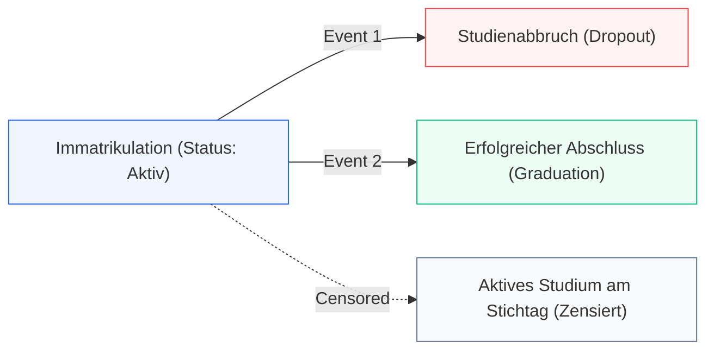
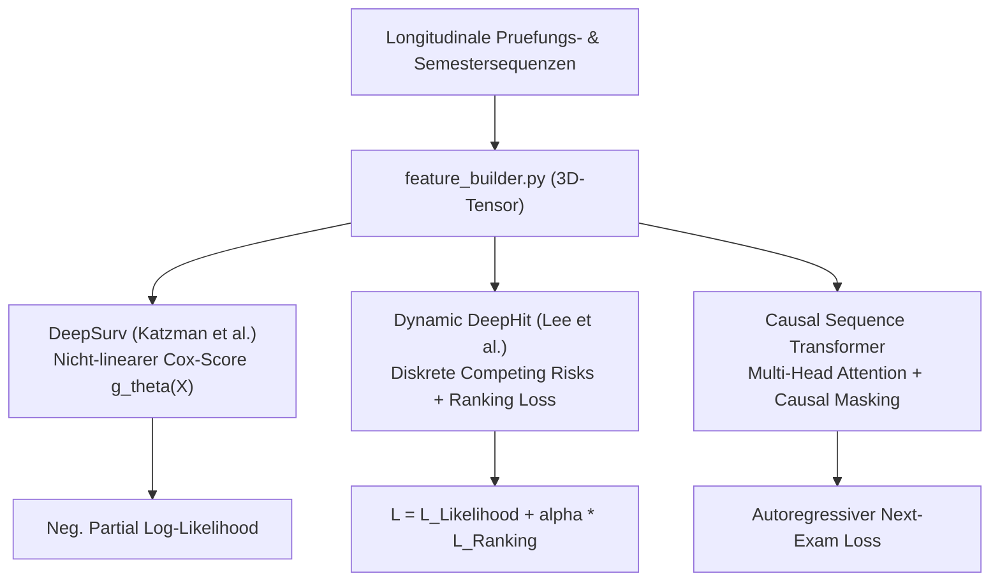

# Grundlagen der Survival-Analyse, Zensierungsmathematik und Ereigniszeitmodellierung

Die quantitative Modellierung von Bildungsverlaeufen steht vor einer fundamentalen methodischen Herausforderung: Studienerfolg und Studienabbruch sind keine statischen Zustaende, sondern dynamische, zeitabhaengige Prozesse. Dieses Dokument liefert die formale mathematische und biostatistische Fundierung der im DeepSupport-Framework eingesetzten Methoden der Ereigniszeitanalyse (Survival-Analyse). Es klaert die mathematischen Eigenschaften von Zensierungsmechanismen, loest zentrale Missverstaendnisse bezueglich Verweildauern und Konfidenzintervallen auf, analysiert Software-Grenzfaelle (wie die Division durch Null in `statsmodels`) und spannt den Bogen von klassischen Schaetzern ueber konkurrierende Risiken (Competing Risks) bis hin zu modernen Deep-Learning-Architekturen.

---

## 1. Einleitung: Ereigniszeitdaten im Hochschulkontext

In der empirischen Hochschulforschung wird der Studienerfolg haeufig auf zwei verkuerzte Arten modelliert:

1. **Lineare Regression (OLS):** Vorhersage der Studiendauer $T$ als kontinuierliche Zielvariable.
2. **Logistische Regression / Binaere Klassifikation:** Vorhersage der dichotomen Variable $Y \in \{0, 1\}$ (Abbruch vs. Verbleib/Abschluss).

Beide Ansaetze versagen vor den realen Bedingungen longitudinaler Paneldaten:

### Das Dilemma der linearen Regression
Eine OLS-Regression setzt voraus, dass die Studiendauer fuer jedes Individuum vollstaendig beobachtet wurde. Zum Erhebungszeitpunkt eines Semesters befindet sich jedoch ein erheblicher Teil der Studierenden noch im regulaeren Studium. 
- Setzt man fuer diese aktiven Studierenden deren bisherige Fachsemesterzahl als Endpunkt ein, wird deren Studiendauer kuenstlich unterschaetzt.
- Schliesst man aktive Studierende aus der Analyse aus, erzeugt man einen massiven **Survivorship Bias** bzw. Selektionsbias: Schnelle Abgaenger (Fruehabbrecher) und Regelsemsester-Absolventen werden ueberrepraesentiert, waehrend Langzeitstudierende systematisch herausgefiltert werden.
- Setzt man willkuerlich die zulaessige Hoechststudiendauer ein, werden Varianzen kollabiert und Schaetzer verzerrt.

### Das Dilemma der binaeren Klassifikation
Eine logistische Regression ignoriert die Dimension *wann* ein Ereignis eintritt:
- Ein Studienabbruch im 1. Fachsemester erfordert voellig andere Interventionen (z. B. fachliche Orientierungskurse, Vorkurse) als ein Scheitern an der Bachelorarbeit im 8. Fachsemester.
- Zudem fuehrt das zeitliche Abschneiden der Beobachtung (Administrative Censoring) zu fehlerhaften Labels: Ein Studierender, der im 3. Semester beobachtet wird und noch immatrikuliert ist, erhaelt das Label $Y=0$ (kein Abbruch). Bricht diese Person im 5. Semester ab, handelt es sich um ein False-Negative-Labeling.

### Die Loesung: Time-to-Event-Analyse
Die Survival-Analyse loest beide Probleme simultan, indem sie fuer jedes Individuum $i$ ein Wertepaar erfasst:
- Eine beobachtete Zeitdauer $Y_i \ge 0$.
- Einen Indikator $\delta_i \in \{0, 1\}$, der anzeigt, ob $Y_i$ dem tatsaechlichen Ereigniseintritt entspricht ($\delta_i = 1$) oder ob die Beobachtung zu diesem Zeitpunkt zensiert wurde ($\delta_i = 0$).

---

## 2. Mathematische Fundierung der Ereigniszeit

Sei $T \ge 0$ eine nicht-negative, kontinuierliche Zufallsvariable, die die Zeitspanne vom Studienbeginn ($t=0$) bis zum Eintritt des Zielereignisses (z. B. Exmatrikulation durch Studienabbruch) beschreibt.

### 2.1 Verteilungsfunktion und Dichte
Die Wahrscheinlichkeit, dass das Ereignis bis zu einem Zeitpunkt $t$ eintritt, ist durch die kumulative Verteilungsfunktion $F(t)$ gegeben:
$$F(t) = P(T \le t) = \int_0^t f(u) \, du$$
wobei $f(t) = \frac{dF(t)}{dt}$ die Wahrscheinlichkeitsdichtefunktion darstellt.

### 2.2 Die Ueberlebensfunktion (Survival Function)
Die Ueberlebensfunktion $S(t)$ beschreibt die Wahrscheinlichkeit, dass ein Individuum mindestens bis zum Zeitpunkt $t$ im System verbleibt (das Ereignis also noch nicht erlitten hat):
$$S(t) = P(T > t) = 1 - F(t) = \int_t^\infty f(u) \, du$$

Fundamentale Eigenschaften:
- $S(0) = 1$ (zu Studienbeginn hat noch niemand abgebrochen).
- Monoton fallend: $\frac{d S(t)}{dt} \le 0$.
- Asymptotik: $\lim_{t \to \infty} S(t) = 0$, sofern das Ereignis mit Wahrscheinlichkeit 1 eintritt. Wenn ein Anteil der Population immun gegen das Ereignis ist (z. B. dauerhaft erfolgreiche Studierende im reinen Abbruchmodell), konvergiert $S(t)$ gegen einen positiven Grenzwert $S(\infty) > 0$ (Cure-Modelle / Non-Susceptibility).

### 2.3 Die Hazard-Rate (Transitionsintensitaet)
Die Hazard-Rate $h(t)$ (auch Ausfallrate oder Transitionsintensitaet) gibt das momentane Risiko an, im naechsten infinitesimalen Zeitintervall $[t, t + \Delta t)$ das Ereignis zu erleiden, unter der Bedingung, dass das Individuum bis zum Zeitpunkt $t$ ueberlebt hat:
$$h(t) = \lim_{\Delta t \to 0} \frac{P(t \le T < t + \Delta t \mid T \ge t)}{\Delta t}$$

Unter Anwendung der Definition der bedingten Wahrscheinlichkeit $P(A \mid B) = \frac{P(A \cap B)}{P(B)}$ folgt:
$$h(t) = \lim_{\Delta t \to 0} \frac{P(t \le T < t + \Delta t)}{\Delta t \cdot P(T \ge t)} = \frac{f(t)}{S(t)}$$

Da $f(t) = -\frac{d S(t)}{dt}$, laesst sich die Hazard-Rate schreiben als:
$$h(t) = -\frac{d \ln S(t)}{dt}$$

Wichtige Eigenschaft: $h(t)$ ist **keine Wahrscheinlichkeit**, sondern eine **Rate** mit der Dimension $[\text{Zeit}^{-1}]$. Folglich kann $h(t) > 1$ sein.

### 2.4 Die kumulative Hazard-Funktion
Die kumulative Hazard-Funktion $H(t)$ integriert das akkumulierte Risiko von Beginn bis zum Zeitpunkt $t$:
$$H(t) = \int_0^t h(u) \, du = -\int_0^t \frac{d \ln S(u)}{du} \, du = -\ln S(t)$$

Daraus ergibt sich der fundamentale Zusammenhang:
$$S(t) = \exp(-H(t)) = \exp\left( -\int_0^t h(u) \, du \right)$$

---

## 3. Zensierung, Truncation und Identifikationsbedingungen

In realen Beobachtungsstudien ist die wahre Ereigniszeit $T$ nicht fuer alle Probanden zugaenglich. Stattdessen existiert ein Zensierungsmechanismus $C \ge 0$.

```mermaid
flowchart TD
    subgraph Rechtszensierung["1. Rechtszensierung (Right Censoring)"]
        R1["Immatrikulation t=0"] --> R2["Beobachtung laeuft"]
        R2 --> R3["Zensierungszeitpunkt C: Studie endet"]
        R3 -.-> R4["Wahre Ereigniszeit T (unbeobachtet)"]
    end

    subgraph Intervallzensierung["2. Intervallzensierung (Discrete Semesters)"]
        I1["Semesterstart t_{k-1}"] --> I2["Ereignis tritt ein (T)"]
        I2 --> I3["Erfassung zum Semesterende t_k"]
    end

    subgraph Truncation["3. Left Truncation (Delayed Entry)"]
        T1["Beginn t=0"] -.-> T2["Vorgeschichte unbeobachtet"]
        T2 --> T3["Eintritt ins Panel bei t_{entry} (Hochschulwechsler)"]
    end
```



### 3.1 Taxonomie der Zensierungsarten

#### A. Rechtszensierung (Right Censoring)
Der haeufigste Fall im Hochschulwesen: Ein Individuum verlaesst das Beobachtungsfenster, bevor das Ereignis eintritt ($T_i > C_i$).
- **Administratives Zensieren:** Die Datenerhebung endet an einem Stichtag (z. B. Ende des Wintersemesters 2025/26). Alle noch immatrikulierten Studierenden werden zu diesem Zeitpunkt rechtszensiert.
- **Zufaelliges Zensieren / Loss to Follow-up:** Ein Studierender wechselt die Universitaet oder verzieht ins Ausland, ohne seinen Status an der bisherigen Hochschule zu dokumentieren.

Beobachtet wird lediglich:
$$Y_i = \min(T_i, C_i), \quad \delta_i = \mathbb{I}(T_i \le C_i)$$

#### B. Linkszensierung (Left Censoring)
Das Ereignis ist bereits vor Beginn der Beobachtung eingetreten ($T_i < C_i$), aber der genaue Zeitpunkt ist unbekannt. Im Hochschulbereich selten, da der Beginn des Studiums administrativ mit Tag 1 der Immatrikulation praezise definiert ist.

#### C. Intervallzensierung (Interval Censoring)
Es ist lediglich bekannt, dass das Ereignis in einem Zeitintervall $[t_{L,i}, t_{R,i}]$ eingetreten ist. Im Hochschulwesen ist dies streng genommen der Standardfall: Exmatrikulationen und Pruefungen werden semesterweise aggregiert. Wenn eine Person im Verlauf des 3. Fachsemesters die Motivation verliert, wird der administrative Abbruch zum Stichtag der Rueckmeldefrist erfasst ($2 < T_i \le 3$).

#### D. Left Truncation (Delayed Entry)
Personen treten erst zu einem Zeitpunkt $t_{\text{entry}} > 0$ in das Risikoset ein (z. B. Quereinsteiger im 3. Semester). Wer vor $t_{\text{entry}}$ abgebrochen ist, wird in der Kohorte gar nicht erst beobachtet. Wird Left Truncation nicht konditioniert, entsteht ein schwerer Selektionsbias zugunsten erfolgreicher Studierender.

### 3.2 Die fundamentale Annahme: Nicht-informative (unabhaengige) Zensierung

Fuer saemtliche Standardverfahren (Kaplan-Meier, Nelson-Aalen, Cox-Regression) ist die Gueltigkeit der Annahme **nicht-informativer Zensierung** zwingend erforderlich:
$$T \perp C \mid X$$

Bedeutung: Bedingt auf die beobachtbaren Kovariaten $X$ darf das Risiko, zum Zeitpunkt $t$ zensiert zu werden, keine Information darueber enthalten, wie hoch die Wahrscheinlichkeit eines unmittelbar bevorstehenden Ereignisses ist. Ein Individuum, das zu $t$ zensiert wird, muss fuer die Zukunft dieselbe Hazard-Rate aufweisen wie Individuen mit identischem $X$, die im Risikoset verbleiben.

Verletzungen dieser Annahme fuehren zu gravierenden Verzerrungen:
- Wenn Studierende, die kurz vor dem Scheitern stehen, sich vorzeitig exmatrikulieren oder untertauchen, ist die Zensierung informativ.
- Wenn Absolventen als "zensiert" bezueglich eines Studienabbruchs kodiert werden, wird die Uninformativitaet fundamental verletzt (siehe Kapitel 6).

---

## 4. Nicht-parametrische Schaetzung: Kaplan-Meier und Nelson-Aalen

Zur Schaetzung der Ueberlebensfunktion $S(t)$ ohne Verteilungsannahmen dient der **Kaplan-Meier-Schaetzer** (Produkt-Grenzwert-Schaetzer; Kaplan & Meier, 1958).

### 4.1 Konstruktion des Kaplan-Meier-Schaetzers
Seien $t_1 < t_2 < \dots < t_K$ die geordneten, eindeutigen Zeitpunkte, an denen mindestens ein Ereignis beobachtet wird. Zu jedem Zeitpunkt $t_i$ seien:
- $d_i$: Anzahl der Ereignisse zum Zeitpunkt $t_i$.
- $n_i$: Anzahl der Individuen im Risikoset unmittelbar vor $t_i$ (d. h. $Y_j \ge t_i$).

Die bedingte Wahrscheinlichkeit, das Intervall $[t_i, t_{i+1})$ unbeschadet zu ueberstehen, gegeben das Erreichen von $t_i$, wird geschaetzt als:
$$\hat{p}_i = 1 - \frac{d_i}{n_i} = \frac{n_i - d_i}{n_i}$$

Daraus ergibt sich die Kaplan-Meier-Schaetzung als kumulatives Produkt ueber alle vorherigen Ereigniszeitpunkte:
$$\hat{S}(t) = \prod_{t_i \le t} \left( 1 - \frac{d_i}{n_i} \right)$$

### 4.2 Der Nelson-Aalen-Schaetzer
Fuer die kumulative Hazard-Funktion $H(t)$ lautet der nicht-parametrische Schaetzer nach Nelson (1972) und Aalen (1978):
$$\hat{H}(t) = \sum_{t_i \le t} \frac{d_i}{n_i}$$

Die alternative Ueberlebensfunktion lautet:
$$\hat{S}_{\text{NA}}(t) = \exp(-\hat{H}(t)) = \prod_{t_i \le t} \exp\left( -\frac{d_i}{n_i} \right)$$
Fuer kleine Verhaeltnisse $\frac{d_i}{n_i}$ liefert $\exp(-\frac{d_i}{n_i}) \approx 1 - \frac{d_i}{n_i}$ numerisch nahezu identische Resultate wie Kaplan-Meier.

### 4.3 Varianzschaetzung: Die Greenwood-Formel
Die Varianz von $\hat{S}(t)$ wird ueber die klassische Greenwood-Formel (Greenwood, 1926) geschaetzt:
$$\widehat{\text{Var}}(\hat{S}(t)) = [\hat{S}(t)]^2 \sum_{t_i \le t} \frac{d_i}{n_i (n_i - d_i)}$$

#### Herleitung der Greenwood-Formel:
1. Logarithmierung der Ueberlebensfunktion:
   $$\ln \hat{S}(t) = \sum_{t_i \le t} \ln\left( 1 - \frac{d_i}{n_i} \right)$$
2. Unter der Annahme, dass die bedingten Ereigniszahlen $d_i \mid n_i$ unabhaengig und binomial verteilt sind mit Erfolgswahrscheinlichkeit $q_i = \frac{d_i}{n_i}$, gilt fuer $\hat{p}_i = 1 - \frac{d_i}{n_i}$:
   $$\text{Var}(\hat{p}_i) = \frac{p_i (1 - p_i)}{n_i}$$
3. Mittels der Delta-Methode fuer $g(p) = \ln(p)$ mit $g'(p) = \frac{1}{p}$:
   $$\text{Var}(\ln \hat{p}_i) \approx [g'(\hat{p}_i)]^2 \text{Var}(\hat{p}_i) = \frac{1}{\hat{p}_i^2} \frac{\hat{p}_i (1 - \hat{p}_i)}{n_i} = \frac{1 - \hat{p}_i}{n_i \hat{p}_i} = \frac{\frac{d_i}{n_i}}{n_i \left(1 - \frac{d_i}{n_i}\right)} = \frac{d_i}{n_i (n_i - d_i)}$$
4. Da die Intervalle asymptotisch unabhaengig sind:
   $$\text{Var}(\ln \hat{S}(t)) \approx \sum_{t_i \le t} \frac{d_i}{n_i (n_i - d_i)}$$
5. Erneute Anwendung der Delta-Methode auf $\hat{S}(t) = \exp(\ln \hat{S}(t))$ mit $f(x) = \exp(x)$ und $f'(x) = \exp(x) = \hat{S}(t)$:
   $$\widehat{\text{Var}}(\hat{S}(t)) \approx [\hat{S}(t)]^2 \cdot \text{Var}(\ln \hat{S}(t)) = [\hat{S}(t)]^2 \sum_{t_i \le t} \frac{d_i}{n_i (n_i - d_i)}$$

### 4.4 Asymptotische Konfidenzintervalle (Log-Log-Transformation)
Ein naives Wald-Konfidenzintervall $\hat{S}(t) \pm z_{1-\alpha/2} \sqrt{\widehat{\text{Var}}(\hat{S}(t))}$ hat den gravierenden Nachteil, dass es an den Raendern Werte ausserhalb des Definitionsbereichs $[0, 1]$ generieren kann (z. B. Obergrenzen $> 1$ zu Beginn oder Untergrenzen $< 0$ am Ende).

Standardmaessig (und auch in biostatistischer Software wie `lifelines` oder R's `survival`) wird daher die **Log-Log-Transformation** nach Kalbfleisch und Prentice (2002) verwendet:
$$W(t) = \ln(-\ln \hat{S}(t))$$

Die Varianz von $W(t)$ ergibt sich ueber die Delta-Methode:
$$\widehat{\text{Var}}(W(t)) = \frac{1}{[\ln \hat{S}(t)]^2} \sum_{t_i \le t} \frac{d_i}{n_i (n_i - d_i)}$$

Das $(1-\alpha)$-Konfidenzintervall fuer $S(t)$ lautet:
$$[\hat{S}(t)]^{\exp\left( \pm z_{1-\alpha/2} \sqrt{\widehat{\text{Var}}(W(t))} \right)}$$
Diese Konstruktion garantiert mathematisch strikt, dass die Intervallgrenzen stets im Intervall $(0, 1)$ verbleiben.

### 4.5 Gruppenvergleich: Der Log-Rank-Test
Zum statistischen Vergleich zweier Ueberlebenskurven (z. B. Gruppe 1: Studierende mit Support vs. Gruppe 2: Studierende ohne Support) dient der **Log-Rank-Test** (Mantel & Haenszel).

Unter der Nullhypothese $H_0: S_1(t) = S_2(t)$ fuer alle $t$ wird zu jedem Ereigniszeitpunkt $t_i$ eine $2 \times 2$-Tafel gebildet:

| Gruppe | Ereignisse | Ueberlebende | Risikoset |
|:---|:---:|:---:|:---:|
| Gruppe 1 | $d_{1i}$ | $n_{1i} - d_{1i}$ | $n_{1i}$ |
| Gruppe 2 | $d_{2i}$ | $n_{2i} - d_{2i}$ | $n_{2i}$ |
| **Gesamt** | $d_i$ | $n_i - d_i$ | $n_i$ |

Die erwartete Anzahl von Ereignissen in Gruppe 1 unter der hypergeometrischen Verteilung lautet:
$$e_{1i} = \mathbb{E}[d_{1i} \mid n_{1i}, n_{2i}, d_i] = n_{1i} \frac{d_i}{n_i}$$

mit der Varianz:
$$v_{1i} = \text{Var}(d_{1i}) = \frac{n_{1i} n_{2i} d_i (n_i - d_i)}{n_i^2 (n_i - 1)}$$

Die Log-Rank-Teststatistik:
$$Q = \frac{\left( \sum_{i=1}^K (d_{1i} - e_{1i}) \right)^2}{\sum_{i=1}^K v_{1i}} \xrightarrow{d} \chi^2_1$$

---

## 5. Entwirrung des zentralen Missverstaendnisses: Verweildauer vs. Ueberlebenskurve

Ein haeufiges Missverstaendnis in Data-Science- und Hochschulprojekten betrifft das Verhaeltnis zwischen einer Ueberlebenskurve und einer Verweildauerkurve:

> **Zentrale Frage:**  
> *Sind Kaplan-Meier-Kurven nicht letztlich einfache Verweildauerkurven? Wenn jeder Studienabgang (Abbruch oder Abschluss) gleich behandelt wird und somit am Ende niemand zensiert ist, warum berechnet die Software dann ueberhaupt noch Konfidenzintervalle? Und warum stuerzen etablierte Bibliotheken wie `statsmodels` in genau diesem Grenzfall mit Division durch Null ab?*

Die Aufloesung erfolgt in drei mathematischen und softwaretechnischen Schritten.

### 5.1 Der zensierungsfreie Grenzfall: Identitaet mit der Verweildauerkurve
Angenommen, eine Kohorte von $N$ Studierenden wird vollstaendig bis zum endgueltigen Verlassen der Universitaet beobachtet. Jeder Abgang wird als Zielereignis gewertet. Es gibt keine Rechtszensierung ($\delta_i = 1$ fuer alle $i=1, \dots, N$).

In diesem Fall gilt zu jedem Ereigniszeitpunkt $t_i$:
$$n_1 = N, \quad n_2 = N - d_1, \quad \dots, \quad n_i = N - \sum_{j=1}^{i-1} d_j$$

Setzt man dies in den Kaplan-Meier-Schaetzer ein:
$$\hat{S}(t) = \prod_{t_i \le t} \left( \frac{n_i - d_i}{n_i} \right) = \frac{N - d_1}{N} \cdot \frac{N - d_1 - d_2}{N - d_1} \dots \frac{N - \sum_{j \le i} d_j}{N - \sum_{j < i} d_j}$$

Aufgrund der Teleskop-Eigenschaft kuerzen sich alle Zwischenglieder vollstaendig heraus:
$$\hat{S}(t) = \frac{N - \sum_{t_i \le t} d_i}{N} = 1 - \frac{1}{N} \sum_{i=1}^N \mathbb{I}(T_i \le t) = 1 - \hat{F}_n(t)$$

**Ergebnis 1:**  
Im zensierungsfreien Grenzfall degeneriert der Kaplan-Meier-Schaetzer **mathematisch exakt zur empirischen Gegen-Verteilungsfunktion $1 - \hat{F}_n(t)$** – also exakt zur klassischen empirischen Verweildauerkurve!

### 5.2 Warum existieren Konfidenzintervalle auch ohne Zensierung?
Wenn alle Datenpunkte exakt beobachtet werden, koennte man intuitiv vermuten, dass keine Unsicherheit mehr vorliegt. Dies verwechselt jedoch die **Stichprobe** mit der **theoretischen Population (Superpopulation / Datengenerierender Prozess DGP)**:

1. Die beobachteten $N$ Studierenden repraesentieren eine Zufallsstichprobe aus einer unendlichen Superpopulation kuenftiger Studierender oder aus dem stochastischen Generator der Universitaet.
2. Zu jedem Semester $t$ ist der Status eines zufaellig gezogenen Studierenden eine Bernoulli-Zufallsvariable mit Erfolgswahrscheinlichkeit $S(t) = P(T > t)$.
3. Die Anzahl der verbliebenen Studierenden $N \hat{S}(t)$ folgt einer Binomialverteilung:
   $$N \hat{S}(t) \sim \text{Binom}(N, S(t))$$

Was passiert nun mit der Greenwood-Formel im zensierungsfreien Fall?
Setzt man $n_i - d_i = n_{i+1}$ ein:
$$\sum_{t_i \le t} \frac{d_i}{n_i (n_i - d_i)} = \sum_{t_i \le t} \frac{n_i - n_{i+1}}{n_i n_{i+1}} = \sum_{t_i \le t} \left( \frac{1}{n_{i+1}} - \frac{1}{n_i} \right)$$

Auch diese Summe bildet eine Teleskopsumme:
$$\sum_{t_i \le t} \left( \frac{1}{n_{i+1}} - \frac{1}{n_i} \right) = \frac{1}{n(t)} - \frac{1}{N}$$
wobei $n(t) = N \hat{S}(t)$ die Anzahl der zum Zeitpunkt $t$ noch immatrikulierten Personen ist.

Multipliziert man diesen Term mit $[\hat{S}(t)]^2 = \left( \frac{n(t)}{N} \right)^2$:
$$\widehat{\text{Var}}(\hat{S}(t)) = \left( \frac{n(t)}{N} \right)^2 \left( \frac{1}{n(t)} - \frac{1}{N} \right) = \frac{n(t)}{N^2} - \frac{n(t)^2}{N^3} = \frac{\frac{n(t)}{N} \left( 1 - \frac{n(t)}{N} \right)}{N} = \frac{\hat{S}(t)(1 - \hat{S}(t))}{N}$$

**Ergebnis 2:**  
Die Greenwood-Formel reduziert sich im Fall vollstaendiger Beobachtung exakt auf die klassische **Varianz einer Binomial-Stichprobe** $\frac{\hat{p}(1-\hat{p})}{N}$.  
Das Konfidenzintervall der Kaplan-Meier-Kurve misst also nicht das Fehlen von Daten durch Zensierung, sondern die **stochastische Stichprobenunsicherheit gegenueber dem wahren Erwartungswert des DGP**.

### 5.3 Das Software-Versagen: Warum `statsmodels` abstuerzt
Im historischen Verlauf des DeepSupport-Projekts (u. a. im Fruehstadium des DataAnalysis-Dashboards in `legacy_projects/DataAnalysis/Dashboard_Survival_beta.ipynb`) trat bei der Analyse vollstaendiger Verweildauern ein schwerer Laufzeitfehler auf:

```python
from statsmodels.duration.survfunc import SurvfuncRight
sf = SurvfuncRight(df['studiendauer_semester'], df['event'].astype(int))
```

Wenn jeder Studierende das Studium irgendwann beendet ($\delta_i = 1$ fuer alle $i$) und die Kohorte am Beobachtungsende komplett leer ist, quittiert `statsmodels` die Varianzberechnung mit einem `ZeroDivisionError` oder produziert `NaN`/`inf`.

#### Ursachenanalyse im Quellcode:
In der Greenwood-Varianzformel steht fuer jeden Schritt $i$:
$$\frac{d_i}{n_i (n_i - d_i)}$$

Am letzten beobachteten Zeitpunkt $t_K$ verlassen die letzten verbliebenen Studierenden die Hochschule. Zu diesem Zeitpunkt gilt zwingend:
$$d_K = n_K \implies n_K - d_K = 0$$

Der Nennerterm $n_K - d_K$ wird exakt **Null**.
- **Design-Fokus von Survival-Bibliotheken:** Werkzeuge wie `statsmodels.duration.survfunc` wurden primaer fuer klinische Studien konzipiert. In einer medizinischen Studie endet das Follow-up fast immer administrativ, waehrend noch Patienten am Leben sind ($n_K > d_K$ oder die letzte Beobachtung ist zensiert).
- **Entartung der Likelihood:** Ein Datensatz, in dem $100\,\%$ der Subjekte das Ereignis erleiden und das Risikoset am Ende exakt auf 0 faellt, repraesentiert fuer reine Survival-Engines eine Randwert-Entartung (Boundary Condition). Die Information Matrix wird singulaer.
- **Loesung im DeepSupport-Backbone:** Moderne Bibliotheken wie `lifelines` (`KaplanMeierFitter`) fangen diesen Grenzfall durch Clipping ($n_i - d_i > 0$) ab und setzen die Varianz bei $S(t)=0$ definitionsgemaess auf 0. Falsch konfigurierte Standard-Engines hingegen kollabieren an der Singularitaet $\frac{1}{0}$.

---

## 6. Das fundamentale Problem konkurrierender Risiken (Competing Risks)

Im Hochschulkontext existiert nicht nur ein Ereignis, sondern es liegen zwei sich gegenseitig ausschliessende, absorbierende Zustaende vor:
1. **Studienabbruch (Dropout)**
2. **Erfolgreicher Abschluss (Graduation)**



### 6.1 Die fatale Falle der naiven Zensierung von Absolventen
Ein haeufiger, schwerer methodischer Fehler in der Hochschulstatistik besteht darin, Absolventen bei der Untersuchung des Studienabbruchs einfach als **rechtszensiert** zu deklarieren:
$$\delta_{\text{Dropout}, i} = \begin{cases} 1, & \text{falls Abbruch} \\ 0, & \text{falls Abschluss oder noch im Studium} \end{cases}$$

#### Warum dies mathematisch unzulaessig ist:
Rechtszensierung setzt zwingend **nicht-informative Zensierung** voraus ($T_{\text{Dropout}} \perp C$). Die mathematische Interpretation von Rechtszensierung lautet:
> *"Ein zum Zeitpunkt $t$ zensiertes Individuum unterliegt nach dem Zeitpunkt $t$ weiterhin exakt derselben Ereignisgefahr wie die im Risikoset verbleibenden Personen."*

Fuer einen Absolventen ist diese Annahme voellig absurd:
- Ein Studierender, der im 6. Fachsemester seine Bachelorurkunde erhaelt, kann in Semester 7, 8 oder 9 **nicht mehr exmatrikuliert werden**. Sein Abbruchrisiko faellt schlagartig auf exakt Null ($T_{\text{Dropout}} = \infty$).
- Zensiert man Absolventen, werden sie aus dem Nenner $n_i$ des Risikosets entfernt. Dadurch verbleiben im Risikoset spaeterer Semester ueberproportional viele Problemstudierende.
- **Folge:** Der Kaplan-Meier-Schaetzer fuer das Abbruchrisiko wird dramatisch **nach oben verzerrt** (Ueberschaetzung des Dropout-Risikos).
- Berechnet man analog eine Kaplan-Meier-Kurve fuer den Abschluss (und zensiert Abbrecher), ergibt die Summe der beiden Schaetzer $\hat{F}_{\text{Dropout}}(t) + \hat{F}_{\text{Abschluss}}(t)$ regelmaessig Werte **weit ueber $100\,\%$** ($1{,}2$ bis $1{,}5$).

### 6.2 Die mathematisch korrekte Formulierung: Cumulative Incidence Function (CIF)
Im Rahmen konkurrierender Risiken ist das Ereignis durch ein Paar $(T, J)$ definiert, wobei $T \ge 0$ die Eintrittszeit und $J \in \{1, 2, \dots, K\}$ die Art des Ereignisses darstellt (z. B. $J=1$: Dropout, $J=2$: Abschluss).

#### Cause-Specific Hazard Rate:
Die ereignisspezifische Hazard-Rate fuer Ursache $k$ lautet:
$$h_k(t) = \lim_{\Delta t \to 0} \frac{P(t \le T < t + \Delta t, J = k \mid T \ge t)}{\Delta t}$$

Die Gesamthazard-Rate ueber alle Ereignisursachen ist die Summe der Cause-Specific Hazards:
$$h_{\text{gesamt}}(t) = \sum_{k=1}^K h_k(t)$$

Das Gesamtueberleben (Freisein von *jedem* Ereignis) lautet:
$$S_{\text{gesamt}}(t) = \exp\left( -\int_0^t h_{\text{gesamt}}(u) \, du \right)$$

#### Cumulative Incidence Function (CIF):
Die Wahrscheinlichkeit, bis zum Zeitpunkt $t$ das spezifische Ereignis $k$ erlitten zu haben, ist die kumulative Inzidenzfunktion:
$$I_k(t) = P(T \le t, J = k) = \int_0^t S_{\text{gesamt}}(u^-) \, h_k(u) \, du$$

Fundamentale Eigenschaften der CIF:
- $I_k(t)$ haengt explizit von den Hazards **aller anderen konkurrierenden Risiken** ab, da $S_{\text{gesamt}}(u^-)$ von allen $h_j(u)$ gedaempft wird. Steigt beispielsweise die Abschlussquote drastisch an, sinkt die kumulative Dropout-Inzidenz $I_{\text{Dropout}}(t)$, selbst wenn die Cause-Specific Hazard $h_{\text{Dropout}}(t)$ unveraendert bleibt!
- Vollstaendige Additivitaet:
  $$\sum_{k=1}^K I_k(t) + S_{\text{gesamt}}(t) = 1 \quad \forall t \ge 0$$
  Ein Ueberschreiten der $100\,\%$-Grenze ist mathematisch ausgeschlossen.

### 6.3 Regressionsmodelle fuer konkurrierende Risiken

| Kriterium | Cause-Specific Cox Model | Fine-Gray Subdistribution Model |
|:---|:---|:---|
| **Mathematische Zielgroesse** | Cause-Specific Hazard $h_k(t)$ | Subdistribution Hazard $\bar{h}_k(t)$ |
| **Behandlung konkurrierender Events** | Werden zum Ereigniszeitpunkt zensiert | Verbleiben permanent im Risikoset (mit Gewicht 1 bzw. IPCW) |
| **Primaerer Anwendungszweck** | Kausale / aetiologische Fragestellungen | Klinische Prognose / Absolute Risikovorhersage (CIF) |
| **Interpretation der Koeffizienten** | Effekt auf die momentane Uebergangsrate | Effekt auf die kumulative Inzidenz $I_k(t)$ |

In DeepSupport wird dieser Dualismus aufgeloest: Forschungen zur reinen Wirkung von Supportmassnahmen nutzen Cause-Specific Formulierungen (oder DML-Orthogonalisierung), waehrend operative Fruehwarnsysteme auf die CIF bzw. neuronale Multi-Task-Diskretisierungen (Dynamic DeepHit) setzen.

---

## 7. Semiparametrische Regression & Zeitvariierende Kovariaten

Waehrend Kaplan-Meier univariate Gruppenvergleiche ermoeglicht, erfordert die multivariate Kontrolle von Stoergroessen (Confoundern) Regressionsmodelle.

### 7.1 Das Cox Proportional Hazards Modell (Cox, 1972)
Das Cox-Modell postuliert eine multiplikative Struktur fuer die Hazard-Rate:
$$h(t \mid X) = h_0(t) \exp(\beta^\top X)$$

- $h_0(t)$: Nicht-parametrische Baseline-Hazard (beliebige, unspezifizierte Funktion der Zeit).
- $\exp(\beta^\top X)$: Parametrischer relativer Risikoscore (Kovariateneffekt).

#### Die Hazard Ratio (HR):
Fuer eine binaere Kovariate $X_k \in \{0, 1\}$ (z. B. Teilnahme an Mentoring) gilt:
$$\text{HR} = \frac{h(t \mid X_k = 1)}{h(t \mid X_k = 0)} = \exp(\beta_k)$$

- $\text{HR} < 1$: Protektiver Effekt (Risikosenkung; z. B. $\text{HR} = 0{,}80 \implies 20\,\%$ geringeres Abbruchrisiko).
- $\text{HR} > 1$: Erhoehtes Risiko (z. B. $\text{HR} = 1{,}20$).

#### Partial Likelihood Schaetzung:
Die Schaetzung von $\beta$ erfolgt ohne Kenntnis von $h_0(t)$ ueber die partielle Likelihood (Cox, 1975):
$$L(\beta) = \prod_{i: \delta_i = 1} \frac{\exp(\beta^\top X_i)}{\sum_{j \in R(t_i)} \exp(\beta^\top X_j)}$$
wobei $R(t_i)$ das Risikoset zum Zeitpunkt $t_i$ darstellt. Bei Bindungen (Ties) werden Breslow- oder Efron-Approximationen verwendet.

### 7.2 Pruefung der Proportionalitaetsannahme (Schoenfeld-Residualien)
Das Cox-Modell setzt voraus, dass die Hazard Ratio ueber die Zeit konstant ist (Proportional Hazards Assumption).
Zur Ueberpruefung dienen die **Schoenfeld-Residualien**:
$$r_{ik} = X_{ik} - \bar{x}_k(t_i), \quad \bar{x}_k(t_i) = \frac{\sum_{j \in R(t_i)} X_{jk} \exp(\beta^\top X_j)}{\sum_{j \in R(t_i)} \exp(\beta^\top X_j)}$$

Traegt man $r_{ik}$ gegen die Zeit $t_i$ auf, darf kein systematischer Trend erkennbar sein. Eine Korrelation zwischen Residualien und Zeit indiziert zeitabhaengige Effekte ($\beta(t)$).
Im Hochschulwesen ist Proportional Hazards fast ausnahmslos verletzt: Die Wirkung von Brueckenkursen ist im 1. Semester massiv und flacht spaeter ab.

### 7.3 Zeitvariierende Kovariaten & Andersen-Gill-Modell
Um zeitveraenderliche Merkmale (z. B. pro Semester erworbene CP, Veraenderung der Motivation, kumulierte Fehlversuche) korrekt abzubilden, wird das Modell in die **Counting-Process-Formulierung** nach Andersen und Gill (1982) ueberfuehrt.

Jeder Studierende wird in semesterweise Intervalle zerlegt:
$$[t_{\text{start}}, t_{\text{stop}}) \times \text{Kovariatenvektor } X(t) \times \text{Event } \delta(t)$$

Beispiel fuer Studierenden 1042:
- Intervall $[0, 1)$: $\text{CP}=30$, $\text{Fehlversuche}=0$, $\text{Support}=0 \implies \text{Event}=0$
- Intervall $[1, 2)$: $\text{CP}=15$, $\text{Fehlversuche}=2$, $\text{Support}=1 \implies \text{Event}=0$
- Intervall $[2, 3)$: $\text{CP}=0$, $\text{Fehlversuche}=3$, $\text{Support}=1 \implies \text{Event}=1$ (Abbruch)

#### Aufloesung des Immortal Time Bias:
Wuerde man eine statische Dummy-Variable "Hat jemals Support genutzt" ueber die gesamte Studiendauer definieren, wuerde Studierender 1042 bereits in Intervall $[0, 1)$ als Support-Nutzer gewertet. Da er aber erst in Semester 2 zum Support ging, *musste* er Semester 1 zwingend ueberleben, um ueberhaupt Support-Nutzer zu werden. Dies erzeugt kuenstliche "unsterbliche Zeit" (Immortal Time Bias) und taeuscht eine gewaltige Schein-Protektivitaet vor. Die Andersen-Gill-Panelstruktur eliminiert diesen Bias vollstaendig.

---

## 8. Deep Learning fuer Ereigniszeiten

Klassische Regressionsmodelle stossen bei komplexen Nicht-Linearitaeten und hochdimensionalen Sequenzen an ihre Grenzen. Das DeepSupport-Framework integriert moderne Deep-Learning-Architekturen:



### 8.1 DeepSurv (Katzman et al., 2018)
DeepSurv ersetzt den linearen Praediktor $\beta^\top X$ des Cox-Modells durch ein tiefes neuronales Feedforward-Netzwerk $g_\theta(X)$:
$$h(t \mid X) = h_0(t) \exp(g_\theta(X))$$

Die Verlustfunktion ist der negative partielle Log-Likelihood mit Regularisierung:
$$\mathcal{L}(\theta) = -\sum_{i: \delta_i = 1} \left( g_\theta(X_i) - \ln \sum_{j \in R(t_i)} \exp(g_\theta(X_j)) \right) + \lambda \|\theta\|_2^2$$

DeepSurv modelliert hochgradig nicht-lineare Wechselwirkungen (z. B. Synergien zwischen HZB-Note und Fachsemester), bleibt jedoch an die Proportional-Hazards-Annahme gebunden.

### 8.2 Dynamic DeepHit (Lee et al., 2018, 2020)
Dynamic DeepHit bricht mit der Proportional-Hazards-Annahme und loest das Competing-Risks-Problem direkt im diskreten Zeitbereich.

1. **Diskretes Zeithorizont-Gitter:** Die Zeit wird in diskrete Intervalle eingeteilt: $t \in \{1, 2, \dots, T_{\max}\}$.
2. **Architektur:** Ein rekurrentes Netzwerk (LSTM/GRU) oder Transformer verarbeitet die dynamische Historie $X_{1:t}$ und gibt ueber Softmax-Schichten die gemeinsame Wahrscheinlichkeitsverteilung aus:
   $$y_{t, k} = P(T = t, J = k \mid X_{1:t})$$
3. **Duale Verlustfunktion:**
   $$\mathcal{L} = \mathcal{L}_{\text{Likelihood}} + \alpha \cdot \mathcal{L}_{\text{Ranking}}$$
   - $\mathcal{L}_{\text{Likelihood}}$ optimiert die korrekte Zuordnung zensierter und unzensierter Ereigniswahrscheinlichkeiten.
   - $\mathcal{L}_{\text{Ranking}}$ ist ein differenzierbares Ranking-Kriterium, das sicherstellt, dass Studierende mit frueherem tatsaechlichem Abbruch ein hoeheres modelliertes Risiko aufweisen als Studierende mit spaeterem Abbruch (direkte Maximierung des Harrell C-Index).

---

## 9. Systemische Verankerung im DeepSupport-Framework

Im DeepSupport-Repository ist diese theoretische Fundierung in modularen Komponenten operationalisiert:

| Baustein | Datei | Mathematische Funktion |
|:---|:---|:---|
| **Panel-Erzeugung** | `src/deepsupport/features/feature_builder.py` | Konstruktion des Counting-Process-Panels (Intervalle von $t_{\text{start}}$ bis $t_{\text{stop}}$) und 3D-Sequenztensoren; strikte Vermeidung von Future Leakage durch Vorsemester-Shift. |
| **Extended Cox** | `src/extended_cox_survival.py` | Semiparametrische Panel-Regression mit zeitvariierenden Kovariaten unter Breslow-Ties. |
| **Dynamic DeepHit** | `src/dynamic_deephit_model.py` | Diskrete neuronale Competing-Risks-Modellierung (Dropout vs. Abschluss) mit kombiniertem NLL- und Ranking-Loss. |
| **Causal DML** | `src/dml_orthogonal_survival.py` | Double Machine Learning zur robusten Schaetzung von Hazard Ratios unter Eliminierung von Confounding by Indication. |
| **Standard-Evaluation** | `src/deepsupport/evaluation/metrics_logger.py` | `SurvivalEvaluator` berechnet Harrell C-Index, Brier Score, Brier AUC und Dual-Konfidenzintervalle gemaess Zero-Imputation Policy. |

---

## 10. Zusammenfassende Richtlinien fuer die Hochschulpraxis

1. **Niemals Absolventen zensieren:** Absolventen duerfen in einer Abbruch-Survival-Analyse niemals als rechtszensiert kodiert werden. Das fuehrt zur kuenstlichen Inflationierung des Abbruchrisikos. Es ist zwingend ein Competing-Risks-Framework (CIF oder Dynamic DeepHit) zu verwenden.
2. **Konfidenzintervalle quantifizieren die Population:** Auch wenn in einer historischen Kohorte jeder Studienabgang registriert wurde, besitzen Survival-Kurven Konfidenzintervalle, da die Kohorte eine Stichprobe des universitaeren Datengenerators darstellt.
3. **Auf Division durch Null bei Vollerhebung achten:** Bei zensierungsfreien Kohorten kollabiert die Greenwood-Formel am Endpunkt ($n_K = d_K$). Softwarebibliotheken wie `statsmodels` muessen gegen diesen Randfall abgesichert werden.
4. **Keine statischen Praediktoren fuer zeitveraenderliche Interventionen:** Werden Beratungs- oder Mentoringangebote untersucht, muessen die Daten als Counting Process aufbereitet werden, um den Immortal Time Bias zu verhindern.

---

## Verwandte Dokumente

| Dokument | Pfad | Schwerpunkt / Relevanz |
|:---|:---|:---|
| **Datenarchitektur & EDA V4** | [`datenarchitektur_und_eda_v4.md`](datenarchitektur_und_eda_v4.md) | Relationales Schema, Sunburst I & II, DGP-Dekonstruktion des Overload-Zeitmangels und Aufloesung des Immortal Time Bias. |
| **Visuelle Datenexploration** | [`visuelle_datenexploration_v4.md`](visuelle_datenexploration_v4.md) | 6 Publikationsgrafiken, Kausaler Forest Plot und Kaplan-Meier-Kurven der 8 Universen. |
| **Kausale Vergleichsanalyse** | [`04_Kausale_Vergleichsanalyse.md`](04_Kausale_Vergleichsanalyse.md) | Ground Truth (A vs. B) vs. Naive, Cox- und DML-Schaetzer. |
| **Modellarchitekturen** | [`../02_architectures_and_models/model_architectures.md`](../02_architectures_and_models/model_architectures.md) | Mathematische Spezifikation von DeepSurv, Dynamic DeepHit und Sequence Transformers. |
| **Evaluierungs-Architektur** | [`../01_master_plans/refactoring_plan_evaluation_pipeline1.md`](../01_master_plans/refactoring_plan_evaluation_pipeline1.md) | Die 5 OOP-Evaluatorklassen (`SurvivalEvaluator`, `CausalEvaluator` etc.) und Validierungsmetriken. |
| **Historischer Diskurs** | [`../07_conversation_logs/01_History_Selection_Bias_and_Confounding.md`](../07_conversation_logs/01_History_Selection_Bias_and_Confounding.md) | Entdeckung des Selektionsbias und Genese der kontrafaktischen Parallelwelten. |
