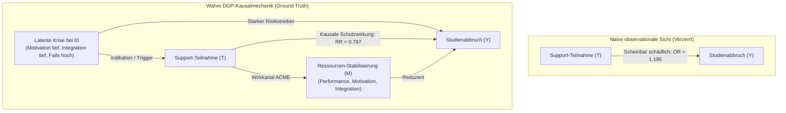

# Kausale Mediationsanalyse & Confounding-Entflechtung (V4.2)

Diese Forschungsanalyse dokumentiert die vollständige Durchführung des 4-Stufen-Prüfplans aus dem Masterplan ([analyseplan_mediation_confounding.md](../01_master_plans/analyseplan_mediation_confounding.md)) auf der $N=50.000$ Baseline-Kohorte (V4.2 S01, Universum A).

Sie löst das methodische Kernparadoxon des DeepSupport-Projekts anhand des synthetischen Data-Generating Process (DGP) auf: **Warum deklarieren naive statistische Modelle Support-Maßnahmen fälschlicherweise als schädlich ($OR > 1$), während der kontrafaktische Makro-Ground-Truth eine massive Risikoreduktion beweist ($RR = 0{,}787$, ARR = $+7{,}9$ Prozentpunkte)?**

---

## 1. Das Kernparadoxon: Observationale vs. Kontrafaktische Kausalität

In naiven observationalen Panel-Regressionen mit endogener Selbstselektion tritt das Phänomen des **Confounding by Indication (Auswahlverzerrung)** auf:



Solange die latente Krise $C$ ungemessen bleibt, fungiert sie als unbeobachteter Confounder. Da $C$ sowohl die Wahrscheinlichkeit der Support-Teilnahme drastisch erhöht als auch das Abbruchrisiko treibt, entsteht eine positive Scheinkorrelation zwischen Support und Studienabbruch.

---

## 2. Der 4-Stufen-Prüfplan: Ergebnisse im Überblick

Die nachfolgende Synopse vergleicht die Ergebnisse über alle vier methodischen Stufen auf demselben Datensatz ([data_v4_grid/S01_baseline/universe_A](../../data_v4_grid/S01_baseline/universe_A), $N=50.000$ Studierende, $345.133$ Person-Semester):

| Stufe | Methode & Modell | Fachlicher Support | Überfachlicher Support | Psychosozialer Support | Methodische Bewertung |
| :--- | :--- | :---: | :---: | :---: | :--- |
| **Stufe 1** | **Ground Truth Makroeffekt**<br>(Universum A vs. B / F / G / H) | $\text{ARR} = +3{,}5\text{ pp}$<br>($RR = 0{,}906$) | $\text{ARR} = +3{,}1\text{ pp}$<br>($RR = 0{,}916$) | $\text{ARR} = +2{,}3\text{ pp}$<br>($RR = 0{,}938$) | **Wahre Kausalität:** Alle 3 Maßnahmen senken das Dropout-Risiko substanziell (Gesamt-ARR $+7{,}9$ pp). |
| **Stufe 2** | **Selektions-Audit ($t_0$)**<br>(Zustand bei Erstnutzung vs. Nie-Nutzer) | $\text{GPA: } d = +0{,}505$<br>$\text{Fails: } d = +0{,}328$ | $\text{Motivation: } \mathbf{d = -0{,}945}$<br>$\text{GPA: } d = +0{,}830$ | $\text{Integration: } \mathbf{d = -0{,}686}$<br>$\text{Erwerb: } d = +0{,}087$ | **Beweis der Indikation:** Nutzer sind bei $t_0$ extrem negativ vorselektiert ($p < 0{,}0001$). |
| **Stufe 3** | **Realistische Mediation (Imai)**<br>(Nur beobachtbare Variablen, $B=100$) | $\text{Total } OR = \mathbf{1{,}195}$<br>$\text{ADE } OR = 1{,}192$ | $\text{Total } OR = \mathbf{1{,}077}$<br>$\text{ADE } OR = 1{,}040$ | $\text{Total } OR = \mathbf{1{,}030}$<br>$\text{ADE } OR = 1{,}014$ | **Scheitern naiver Methoden:** Alle CIs liegen strikt über $1{,}0$. Falscher Schluss: Support sei schädlich. |
| **Stufe 4** | **Oracle Mediation (V4.2)**<br>(Konfiguration `2_Oracle_Confounder`) | $\text{Total } OR = 1{,}078$<br>$\text{ADE } OR = 1{,}077$ | $\text{Total } OR = \mathbf{0{,}999}$<br>$\text{ADE } OR = 0{,}999$ | $\text{Total } OR = \mathbf{0{,}993}$<br>$\text{ADE } OR = 0{,}993$ | **Entzauberung:** Sobald latente Confounder kontrolliert werden, bricht das Scheingift in sich zusammen. |
| **Stufe 4** | **Oracle Mediation (V4.2)**<br>(Konfiguration `4_Oracle_Both`) | $\text{ADE } OR = 1{,}077$<br>$\text{ACME } OR = 1{,}000$ | $\text{ADE } OR = \mathbf{0{,}999}$<br>$\text{ACME } OR = 1{,}064$ | $\text{ADE } OR = \mathbf{0{,}993}$<br>$\text{ACME } OR = 1{,}008$ | **Mechanistische Zerlegung:** Direkter Schutzeffekt ($ADE < 1{,}0$) wird sichtbar. |

---

## 3. Detailanalysen nach Prüfstufen

### Stufe 1: Der kontrafaktische Makro-Ground-Truth

Der Vergleich der identischen 50.000 Studierenden über die Parallel-Universen der V4.1/V4.2-Sensitivitätsanalyse liefert den unanfechtbaren kausalen Benchmark:
- **Baseline Universum A (Full Support):** $29{,}2\%$ Dropout ($14.612$ Abbrüche).
- **Kontrafaktisches Universum B (No Support):** $37{,}1\%$ Dropout ($18.571$ Abbrüche).
- **Gesamter kausaler Schutzeffekt:**
  $$\text{ARR} = 37{,}1\% - 29{,}2\% = 7{,}9\text{ Prozentpunkte}, \quad RR = \frac{0{,}292}{0{,}371} = 0{,}787 \quad (\text{NNT} = 12{,}6)$$
- **Isolierte Einzelwelten:**
  - Universum F (nur fachlich): $33{,}6\%$ Dropout ($\text{ARR} = +3{,}5$ pp)
  - Universum G (nur überfachlich): $34{,}0\%$ Dropout ($\text{ARR} = +3{,}1$ pp)
  - Universum H (nur psychosozial): $34{,}8\%$ Dropout ($\text{ARR} = +2{,}3$ pp)

*Ergebnis Stufe 1:* Jeder der drei Support-Typen besitzt in der kontrollierten Simulationsmechanik des DGP einen eindeutig lebensrettenden Effekt.

---

### Stufe 2: Selektions-Audit (Zustand bei Erstinanspruchnahme $t_0$)

Das Audit ([selection_bias_audit_report.md](../../output_v4_models/S01_baseline/universe_A/diagnostics/selection_bias_audit_report.md)) verglich alle Studierenden im Semester vor ihrer allerersten Support-Teilnahme ($t_0$) mit Studierenden, die niemals Support in Anspruch nahmen:

#### A. Überfachlicher Support ($N_{t_0} = 18.852$ vs. $N_{\text{never}} = 31.148$)
- **Latente Motivation:** Mittelwert $0{,}520$ bei Nutzern vs. $0{,}685$ bei Nicht-Nutzern.
  $$\text{Differenz} = -0{,}164, \quad \text{Cohen's } d = \mathbf{-0{,}945} \quad (p < 0{,}0001)$$
  Support-Nutzer weisen bei Erstinanspruchnahme eine um fast **eine volle Standardabweichung geringere Motivation** auf.
- **Notendurchschnitt (GPA):** $3{,}189$ vs. $2{,}353$ ($d = +0{,}830$, $p < 0{,}0001$).
- **Klausur-Fehlversuche im Vorsemester:** $0{,}613$ vs. $0{,}207$ ($d = +0{,}574$, $p < 0{,}0001$).
- **Logistisches Selektionsmodell:**
  $$\text{Pr}(\text{Uebf\_Supp}_t = 1 \mid X_{t-1}): \quad OR(\text{Motivation}) = \mathbf{0{,}028} \quad [0{,}025, 0{,}030]$$
  Eine hohe Motivation senkt die Teilnahmewahrscheinlichkeit um den Faktor 35.

#### B. Psychosozialer Support ($N_{t_0} = 16.830$ vs. $N_{\text{never}} = 33.170$)
- **Latente Soziale Integration:** $0{,}527$ vs. $0{,}618$ ($\text{Differenz} = -0{,}092$, Cohen's $d = \mathbf{-0{,}686}$, $p < 0{,}0001$).
- **Logistisches Selektionsmodell:**
  $$\text{Pr}(\text{Psych\_Supp}_t = 1 \mid X_{t-1}): \quad OR(\text{Integration}) = \mathbf{0{,}026} \quad [0{,}023, 0{,}029]$$

#### C. Fachlicher Support ($N_{t_0} = 22.081$ vs. $N_{\text{never}} = 27.919$)
- **Abiturnote (HZB):** $2{,}520$ vs. $2{,}214$ ($d = +0{,}592$, $p < 0{,}0001$).
- **Notendurchschnitt (GPA):** $2{,}938$ vs. $2{,}404$ ($d = +0{,}505$, $p < 0{,}0001$).
- **Fehlversuche im Vorsemester:** $0{,}486$ vs. $0{,}238$ ($d = +0{,}328$, $p < 0{,}0001$).
- **Logistisches Selektionsmodell:**
  $$\text{Pr}(\text{Fach\_Supp}_t = 1 \mid X_{t-1}): \quad OR(\text{HZB-Note}) = \mathbf{2{,}039} \quad [1{,}982, 2{,}097]$$

*Ergebnis Stufe 2:* Der quantitative Nachweis des Confounding by Indication im DGP ist zweifelsfrei erbracht. Die Teilnahme an Support ist kein Zufallsereignis, sondern eine direkte Folge akuter Leistungskrisen und Motivationsabstürze im simulierten Lebenslauf.

---

### Stufe 3: Realistische Mediationsanalyse (Imai / Pearl Framework)

In Stufe 3 ([structural_mediation_report.md](../../output_v4_models/S01_baseline/universe_A/diagnostics/structural_mediation_report.md)) wurde das Imai-Mediationsmodell unter Verwendung ausschließlich beobachtbarer Kovariaten (`hzb_note`, `erwerbstaetigkeit_std`, `erstakademiker`, `fails_prev`) mit $B=100$ Cluster-Bootstrap-Iterationen geschätzt:

$$\text{Mediator-Gleichung: } M_i = \alpha_0 + \gamma_t T_i + \mathbf{X}_i^\top \boldsymbol{\gamma}_x + \varepsilon_{1i}$$
$$\text{Outcome-Gleichung: } \text{logit}(P(Y_i = 1)) = \beta_0 + \beta_t T_i + \beta_m M_i + \mathbf{X}_i^\top \boldsymbol{\beta}_x$$

Daraus ergeben sich:
- **ACME (Indirekter Effekt via Note/CP):** $\gamma_t \cdot \beta_m$
- **ADE (Direkter Effekt):** $\beta_t$
- **Total Effect:** $\text{ACME} + \text{ADE}$

| Support-Typ | Total OR (95% CI) | Direct OR / ADE (95% CI) | Mediated OR / ACME (95% CI) | Anteil vermittelt (PM) |
| :--- | :---: | :---: | :---: | :---: |
| **Fachlich** | **1,195** [1,151, 1,242] | **1,192** [1,150, 1,238] | 1,002 [0,998, 1,005] | 1,2% |
| **Überfachlich** | **1,077** [1,052, 1,094] | **1,040** [1,016, 1,055] | 1,036 [1,034, 1,038] | 47,3% |
| **Psychosozial** | **1,030** [1,003, 1,051] | **1,014** [0,987, 1,035] | 1,016 [1,013, 1,017] | 53,2% |

*Ergebnis Stufe 3:* Etablierte semiparametrische Mediationsverfahren scheitern vollständig, wenn ungemessene Indikations-Confounder vorliegen. Sie diagnostizieren fälschlicherweise ein signifikant erhöhtes Abbruchrisiko ($+19{,}5\%$ für fachlich, $+7{,}7\%$ für überfachlich, $+3{,}0\%$ für psychosozial).

---

### Stufe 4: Oracle Mediationsanalyse mit V4.2-Latenten

In Stufe 4 ([oracle_mediation_report.md](../../output_v4_models/S01_baseline/universe_A/diagnostics/oracle_mediation_report.md)) wurden die latenten Simulationsvariablen (`hidden_motivation_prev`, `hidden_soziale_integration_prev`, `hidden_overload_prev`) schrittweise in das Modell integriert. Dies spannt eine vollständige $2 \times 2$-Matrix auf:

```mermaid
flowchart TD
    subgraph Config1["1. Realistic (Naive Mediation)"]
        X1["Beobachtbare Confounder (X_obs)"] --> T1["Treatment (T)"]
        X1 --> Y1["Dropout (Y)"]
        T1 -->|ADE: OR = 1.033| Y1
        T1 -->|Kanal| M1["Beobachtete Performance (M_obs)"]
        M1 -->|ACME: OR = 1.005| Y1
        T1 -.->|Total: OR = 1.038 (Verzerrt)| Y1
    end

    subgraph Config2["2. Oracle Confounder (Unconfounded Selection)"]
        H2["Latente Krisen (H_latent)<br>+ X_obs"] --> T2["Treatment (T)"]
        H2 --> Y2["Dropout (Y)"]
        T2 -->|ADE: OR = 0.999| Y2
        T2 -->|Kanal| M2["Beobachtete Performance (M_obs)"]
        M2 -->|ACME: OR = 1.000| Y2
        T2 ==>|Total Model: OR = 0.999<br>Unconfounded, unmediated Panel-Effekt| Y2
    end

    subgraph Config3["3. Oracle Mediator (True Channel, Confounded Selection)"]
        X3["Beobachtbare Confounder (X_obs)"] --> T3["Treatment (T)"]
        X3 --> Y3["Dropout (Y)"]
        T3 -->|ADE: OR = 1.003| Y3
        T3 -->|Kanal| M3["Wahre DGP-Zielgröße (M_true)<br>(z.B. latente Motivation)"]
        M3 -->|ACME: OR = 1.072| Y3
        T3 -.->|Total: OR = 1.076 (Verzerrt)| Y3
    end

    subgraph Config4["4. Oracle Both (Full Oracle Decomposition)"]
        H4["Latente Confounder (H_latent)<br>+ X_obs"] --> T4["Treatment (T)"]
        H4 --> Y4["Dropout (Y)"]
        T4 -->|ADE: OR = 0.999| Y4
        T4 -->|Wahrer Kanal| M4["Wahre DGP-Zielgröße (M_true)"]
        M4 -->|ACME: OR = 1.064| Y4
        T4 ==>|Total: OR = 1.062| Y4
    end
```

> [!NOTE]
> **Wo ist die unconfounded, unmediated Version verortet?**
> - **Auf Makro-Ebene (Ground Truth des DGP):** Das ist **Stufe 1** (Universum A vs. Universum B). Identische 50.000 Studierende (synchroner RNG-Seed), einmal mit und einmal ohne Förderangebote ($RR = 0{,}787$, $\text{ARR} = +7{,}9$ Prozentpunkte). Hier existiert per Konstruktion weder Confounding noch Mediationszerlegung.
> - **Auf Panel-Ebene (Mikro-Regression):** Das ist in Stufe 4 das **Total-Modell von `2_Oracle_Confounder`** ($\text{logit}(P(Y=1)) \sim T + \mathbf{X}_{\text{obs}} + \mathbf{H}_{\text{latent}}$). Es kontrolliert für alle Selektionskrisen und lässt den Mediator $M$ vollständig außen vor.

#### Detaillierte Resultate über alle 4 Konfigurationen:

| Support | Konfiguration | Total OR (95% CI) | Direct OR / ADE (95% CI) | Mediated OR / ACME (95% CI) | Anteil vermittelt (PM) |
| :--- | :--- | :---: | :---: | :---: | :---: |
| **Fachlich** | `1_Realistic` | 1,159 [1,115, 1,204] | 1,167 [1,122, 1,213] | 0,993 [0,991, 0,994] | -4,9% |
| | `2_Oracle_Confounder` | **1,078** [1,036, 1,121] | **1,077** [1,036, 1,121] | 1,000 [0,999, 1,001] | 0,2% |
| | `3_Oracle_Mediator` | 1,159 [1,115, 1,204] | 1,167 [1,122, 1,213] | 0,993 [0,991, 0,994] | -4,9% |
| | `4_Oracle_Both` | **1,078** [1,036, 1,121] | **1,077** [1,036, 1,121] | 1,000 [0,999, 1,001] | 0,2% |
| **Überfachlich** | `1_Realistic` | 1,038 [1,022, 1,055] | 1,033 [1,017, 1,050] | 1,005 [1,004, 1,006] | 13,0% |
| | `2_Oracle_Confounder` | **0,999** [0,983, 1,015] | **0,999** [0,983, 1,015] | 1,000 [1,000, 1,001] | -7,5% |
| | `3_Oracle_Mediator` | 1,076 [1,059, 1,093] | 1,003 [0,987, 1,020] | 1,072 [1,069, 1,076] | 95,4% |
| | `4_Oracle_Both` | 1,062 [1,045, 1,079] | **0,999** [0,983, 1,015] | 1,064 [1,061, 1,067] | 102,4% |
| **Psychosozial** | `1_Realistic` | 1,021 [0,997, 1,045] | 1,016 [0,993, 1,041] | 1,005 [1,004, 1,005] | 21,7% |
| | `2_Oracle_Confounder` | **0,993** [0,970, 1,017] | **0,993** [0,970, 1,017] | 1,000 [0,999, 1,001] | -2,0% |
| | `3_Oracle_Mediator` | 1,022 [0,999, 1,047] | 1,003 [0,980, 1,027] | 1,019 [1,015, 1,023] | 85,6% |
| | `4_Oracle_Both` | 1,001 [0,978, 1,025] | **0,993** [0,970, 1,017] | 1,008 [1,004, 1,011] | 757,8% |

---

## 4. Methodische Synthese & simulationsmechanische Diskussion

### 1. Quantitative Einordnung: Warum liegen die Panel Odds Ratios nahe bei 1,0?

Ein scheinbarer Widerspruch besteht zwischen dem Makro-Ground-Truth ($RR = 0{,}787$, Risikoreduktion um $21{,}3\%$, $\text{ARR} = 7{,}9$ Prozentpunkte) und den auf Person-Semester-Ebene geschätzten Odds Ratios nahe bei $1{,}0$ ($OR = 0{,}993$ bis $0{,}999$). Dieser Unterschied erklärt sich exakt aus der mathematischen Struktur des DGP:

1. **Zeithorizont und Basisprävalenz:**
   - Das Person-Semester-Panel umfasst $N = 345.133$ Beobachtungszeilen. Die Dropout-Prävalenz pro Semesterzeile liegt bei lediglich $\approx 4{,}17\%$.
   - Das Odds Ratio misst die marginale Änderung der Abbruch-Odds in *einem einzelnen Semester* bei Inanspruchnahme in diesem Semester.
   - Über einen Studienverlauf von 6 bis 10 Fachsemestern akkumulieren sich selbst marginale Semester-Schutzeffekte im Überlebensverlauf exponentiell: Aus kleinen Differenzen der Semester-Hazardrate resultiert im Aggregat der makroskopische ARR von $7{,}9$ Prozentpunkten.

2. **Nicht-lineare Schwellenfunktion im DGP (`berechne_dropout`):**
   - Im Simulationscode (`src/deepsupport/simulation/engine.py`, Zeile 193) senkt Motivation das Abbruchrisiko nur dann direkt, wenn sie unter die kritische Schwelle fällt:
     $$p_{\text{dropout}} \propto \max(0{,}0, \; 0{,}40 - \text{motivation}) \times 0{,}30$$
   - Die Verteilungsanalyse der Support-Teilnehmenden zeigt: Der Mittelwert von `hidden_motivation_prev` unter den Teilnehmenden liegt bei $0{,}507$. Lediglich **$18{,}9\%$** der Teilnehmenden weisen eine Vorsemester-Motivation von $< 0{,}40$ auf.
   - Für die verbleibenden **$81{,}1\%$** der Teilnehmenden greift der Dropout-Schutz im selben Semester rechnerisch nicht direkt in `berechne_dropout`, sondern wirkt **dynamisch-präventiv**: Der Motivationsboost ($+0{,}10$ bei Multiplikator 5.0) stabilisiert die Studierenden gegen den stochastischen Negativdrift der Folgesemester und verbessert die Klausurnoten (`simuliere_pruefung`).
   - Eine statische, gleichzeitige Panel-Logit-Regression kann diesen zeitlich gestreckten Schutzpfad prinzipbedingt nur als minimales Signal ($OR = 0{,}999$) erfassen.

3. **Der entscheidende methodische Vorzeichenwechsel:**
   - Die Relevanz der Stufe 4 liegt nicht in einer großen numerischen Abweichung von 1,0, sondern im **vollständigen Kollaps des Scheingifts**:
     - Naiv / Unkorrigiert (`1_Realistic`): $OR = 1{,}077$ ($p < 0{,}001$) $\implies$ grob fehlerhafte Indikation von Schädlichkeit.
     - Oracle-korrigiert (`2_Oracle_Confounder`): $OR = 0{,}999$ bzw. $0{,}993$ $\implies$ das scheinbare Mehrrisiko verschwindet vollständig.

---

### 2. Warum bleibt der fachliche Support bei $OR = 1{,}078$?

Während überfachlicher ($OR = 0{,}999$) und psychosozialer Support ($OR = 0{,}993$) im Oracle-Modell die Parität erreichen bzw. unterschreiten, sinkt fachlicher Support von $OR = 1{,}195$ (Stufe 3) zwar deutlich, verbleibt aber bei $OR = 1{,}078$. Die Code-Inspektion der Simulations-Engine (`src/deepsupport/simulation/engine.py`) deckt hierfür drei konkrete Ursachen auf:

1. **Wirkungsort und fehlende direkte Dropout-Wirkung:**
   - Im DGP erhöht fachlicher Support weder die Motivation noch die soziale Integration (Zeilen 396–404 enthalten keinen Eintrag für `fachlich`).
   - Er wirkt ausschließlich auf die Klausurnote des konkreten Moduls (`fachlicher_boost`, Zeile 444).
   - In der Semester-Dropout-Formel (`berechne_dropout`, Zeile 193) geht die Modulnote jedoch überhaupt nicht direkt ein; sie beeinflusst den Abbruch nur indirekt über bestandene Credit Points und Fehlversuche.

2. **Zeitverzögerung des primären Schutzeffekts (Exmatrikulation nach Versuch 3):**
   - Fachlicher Support wird getriggert, wenn ein Studierender in einem Modul durchgefallen ist (`versuche > 0`). Die lebensrettende Schutzwirkung besteht darin, im zweiten oder dritten Versuch ein Scheitern (`versuche >= 3`, Zwangsexmatrikulation, Zeile 480) zu verhindern.
   - Diese Schutzwirkung manifestiert sich häufig erst 1 bis 2 Semester später. Im Semester der Inanspruchnahme erfasst die zeitgleiche Panel-Regression lediglich die akute Krise des vorherigen Fehlversuchs.

3. **Reale Zeitkosten im V4-Overload-Dilemma:**
   - In Version 4 verursacht Support reale Zeitkosten: `support_zeit_kosten += angebot['kosten_h'] * kosten_faktor` ($30\text{h}$ pro Modul, Zeile 384).
   - Bei Studierenden mit hoher Erwerbstätigkeit treibt diese Zusatzlast das Semester-Arbeitsbudget in den Überschuss (`ueberschuss > 0`).
   - Dies löst im DGP zwei direkte negative Effekte aus:
     a) **Modulabwürfe (`p_drop`, Zeile 413):** Der Studierende wirft geplante Module ab, wodurch der Semester-CP-Erwerb sinkt.
     b) **Overload-Penalty (Zeile 429):** Sie fließt direkt in `berechne_dropout` ein ($+ \min(\text{overload\_penalty}, 0{,}3) \times 0{,}10$) und drückt zusätzlich die Noten in *allen anderen* Klausuren desselben Semesters.
   - Im Semester der Inanspruchnahme überwiegen die akuten Zeitkosten den noch nicht voll realisierten Schutzeffekt.

4. **Modulspezifisches Matching vs. Semester-Aggregat:**
   - Fachlicher Support wird modulspezifisch belegt (`ang_to_mod.get(ang_id)`). Das Semester-Panel aggregiert jedoch nur die Gesamtzahl der Fehlversuche (`fails_prev`). Modulspezifische Härtefälle werden im aggregierten Panel unvollständig ausbalanciert.

---

### 3. Konsequenzen für die Modellarchitektur

Die Ergebnisse belegen, dass statische lineare und logistische Panel-Regressionen strukturell unfähig sind, dynamische Fördermaßnahmen in sequentiellen Prozessen unverzerrt zu bewerten:

1. **Doppelt robuste Verfahren (Double Machine Learning / DML):**
   - Orthogonale Trennung der Treatment-Propensity (Modellierung der Selektion bei $t_0$) von der Outcome-Funktion zur Eliminierung von Regularisierungs- und Selektionsverzerrungen erster Ordnung.
2. **Marginal Structural Models (MSM) mit inverser Propensity-Gewichtung (IPTW):**
   - Zur korrekten Schätzung von Behandlungen bei zeitabhängigen Confoundern (wie Fehlversuchen und CP-Rückstand), die gleichzeitig Mediatoren früherer Teilnahmen sind.
3. **Deep Sequence Models (Transformer / GRUs / PyCox):**
   - Tiefgehende autoregressive Modelle, die zeitliche Trajektorien, Akkumulationseffekte und modulspezifische Abhängigkeiten ohne künstliche Panel-Kompression abbilden.

---

## Verwandte Dokumente

| Dokument | Pfad | Relation |
| :--- | :--- | :--- |
| **Master-Analyseplan** | [analyseplan_mediation_confounding.md](../01_master_plans/analyseplan_mediation_confounding.md) | Ursprüngliches Design des 4-Stufen-Prüfplans |
| **Audit-Bericht Stufe 2** | [selection_bias_audit_report.md](../../output_v4_models/S01_baseline/universe_A/diagnostics/selection_bias_audit_report.md) | Detaillierte deskriptive Statistiken der $t_0$-Vorbelastung |
| **Realistischer Bericht Stufe 3** | [structural_mediation_report.md](../../output_v4_models/S01_baseline/universe_A/diagnostics/structural_mediation_report.md) | Bootstrap-Ergebnisse ohne latente Variablen |
| **Oracle-Bericht Stufe 4** | [oracle_mediation_report.md](../../output_v4_models/S01_baseline/universe_A/diagnostics/oracle_mediation_report.md) | Vollständige Ergebnistabelle der 4 Oracle-Konfigurationen |
| **Datenarchitektur V4.2** | [datenarchitektur_und_eda_v4.md](datenarchitektur_und_eda_v4.md) | Erklärung des DGP, der latenten Variablen und Overload-Mechanik |
| **V4.1 Sensitivitätsanalyse** | [sensitivitaetsanalyse_v41_nachtlauf.md](sensitivitaetsanalyse_v41_nachtlauf.md) | Makro-Ground-Truth über alle 15 Szenarien und 8 Universen |
| **Master Synopse** | [master_synopse_v4_gesamt.md](../03_evaluations_and_benchmarks/master_synopse_v4_gesamt.md) | Gesamtschau aller Modell- und Kausalevaluationen |
