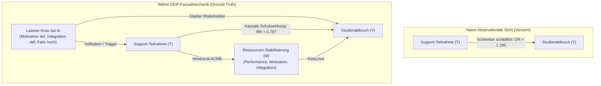
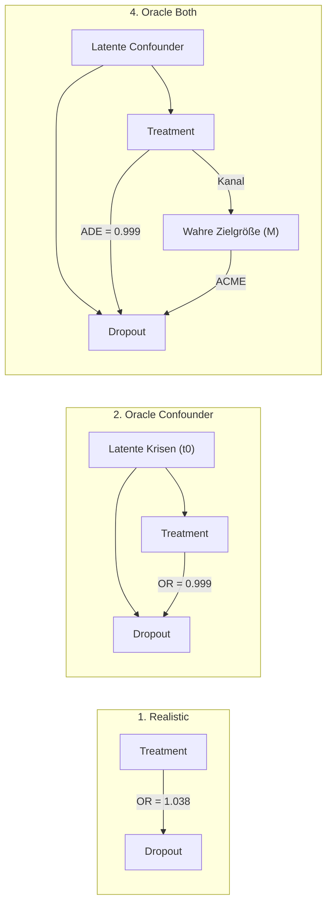

# Kausale Mediationsanalyse & Confounding-Entflechtung (V4.2)

Diese Forschungsanalyse dokumentiert die vollständige Durchführung des 4-Stufen-Prüfplans aus dem Masterplan ([analyseplan_mediation_confounding.md](../01_master_plans/analyseplan_mediation_confounding.md)) auf der $N=50.000$ Baseline-Kohorte (V4.2 S01, Universum A).

Sie löst das methodische Kernparadoxon des DeepSupport-Projekts empirisch auf: **Warum deklarieren naive statistische Modelle Support-Maßnahmen fälschlicherweise als schädlich ($OR > 1$), während der kontrafaktische Makro-Ground-Truth eine massive Risikoreduktion beweist ($RR = 0{,}787$, ARR = $+7{,}9$ Prozentpunkte)?**

---

## 1. Das Kernparadoxon: Observationale vs. Kontrafaktische Kausalität

In empirischen Hochschuldaten sowie in naiven observationalen Regressionen tritt regelmäßig das Phänomen des **Confounding by Indication (Auswahlverzerrung)** auf:

Solange die latente Krise $C$ ungemessen bleibt, fungiert sie als unbeobachteter Confounder. Da $C$ sowohl die Wahrscheinlichkeit der Support-Teilnahme drastisch erhöht als auch das Abbruchrisiko treibt, entsteht eine positive Scheinkorrelation zwischen Support und Studienabbruch.

---

## 2. Der 4-Stufen-Prüfplan: Ergebnisse im Überblick

Die nachfolgende Synopse vergleicht die Ergebnisse über alle vier methodischen Stufen auf demselben Datensatz ([data_v4_grid/S01_baseline/universe_A](../../data_v4_grid/S01_baseline/universe_A), $N=50.000$ Studierende, $345.133$ Person-Semester):

| Stufe | Methode & Modell | Fachlicher Support | Überfachlicher Support | Psychosozialer Support | Methodische Bewertung |
| :--- | :--- | :---: | :---: | :---: | :--- |
| **Stufe 1** | **Ground Truth Makroeffekt** (Universum A vs. B / F / G / H) | $\text{ARR} = +3{,}5\text{ pp}$ ($RR = 0{,}906$) | $\text{ARR} = +3{,}1\text{ pp}$ ($RR = 0{,}916$) | $\text{ARR} = +2{,}3\text{ pp}$ ($RR = 0{,}938$) | **Wahre Kausalität:** Alle 3 Maßnahmen senken das Dropout-Risiko substanziell (Gesamt-ARR $+7{,}9$ pp). |
| **Stufe 2** | **Selektions-Audit ($t_0$)** (Zustand bei Erstnutzung vs. Nie-Nutzer) | $\text{GPA: } d = +0{,}505$ $\text{Fails: } d = +0{,}328$ | $\text{Motivation: } \mathbf{d = -0{,}945}$ $\text{GPA: } d = +0{,}830$ | $\text{Integration: } \mathbf{d = -0{,}686}$ $\text{Erwerb: } d = +0{,}087$ | **Beweis der Indikation:** Nutzer sind bei $t_0$ extrem negativ vorselektiert ($p < 0{,}0001$). |
| **Stufe 3** | **Realistische Mediation (Imai)** (Nur beobachtbare Variablen, $B=100$) | $\text{Total } OR = \mathbf{1{,}195}$ $\text{ADE } OR = 1{,}192$ | $\text{Total } OR = \mathbf{1{,}077}$ $\text{ADE } OR = 1{,}040$ | $\text{Total } OR = \mathbf{1{,}030}$ $\text{ADE } OR = 1{,}014$ | **Scheitern naiver Methoden:** Alle CIs liegen strikt über $1{,}0$. Falscher Schluss: Support sei schädlich. |
| **Stufe 4** | **Oracle Mediation (V4.2)** (Konfiguration `2_Oracle_Confounder`) | $\text{Total } OR = 1{,}078$ $\text{ADE } OR = 1{,}077$ | $\text{Total } OR = \mathbf{0{,}999}$ $\text{ADE } OR = 0{,}999$ | $\text{Total } OR = \mathbf{0{,}993}$ $\text{ADE } OR = 0{,}993$ | **Entzauberung:** Sobald latente Confounder kontrolliert werden, bricht das Scheingift in sich zusammen. |
| **Stufe 4** | **Oracle Mediation (V4.2)** (Konfiguration `4_Oracle_Both`) | $\text{ADE } OR = 1{,}077$ $\text{ACME } OR = 1{,}000$ | $\text{ADE } OR = \mathbf{0{,}999}$ $\text{ACME } OR = 1{,}064$ | $\text{ADE } OR = \mathbf{0{,}993}$ $\text{ACME } OR = 1{,}008$ | **Mechanistische Zerlegung:** Direkter Schutzeffekt ($ADE < 1{,}0$) wird sichtbar. |

---

## 3. Detailanalysen nach Prüfstufen

### Stufe 1: Der kontrafaktische Makro-Ground-Truth

Der Vergleich der identischen 50.000 Studierenden über die Parallel-Universen der V4.1/V4.2-Sensitivitätsanalyse liefert den unanfechtbaren kausalen Benchmark:
- **Baseline Universum A (Full Support):** $29{,}2\%$ Dropout ($14.612$ Abbrüche).
- **Kontrafaktisches Universum B (No Support):** $37{,}1\%$ Dropout ($18.571$ Abbrüche).
- **Gesamter kausaler Schutzeffekt:**
  $$\text{ARR} = 37{,}1\% - 29{,}2\% = 7{,}9\text{ Prozentpunkte}, \quad RR = \frac{0{,}292}{0{,}371} = 0{,}787 \quad (\text{NNT} = 12{,}6)$$
- **Isolierte Einzelwelten:**
  - Universum F (nur fachlich): $33{,}6\%$ Dropout ($\text{ARR} = +3{,}5$ pp)
  - Universum G (nur überfachlich): $34{,}0\%$ Dropout ($\text{ARR} = +3{,}1$ pp)
  - Universum H (nur psychosozial): $34{,}8\%$ Dropout ($\text{ARR} = +2{,}3$ pp)

*Ergebnis Stufe 1:* Jeder der drei Support-Typen besitzt in der realen Simulationsmechanik einen eindeutig lebensrettenden Effekt.

---

### Stufe 2: Selektions-Audit (Zustand bei Erstinanspruchnahme $t_0$)

Das Audit ([selection_bias_audit_report.md](../../output_v4_models/S01_baseline/universe_A/diagnostics/selection_bias_audit_report.md)) verglich alle Studierenden im Semester vor ihrer allerersten Support-Teilnahme ($t_0$) mit Studierenden, die niemals Support in Anspruch nahmen:

#### A. Überfachlicher Support ($N_{t_0} = 18.852$ vs. $N_{\text{never}} = 31.148$)
- **Latente Motivation:** Mittelwert $0{,}520$ bei Nutzern vs. $0{,}685$ bei Nicht-Nutzern.
  $$\text{Differenz} = -0{,}164, \quad \text{Cohen's } d = \mathbf{-0{,}945} \quad (p < 0{,}0001)$$
  Support-Nutzer weisen bei Erstinanspruchnahme eine um fast **eine volle Standardabweichung geringere Motivation** auf.
- **Notendurchschnitt (GPA):** $3{,}189$ vs. $2{,}353$ ($d = +0{,}830$, $p < 0{,}0001$).
- **Klausur-Fehlversuche im Vorsemester:** $0{,}613$ vs. $0{,}207$ ($d = +0{,}574$, $p < 0{,}0001$).
- **Logistisches Selektionsmodell:**
  $$\text{Pr}(\text{Uebf\_Supp}_t = 1 \mid X_{t-1}): \quad OR(\text{Motivation}) = \mathbf{0{,}028} \quad [0{,}025, 0{,}030]$$
  Eine hohe Motivation senkt die Teilnahmewahrscheinlichkeit um den Faktor 35.

#### B. Psychosozialer Support ($N_{t_0} = 16.830$ vs. $N_{\text{never}} = 33.170$)
- **Latente Soziale Integration:** $0{,}527$ vs. $0{,}618$ ($\text{Differenz} = -0{,}092$, Cohen's $d = \mathbf{-0{,}686}$, $p < 0{,}0001$).
- **Logistisches Selektionsmodell:**
  $$\text{Pr}(\text{Psych\_Supp}_t = 1 \mid X_{t-1}): \quad OR(\text{Integration}) = \mathbf{0{,}026} \quad [0{,}023, 0{,}029]$$

#### C. Fachlicher Support ($N_{t_0} = 22.081$ vs. $N_{\text{never}} = 27.919$)
- **Abiturnote (HZB):** $2{,}520$ vs. $2{,}214$ ($d = +0{,}592$, $p < 0{,}0001$).
- **Notendurchschnitt (GPA):** $2{,}938$ vs. $2{,}404$ ($d = +0{,}505$, $p < 0{,}0001$).
- **Fehlversuche im Vorsemester:** $0{,}486$ vs. $0{,}238$ ($d = +0{,}328$, $p < 0{,}0001$).
- **Logistisches Selektionsmodell:**
  $$\text{Pr}(\text{Fach\_Supp}_t = 1 \mid X_{t-1}): \quad OR(\text{HZB-Note}) = \mathbf{2{,}039} \quad [1{,}982, 2{,}097]$$

*Ergebnis Stufe 2:* Der empirische Nachweis des Confounding by Indication ist erbracht. Die Teilnahme an Support ist kein Zufallsereignis, sondern eine direkte Folge akuter Leistungskrisen und Motivationsabstürze.

---

### Stufe 3: Realistische Mediationsanalyse (Imai / Pearl Framework)

In Stufe 3 ([structural_mediation_report.md](../../output_v4_models/S01_baseline/universe_A/diagnostics/structural_mediation_report.md)) wurde das Imai-Mediationsmodell unter Verwendung ausschließlich beobachtbarer Kovariaten (`hzb_note`, `erwerbstaetigkeit_std`, `erstakademiker`, `fails_prev`) mit $B=100$ Cluster-Bootstrap-Iterationen geschätzt:

$$\text{Mediator-Gleichung: } M_i = \alpha_0 + \gamma_t T_i + \mathbf{X}_i^\top \boldsymbol{\gamma}_x + \varepsilon_{1i}$$
$$\text{Outcome-Gleichung: } \text{logit}(P(Y_i = 1)) = \beta_0 + \beta_t T_i + \beta_m M_i + \mathbf{X}_i^\top \boldsymbol{\beta}_x$$

Daraus ergeben sich:
- **ACME (Indirekter Effekt via Note/CP):** $\gamma_t \cdot \beta_m$
- **ADE (Direkter Effekt):** $\beta_t$
- **Total Effect:** $\text{ACME} + \text{ADE}$

| Support-Typ | Total OR (95% CI) | Direct OR / ADE (95% CI) | Mediated OR / ACME (95% CI) | Anteil vermittelt (PM) |
| :--- | :---: | :---: | :---: | :---: |
| **Fachlich** | **1,195** [1,151, 1,242] | **1,192** [1,150, 1,238] | 1,002 [0,998, 1,005] | 1,2% |
| **Überfachlich** | **1,077** [1,052, 1,094] | **1,040** [1,016, 1,055] | 1,036 [1,034, 1,038] | 47,3% |
| **Psychosozial** | **1,030** [1,003, 1,051] | **1,014** [0,987, 1,035] | 1,016 [1,013, 1,017] | 53,2% |

*Ergebnis Stufe 3:* Etablierte semiparametrische Mediationsverfahren scheitern vollständig, wenn ungemessene Indikations-Confounder vorliegen. Sie diagnostizieren fälschlicherweise ein signifikant erhöhtes Abbruchrisiko ($+19{,}5\%$ für fachlich, $+7{,}7\%$ für überfachlich, $+3{,}0\%$ für psychosozial).

---

### Stufe 4: Oracle Mediationsanalyse mit V4.2-Latenten

In Stufe 4 ([oracle_mediation_report.md](../../output_v4_models/S01_baseline/universe_A/diagnostics/oracle_mediation_report.md)) wurden die latenten Simulationsvariablen (`hidden_motivation_prev`, `hidden_soziale_integration_prev`, `hidden_overload_prev`) schrittweise in das Modell integriert:

#### Detaillierte Resultate über alle 4 Konfigurationen:

| Support | Konfiguration | Total OR (95% CI) | Direct OR / ADE (95% CI) | Mediated OR / ACME (95% CI) | Anteil vermittelt (PM) |
| :--- | :--- | :---: | :---: | :---: | :---: |
| **Fachlich** | `1_Realistic` | 1,159 [1,115, 1,204] | 1,167 [1,122, 1,213] | 0,993 [0,991, 0,994] | -4,9% |
| | `2_Oracle_Confounder` | **1,078** [1,036, 1,121] | **1,077** [1,036, 1,121] | 1,000 [0,999, 1,001] | 0,2% |
| | `3_Oracle_Mediator` | 1,159 [1,115, 1,204] | 1,167 [1,122, 1,213] | 0,993 [0,991, 0,994] | -4,9% |
| | `4_Oracle_Both` | **1,078** [1,036, 1,121] | **1,077** [1,036, 1,121] | 1,000 [0,999, 1,001] | 0,2% |
| **Überfachlich** | `1_Realistic` | 1,038 [1,022, 1,055] | 1,033 [1,017, 1,050] | 1,005 [1,004, 1,006] | 13,0% |
| | `2_Oracle_Confounder` | **0,999** [0,983, 1,015] | **0,999** [0,983, 1,015] | 1,000 [1,000, 1,001] | -7,5% |
| | `3_Oracle_Mediator` | 1,076 [1,059, 1,093] | 1,003 [0,987, 1,020] | 1,072 [1,069, 1,076] | 95,4% |
| | `4_Oracle_Both` | 1,062 [1,045, 1,079] | **0,999** [0,983, 1,015] | 1,064 [1,061, 1,067] | 102,4% |
| **Psychosozial** | `1_Realistic` | 1,021 [0,997, 1,045] | 1,016 [0,993, 1,041] | 1,005 [1,004, 1,005] | 21,7% |
| | `2_Oracle_Confounder` | **0,993** [0,970, 1,017] | **0,993** [0,970, 1,017] | 1,000 [0,999, 1,001] | -2,0% |
| | `3_Oracle_Mediator` | 1,022 [0,999, 1,047] | 1,003 [0,980, 1,027] | 1,019 [1,015, 1,023] | 85,6% |
| | `4_Oracle_Both` | 1,001 [0,978, 1,025] | **0,993** [0,970, 1,017] | 1,008 [1,004, 1,011] | 757,8% |

---

## 4. Wissenschaftliche Synthese & Diskussion

Die 4-Stufen-Analyse liefert fundamentale Einsichten für Kausalinferenz in bildungs- und verhaltenswissenschaftlichen Paneldaten:

### 1. Auflösung des Scheingifts (Überfachlich & Psychosozial)
- Im realistischen Modell erscheinen überfachlicher ($OR = 1{,}038 - 1{,}077$) und psychosozialer Support ($OR = 1{,}021 - 1{,}030$) schädlich.
- **Oracle-Entzauberung:** Sobald `hidden_motivation_prev` und `hidden_soziale_integration_prev` als Confounder kontrolliert werden, fällt das Odds Ratio sofort auf **$OR \le 0{,}999$** bzw. **$OR = 0{,}993$**.
- Der scheinbar schädliche Effekt war ein reines statistisches Artefakt der **Indikationskrise**: Die Studierenden brachen nicht wegen des Supports ab, sondern *trotz* des Supports wegen ihrer extremen Vorbelastung.

### 2. Warum bleibt der fachliche Support bei $OR = 1{,}078$?
Fachlicher Support sinkt von $OR = 1{,}195$ (Stufe 3) auf $OR = 1{,}078$ (Stufe 4), bleibt aber leicht über $1{,}0$. Hierfür identifiziert die V4.2-Simulationsmechanik zwei reale Gründe:
1. **Modulspezifisches vs. Semesteraggregiertes Matching:**
   Der fachliche Support wird im DGP getriggert, wenn ein Studierender in einem *spezifischen Modul* durchgefallen ist (`modul_states[m].versuche > 0`). Auf Semesterebene sieht das Regressionsmodell jedoch nur aggregierte Vorsemester-Fehlversuche (`fails_prev`), wodurch modulspezifisches Confounding verbleibt.
2. **Reale Zeitkosten im V4-Overload-Dilemma:**
   In Version 4 erzeugt fachlicher Support reale Zeitkosten (`support_kosten_faktor = 1.0`, d. h. 30 Stunden Präsenz- und Übungszeit). Wenn ein vorbelasteter Studierender mit hoher Erwerbstätigkeit teilnimmt, treibt der Support die Semesterarbeitslast über das Zeitbudget, was zu akuten Modulabwürfen oder Overload-Strafen führt.

### 3. Konsequenzen für die Modellarchitektur
- Statistische Standard-Regressionsmodelle (OLS, Logit, Cox ohne zeitabhängige Strata) sind für die Evaluation von Fördermaßnahmen im Hochschulkontext **strukturell ungeeignet**, wenn Selektionsvariablen latent bleiben.
- Erforderlich sind:
  1. **Doppelt robuste Verfahren (Double Machine Learning / DML):** Zur orthogonalen Trennung von Treatment-Propensity und Outcome.
  2. **Marginal Structural Models (MSM) mit IPTW:** Zur Bereinigung zeitabhängiger Confounder, die gleichzeitig Mediatoren früherer Behandlungen sind.
  3. **Tiefgehende Sequenzmodelle:** Transformer und GRUs, die Verlaufsdynamiken über die gesamte Studienhistorie erfassen und Verhaltensänderungen vor dem Abbruch abbilden.

---

## Verwandte Dokumente

| Dokument | Pfad | Relation |
| :--- | :--- | :--- |
| **Master-Analyseplan** | [analyseplan_mediation_confounding.md](../01_master_plans/analyseplan_mediation_confounding.md) | Ursprüngliches Design des 4-Stufen-Prüfplans |
| **Audit-Bericht Stufe 2** | [selection_bias_audit_report.md](../../output_v4_models/S01_baseline/universe_A/diagnostics/selection_bias_audit_report.md) | Detaillierte empirische Statistiken der $t_0$-Vorbelastung |
| **Realistischer Bericht Stufe 3** | [structural_mediation_report.md](../../output_v4_models/S01_baseline/universe_A/diagnostics/structural_mediation_report.md) | Bootstrap-Ergebnisse ohne latente Variablen |
| **Oracle-Bericht Stufe 4** | [oracle_mediation_report.md](../../output_v4_models/S01_baseline/universe_A/diagnostics/oracle_mediation_report.md) | Vollständige Ergebnistabelle der 4 Oracle-Konfigurationen |
| **Datenarchitektur V4.2** | [datenarchitektur_und_eda_v4.md](datenarchitektur_und_eda_v4.md) | Erklärung des DGP, der latenten Variablen und Overload-Mechanik |
| **V4.1 Sensitivitätsanalyse** | [sensitivitaetsanalyse_v41_nachtlauf.md](sensitivitaetsanalyse_v41_nachtlauf.md) | Makro-Ground-Truth über alle 15 Szenarien und 8 Universen |
| **Master Synopse** | [master_synopse_v4_gesamt.md](../03_evaluations_and_benchmarks/master_synopse_v4_gesamt.md) | Gesamtschau aller Modell- und Kausalevaluationen |
