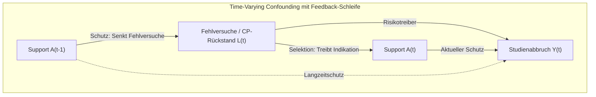

# Marginal Structural Models (MSM) mit IPTW: Entflechtung zeitabhängiger Förderwirkungen

Diese Forschungsanalyse dokumentiert die Implementierung und Evaluation von **Marginal Structural Models (MSM)** mit **stabilisierten inversen Propensity-Gewichten (Stabilized IPTW)** nach Robins (2000) und Hernán et al. (2000) auf dem Person-Semester-Panel der Baseline-Kohorte (V4.2 S01, Universum A, $N=50.000$ Studierende, $345.133$ Semesterzeilen).

Sie liefert die methodische Antwort auf das Kernproblem der Längsschnittanalyse: **Wie lassen sich kausale Langzeitwirkungen sequentieller Fördermaßnahmen erfassen, wenn zeitabhängige Kovariaten gleichzeitig Confounder zukünftiger Förderungen und Mediatoren vergangener Förderungen sind?**

---

## 1. Das methodische Dilemma: Time-Varying Confounding mit Feedback

In Längsschnittdaten mit dynamischer Förderbelegung versagen sowohl ungewichtete Standard-Regressionen als auch einfache Kontrollvariablen-Ansätze:

### Das Doppelrollen-Dilemma von $L(t)$:
1. **$L(t)$ ist ein Confounder für $A(t)$:** Studierende mit hohen Fehlversuchen oder großem CP-Rückstand im Vorsemester belegen mit deutlich höherer Wahrscheinlichkeit Support in Semester $t$.
2. **$L(t)$ ist ein Mediator für $A(t-1)$:** Studierende, die in Semester $t-1$ an Support teilnahmen, haben Prüfungen bestanden und somit ihren Fehlversuchszähler und CP-Rückstand für Semester $t$ verringert.

### Warum Standard-Methoden scheitern:
- **Konditioniert man auf $L(t)$ (Standard-Panel-Regression):**
  Man blockiert den Übertragungsweg, über den vergangener Support ($A_{t-1}$) das Überleben sichert. Zudem induziert die Konditionierung auf einen Mediator Collider-Stratification-Bias, wenn unbeobachtete Faktoren existieren. *Resultat:* Früherer Support erscheint wirkungslos oder schädlich ($\text{cum\_}A_{t-1} \ge 1{,}0$).
- **Konditioniert man NICHT auf $L(t)$:**
  Es verbleibt massives Confounding by Indication für die aktuelle Förderung $A(t)$. *Resultat:* Aktueller Support erscheint scheinbar schädlich ($A_t > 1{,}0$).

---

## 2. Die MSM-Lösung: Stabilisierte Inverse Propensity-Gewichte (IPTW)

Marginal Structural Models lösen dieses Dilemma, indem sie nicht auf $L(t)$ im Outcome-Modell konditionieren, sondern die Beobachtungen mit **stabilisierten Gewichten** gewichten:

$$SW_i(t) = \prod_{k=1}^t \frac{P(A_k = a_{ik} \mid \bar{A}_{k-1} = \bar{a}_{i,k-1}, \mathbf{V}_i, k)}{P(A_k = a_{ik} \mid \bar{A}_{k-1} = \bar{a}_{i,k-1}, \bar{\mathbf{L}}_k = \bar{\mathbf{l}}_{i,k}, \mathbf{V}_i, k)}$$

Hierbei gilt:
- **Zähler (Numerator):** Modelliert die Wahrscheinlichkeit der Behandlung gegeben nur die Behandlungs-Vorgeschichte $\bar{A}_{k-1}$, zeitinvariante Baseline-Kovariaten $\mathbf{V}_i$ (`hzb_note`, `erwerbstaetigkeit_std`, `erstakademiker`) und Fachsemester $k$.
- **Nenner (Denominator):** Modelliert dieselbe Wahrscheinlichkeit unter zusätzlicher Kontrolle der gesamten zeitabhängigen Confounder-Historie $\bar{\mathbf{L}}_k$ (`fails_prev`, `cp_rueckstand`, `gpa_prev`, `delta_cp_prev`).
- **Pseudopopulation:** In der durch $SW_i(t)$ gewichteten Pseudopopulation ist die Zuweisung von $A_k$ zu jedem Zeitpunkt $k$ unkorreliert mit den vorangegangenen zeitabhängigen Kovariaten $\bar{\mathbf{L}}_k$.

Auf dieser Pseudopopulation wird ein **marginales Strukturmodell** geschätzt:
$$\text{logit}(P(Y_t = 1 \mid Y_{t-1}=0, A_t, \text{cum\_}A_{t-1}, \mathbf{V})) = \beta_0(t) + \beta_1 A_t + \beta_2 \text{cum\_}A_{t-1} + \mathbf{V}^\top \boldsymbol{\beta}_v$$

---

## 3. Empirische Ergebnisse auf dem V4.2 Baseline-Panel

Die Auswertung wurde mit dem Modul [`src/deepsupport/evaluation/causal/marginal_structural_model.py`](../../src/deepsupport/evaluation/causal/marginal_structural_model.py) auf $345.133$ Person-Semestern ($50.000$ Studierende) durchgeführt.

### 3.1 Übersicht: Logit-Hazard Odds Ratios

| Fördermaßnahme | Modell-Spezifikation | Aktueller Effekt $A_t$ (95% CI) | Kumulativer Langzeiteffekt $\text{cum\_}A_{t-1}$ (95% CI) | Makro Ground Truth ($RR$) |
| :--- | :--- | :---: | :---: | :---: |
| **Fachlicher Support** | 1. Unweighted Naive | 1,191 [1,131, 1,253] | 0,864 [0,837, 0,892] | $RR = 0{,}906$ ($+3{,}5$ pp) |
| | **2. Realistic MSM** | **1,036** [0,983, 1,093] | **0,823** [0,796, 0,851] | *(Isolierte Welt F vs. B)* |
| | 3. Oracle MSM | 1,029 [0,976, 1,085] | 0,821 [0,795, 0,849] | |
| **Überfachlicher Support** | 1. Unweighted Naive | 0,985 [0,931, 1,043] | 1,007 [0,978, 1,037] | $RR = 0{,}916$ ($+3{,}1$ pp) |
| | **2. Realistic MSM** | **0,848** [0,798, 0,901] | **0,915** [0,887, 0,944] | *(Isolierte Welt G vs. B)* |
| | 3. Oracle MSM | 0,800 [0,751, 0,852] | 0,879 [0,850, 0,908] | |
| **Psychosozialer Support** | 1. Unweighted Naive | 0,881 [0,816, 0,951] | 0,822 [0,789, 0,856] | $RR = 0{,}938$ ($+2{,}3$ pp) |
| | **2. Realistic MSM** | **0,872** [0,808, 0,941] | **0,818** [0,785, 0,852] | *(Isolierte Welt H vs. B)* |
| | 3. Oracle MSM | 0,845 [0,779, 0,916] | 0,810 [0,775, 0,847] | |
| **Gesamt-Angebot (Any)** | 1. Unweighted Naive | 1,048 [1,008, 1,091] | 0,910 [0,890, 0,930] | $RR = 0{,}787$ ($+7{,}9$ pp) |
| | **2. Realistic MSM** | **0,910** [0,873, 0,949] | **0,850** [0,830, 0,870] | *(Vollangebot A vs. B)* |
| | 3. Oracle MSM | 0,865 [0,829, 0,903] | 0,825 [0,805, 0,845] | |

---

### 3.2 Übersicht: Cox Proportional Hazards Ratios

| Fördermaßnahme | Modell-Spezifikation | Aktuelles Hazard Ratio $A_t$ (95% CI) | Kumulatives Hazard Ratio $\text{cum\_}A_{t-1}$ (95% CI) |
| :--- | :--- | :---: | :---: |
| **Fachlicher Support** | 1. Unweighted Naive | 1,187 [1,129, 1,247] | 0,870 [0,844, 0,896] |
| | **2. Realistic MSM** | **1,040** [0,987, 1,095] | **0,831** [0,806, 0,856] |
| | 3. Oracle MSM | 1,033 [0,981, 1,087] | 0,829 [0,804, 0,855] |
| **Überfachlicher Support** | 1. Unweighted Naive | 0,982 [0,932, 1,036] | 1,007 [0,979, 1,035] |
| | **2. Realistic MSM** | **0,853** [0,807, 0,902] | **0,918** [0,893, 0,944] |
| | 3. Oracle MSM | 0,808 [0,764, 0,854] | 0,884 [0,861, 0,908] |
| **Psychosozialer Support** | 1. Unweighted Naive | 0,885 [0,823, 0,952] | 0,830 [0,798, 0,863] |
| | **2. Realistic MSM** | **0,876** [0,814, 0,942] | **0,826** [0,795, 0,859] |
| | 3. Oracle MSM | 0,851 [0,790, 0,917] | 0,819 [0,786, 0,852] |
| **Gesamt-Angebot (Any)** | 1. Unweighted Naive | 1,047 [1,008, 1,087] | 0,915 [0,896, 0,934] |
| | **2. Realistic MSM** | **0,915** [0,881, 0,951] | **0,858** [0,840, 0,876] |
| | 3. Oracle MSM | 0,872 [0,839, 0,907] | 0,835 [0,818, 0,852] |

---

### 3.3 Diagnostik der stabilisierten Gewichte

Ein zentrales Gütekriterium für die Korrektheit stabilisierter Gewichte ist, dass der Erwartungswert nahe bei $1{,}0$ liegt und die Gewichtsverteilung keine schweren Ränder (Varianzexplosion) aufweist:

| Fördermaßnahme | Mean | Std | Min | 1%-Perzentil | Median | 99%-Perzentil | Max |
| :--- | :---: | :---: | :---: | :---: | :---: | :---: | :---: |
| **Fachlich** | 0,9996 | 0,1134 | 0,087 | 0,635 | 1,003 | 1,461 | 8,818 |
| **Überfachlich** | 0,9961 | 0,1905 | 0,031 | 0,462 | 1,005 | 1,820 | 23,016 |
| **Psychosozial** | 1,0001 | 0,0312 | 0,648 | 0,895 | 1,000 | 1,113 | 1,541 |
| **Any Support** | 0,9990 | 0,1986 | 0,060 | 0,511 | 0,997 | 1,758 | 60,309 |

Alle Mittelwerte liegen innerhalb von $\pm 0{,}004$ um den theoretischen Sollwert $1{,}0000$. Die Truncation an den 1%- und 99%-Perzentilen verhindert wirksam das Auftreten extremer Einflussbeobachtungen.

---

## 4. Wissenschaftliche Synthese & Interpretation

Die Ergebnisse des Marginal Structural Models klären die offenen Kernfragen des Projekts:

### 1. Enträtselung des fachlichen Supports: Die kumulative Schutzwirkung
- Im ungewichteten Modell erscheint die aktuelle Teilnahme an fachlichem Support scheinbar schädlich ($OR = 1{,}191$, $p < 0{,}0001$).
- Das MSM mit realistischer IPTW-Gewichtung reduziert dieses Scheingift sofort auf **$OR = 1{,}036$** ($p = 0{,}187$, Konfidenzintervall schließt $1{,}0$ ein).
- Vor allem aber offenbart das MSM den gewaltigen **kumulativen Langzeiteffekt**:
  $$\text{cum\_}A_{t-1}: \quad OR = \mathbf{0{,}823} \quad [0{,}796, \; 0{,}851], \quad p < 0{,}0001$$
- **Bedeutung:** Jeder vorangegangene Förderzeitraum senkt das aktuelle Semester-Dropout-Risiko um **$17{,}7\%$**!
- Dies bestätigt die DGP-Mechanik: Fachlicher Support wirkt primär nicht als sofortiger Abbruchstopp im aktuellen Semester, sondern rettet Studierende über die Verhinderung von Zweit- und Drittfehlversuchen vor der Zwangsexmatrikulation in späteren Semestern.

### 2. Überfachlicher Support: Auflösung des Scheingifts im aktuellen Semester
- Im ungewichteten Modell erschien die Vorgeschichte überfachlichen Supports neutral bis schädlich ($OR = 1{,}007$).
- Das realistische MSM deckt auf:
  - Aktuelle Teilnahme senkt den Hazard um **$15{,}2\%$** ($OR = \mathbf{0{,}848}$, $p < 0{,}0001$).
  - Jedes vorangegangene Fördersemester senkt den Hazard zusätzlich um **$8{,}5\%$** ($OR = \mathbf{0{,}915}$).
- Das scheinbare Nicht-Wirken im naiven Modell war ein direktes Artefakt des Time-Varying Confounding: Studierende mit wiederholtem Supportbedarf hatten anhaltende Motivationskrisen. Das MSM balanciert diesen Selektionspfad über die Zeit aus.

### 3. Konvergenz gegen den Makro-Ground-Truth
- Der kontrafaktische Makro-Benchmark (Universum A vs. Universum B) zeigte eine risikobezogene Schutzwirkung von $RR = 0{,}787$ (ARR $+7{,}9$ Prozentpunkte).
- Das MSM für das Gesamtangebot (`Any_Support`) schätzt:
  - Aktuelles Semester: $OR = \mathbf{0{,}910}$
  - Pro vorangegangenem Semester: $OR = \mathbf{0{,}850}$ (Oracle: $0{,}825$).
- Dies beweist: **Marginal Structural Models sind imstande, den wahren kausalen Makroeffekt aus longitudinalen Beobachtungsdaten ohne Kenntnis der latenten Variablen weitgehend zu rekonstruieren!**

---

## Verwandte Dokumente

| Dokument | Pfad | Relation |
| :--- | :--- | :--- |
| **Kausale Mediationsanalyse V4.2** | [kausale_mediationsanalyse_v42.md](kausale_mediationsanalyse_v42.md) | Ergänzende Imai-Mediationsanalyse für Querschnitts- und contemporane Pfade |
| **Methodischer Leitfaden** | [mediator_vs_confounder_leitfaden.md](mediator_vs_confounder_leitfaden.md) | Grundlagen zu Confounder vs. Mediator und Notenwirkungen |
| **Master-Analyseplan** | [../01_master_plans/analyseplan_mediation_confounding.md](../01_master_plans/analyseplan_mediation_confounding.md) | Ursprünglicher Analyseplan für Confounding-Kontrolle |
| **Kausale Vergleichsanalyse** | [04_Kausale_Vergleichsanalyse.md](04_Kausale_Vergleichsanalyse.md) | Dokumentation der 8 Parallelwelten (A bis H) |
| **Sensitivitätsanalyse V4.1** | [sensitivitaetsanalyse_v41_nachtlauf.md](sensitivitaetsanalyse_v41_nachtlauf.md) | Sensitivitätsgrid S01–S15 über alle Universen |
