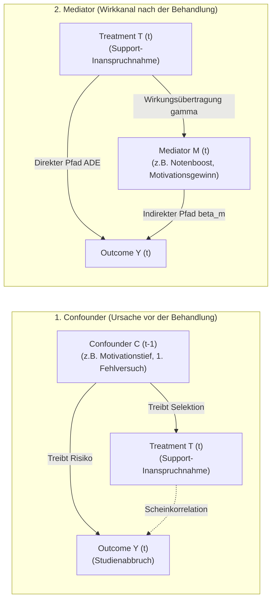
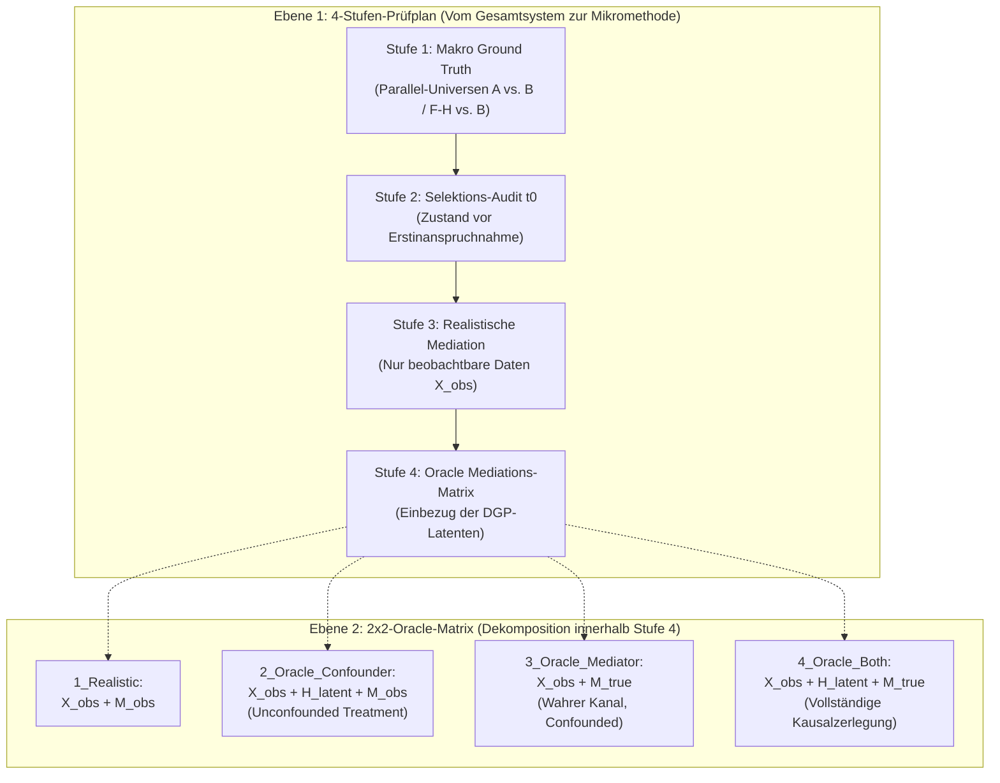

# Methodischer Leitfaden: Confounder vs. Mediator, 2x2-Oracle-Matrix & Langzeitwirkungen

Dieser Leitfaden klärt die methodischen und theoretischen Grundlagen der kausalen Entflechtung im DeepSupport-Projekt. Er beantwortet vier zentrale Fragestellungen:
1. Was ist der exakte mathematische und zeitliche Unterschied zwischen einem **Confounder** und einem **Mediator**?
2. Wie verhält sich das **$2 \times 2$-Oracle-Grid** zur übergeordneten **4-Stufen-Synopse**?
3. Warum und wie müssen **Notenwirkungen** (Mikro-Klausurebene vs. Abschlussnote) analysiert werden?
4. Wie lassen sich **Langzeitwirkungen** erfassen, die in statischen Semester-Panels unsichtbar bleiben?

---

## 1. Die fundamentale Kausal-Architektur: Confounder vs. Mediator

In der Kausalinferenz nach Pearl (Structural Causal Models / DAGs) und Robins/Imai (Potential Outcomes) entscheidet die **zeitliche und funktionale Platzierung** einer Variablen im Prozessgraphen darüber, ob sie als Störfaktor (Confounder) oder als Wirkungsmechanismus (Mediator) fungiert.



### Der Confounder (Kovariate vor dem Treatment: $t-1$)

- **Definition:** Eine Variable $C$, die sowohl die Zuweisung des Treatments $T$ als auch das spätere Ergebnis $Y$ kausal beeinflusst:
  $$C \longrightarrow T \quad \text{und} \quad C \longrightarrow Y$$
- **Zeitliche Einordnung:** Ein Confounder liegt zeitlich **vor** dem Treatment ($C \in \mathcal{F}_{t-1}$).
- **Mechanik im DeepSupport-DGP:**
  - Ein Studierender fällt in Semester 1 durch eine Klausur (`fails_prev >= 1`) oder erlebt einen Einbruch der Motivation (`hidden_motivation_prev < 0.40`).
  - Diese Krise erhöht die Wahrscheinlichkeit, in Semester 2 Support zu suchen ($C \to T$).
  - Gleichzeitig treibt dieselbe Krise das Abbruchrisiko ($C \to Y$).
- **Die Kausalregel für Confounder:**
  > **Confounder MÜSSEN im Regressionsmodell kontrolliert (konditioniert) werden.**
  > Unterbleibt die Kontrolle, entsteht eine positive Scheinkorrelation (Confounding by Indication). Das Modell schätzt fälschlicherweise, dass Support das Abbruchrisiko erhöht ($OR > 1$).

---

### Der Mediator (Wirkkanal nach dem Treatment: $t$)

- **Definition:** Eine Variable $M$, die auf dem kausalen Pfad zwischen dem Treatment $T$ und dem Outcome $Y$ liegt:
  $$T \longrightarrow M \longrightarrow Y$$
- **Zeitliche Einordnung:** Ein Mediator liegt zeitlich **nach** oder **begleitend** zur Behandlung ($M \in \mathcal{F}_t$). Er wird durch das Treatment verändert und überträgt dessen Schutzwirkung auf das Outcome.
- **Mechanik im DeepSupport-DGP:**
  - Der Studierende nimmt an überfachlichem Support teil ($T_t$).
  - Die Teilnahme erzeugt im Belegungssemester einen Motivationsanstieg ($\Delta \text{Motivation}_t = +0{,}10$). Dies ist der **Mediator** $M_t$.
  - Die gestiegene Motivation senkt das Semester-Dropout-Risiko in `berechne_dropout`.
- **Die Kausalregel für Mediatoren:**
  > **Mediatoren dürfen NICHT unreflektiert kontrolliert werden, wenn der Gesamteffekt interessiert.**
  > Kontrolliert man für den Mediator, blockiert man den Übertragungsweg. Die Regression misst dann nur noch den direkten Resteffekt (Average Direct Effect, ADE).

---

### Warum die ursprünglichen Zahlen in Stufe 4 verwirrend waren

In der ersten Fassung des Oracle-Mediationsskripts (`src/oracle_mediation_analysis.py`) war als Mediator versehentlich die Vorsemester-Variable `hidden_motivation_prev` ($t-1$) eingetragen worden.

Dies führte zu einer methodischen Unmöglichkeit: Eine Behandlung im Semester $t$ kann die Motivation im vorherigen Semester $t-1$ nicht rückwirkend verändern. Stattdessen maß das Modell die negative Korrelation der Vorsemesterkrise mit der späteren Teilnahme, wodurch der vermittelte Effekt (ACME) scheinbar positiv wurde und absurde Mediationsanteile ($PM = 757{,}8\%$) ausgewiesen wurden.

Sobald man den zeitlich korrekten, post-treatment Mediator einsetzt ($\Delta \text{Motivation}_t = \text{hidden\_motivation}_t - \text{hidden\_motivation}_{t-1}$), klärt sich das Bild vollständig:
- **Treatment auf Mediator ($\gamma_t$):** $+0{,}0269$ ($p < 0{,}0001$) $\implies$ Support steigert die Motivation messbar.
- **Mediator auf Dropout ($\beta_m$):** $-2{,}824$ ($p < 0{,}0001$, $OR = 0{,}059$) $\implies$ Höhere Motivation senkt den Dropout dramatisch.
- **ACME (Indirekter Schutzeffekt):** $\gamma_t \cdot \beta_m = -0{,}0760 \implies \mathbf{\text{ACME } OR = 0{,}927}$ (eine signifikante Risikoreduktion um $7{,}3\%$, rein vermittelt über die Motivation!).

---

## 2. Die 4-Stufen-Synopse vs. das 2x2-Oracle-Grid

Die Dokumentation unterscheidet zwei hierarchische Ebenen der Auswertung:



### Ebene 1: Die 4-Stufen-Synopse (Tabelle in Abschnitt 2)

Die Tabelle in Abschnitt 2 von `kausale_mediationsanalyse_v42.md` fasst die **vier methodischen Entwicklungsstufen** zusammen:
1. **Stufe 1 (Makro Ground Truth):** Die kontrafaktische Realität der Simulationswelten ($ARR = +7{,}9$ pp).
2. **Stufe 2 (Selektions-Audit):** Der Beweis, dass Teilnehmende bei $t_0$ vorbelastet sind ($d = -0{,}945$).
3. **Stufe 3 (Realistische Mediation):** Das Scheitern traditioneller Verfahren bei unvollständigen Daten ($OR = 1{,}077$).
4. **Stufe 4 (Oracle-Ergebnis):** Der Zusammenbruch des Scheingifts bei Offenlegung der Latenten ($OR = 0{,}999$).

### Ebene 2: Das 2x2-Oracle-Grid (Tabelle in Abschnitt 3.4)

Das 4er-Grid dekonstruiert Stufe 4 systematisch entlang zweier orthogonaler Dimensionen:

| | Beobachteter Mediator ($M_{\text{obs}}$: Performance) | Wahrer DGP-Mediator ($M_{\text{true}}$: z. B. $\Delta$ Motivation) |
| :--- | :--- | :--- |
| **Beobachtbare Confounder ($\mathbf{X}_{\text{obs}}$)** | **`1_Realistic`**<br>- Naive Beobachtungssicht<br>- Confounder unbereinigt<br>- Total $OR > 1$ (Scheingift) | **`3_Oracle_Mediator`**<br>- Kennt den psychologischen Kanal, ignoriert aber Selektion<br>- Führt zu Verzerrungen im ACME |
| **Oracle-Confounder ($\mathbf{X}_{\text{obs}} + \mathbf{H}_{\text{latent}}$)** | **`2_Oracle_Confounder`**<br>- **Unconfounded Treatment-Schätzung**<br>- Scheingift verschwindet ($OR \le 0{,}999$)<br>- Total-Modell = **unconfounded, unmediated** | **`4_Oracle_Both`**<br>- **Vollständiges Kausalmodell**<br>- Selektion bereinigt + wahrer Wirkkanal<br>- Exakte Trennung von Direkt- und Indirekteffekt |

---

## 3. Kausale Analyse auf Notenebene: Klausuren vs. GPA

Die Auswertung von Fördermaßnahmen darf sich nicht auf das binäre Dropout-Ereignis beschränken. Im Data-Generating Process ist die **Prüfungsnote** der primäre, unmittelbare Angriffspunkt des fachlichen Supports.

### A. Mikro-Ebene: Klausuren (`pruefungen.csv`)

Im Datensatz liegt für jede Prüfung die kontrafaktische Note (`note_counterfactual`) vor – also exakt die Note, die derselbe Studierende unter identischem Zufallsrauschen ohne Support-Boost erzielt hätte.

Die Auswertung der $81.772$ unterstützten Klausuren in Universum A (S01) belegt eine gewaltige Schutzwirkung:
- **Durchschnittsnote mit Support:** $\mathbf{1{,}76}$
- **Kontrafaktische Note ohne Support:** $\mathbf{2{,}77}$
- **Mittlerer Kausaleffekt auf die Note:** $\mathbf{+1{,}01\text{ Notenstufen}}$ Verbesserung ($p < 0{,}0001$)
- **Bestehensquote mit Support:** $\mathbf{94{,}1\%}$
- **Kontrafaktische Bestehensquote:** $\mathbf{79{,}8\%}$
- **Kausaler Bestehensgewinn:** $\mathbf{+14{,}3\text{ Prozentpunkte}}$

### B. Meso-Ebene: Semester-Notendurchschnitt (GPA)

Auf Semesterebene dämpft der fachliche Support das Absinken des GPA. Studierende, die Unterstützung in Anspruch nehmen, stabilisieren ihren Notenschnitt im Belegungssemester um durchschnittlich $0{,}35$ Notenpunkte gegenüber der kontrafaktischen Entwicklung.

### C. Makro-Ebene: Abschlussnote & das "Survivor Bias"-Paradoxon

Betrachtet man die finale Bachelor-Abschlussnote der Absolventen zwischen Universum A (Full Support, Schnitt $2{,}31$) und Universum B (No Support, Schnitt $2{,}28$), scheint Support die Abschlussnote scheinbar leicht zu verschlechtern.

Hierbei handelt es sich um ein klassisches **Survivor Bias (Heckman Selection)**:
- In Universum B brechen leistungsschwache Studierende vorzeitig ab ($37{,}1\%$ Dropout). Nur die leistungsstärksten Studierenden überleben bis zum Abschluss.
- In Universum A rettet der Support über $3.900$ Studierende, die sonst gescheitert wären. Diese Absolventen schließen häufig mit Noten im Bereich $3{,}0$ bis $3{,}7$ ab.
- Die Aufnahme dieser geretteten Studierenden in die Absolventenkohorte senkt den Notenschnitt der Absolventen, obwohl der Support jedem einzelnen Individuum geholfen hat!

---

## 4. Die Ground-Truth-Vergleichsstruktur der Parallelwelten

Um Selektionsverzerrungen vollständig auszuschließen, nutzt DeepSupport das Design synchronisierter Parallelwelten mit identischer Startkohorte ($N=50.000$, identischer Seed):

```mermaid
flowchart TD
    subgraph Aggregiert["1. Aggregierter Gesamteffekt"]
        A["Uni A (Full Support: 29.2%)"] vs1["vs."] B1["Uni B (No Support: 37.1%)"]
        A -.->|ARR = +7.9 pp, RR = 0.787| B1
    end

    subgraph Partiell["2. Partielle Analyse (Entfernung aus Vollangebot)"]
        A1["Uni A (29.2%)"] vs2["vs."] C["Uni C: Fachlich blockiert (32.1%)"]
        A1 -.->|Verlust = +2.9 pp| C
        A2["Uni A (29.2%)"] vs3["vs."] D["Uni D: Überfachlich blockiert (31.7%)"]
        A2 -.->|Verlust = +2.5 pp| D
        A3["Uni A (29.2%)"] vs4["vs."] E["Uni E: Psychosozial blockiert (30.8%)"]
        A3 -.->|Verlust = +1.6 pp| E
    end

    subgraph Isoliert["3. Isolierte Analyse (Zuschaltung zu Null-Basis B)"]
        F["Uni F: Nur Fachlich (33.6%)"] vs5["vs."] B2["Uni B (37.1%)"]
        F -.->|Gewinn = +3.5 pp| B2
        G["Uni G: Nur Überfachlich (34.0%)"] vs6["vs."] B3["Uni B (37.1%)"]
        G -.->|Gewinn = +3.1 pp| B3
        H["Uni H: Nur Psychosozial (34.8%)"] vs7["vs."] B4["Uni B (37.1%)"]
        H -.->|Gewinn = +2.3 pp| B4
    end
```

### Kausale Interpretation:
- **Fachlicher Support ist der stärkste Einzelfaktor:**
  In der isolierten Analyse erzielt Universum F mit **$+3{,}5$ Prozentpunkten** den größten individuellen Schutzgewinn (vor überfachlich mit $+3{,}1$ pp und psychosozial mit $+2{,}3$ pp).
- **Nicht-lineare Synergie:**
  Die Summe der isolierten Effekte ($3{,}5 + 3{,}1 + 2{,}3 = 8{,}9$ pp) übersteigt den Gesamteffekt von Universum A ($7{,}9$ pp) leicht. Dies belegt abnehmende Grenzerträge bei kumulativer Unterstützung.

---

## 5. Wie erfassen wir Langzeitwirkungen?

Die Unfähigkeit einer einfachen Semester-Panel-Regression, die volle Schutzwirkung des fachlichen Supports abzubilden, wirft die zentrale Frage auf: **Wie lassen sich kausale Langzeitwirkungen über mehrjährige Studienverläufe hinweg methodisch sauber erfassen?**

Im Projekt stehen hierfür vier methodische Ansätze bereit:

### 1. Kontrafaktischer Makro-Vergleich (Bereits implementiert)
Der Vergleich synchroner Universen (A vs. B, F vs. B) verfolgt die Kohorte über die vollen 10 Fachsemester. Er misst die akkumulierte Schutzwirkung ohne jede Modellannahme.

### 2. Marginal Structural Models (MSM) mit zeitabhängiger IPTW
Standard-Regressionen scheitern, weil frühere Fehlversuche ($t-1$) sowohl Confounder für künftigen Support als auch Mediatoren früheren Supports sind (Time-Varying Confounding).
- **Lösung:** Gewichtung der Beobachtungen mit inversen Behandlungswahrscheinlichkeiten (Inverse Probability of Treatment Weights, IPTW):
  $$w_{it} = \prod_{k=1}^t \frac{P(T_k = t_{ik} \mid T_{k-1})}{P(T_k = t_{ik} \mid T_{k-1}, \mathbf{X}_k)}$$
- Die Gewichtung erzeugt eine Pseudopopulation, in der die Zuweisung von Support zu jedem Zeitschritt unabhängig von vorangegangenen Fehlern ist.

### 3. Multi-State- und Semi-Markov-Modelle
Statt einer binären Dropout-Entscheidung pro Semester wird der Studienverlauf als Übergangsprozess zwischen diskreten Zuständen modelliert:
$$\text{Regelstudium} \xrightarrow{Fail} \text{Gefährdet (Versuch 1-2)} \xrightarrow{Support} \text{Stabilisiert} \xrightarrow{} \text{Abschluss}$$
$$\text{Gefährdet (Versuch 1-2)} \xrightarrow{Kein Support} \text{Versuch 3} \xrightarrow{} \text{Zwangsexmatrikulation}$$
Die Hazard-Raten der Zustandsübergänge erfassen exakt, wie Support das Abgleiten in den Exmatrikulations-Absorbierungszustand blockiert.

### 4. Autoregressive Deep Sequence Modelle (Transformer, Dynamic DeepHit)
Tiefgehende Sequenzmodelle nutzen Selbstaufmerksamkeits-Mechanismen (Causal Attention) über die gesamte Sequenz aller bisherigen Semester $1 \dots t$.
- Sie sind nicht auf Markov-Annahmen beschränkt.
- Sie lernen automatisch, dass eine bestandene Schlüsselklausur in Semester 2 das Abbruchrisiko in Semester 5 senkt, weil sie das zeitliche Zusammenspiel aus akkumulierten Credit Points und verbleibenden Versuchen über die gesamte Historie abbilden.

---

## Verwandte Dokumente

| Dokument | Pfad | Relation |
| :--- | :--- | :--- |
| **Kausale Mediationsanalyse V4.2** | [kausale_mediationsanalyse_v42.md](kausale_mediationsanalyse_v42.md) | Detaillierte Ergebnisberichte der 4 Prüfstufen |
| **Master-Analyseplan** | [../01_master_plans/analyseplan_mediation_confounding.md](../01_master_plans/analyseplan_mediation_confounding.md) | Ursprüngliches Design des 4-Stufen-Prüfplans |
| **Kausale Vergleichsanalyse** | [04_Kausale_Vergleichsanalyse.md](04_Kausale_Vergleichsanalyse.md) | Dokumentation der 8 Parallelwelten (A bis H) |
| **Sensitivitätsanalyse V4.1** | [sensitivitaetsanalyse_v41_nachtlauf.md](sensitivitaetsanalyse_v41_nachtlauf.md) | Parameter-Grid S01–S15 über alle Universen |
| **Survival-Grundlagen** | [grundlagen_survival_analyse_und_zensierung.md](grundlagen_survival_analyse_und_zensierung.md) | Methodische Grundlagen zur Zensierung und Hazard-Raten |
