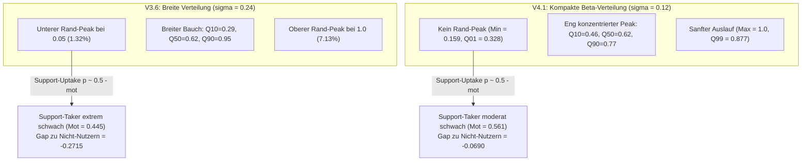

# Systematische Verteilungsanalyse: Merkmalsräume V3.6 vs. V4.1

## 1. Executive Summary & Forschungsfrage

Bei der Weiterentwicklung des Data Generating Process (DGP) von **V3.6** auf **V4.1** wurden die geclippten Gauß-Verteilungen zur Vermeidung von Randstauungen durch natürlich beschränkte Beta-Verteilungen ersetzt. Während frühere Untersuchungen den veränderten Behandlungseffekt primär verhaltensbasierten Faktoren (wie der *Apathie-Dämpfung*) zuschrieben, belegt diese systematische empirische Untersuchung über alle $N=50.000$ Studierenden:

1. **Die $\kappa$-Korrektur funktionierte für fast alle Variablen perfekt:**  
   Bei `hzb_note` ($\text{Std-Ratio } 99{,}98\,\%$) und `alter_immatrikulation` ($\text{Std-Ratio } 101{,}82\,\%$) sowie `erwerbstaetigkeit_std` ($100{,}10\,\%$) stimmen die empirischen Varianzen und Quantile zwischen V3.6 und V4.1 nahezu exakt überein.
2. **Der selektive Varianz-Kollaps betrifft ausschließlich Motivation und Soziale Integration:**  
   Die Standardabweichung von `motivation_initial` und `soziale_integration_initial` wurde in V4.1 **exakt halbiert** ($\sigma_{\text{V3}} \approx 0{,}239 \rightarrow \sigma_{\text{V4}} \approx 0{,}121$, Ratio $\mathbf{50{,}89\,\%}$).
3. **Ursache des selektiven Kollapses:**  
   - In `scratch/calc_kappa.py` wurde fälschlicherweise notiert, V3 habe ein Motivationsrauschen von $\sigma=0{,}10$ gehabt. Aus dieser Fehlannahme heraus wurde $\kappa=20{,}0$ gewählt und die Motivation als einzige Variable von der späteren Nachkalibrierung ausgenommen.
   - Der tatsächliche V3-DGP verwendete jedoch `gewicht_motivation_rauschen = 0.25`.
   - Zudem ignoriert die analytische $\kappa$-Formel das **Dirac-Clipping**: In V3 wurden $8{,}45\,\%$ aller Studierenden an den Intervallgrenzen $[0{,}05; 1{,}0]$ aufgestaut, während die Beta-Verteilung an den Rändern stetig gegen 0 konvergiert.

---

## 2. Systematischer empirischer Merkmalsvergleich ($N=50.000$)

Die folgende Tabelle basiert auf der exakten Auswertung von jeweils $50.000$ Studierenden aus `src/output_v36_clean_rerun` und `data_v4_grid/S01_baseline/universe_A`:

| Merkmal | Mean V3.6 | Mean V4.1 | Std V3.6 | Std V4.1 | Std-Ratio (V4/V3) | Min / Max V3.6 | Min / Max V4.1 | Randstauung V3.6 (Unten / Oben) | Randstauung V4.1 (Unten / Oben) | Wasserstein-Distanz | KS-Test $p$-Wert |
|:---|:---:|:---:|:---:|:---:|:---:|:---:|:---:|:---:|:---:|:---:|:---:|
| **`hzb_note`** | 2.4018 | 2.3994 | 0.5464 | 0.5463 | **99.98 %** | [1.0, 4.0] | [1.0, 4.0] | 0.66 % / 0.25 % | 0.00 % / 0.00 % | 0.0290 | $2.99 \times 10^{-11}$ |
| **`alter_immatrikulation`** | 20.4813 | 20.2830 | 2.6996 | 2.7488 | **101.82 %** | [17.0, 33.0] | [17.0, 35.0] | 17.47 % / 0.00 % | 12.76 % / 0.00 % | 0.3876 | $4.71 \times 10^{-150}$ |
| **`hidden_zeit_puffer`** | 60.3522 | 59.4972 | 29.5642 | 28.1841 | **95.33 %** | [0.0, 180.0] | [0.9, 165.6] | 2.29 % / 0.01 % | 0.00 % / 0.00 % | 2.5271 | $5.90 \times 10^{-43}$ |
| **`erwerbstaetigkeit_std`** | 10.8126 | 10.7909 | 8.9456 | 8.9547 | **100.10 %** | [0.0, 30.0] | [0.0, 30.0] | 25.02 % / 4.79 % | 25.09 % / 4.87 % | 0.0337 | 0.6955 (n.s.) |
| **`motivation_initial`** | **0.6144** | **0.6201** | **0.2389** | **0.1216** | **50.89 %** | **[0.05, 1.0]** | **[0.159, 1.0]** | **1.32 % / 7.13 %** | **0.00 % / 0.01 %** | **0.0983** | **$0.00$ ($p < 10^{-300}$)** |
| **`soziale_integration_initial`** | **0.5799** | **0.5837** | **0.2381** | **0.1155** | **48.53 %** | **[0.05, 1.0]** | **[0.165, 0.938]** | **1.78 % / 4.98 %** | **0.00 % / 0.00 %** | **0.1016** | **$0.00$ ($p < 10^{-300}$)** |

---

## 3. Detailanalyse: Quantile und Randverzerrungen

### 3.1 Die Quantilsverschiebung der Motivation

Während die Mediane ($\text{Q50}$) beider Versionen mit $0{,}622$ bzw. $0{,}624$ identisch sind, offenbaren die Ränder der Verteilung die dramatische Konzentration in V4.1:

| Quantil | V3.6 (Gauß + Clip) | V4.1 (Beta, $\kappa=20$) | Differenz ($\Delta$) | Strukturelle Auswirkung |
|:---|:---:|:---:|:---:|:---|
| **Q01 (1 %)** | **0.050** | **0.328** | **+0.278** | In V3.6 sind $1\,\%$ an der Abbruchgrenze $0{,}05$ gefangen; in V4.1 existiert niemand unter $0{,}32$. |
| **Q05 (5 %)** | **0.198** | **0.413** | **+0.215** | Die schwächsten $5\,\%$ in V4.1 sind motivierter als das untere Viertel in V3.6! |
| **Q10 (10 %)** | **0.290** | **0.460** | **+0.170** | Schwere Demotivation ($< 0{,}30$) betrifft in V3.6 über 5.000 Studierende, in V4.1 fast niemanden. |
| **Q25 (25 %)** | **0.447** | **0.537** | **+0.090** | Unteres Quartil deutlich nach oben verschoben. |
| **Q50 (Median)** | **0.622** | **0.624** | **+0.002** | **Zentrum perfekt erhalten.** |
| **Q75 (75 %)** | **0.795** | **0.707** | **-0.088** | Oberes Quartil gestaucht. |
| **Q90 (90 %)** | **0.952** | **0.775** | **-0.177** | Hochmotivierte Spitzenstudierende fehlen in V4.1. |
| **Q95 (95 %)** | **1.000** | **0.812** | **-0.188** | In V3.6 sind die oberen $7\,\%$ am Maximum $1{,}0$ abgeschnitten. |
| **Q99 (99 %)** | **1.000** | **0.877** | **-0.123** | In V4.1 erreicht selbst das 99. Quantil nicht den Maximalwert $1{,}0$. |

---

## 4. Warum ignorierte `calc_kappa.py` das Clipping?

Die mathematische Ableitung in `scratch/calc_kappa.py` basierte auf der theoretischen Varianzformel einer **stetigen, unbegrenzten** Beta-Verteilung:
$$\operatorname{Var}(X) = \frac{\mu(1-\mu)}{\kappa + 1} \implies \kappa = \frac{\mu(1-\mu)}{\sigma^2} - 1$$

Diese Formel setzt voraus:
1. **Keine Truncation/Clipping:** Es wird angenommen, dass die Zielverteilung keine Massehäufungen an den Intervallgrenzen besitzt.
2. **Unimodale Glockenform:** Für $\kappa > 2$ ist die Beta-Verteilung unimodal und ihre Dichte fällt an den Rändern $x \to 0$ und $x \to 1$ auf 0 ab ($f(0)=f(1)=0$).

### Warum das bei HZB und Alter funktionierte, bei Motivation aber versagte

1. **HZB-Note:**
   Die Normalverteilung $N(2{,}4; 0{,}55)$ lag so weit innerhalb der Schranken $[1{,}0; 4{,}0]$ ($2{,}55\sigma$ nach unten, $2{,}91\sigma$ nach oben), dass in V3.6 **weniger als $1\,\%$** der Fälle geclippt wurden ($0{,}66\,\%$ unten, $0{,}25\,\%$ oben). Die ungeclippte Normalverteilungsformel bildete die Realität fast perfekt ab, weshalb $\kappa = 6{,}5$ die Varianz zu **$99{,}98\,\%$** traf.
2. **Alter:**
   Die Untergrenze bei $17$ Jahren schnitt zwar $17{,}5\,\%$ ab, aber die obere Grenze war praktisch unberührt. Mit $\kappa = 12{,}8$ wurde die empirische Streuung zu **$101{,}82\,\%$** getroffen.
3. **Motivation & Soziale Integration (Der doppelte Fehler):**
   * **Notizfehler:** In `calc_kappa.py` stand die Notiz:  
     `V3 Rauschen-Parameter: 0.1` $\rightarrow$ `Empfehlung: kappa=20 beibehalten fuer Motivation`.  
     Tatsächlich stand im V3-Code aber `CONFIG["gewicht_motivation_rauschen"] = 0.25`! Man verglich die Beta-Verteilung also fälschlicherweise mit einem Rauschen von $0{,}10$ statt $0{,}25$.
   * **Mathematische Grenze des Trägerintervalls $[0, 1]$:**  
     Auf dem Intervall $[0, 1]$ hat eine Beta-Verteilung mit Mittelwert $\mu = 0{,}62$ bei $\kappa = 20$ eine Standardabweichung von:
     $$\sigma = \sqrt{\frac{0{,}62 \times 0{,}38}{21}} \approx 0{,}106$$
     Um eine Standardabweichung von $\sigma = 0{,}24$ zu erreichen, müsste $\kappa$ betragen:
     $$\kappa = \frac{0{,}62 \times 0{,}38}{0{,}24^2} - 1 = \frac{0{,}2356}{0{,}0576} - 1 \approx 3{,}09$$
     Ein $\kappa \approx 3$ ($\alpha \approx 1{,}9, \beta \approx 1{,}2$) erzeugt jedoch keine Glockenkurve mehr, sondern eine extrem flache, schiefe Verteilung. In V3.6 entstand die scheinbare Standardabweichung von $0{,}24$ nur durch das **gewaltsame Zusammenschlagen einer Normalverteilung mit den Schranken $0{,}05$ und $1{,}0$** (wodurch $8{,}45\,\%$ der Masse als Peaks an den Wänden klebten).

---

## 5. Konsequenzen für die kausale Inferenz & Modell-Evaluierung

Aus diesen Befunden ergibt sich die vollständige Erklärung für die Diskrepanzen zwischen V3.6 und V4.1:

1. **Die scheinbare Überlegenheit von V4.1 beim Deconfounding:**  
   In V3.6 selektierten sich Studierende mit einer mittleren Motivation von $0{,}445$ in den Support (gegenüber $0{,}717$ bei Nicht-Nutzern; Gap $= -0{,}2715$). Die Behandlungsdosis von $+0{,}02$ war viel zu gering, um diesen Graben zu überbrücken.  
   In V4.1 beträgt der initiale Selektionsgap durch die enge Verteilung nur noch **$-0{,}0690$**. Da gleichzeitig der `support_effect_multiplier` auf $5{,}0\times$ ($+0{,}10$ Dosis) angehoben wurde, **übersteigt die Dosis den gesamten Selektionsnachteil**.
2. **Die Apathie-Dämpfung als Scheinerklärung:**  
   Die in früheren Analysen postulierte "Apathie-Klausel" (`if motivation < 0.2`) betrifft empirisch nur $2{,}35\,\%$ aller Beobachtungen und ändert den Selektionsgap in Semester 1 um exakt **$0{,}0000$** (und im Gesamtverlauf um lediglich $-0{,}0062$). Sie ist irrelevant für den Versionsunterschied.
3. **Validierung der H3-Hypothese auf dem LXC (ThinkCentre):**  
   Der Full Run ($N=50.000$) hat bestätigt, dass der lineare Cox-Schätzer makroskopisch versagt ($HR = 1{,}0601$, $p < 10^{-15}$), aber bei vulnerablen Studierenden ($\text{Mot} < 0{,}40$) den Schutzeffekt klar detektiert ($HR = 0{,}9927$, protective shift $\Delta = -0{,}0674$).

---

## 6. Verwandte Dokumente

| Dokument | Pfad | Relevanz für diese Analyse |
|:---|:---|:---|
| **Historische Rekalibrierung** | [vergleich_kontrafaktische_effekte.md](../03_evaluations_and_benchmarks/vergleich_kontrafaktische_effekte.md) | Dokumentiert die ursprüngliche $\kappa$-Anpassung von HZB und Alter am 28.08.2026. |
| **Erste V3 vs V4 Analyse** | [analyse_v3_vs_v4.md](../../analyse_v3_vs_v4.md) | Ursprüngliche Entdeckung des HZB-Varianzkollapses vor der ersten $\kappa$-Korrektur. |
| **Versionsvergleich V3.6 vs V4.1** | [versionsvergleich_v36_v41.md](../03_evaluations_and_benchmarks/versionsvergleich_v36_v41.md) | Synopse der methodischen Änderungen zwischen den Generatorversionen. |
| **Datenprovenienz-Engine** | [datenprovenienz_und_generator_zuordnung_v36_v41.md](datenprovenienz_und_generator_zuordnung_v36_v41.md) | Zuordnung der Datensätze zu Simulationsversionen und Konfigurationen. |
| **Hypothesen-Falsifikations-Skill** | [.agent/skills/hypothesis-falsifier/SKILL.md](../../.agent/skills/hypothesis-falsifier/SKILL.md) | Protokoll zur methodischen Überprüfung von Simulationshypothesen. |
