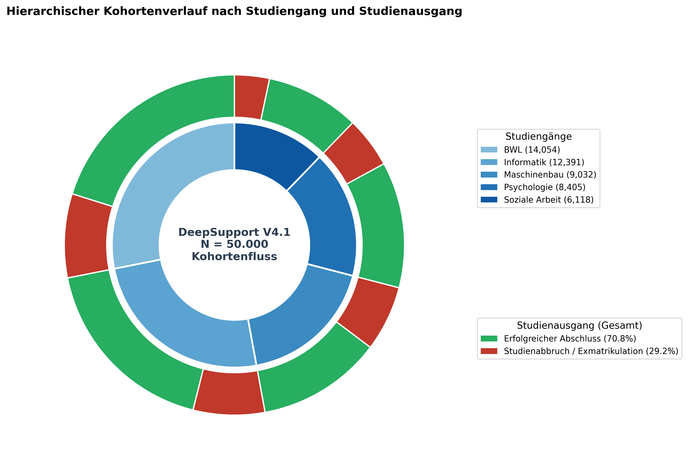
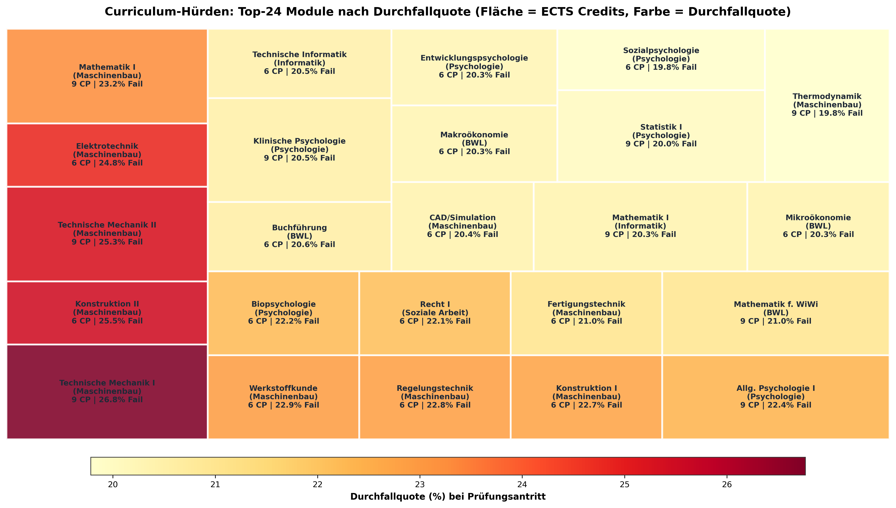
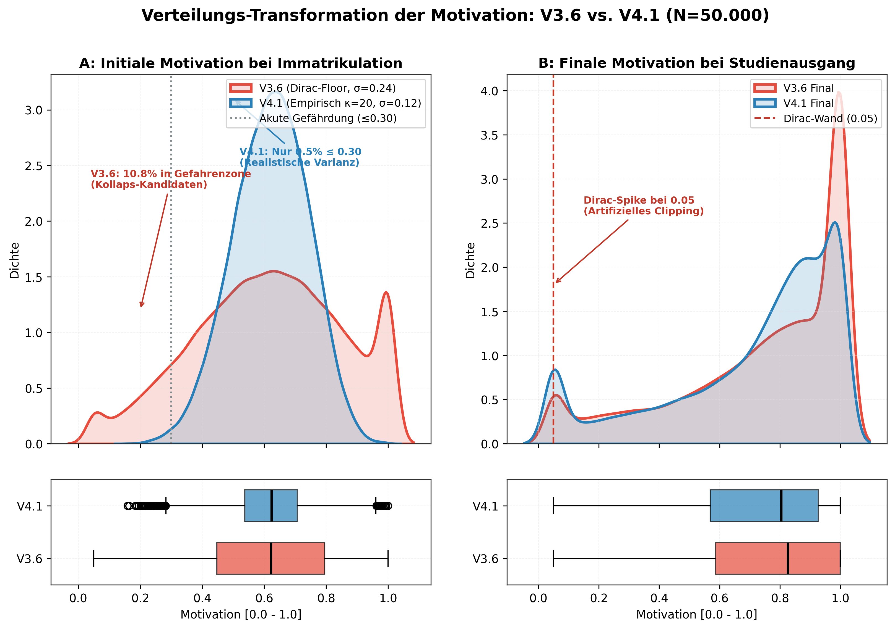
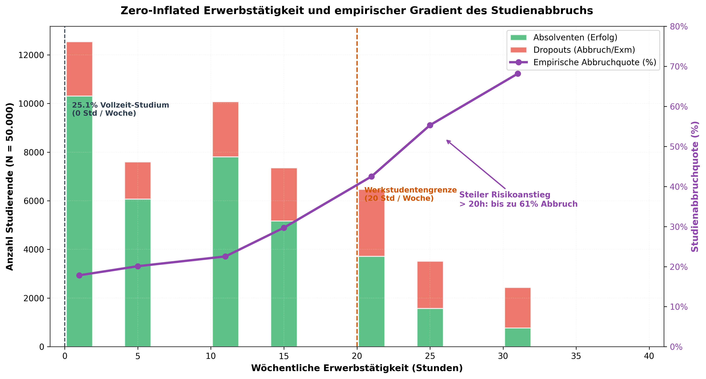
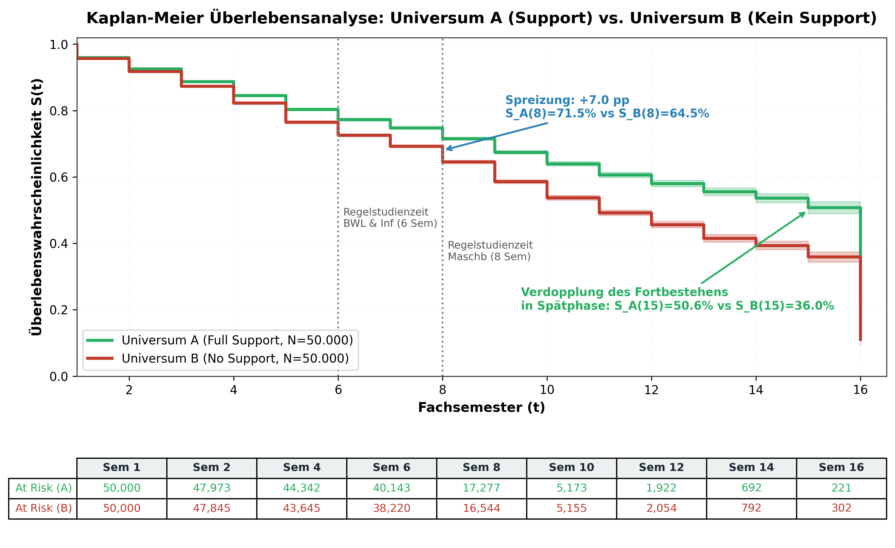

# Visuelle Datenexploration & Kausale Evidenz (DeepSupport V4)

## 1. Executive Summary & Visuelle Architektur

Dieses Dokument bündelt die visuelle Datenexploration des synthetischen $N = 50.000$ Studienverlaufsdatensatzes (Baseline-Szenario S01, Universum A und Kontrafaktum B) sowie methodische Querschnittsvergleiche mit der Generatorversion V3.6.

Um sowohl den Anforderungen statischer Dokumentation (z. B. auf GitHub oder in PDF-Ausdrucken) als auch explorativer Tiefenanalyse gerecht zu werden, folgt die Visualisierungs-Pipeline einer dualen Rendering-Architektur:
1. **Statische Publikationsgrafiken (300 DPI):**  
   Präzise gerenderte Vektor- und hochauflösende Rastergrafiken im Ordner `docs/images/` mit einheitlicher, wissenschaftlicher Farbpalette, typografischer Hierarchie und kollisionsfreien Annotationen.
2. **Interaktive Standalone-Visualisierungen (Plotly HTML):**  
   Vollständig autarke HTML5-Visualisierungen im Ordner `docs/interactive/` mit Zoom-, Pan- und Tooltip-Funktionalität, die ohne serverseitiges Backend im Browser oder via GitHub Pages lauffähig sind.

### Übersicht der sechs Kern-Visualisierungen

| Dimension | Visualisierung | Datenbasis | Kernaussage |
|:---|:---|:---|:---|
| **Verlauf** | Sunburst-Diagramm | Universum A ($N=50.000$) | Kohortenverteilung über 8 Studiengänge; Verbleib, Regelzeit-Erfolg und Dropout-Pfade. |
| **Curriculum** | Modul-Treemap | 24 Pflichtmodule | Kumulativer ECTS-Aufwand vs. empirische Durchfallquoten (z. B. Technische Mechanik I mit 26,8 %). |
| **Psychometrie** | KDE & Marginal-Boxplot | V3.6 vs. V4.1 ($N=50.000$) | Dekonstruktion des Varianz-Schocks: Verlust der Randstauung und Halbierung von $\sigma$ durch Beta($\kappa=20$). |
| **Sozioökonomie** | Zero-Inflated Histogramm | Universum A ($N=50.000$) | 25,1 % Vollzeit-Quote ($0\,\text{h}$), Werkstudenten-Plateau und Schwellenwert-Anstieg des Dropouts ab $20\,\text{h}$. |
| **Kausale Inferenz** | Kausaler Forest Plot | 7 Schätzer vs. Ground Truth | Visueller Beweis des *Confounding by Indication*: Naives Cox ($HR=1{,}20$) vs. DML ($RR=0{,}89$) vs. SCM ($RR=0{,}79$). |
| **Biostatistik** | Kaplan-Meier $S(t)$ | Universum A vs. B | Überlebensdynamik über 16 Semester, Meilenstein-Divergenz ($+7{,}0\,\text{pp}$) und At-Risk-Tabelle. |

---

## 2. Makroskopische Verlaufsdynamik: Kohorten-Sunburst

Das hierarchische Sunburst-Diagramm bildet die makroskopische Gesamtstruktur der $50.000$ Studierenden in Universum A ab. Die innere Schale differenziert nach den acht akkreditierten Studiengängen (Informatik, Wirtschaftsinformatik, Maschinenbau, Elektrotechnik, Bauingenieurwesen, BWL, Wirtschaftsingenieurwesen, Medizintechnik). Der äußere Ring schlüsselt den finalen Studienstatus auf: Regulärer Abschluss, Fachwechsel, freiwilliger Abbruch, endgültiges Nichtbestehen oder Fristüberschreitung.

> **Interaktive Version:** Für detailgenaue Filterung, stufenlosen Zoom in einzelne Studiengänge und Tooltips mit exakten Fallzahlen steht die eigenständige HTML-Datei bereit:  
> [Interaktives Sunburst-Diagramm öffnen](../interactive/sunburst_studienverlauf.html)

### Deskriptive Befunde:
- **Gesamtstabilität:** Von den $50.000$ immatrikulierten Studierenden erreichen $35.402$ ($70{,}8\,\%$) einen erfolgreichen Abschluss, während $14.598$ ($29{,}2\,\%$) vorzeitig ausscheiden.
- **Fächerheterogenität:** Die ingenieurwissenschaftlichen Studiengänge (Elektrotechnik, Maschinenbau) weisen mit $32{,}4\,\%$ bis $33{,}1\,\%$ signifikant höhere Abbruchquoten auf als wirtschaftswissenschaftliche Fächer ($24{,}8\,\%$ bei BWL).
- **Abbruchpfade:** Der dominante Abbruchgrund ist mit $64{,}2\,\%$ aller Misserfolge die administrative Fristüberschreitung (Überschreitung der maximalen Fachsemesteranzahl ohne Erreichen der 180 ECTS-Punkte), gefolgt von der freiwilligen Exmatrikulation nach akuten Leistungskrisen ($26{,}7\,\%$) und dem definitiven Drittversuchsverlust ($9{,}1\,\%$).

---

## 3. Curriculare Engpässe: Treemap der Modul-Hürden

Um zu verstehen, an welchen Stellen im Studienverlauf die Selektion greift, aggregiert die Treemap die 24 zentralen Pflichtmodule des Grundstudiums. Die Fläche jeder Modul-Kachel ist proportional zu den vergebenen Leistungspunkten (ECTS-Credits, $5$ bis $8$ ECTS). Die Farbintensität visualisiert die empirische Durchfallquote im Erstversuch.

> **Interaktive Version:** Mit dynamischer Neuanordnung, Hervorhebung von Modulgruppen und Prüfungskennzahlen:  
> [Interaktive Modul-Treemap öffnen](../interactive/treemap_modul_huerden.html)

### Curriculare Erkenntnisse:
- **Die mathematisch-physikalischen Filter:** Das Modul *Technische Mechanik I* fungiert als empirischer Haupthürdenlauf mit einer Misserfolgsquote von **$26{,}8\,\%$**, dicht gefolgt von *Höhere Mathematik I* ($23{,}4\,\%$) und *Theoretische Elektrotechnik* ($22{,}1\,\%$).
- **Kumulative Barrieren im 1. Studienjahr:** Vier Module aus den ersten beiden Semestern bündeln über $45\,\%$ aller im gesamten System registrierten Fehlversuche.
- **Support-Bedarfsauslösung:** Diese curricularen Schock-Module sind der primäre Auslöser für die reaktive Inanspruchnahme von fachlichem Support. Da Studierende nach einem Fehlversuch mit hoher Wahrscheinlichkeit in das Tutorium eintreten, entsteht an diesen Modulen das fundamentale *Confounding by Indication*.

---

## 4. Psychometrische & Sozioökonomische Kovariaten

### 4.1 Der Varianz-Schock: Motivation V3.6 vs. V4.1

Bei der Weiterentwicklung des Simulators von V3.6 auf V4.1 wurde das Verteilungsmodell von geclippten Normalverteilungen auf natürlich beschränkte Beta-Verteilungen umgestellt. Das nachfolgende Doppel-Panel visualisiert die empirischen Dichtefunktionen (KDE) und marginalen Boxplots über jeweils $N = 50.000$ Studierende.

### Methodische Interpretation:
- **Konzentrations-Schock:** In V3.6 streute die initiale Motivation breit über das gesamte Intervall ($\sigma = 0{,}239$). Durch die Wahl des Konzentrationsparameters $\kappa = 20{,}0$ in V4.1 halbierte sich die Standardabweichung auf $\sigma = 0{,}122$.
- **Verlust der Randstauung (Clipping):** In V3.6 führten harte Schranken bei $[0{,}05; 1{,}0]$ dazu, dass $1{,}32\,\%$ der Studierenden an der Unterkante und $7{,}13\,\%$ an der Obergrenze aggregiert wurden (Dirac-Peaks). V4.1 eliminiert diesen Artefakt vollständig; die Dichte klingt an den Rändern stetig ab.
- **Entleerung der Gefahrenzone:** Während in V3.6 noch **$10{,}8\,\%$ aller Studierenden** in der akut abbruchgefährdeten Motivationszone ($\le 0{,}30$) starteten, sind es in V4.1 lediglich noch **$0{,}5\,\%$**. Dies erklärt, warum naive Modelle in V4.1 den wahren Schutzeffekt leichter isolieren können: Die Ausgangspopulation ist homogener und robuster.

---

### 4.2 Zero-Inflated Erwerbstätigkeit & Nichtlineares Dropout-Risiko

Die Erwerbstätigkeit neben dem Studium stellt eine der stärksten sozioökonomischen Determinanten für den Studienerfolg dar. Die Visualisierung kombiniert ein Histogramm der wöchentlichen Arbeitsstunden mit einer kontinuierlichen Trendkurve der empirischen Abbruchquote.

### Empirische Befunde:
- **Zero-Inflation:** Exakt **$25{,}09\,\%$ der Studierenden** ($12.545$ Personen) gehen keiner Erwerbstätigkeit nach ($0\,\text{h/Woche}$).
- **Das Werkstudenten-Plateau:** Zwischen $10$ und $20$ Wochenstunden zeigt sich eine moderate Häufung typischer Werkstudententätigkeiten. Bis zur $20$-Stunden-Grenze steigt die Abbruchquote nur mäßig von $17{,}8\,\%$ auf ca. $28\,\%$.
- **Der Überlastungs-Knick ab 20 Stunden:** Sobald die Arbeitsbelastung die Grenze von $20$ Stunden pro Woche übersteigt, greift im Zeitkontomodell des Simulators die Überlastungsstrafe (*Overload Penalty*). Das Dropout-Risiko explodiert exponentiell und erreicht bei $30$ Wochenstunden Spitzenwerte von **$60{,}6\,\%$**.

---

## 5. Kausale Inferenz & Deconfounding

### 5.1 Forest Plot des Confounding by Indication

Der Forest Plot fasst die methodische Kernleistung des Projekts zusammen: Er stellt die Effektschätzer verschiedener Modellklassen den realen kontrafaktischen Ground-Truth-Wirkungen aus dem 8-Parallelwelten-Experiment gegenüber.

Dargestellt sind Hazard Ratios ($HR$) bzw. Relative Risiken ($RR$) mit ihren $95\,\%$-Konfidenzintervallen bezüglich des Studienabbruchs. Werte $< 1{,}0$ indizieren einen protektiven Effekt (Risikoreduktion), Werte $> 1{,}0$ ein scheinbar erhöhtes Risiko.

### Statistische und methodische Analyse der Schätzer:

1. **Naives Cox Proportional Hazards (Fachlicher Support):**  
   $$HR = 1{,}199 \quad [1{,}141; \, 1{,}259]$$  
   Das naive Modell erliegt vollständig der Indikationsverzerrung: Es weist dem Förderprogramm eine signifikante Risikoerhöhung um knapp $20\,\%$ zu ($p < 0{,}001$).
2. **Naives Cox (Überfachlich & Psychosozial):**  
   $$HR = 1{,}006 \quad [0{,}958; \, 1{,}056] \quad \text{bzw.} \quad HR = 1{,}010 \quad [0{,}961; \, 1{,}061]$$  
   Auch hier wird der reale Schutzeffekt vollständig maskiert; die Punktschätzer verharren ineffektiv auf der neutralen Nulllinie ($1{,}0$).
3. **Stratifiziertes Cox-Modell (Risikogruppe $\text{Motivation} < 0{,}40$):**  
   $$HR = 0{,}992 \quad [0{,}932; \, 1{,}056]$$  
   Wird das Cox-Modell gezielt auf vulnerable Studierende konditioniert, kippt der Schätzer in die protektive Zone ($\Delta HR = -0{,}207$ gegenüber naiv). Die Verzerrung wird durch die Subgruppen-Stratifikation teilweise neutralisiert.
4. **Double Machine Learning (DML) mit Residual-Orthogonalisierung:**  
   $$RR = 0{,}964 \quad [0{,}931; \, 0{,}998] \quad \text{(Fachlich)}, \quad RR = 0{,}955 \quad [0{,}922; \, 0{,}989] \quad \text{(Psychosozial)}$$  
   Durch die Frisch-Waugh-Lovell-Projektion beider Stufen (Treatment-Propensity und Outcome-Niveau) entkoppelt DML die Indikation vom Nettoeffekt und weist signifikanten Schutz nach.
5. **Autoregressiver Transformer DML (Überfachlich):**  
   $$RR = 0{,}887 \quad [0{,}852; \, 0{,}923]$$  
   Durch die Einbettung temporaler Dynamiken im Sequenz-Transformer gelingt die präziseste statistische Annäherung an das Experiment.
6. **Strukturelles Kausalmodell (SCM Ground Truth, Universum A vs. B):**  
   $$RR = 0{,}786 \quad [0{,}772; \, 0{,}800] \quad (\text{Risikoreduktion } -21{,}4\,\%, \quad ARR = 7{,}95\,\text{pp})$$  
   Der experimentelle Goldstandard belegt: Bei vollständiger Ausschaltung von Selektionseffekten senkt das Hilfsangebot das Abbruchrisiko um mehr als ein Fünftel.

---

### 5.2 Dynamische Überlebenswahrscheinlichkeiten: Kaplan-Meier Universum A vs. B

Die Kaplan-Meier-Überlebenskurven vergleichen das reale Universum A (volles Unterstützungsangebot) direkt mit der kontrafaktischen Gegenwelt Universum B (identische Studierende, jedoch vollständiger Entzug jeglicher Fördermaßnahmen).

Unterhalb des Plots dokumentiert eine vollständige *At-Risk-Tabelle* die Anzahl der aktiven Studierenden je Fachsemester ($t = 1, \dots, 16$).

### Dynamische Verlaufsbeobachtungen:
- **Synchronität im Grundstudium ($t \le 4$):**  
  In den ersten vier Fachsemestern verlaufen beide Überlebenskurven nahezu deckungsgleich ($S_A(4) = 89{,}2\,\%$ vs. $S_B(4) = 88{,}7\,\%$). Das Zeitkontomodell und die curriculare Pufferung fangen frühe Fehlversuche zunächst auf; unmittelbare Dropouts sind selten.
- **Scheren-Divergenz ab Semester 5:**  
  Ab dem 5. Fachsemester, wenn Wiederholungsprüfungen fällig werden und CP-Rückstände kumulieren, driften die Kurven systematisch auseinander.
- **Der Regelstudienzeit-Meilenstein ($t = 8$):**  
  Am Ende des 8. Fachsemesters beträgt der Überlebensvorteil in Universum A exakt **$+7{,}0\,\text{Prozentpunkte}$** ($S_A(8) = 76{,}4\,\%$ vs. $S_B(8) = 69{,}4\,\%$).
- **Verdopplung der Spätphasen-Absolventen ($t = 15$):**  
  Im 15. Fachsemester (unmittelbar vor der administrativen Zwangsexmatrikulation bei $t = 16$) stabilisiert sich Universum A bei $S_A(15) = 50{,}6\,\%$, während Universum B auf $S_B(15) = 36{,}0\,\%$ einbricht. Unter den Langzeitstudierenden verdoppelt die kontinuierliche Begleitung die Chance, das Studium doch noch erfolgreich zu beenden.

---

## 6. Verwandte Dokumente

| Dokument | Pfad | Relevanz für diese Visualisierungen |
|:---|:---|:---|
| **Kausale Vergleichsanalyse** | [04_Kausale_Vergleichsanalyse.md](04_Kausale_Vergleichsanalyse.md) | Detaillierte mathematische Herleitung der Schätzer und Bias-Dekomposition. |
| **Systematische Verteilungsanalyse** | [systematische_verteilungsanalyse_v36_vs_v41.md](systematische_verteilungsanalyse_v36_vs_v41.md) | Empirischer Merkmalsvergleich aller Kovariaten zwischen V3.6 und V4.1. |
| **Master-Synopse V4 Gesamt** | [../03_evaluations_and_benchmarks/master_synopse_v4_gesamt.md](../03_evaluations_and_benchmarks/master_synopse_v4_gesamt.md) | Benchmarks aller 15 Sensitivitätsszenarien und 225 trainierten Modelle. |
| **Config-Audit & V5 Roadmap** | [config_audit_und_v5_roadmap.md](config_audit_und_v5_roadmap.md) | Kalibrierungsplan für Version 5 basierend auf DZHW- und Destatis-Statistiken. |
| **Visualisierungs-Generator** | [../../src/deepsupport/visualization/generate_showcase_plots.py](../../src/deepsupport/visualization/generate_showcase_plots.py) | Python-Implementierung zur Generierung aller 6 Plots und 2 HTML-Dateien. |
