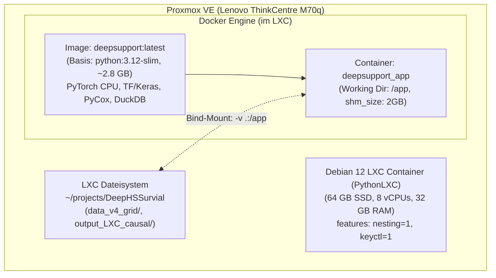

# Docker-Kapselung & Proxmox LXC Deployment-Leitfaden

Dieses Dokument beschreibt die vollständige Containerisierung des **DeepSupport**-Forschungsframeworks via Docker und das Deployment innerhalb eines Debian-LXC-Containers auf einem Proxmox VE Hypervisor (Lenovo ThinkCentre M70q Tiny).

---

## 1. Architektur & Designentscheidung

Die Containerisierung löst die Abhängigkeiten zwischen Betriebssystem, Compiler-Toolchains (C++ OpenMP, HiGHS-Solver) und Python-Wheels vollständig auf:



### Kernmerkmale des Setups:
1. **Schlankes Basis-Image (`python:3.12-slim`):**
   Kein ressourcenfressendes Vollsystem, sondern ein optimiertes Debian-Slim-Image mit `build-essential` und `libgomp1` für OpenMP-Vektorisierung.
2. **PyTorch CPU-Wheels:**
   Durch `--extra-index-url https://download.pytorch.org/whl/cpu` entfallen ca. 2,5 GB ungenutzte CUDA-Laufzeitbibliotheken. Die Image-Größe liegt bei nur $\approx 2{,}8$ GB.
3. **Strikter Build-Kontext via `.dockerignore`:**
   Große Datenverzeichnisse (`data_v4_grid/` mit $> 25$ GB, virtuelle Umgebungen `.venv/`, Logs und Checkpoints) werden beim Build ignoriert. Der Build-Kontext beträgt lediglich wenige Megabyte.
4. **Zero-Duplication durch Bind-Mounts:**
   Die Simulations- und Ausgabedaten verbleiben auf der 64 GB SSD des LXC und werden zur Laufzeit per Volume-Mount (`.:/app`) eingebunden.

---

## 2. Proxmox VE Voraussetzung (LXC Nesting)

Damit der Docker-Daemon innerhalb eines unprivilegierten LXC-Containers auf Proxmox starten kann, müssen die Features `nesting` und `keyctl` aktiviert sein.

### Option A: Über die Proxmox Web-GUI
1. Im Browser die Proxmox-Oberfläche öffnen (`https://<proxmox-ip>:8006`).
2. Den Container auswählen (z. B. `PythonLXC` / ID `10x`).
3. Unter **Optionen** den Punkt **Features** anklicken und auf **Bearbeiten** gehen.
4. Haken setzen bei:
   - **Nesting** (`[x]`)
   - **Keyctl** (`[x]`)
5. Bestätigen und Container neu starten.

### Option B: Über die Proxmox Host-Shell
Auf der Root-Shell des Proxmox-Nodes:
```bash
pct set <VMID> -features nesting=1,keyctl=1
pct reboot <VMID>
```

---

## 3. Docker-Installation im LXC Container

In Debian 12 (Bookworm) heißt das Compose-v2-Paket **`docker-compose-plugin`** (bzw. `docker-compose`), während der Paketname `docker-compose-v2` distributionsspezifisch ist.

### Option A: Installation über die Debian-Standard-Repositories (Schnellste Variante)

```bash
# Paketlisten aktualisieren und Docker Engine + Compose Plugin installieren
sudo apt-get update
sudo apt-get install -y docker.io docker-compose-plugin docker-compose

# Benutzer zur docker-Gruppe hinzufügen (vermeidet sudo vor jedem docker-Befehl)
sudo usermod -aG docker $USER

# Service aktivieren und starten
sudo systemctl enable --now docker
```

*Hinweis:* Nach `usermod` einmal aus dem LXC ausloggen und neu einloggen (oder `newgrp docker` ausführen), damit die Gruppenberechtigung aktiv wird.

### Option B: Installation über das offizielle Docker-CE Repository (Empfohlen für neueste Features)

```bash
sudo apt-get update
sudo apt-get install -y ca-certificates curl
sudo install -m 0755 -d /etc/apt/keyrings
sudo curl -fsSL https://download.docker.com/linux/debian/gpg -o /etc/apt/keyrings/docker.asc
sudo chmod a+r /etc/apt/keyrings/docker.asc

echo \
  "deb [arch=$(dpkg --print-architecture) signed-by=/etc/apt/keyrings/docker.asc] https://download.docker.com/linux/debian \
  $(. /etc/os-release && echo "$VERSION_CODENAME") stable" | \
  sudo tee /etc/apt/sources.list.d/docker.list > /dev/null
sudo apt-get update

sudo apt-get install -y docker-ce docker-ce-cli containerd.io docker-buildx-plugin docker-compose-plugin
sudo usermod -aG docker $USER
sudo systemctl enable --now docker
```

### Verifikation der Installation:
```bash
docker --version
docker compose version
```

---

## 4. Bauen des DeepSupport Images

Im Projektverzeichnis auf dem LXC:

```bash
cd ~/projects/DeepHSSurvial
git pull

# Image via Docker Compose bauen
docker compose build
```

*Build-Dauer:* ca. 3 bis 5 Minuten bei erstem Durchlauf. Danach greift das Docker-Layer-Caching.

---

## 5. Ausführung & Nutzungsmuster

### 5.1 Interaktive Entwicklung / Debugging-Shell
Startet einen temporären Container mit vollem Zugriff auf Code und Daten:
```bash
docker compose run --rm deepsupport
```
Im Container:
```bash
python -c "import torch, duckdb, pycox; print('Ready!')"
exit
```

### 5.2 Ausführung von Batch-Skripten
Direkter Aufruf beliebiger Skripte ohne interaktive Shell:

```bash
# Beispiel: Ausführung des Kausal-Runners
docker compose run --rm deepsupport python src/run_torch_causal_lxc.py \
  --scenarios S01_baseline \
  --modes standard inside_view
```

### 5.3 Hintergrund-Ausführung (Detached)
Für langlaufende Rechenjobs:
```bash
docker compose run -d --name deepsupport_job deepsupport python src/run_torch_causal_lxc.py \
  --scenarios S01_baseline S02_supp_half S03_supp_double S07_noise_half S08_noise_double S11_rct_calibrated \
  --modes standard inside_view realistic gradeblind_oracle blind

# Logs verfolgen
docker logs -f deepsupport_job
```

---

## 6. Verwandte Dokumente

| Dokument | Pfad / Referenz | Kerninhalt |
| :--- | :--- | :--- |
| **System- & Hardware-Stack** | [`system_and_hardware_stack.md`](system_and_hardware_stack.md) | ThinkCentre M70q Spezifikationen & NIC-Konfiguration |
| **LXC Benchmark Evaluation V4.2** | [`../03_evaluations_and_benchmarks/pytorch_lxc_benchmark_evaluation_v42.md`](../03_evaluations_and_benchmarks/pytorch_lxc_benchmark_evaluation_v42.md) | Prädiktiver Benchmark auf dem LXC Node |
| **LXC Kausal-Benchmark V4.2** | [`../03_evaluations_and_benchmarks/pytorch_lxc_causal_benchmark_evaluation_v42.md`](../03_evaluations_and_benchmarks/pytorch_lxc_causal_benchmark_evaluation_v42.md) | Kausaler 6-Szenarien-Lauf mit Ground-Truth-Validierung |
